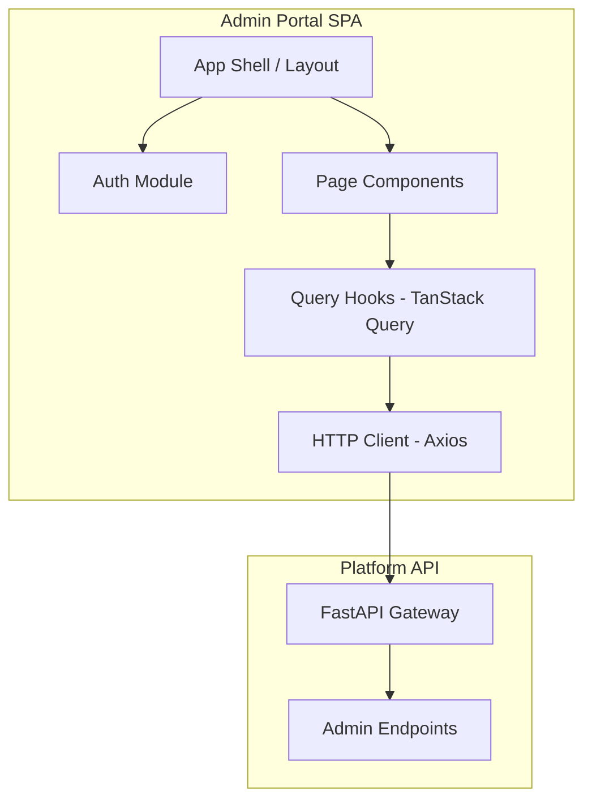
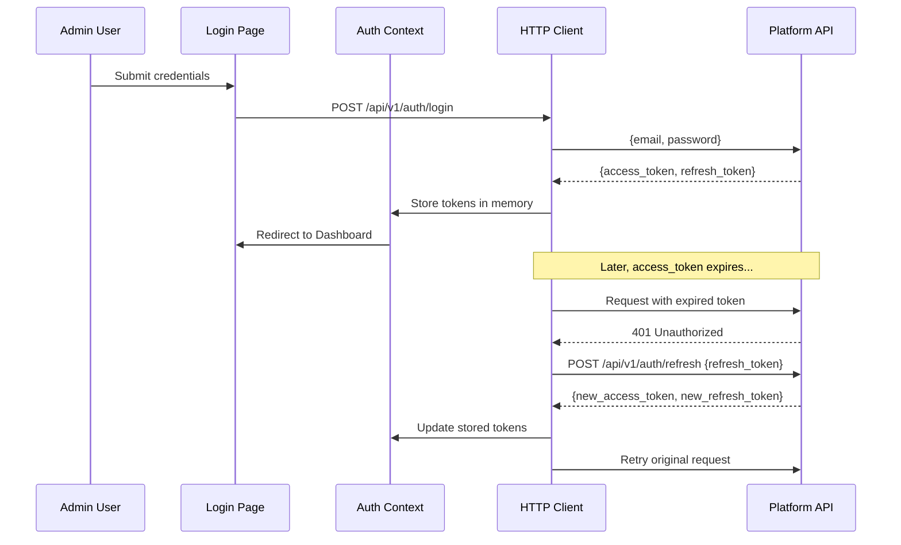
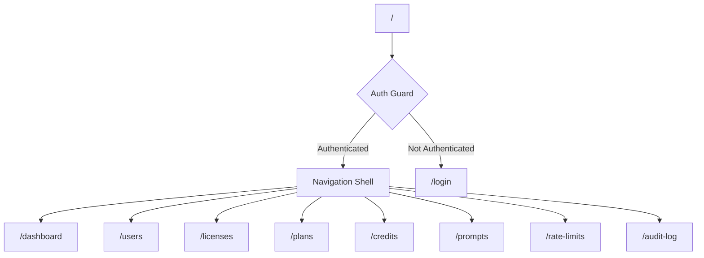

# Design Document: Admin Portal

## Overview

The Admin Portal is a single-page React application (SPA) that provides a management UI for the Platform API. It lives in `admin_portal/` alongside `platform_api/` and communicates exclusively via authenticated REST calls to the existing FastAPI backend.

### Key Design Goals

- **API-Driven UI**: All state comes from the Platform API — no local database, no server-side rendering
- **Optimistic UX**: TanStack Query handles caching, background refetching, and cache invalidation so the UI stays responsive
- **Secure by Default**: JWT tokens stored in memory, automatic refresh, and route guards prevent unauthorized access
- **Consistent Theming**: shadcn/ui + Tailwind CSS with a deep blue (slate-900/950) palette ensures visual cohesion
- **Developer Productivity**: Vite + TypeScript + hot-reload for fast iteration; clean separation of concerns via feature-based folder structure

### Technology Stack

- **Build Tool**: Vite 5+ (fast HMR, ESBuild-powered bundling)
- **Framework**: React 18+ with TypeScript 5+
- **Routing**: React Router v6 (client-side, lazy-loaded routes)
- **Server State**: TanStack Query v5 (caching, refetching, mutations)
- **UI Components**: shadcn/ui (Radix UI primitives + Tailwind)
- **Icons**: Lucide React
- **HTTP Client**: Custom Axios wrapper with JWT interceptor
- **Form Validation**: React Hook Form + Zod schemas
- **Styling**: Tailwind CSS 3+ with shadcn theming

## Architecture

### High-Level Architecture



### Application Layers

```
┌─────────────────────────────────────────────────┐
│  UI Layer (Pages, Components, Layout)           │
├─────────────────────────────────────────────────┤
│  State Layer (TanStack Query, Auth Context)     │
├─────────────────────────────────────────────────┤
│  Data Layer (API hooks, HTTP client, types)     │
└─────────────────────────────────────────────────┘
```

### Authentication Flow



### Route Structure



## Components and Interfaces

### Project Structure

```
admin_portal/
├── index.html
├── vite.config.ts
├── tsconfig.json
├── tailwind.config.ts
├── postcss.config.js
├── package.json
├── .env.example
├── public/
│   └── favicon.svg
├── src/
│   ├── main.tsx                    # App entry point
│   ├── App.tsx                     # Router + providers
│   ├── vite-env.d.ts
│   ├── lib/
│   │   ├── http-client.ts          # Axios instance + interceptors
│   │   ├── auth.ts                 # Token management utilities
│   │   ├── query-client.ts         # TanStack Query client config
│   │   └── utils.ts                # cn() and helper utilities
│   ├── hooks/
│   │   ├── use-auth.ts             # Auth context hook
│   │   ├── use-users.ts            # User CRUD query hooks
│   │   ├── use-licenses.ts         # License query hooks
│   │   ├── use-plans.ts            # Plan query hooks
│   │   ├── use-credits.ts          # Credit query hooks
│   │   ├── use-prompts.ts          # Music prompt query hooks
│   │   ├── use-rate-limits.ts      # Rate limit query hooks
│   │   ├── use-audit-log.ts        # Audit log query hooks
│   │   └── use-dashboard.ts        # Dashboard data hooks
│   ├── components/
│   │   ├── ui/                     # shadcn/ui primitives
│   │   ├── layout/
│   │   │   ├── navigation-shell.tsx
│   │   │   ├── sidebar.tsx
│   │   │   ├── top-bar.tsx
│   │   │   └── auth-guard.tsx
│   │   ├── data-table/
│   │   │   ├── data-table.tsx      # Generic paginated table
│   │   │   ├── pagination.tsx
│   │   │   ├── column-header.tsx
│   │   │   └── filter-bar.tsx
│   │   └── shared/
│   │       ├── loading-skeleton.tsx
│   │       ├── error-state.tsx
│   │       ├── confirm-dialog.tsx
│   │       └── toast-provider.tsx
│   ├── pages/
│   │   ├── login.tsx
│   │   ├── dashboard.tsx
│   │   ├── users/
│   │   │   ├── index.tsx           # User list page
│   │   │   └── user-detail.tsx     # User detail panel/modal
│   │   ├── licenses/
│   │   │   └── index.tsx
│   │   ├── plans/
│   │   │   └── index.tsx
│   │   ├── credits/
│   │   │   └── index.tsx
│   │   ├── prompts/
│   │   │   └── index.tsx
│   │   ├── rate-limits/
│   │   │   └── index.tsx
│   │   └── audit-log/
│   │       └── index.tsx
│   ├── types/
│   │   ├── api.ts                  # API response/request types
│   │   ├── auth.ts                 # Auth-related types
│   │   └── models.ts               # Domain model interfaces
│   └── styles/
│       └── globals.css             # Tailwind directives + theme vars
```

### Core Interfaces

#### HTTP Client (`lib/http-client.ts`)

```typescript
interface HttpClient {
  get<T>(url: string, params?: Record<string, unknown>): Promise<T>;
  post<T>(url: string, data?: unknown): Promise<T>;
  put<T>(url: string, data?: unknown): Promise<T>;
  patch<T>(url: string, data?: unknown): Promise<T>;
  delete<T>(url: string): Promise<T>;
}
```

The Axios instance is configured with:
- Base URL from `VITE_API_BASE_URL` environment variable
- Request interceptor: attaches `Authorization: Bearer <token>` header
- Response interceptor: on 401, attempts token refresh; on refresh failure, redirects to login

#### Auth Context (`hooks/use-auth.ts`)

```typescript
interface AuthContextValue {
  isAuthenticated: boolean;
  isLoading: boolean;
  adminEmail: string | null;
  login: (email: string, password: string) => Promise<void>;
  logout: () => Promise<void>;
  getAccessToken: () => string | null;
  setTokens: (access: string, refresh: string) => void;
}
```

Tokens are stored in a module-level closure (memory only), not localStorage, to prevent XSS access. The refresh token is also kept in memory — the trade-off is that a page refresh requires re-login, which is acceptable for an admin tool.

#### Data Table Component (`components/data-table/data-table.tsx`)

```typescript
interface DataTableProps<T> {
  columns: ColumnDef<T>[];
  data: T[];
  totalCount: number;
  page: number;
  pageSize: number;
  onPageChange: (page: number) => void;
  isLoading: boolean;
  filterBar?: React.ReactNode;
  onRowClick?: (row: T) => void;
}
```

A generic, reusable paginated table that handles:
- Column sorting (client-side for loaded data, server-side via query params)
- Loading skeletons during fetch
- Empty state display
- Row click for detail navigation

#### Query Hook Pattern

Each domain entity follows the same hook pattern:

```typescript
// Example: use-users.ts
function useUsers(params: UserListParams) {
  return useQuery({
    queryKey: ['users', params],
    queryFn: () => httpClient.get<PaginatedResponse<User>>('/users', params),
  });
}

function useUpdateUser() {
  const queryClient = useQueryClient();
  return useMutation({
    mutationFn: (data: { id: string; updates: Partial<User> }) =>
      httpClient.patch<User>(`/users/${data.id}`, data.updates),
    onSuccess: () => queryClient.invalidateQueries({ queryKey: ['users'] }),
  });
}
```

### Key Component Interfaces

#### Navigation Shell

```typescript
interface NavItem {
  label: string;
  path: string;
  icon: LucideIcon;
}

const NAV_ITEMS: NavItem[] = [
  { label: 'Dashboard', path: '/dashboard', icon: LayoutDashboard },
  { label: 'Users', path: '/users', icon: Users },
  { label: 'Licenses', path: '/licenses', icon: KeyRound },
  { label: 'Plans', path: '/plans', icon: CreditCard },
  { label: 'Credits', path: '/credits', icon: Coins },
  { label: 'Music Prompts', path: '/prompts', icon: Music },
  { label: 'Rate Limits', path: '/rate-limits', icon: Gauge },
  { label: 'Audit Log', path: '/audit-log', icon: ScrollText },
];
```

#### Form Validation Schemas (Zod)

```typescript
// Plan update validation
const planUpdateSchema = z.object({
  price_cents: z.number().min(0),
  profile_allowance: z.number().min(1),
  monthly_song_quota: z.number().min(0),
  billing_cycle_days: z.number().min(1),
});

// Rate limit validation
const rateLimitSchema = z.object({
  endpoint_type: z.string(),
  max_requests: z.number().min(1).max(100000),
  window_seconds: z.number().min(1).max(86400),
});

// Credit adjustment validation
const creditAdjustSchema = z.object({
  user_id: z.string().uuid(),
  amount: z.number().refine(v => v !== 0, 'Amount must be non-zero'),
  reason: z.string().min(1, 'Reason is required'),
});

// Music prompt validation
const promptSchema = z.object({
  name: z.string().min(1).max(100),
  content: z.string().min(1).max(5000),
  match_key: z.string().max(100).optional(),
});
```

## Data Models

### TypeScript Domain Models

```typescript
// --- Auth ---
interface TokenPair {
  access_token: string;
  refresh_token: string;
  token_type: 'bearer';
  expires_in: number;
}

// --- Users ---
interface User {
  id: string;
  email: string;
  display_name: string;
  role: 'user' | 'admin';
  status: 'active' | 'suspended' | 'deleted';
  suspension_reason?: string;
  created_at: string;
  updated_at: string;
}

// --- Licenses ---
interface License {
  id: string;
  license_key: string;
  plan_id: string;
  user_id: string | null;
  status: 'unassigned' | 'active' | 'expired' | 'revoked';
  activated_at: string | null;
  expires_at: string | null;
  revoked_at: string | null;
  created_at: string;
}

// --- Plans ---
interface Plan {
  id: string;
  name: string;
  price_cents: number;
  billing_cycle_days: number | null;
  profile_allowance: number;
  monthly_song_quota: number | null;
  daily_song_limit_per_channel: number;
  is_active: boolean;
  effective_from: string;
  created_at: string;
  updated_at: string;
}

interface PlanOffer {
  id: string;
  plan_id: string;
  promo_price_cents: number;
  max_redemptions: number;
  current_redemptions: number;
  is_active: boolean;
  created_at: string;
}

// --- Credits ---
interface CreditPricing {
  id: string;
  model_identifier: string;
  operation_type: string;
  credits_per_operation: number;
  external_cost_cents: number | null;
  created_at: string;
  updated_at: string;
}

interface CreditPack {
  id: string;
  name: string;
  price_cents: number;
  song_credits: number;
  request_count: number;
  is_active: boolean;
}

// --- Music Prompts ---
interface MusicDescription {
  id: string;
  name: string;
  content: string;
  match_key: string | null;
  created_at: string;
  updated_at: string;
}

interface MusicStructure {
  id: string;
  name: string;
  content: string;
  match_key: string | null;
  created_at: string;
  updated_at: string;
}

// --- Rate Limits ---
interface RateLimitConfig {
  id: string;
  endpoint_type: string;
  max_requests: number;
  window_seconds: number;
  updated_at: string;
}

// --- Audit Log ---
interface AuditEntry {
  id: string;
  actor_id: string | null;
  action_type: string;
  target_resource: string | null;
  outcome: 'success' | 'failure';
  credit_impact: number;
  source_ip: string | null;
  endpoint_path: string | null;
  metadata: Record<string, unknown> | null;
  created_at: string;
}

// --- Health ---
interface HealthStatus {
  status: 'healthy' | 'degraded' | 'unhealthy';
  services: Record<string, ServiceHealth>;
}

interface ServiceHealth {
  status: 'healthy' | 'degraded' | 'unhealthy';
  latency_ms?: number;
  message?: string;
}

// --- Pagination ---
interface PaginatedResponse<T> {
  items: T[];
  total: number;
  page: number;
  page_size: number;
  total_pages: number;
}
```

### API Request Types

```typescript
interface UserListParams {
  page?: number;
  page_size?: number;
  status?: 'active' | 'suspended' | 'deleted';
  from_date?: string;
  to_date?: string;
}

interface AuditLogParams {
  page?: number;
  page_size?: number;
  actor_id?: string;
  action_type?: string;
  resource_type?: string;
  from_date?: string;
  to_date?: string;
}

interface CreditAdjustmentRequest {
  user_id: string;
  amount: number;
  reason: string;
}

interface CreateLicenseRequest {
  plan_id: string;
}

interface AssignLicenseRequest {
  user_id: string;
}

interface CreateOfferRequest {
  plan_id: string;
  promo_price_cents: number;
  max_redemptions: number;
}

interface CreatePricingRequest {
  model_identifier: string;
  operation_type: string;
  credits_per_operation: number;
  external_cost_cents: number;
}

interface UpdateRateLimitRequest {
  endpoint_type: string;
  max_requests: number;
  window_seconds: number;
}

interface CreatePromptRequest {
  name: string;
  content: string;
  match_key?: string;
}
```


## Correctness Properties

*A property is a characteristic or behavior that should hold true across all valid executions of a system — essentially, a formal statement about what the system should do. Properties serve as the bridge between human-readable specifications and machine-verifiable correctness guarantees.*

### Property 1: Auth guard restricts unauthenticated access

*For any* route path in the application other than `/login`, if the user is not authenticated, the router SHALL redirect to the login page.

**Validates: Requirements 1.4**

### Property 2: Active navigation highlighting matches current route

*For any* valid route path, the navigation sidebar SHALL highlight exactly one nav item whose `path` matches the current location, and no other nav items SHALL be highlighted.

**Validates: Requirements 2.3**

### Property 3: Health status rendering

*For any* set of service health states (each being 'healthy', 'degraded', or 'unhealthy'), the dashboard SHALL render the correct color indicator for each service (green/yellow/red) AND list all services whose status is not 'healthy' in the affected services section.

**Validates: Requirements 3.3, 3.5**

### Property 4: API mutation errors display toast without navigation

*For any* API error response (any HTTP status >= 400 with an error message), the application SHALL display the error message in a toast notification AND the current route path SHALL remain unchanged.

**Validates: Requirements 4.8**

### Property 5: Plan form validation accepts valid inputs and rejects invalid inputs

*For any* set of plan field values, the plan validation schema SHALL accept the input if and only if price_cents >= 0 AND profile_allowance >= 1 AND monthly_song_quota >= 0 AND billing_cycle_days >= 1.

**Validates: Requirements 6.3**

### Property 6: Offer progress calculation

*For any* plan offer with `current_redemptions` and `max_redemptions` (where max_redemptions > 0), the rendered progress indicator SHALL display a percentage equal to `Math.round((current_redemptions / max_redemptions) * 100)`.

**Validates: Requirements 6.6**

### Property 7: Credit adjustment validation

*For any* credit adjustment form input (amount: number, reason: string), the validation schema SHALL accept the input if and only if amount !== 0 AND reason.trim().length > 0.

**Validates: Requirements 7.6**

### Property 8: Match key pairing groups correctly

*For any* set of descriptions and structures with arbitrary match_key values, the pairing function SHALL group all descriptions and structures sharing the same non-null match_key together, and items with null match_key SHALL appear ungrouped.

**Validates: Requirements 8.9**

### Property 9: Rate limit form validation

*For any* pair of integers (max_requests, window_seconds), the rate limit validation schema SHALL accept the input if and only if max_requests is between 1 and 100,000 inclusive AND window_seconds is between 1 and 86,400 inclusive.

**Validates: Requirements 9.3**

### Property 10: Audit entry rendering includes all required fields

*For any* valid audit log entry, the rendered output SHALL contain the timestamp, actor, action_type, target_resource, and outcome fields. Additionally, if credit_impact is non-zero, it SHALL be displayed; if credit_impact is zero, it SHALL NOT be displayed.

**Validates: Requirements 10.4**

### Property 11: Loading state shows skeleton placeholders

*For any* page component that fetches data, while the query is in a loading state (isLoading === true), the component SHALL render skeleton placeholder elements instead of data content.

**Validates: Requirements 11.4**

### Property 12: Error state shows retry action

*For any* page component where the data query has failed (isError === true), the component SHALL render an error message and a retry button that, when clicked, re-triggers the query.

**Validates: Requirements 11.5**

### Property 13: Submit buttons disabled during pending mutations

*For any* form component where a mutation is in progress (isPending === true), all submit buttons within that form SHALL be disabled and display a loading spinner.

**Validates: Requirements 11.6**

### Property 14: HTTP client attaches JWT to all API requests

*For any* outgoing HTTP request made through the application's HTTP client (excluding the login and refresh endpoints), the request SHALL include an `Authorization: Bearer <token>` header with the current access token.

**Validates: Requirements 12.5**

## Error Handling

### Error Categories

| Category | HTTP Status | UI Behavior |
|----------|-------------|-------------|
| Authentication failure | 401 | Attempt token refresh; on failure redirect to login |
| Authorization failure | 403 | Display "insufficient permissions" error state |
| Validation conflict | 409 | Display contextual error message in toast (e.g., duplicate license, duplicate pricing) |
| Client validation | N/A (pre-submit) | Inline field errors via React Hook Form + Zod |
| Server validation | 422 | Display field-level errors from API response |
| Rate limiting | 429 | Display "too many requests" toast with retry-after countdown |
| Server error | 500 | Display generic error state with retry button |
| Network failure | N/A | Display "connection lost" banner with auto-retry |

### Error Handling Strategy

1. **Global HTTP Interceptor**: Catches 401 responses, attempts refresh, retries original request. On refresh failure, clears auth state and redirects to login.

2. **TanStack Query Error Handling**: Each query/mutation defines an `onError` callback that shows a toast notification. Queries that fail render the error state component with retry.

3. **Form Validation**: Zod schemas validate before submission. Invalid fields show inline error messages. Submit button remains enabled until the form is submitted (then disabled during mutation).

4. **Conflict Errors (409)**: Specific handlers check for known conflict codes and display user-friendly messages:
   - License duplicate: "This user already has an active license for the selected plan"
   - Pricing duplicate: "A pricing entry for this model/operation combination already exists"

5. **Toast Notifications**: Used for:
   - Mutation success confirmations ("User suspended successfully")
   - Mutation error alerts (API error message displayed)
   - Rate limit warnings
   - Never used for query errors (those get the full error state component)

### Retry Strategy

- **Queries**: TanStack Query configured with `retry: 3` for network errors, `retry: false` for 4xx responses
- **Mutations**: No automatic retry; user must re-trigger
- **Token Refresh**: Single attempt; on failure, redirect to login (no retry loop)

## Testing Strategy

### Dual Testing Approach

The admin portal uses both property-based tests and example-based tests for comprehensive coverage:

**Property-Based Tests (fast-check)**:
- Library: [fast-check](https://github.com/dubzzz/fast-check) for TypeScript
- Minimum 100 iterations per property
- Focus on: validation schemas, pure utility functions, data transformations, UI state invariants
- Each test tagged with: `Feature: admin-portal, Property {N}: {description}`

**Example-Based Tests (Vitest + React Testing Library)**:
- Integration tests for page components with mocked API responses (MSW)
- Specific interaction flows (login, form submission, navigation)
- Edge cases (409 conflicts, network failures, empty states)

### Test Organization

```
admin_portal/
├── src/
│   └── ...
├── tests/
│   ├── properties/              # Property-based tests
│   │   ├── validation.prop.test.ts    # Properties 5, 7, 9
│   │   ├── auth-guard.prop.test.ts    # Property 1
│   │   ├── navigation.prop.test.ts    # Property 2
│   │   ├── health-display.prop.test.ts # Property 3
│   │   ├── error-handling.prop.test.ts # Properties 4, 11, 12
│   │   ├── data-transform.prop.test.ts # Properties 6, 8, 10
│   │   ├── http-client.prop.test.ts    # Property 14
│   │   └── form-state.prop.test.ts     # Property 13
│   ├── integration/             # Example-based integration tests
│   │   ├── login.test.tsx
│   │   ├── dashboard.test.tsx
│   │   ├── users.test.tsx
│   │   ├── licenses.test.tsx
│   │   ├── plans.test.tsx
│   │   ├── credits.test.tsx
│   │   ├── prompts.test.tsx
│   │   ├── rate-limits.test.tsx
│   │   └── audit-log.test.tsx
│   ├── mocks/                   # MSW handlers
│   │   └── handlers.ts
│   └── setup.ts                 # Vitest + RTL + MSW setup
```

### Testing Tools

- **Vitest**: Test runner (fast, Vite-native)
- **React Testing Library**: Component rendering and interaction
- **MSW (Mock Service Worker)**: API mocking at the network level
- **fast-check**: Property-based testing library
- **@testing-library/user-event**: Realistic user interaction simulation

### Property Test Configuration

```typescript
import fc from 'fast-check';

// All property tests run minimum 100 iterations
const PBT_CONFIG = { numRuns: 100 };

// Example property test structure
describe('Property 5: Plan validation schema', () => {
  it('accepts valid plan inputs and rejects invalid ones', () => {
    fc.assert(
      fc.property(
        fc.integer(),      // price_cents
        fc.integer(),      // profile_allowance
        fc.integer(),      // monthly_song_quota
        fc.integer(),      // billing_cycle_days
        (price, allowance, quota, cycle) => {
          const result = planUpdateSchema.safeParse({
            price_cents: price,
            profile_allowance: allowance,
            monthly_song_quota: quota,
            billing_cycle_days: cycle,
          });
          const expected = price >= 0 && allowance >= 1 && quota >= 0 && cycle >= 1;
          return result.success === expected;
        }
      ),
      PBT_CONFIG
    );
  });
});
```

### Coverage Goals

- Property tests cover all 14 correctness properties
- Integration tests cover each page's happy path and key error scenarios
- No explicit line-coverage target, but all user-facing flows should have at least one test
