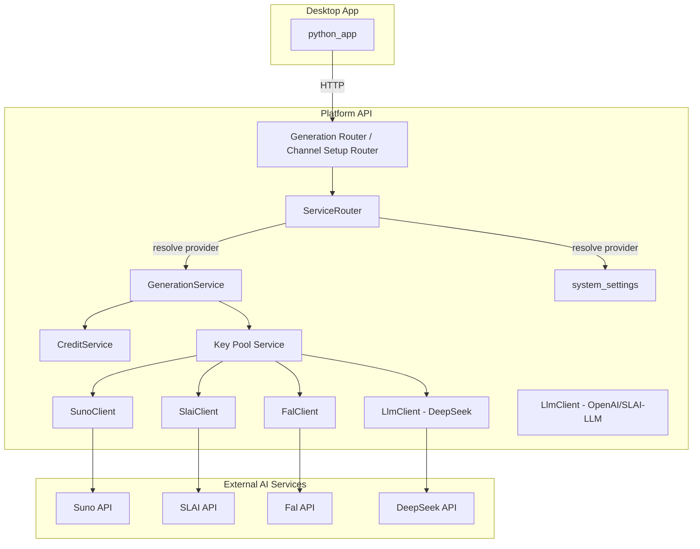
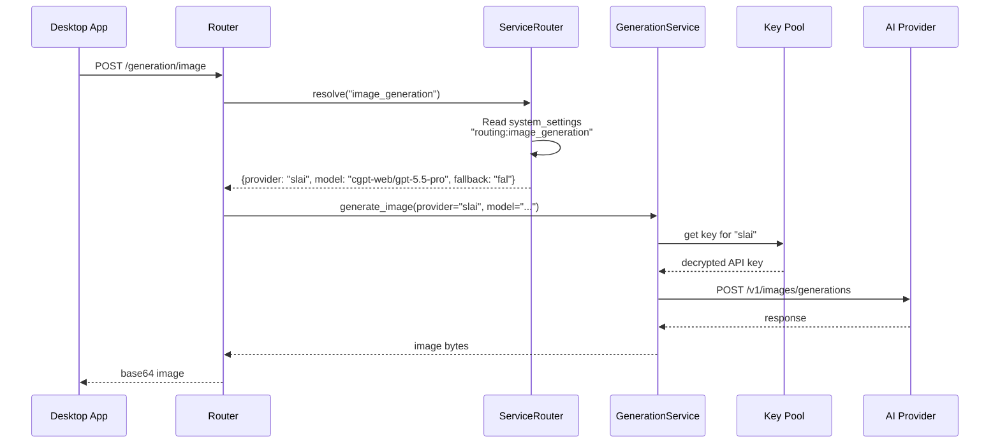

# Design Document: AI Service Switcher

## Overview

This design transforms the platform's hardcoded AI provider routing into a dynamic, admin-configurable system. The core change is introducing a `ServiceRouter` that resolves which provider to use at request time based on `system_settings`, replacing the current pattern where `GenerationService` and `channel_setup` router have provider names baked into their code.

The design leverages existing infrastructure:
- **system_settings table** — already stores key-value config (used for Global Credit Value)
- **Key Pool** — already manages encrypted keys per provider with failover
- **Credit Pricing** — already keyed by (ai_service, operation_type)
- **Service Availability** — already queries key pool status per provider

---

## Architecture



### Request Flow



---

## Components

### 1. ServiceRouter (NEW)

**File:** `platform_api/services/service_router.py`

The central routing resolver. Pure logic, no side effects (easy to test).

```python
@dataclass(frozen=True)
class RoutingConfig:
    """Resolved routing configuration for a single operation type."""
    provider: str           # e.g., "slai"
    model: str | None       # e.g., "cgpt-web/gpt-5.5-pro" or None for default
    fallback_provider: str | None  # e.g., "fal" or None

# Provider capability registry (static, code-defined)
PROVIDER_CAPABILITIES: dict[str, list[str]] = {
    "suno": ["music_generation"],
    "deepseek": ["text_generation"],
    "openai": ["text_generation"],
    "slai": ["image_generation", "text_generation"],
    "fal": ["image_generation"],
}

# Default providers when no config exists (backward compatibility)
DEFAULT_PROVIDERS: dict[str, str] = {
    "music_generation": "suno",
    "text_generation": "deepseek",
    "image_generation": "slai",
}

# Default models per provider
DEFAULT_MODELS: dict[str, str] = {
    "suno": "V5",
    "deepseek": "deepseek-chat",
    "openai": "gpt-5.5",
    "slai": "cgpt-web/gpt-5.5-pro",
    "fal": "flux-pro",
}

class ServiceRouter:
    def __init__(self, settings_repo: SettingsRepository) -> None:
        self._settings_repo = settings_repo

    async def resolve(self, operation_type: str) -> RoutingConfig:
        """Resolve the active provider for an operation type at request time."""
        ...

    async def update_routing(
        self, operation_type: str, provider: str,
        model: str | None = None, fallback: str | None = None
    ) -> RoutingConfig:
        """Admin updates routing config after validation."""
        ...

    def get_capabilities(self) -> dict[str, list[str]]:
        """Return the static provider capability matrix."""
        return PROVIDER_CAPABILITIES

    def validate_assignment(self, provider: str, operation_type: str) -> None:
        """Raise ValidationError if provider can't handle operation_type."""
        ...
```

### 2. system_settings Keys (Storage)

Uses the existing `system_settings` table (already has `get_system_setting` / `upsert_system_settings`).

| Key | Value (JSON) | Example |
|-----|-------|---------|
| `routing:music_generation` | `{"provider": "suno", "model": "V5", "fallback": null}` | Music → Suno |
| `routing:text_generation` | `{"provider": "deepseek", "model": "deepseek-chat", "fallback": "slai"}` | Text → DeepSeek, fallback to SLAI |
| `routing:image_generation` | `{"provider": "slai", "model": "cgpt-web/gpt-5.5-pro", "fallback": "fal"}` | Image → SLAI, fallback to FAL |

Stored as JSON strings in the existing `value` column with `value_type = "json"`.

### 3. GenerationService Changes

The `GenerationService` currently has hardcoded routing like:
- `submit_draft()` → always uses DeepSeek (with SLAI fallback)
- `submit_image()` → uses provider from request body (fal or slai)
- `_call_slai()` → always calls SLAI client

**New pattern:** Each method resolves the provider via `ServiceRouter.resolve()` at the start of the request, then dispatches to the correct client based on the resolved provider.

```python
async def generate_text(self, operation_type: str, ...) -> str:
    routing = await self._service_router.resolve("text_generation")
    provider = routing.provider
    model = routing.model
    
    try:
        return await self._dispatch_text(provider, model, ...)
    except ExternalServiceError:
        if routing.fallback_provider:
            fallback_model = DEFAULT_MODELS.get(routing.fallback_provider)
            return await self._dispatch_text(routing.fallback_provider, fallback_model, ...)
        raise

async def _dispatch_text(self, provider: str, model: str | None, ...) -> str:
    """Route text generation to the correct client."""
    if provider == "deepseek":
        return await self._call_deepseek(model=model, ...)
    elif provider == "slai":
        return await self._call_slai_llm(model=model, ...)
    elif provider == "openai":
        return await self._call_openai(model=model, ...)
    raise ValueError(f"Unknown text provider: {provider}")

async def _dispatch_image(self, provider: str, model: str | None, ...) -> bytes:
    """Route image generation to the correct client."""
    if provider == "slai":
        return await self._call_slai(model=model, ...)
    elif provider == "fal":
        return await self._call_fal(model=model, ...)
    raise ValueError(f"Unknown image provider: {provider}")

async def _dispatch_music(self, provider: str, model: str | None, ...) -> str:
    """Route music generation to the correct client."""
    if provider == "suno":
        return await self._call_suno(model=model, ...)
    raise ValueError(f"Unknown music provider: {provider}")
```

### 4. Channel Setup Router Changes

Currently hardcodes `"deepseek"` and `"slai"`. Updated to resolve via ServiceRouter:

```python
async def generate_names(...):
    from platform_api.dependencies import get_service_router
    router = get_service_router()
    routing = await router.resolve("text_generation")
    
    # Pass to CreditService with resolved provider
    names, credits = await credit_svc.execute_with_credits(
        user_id=ctx.user_id,
        ai_service=routing.provider,
        operation_type="text_generation",
        operation=lambda: gen.generate_chat_text(..., model=routing.model),
        fallback_operation_type="text_generation",
    )
```

### 5. API Endpoints

**Router:** `platform_api/routers/service_routing.py`

```
GET  /api/v1/service-routing          → Returns all routing configs + health
PUT  /api/v1/service-routing          → Update routing for an operation type
GET  /api/v1/service-routing/capabilities → Returns provider capability matrix
```

**GET /api/v1/service-routing Response:**
```json
{
  "routes": [
    {
      "operation_type": "music_generation",
      "provider": "suno",
      "model": "V5",
      "fallback_provider": null,
      "provider_status": "available",
      "fallback_status": null,
      "has_pricing": true
    },
    {
      "operation_type": "text_generation",
      "provider": "deepseek",
      "model": "deepseek-chat",
      "fallback_provider": "slai",
      "provider_status": "available",
      "fallback_status": "available",
      "has_pricing": true
    },
    {
      "operation_type": "image_generation",
      "provider": "slai",
      "model": "cgpt-web/gpt-5.5-pro",
      "fallback_provider": "fal",
      "provider_status": "available",
      "fallback_status": "available",
      "has_pricing": true
    }
  ],
  "capabilities": {
    "suno": ["music_generation"],
    "deepseek": ["text_generation"],
    "openai": ["text_generation"],
    "slai": ["image_generation", "text_generation"],
    "fal": ["image_generation"]
  }
}
```

**PUT /api/v1/service-routing Request:**
```json
{
  "operation_type": "image_generation",
  "provider": "fal",
  "model": "flux-pro",
  "fallback_provider": "slai"
}
```

### 6. Admin Portal — Service Switcher Page

**File:** `admin_portal/src/pages/service-routing/index.tsx`

Layout:
```
┌─────────────────────────────────────────────────────┐
│  AI Service Routing                                 │
│                                                     │
│  ┌─────────────────────────────────────────────┐    │
│  │ 🎵 Music Generation                         │    │
│  │   Provider: [Suno ▼] ● Available            │    │
│  │   Model:    [V5           ]                  │    │
│  │   Fallback: [None ▼]                         │    │
│  │   Pricing:  ✅ 10 credits/op                 │    │
│  └─────────────────────────────────────────────┘    │
│                                                     │
│  ┌─────────────────────────────────────────────┐    │
│  │ 📝 Text Generation                          │    │
│  │   Provider: [DeepSeek ▼] ● Available        │    │
│  │   Model:    [deepseek-chat    ]              │    │
│  │   Fallback: [SLAI ▼] ● Available            │    │
│  │   Pricing:  ✅ 1 credit/op                   │    │
│  └─────────────────────────────────────────────┘    │
│                                                     │
│  ┌─────────────────────────────────────────────┐    │
│  │ 🖼️ Image Generation                         │    │
│  │   Provider: [SLAI ▼] ● Available            │    │
│  │   Model:    [cgpt-web/gpt-5.5-pro]          │    │
│  │   Fallback: [FAL ▼] ● Available             │    │
│  │   Pricing:  ✅ 5 credits/op                  │    │
│  └─────────────────────────────────────────────┘    │
└─────────────────────────────────────────────────────┘
```

Each card shows:
- Operation type with icon
- Provider dropdown (filtered by capability + key availability)
- Model text input (pre-filled with provider default)
- Fallback dropdown (same filtering, excludes primary)
- Availability badge (green/yellow/red)
- Pricing status (✅ configured, ⚠️ missing)

---

## Data Flow

### Provider Resolution (per request)

```
1. Request arrives at router
2. ServiceRouter.resolve(operation_type)
   a. Read system_settings key "routing:{operation_type}"
   b. If exists → parse JSON → return RoutingConfig
   c. If not exists → return DEFAULT_PROVIDERS[operation_type]
3. GenerationService dispatches to correct client
4. Key Pool provides API key for the resolved provider
5. Client makes external HTTP call
```

### Fallback Flow

```
1. Primary provider call fails (ExternalServiceError / timeout / no keys)
2. Check if RoutingConfig.fallback_provider is set
3. If yes → dispatch same request to fallback provider
4. If fallback also fails → raise error to caller
5. If no fallback configured → raise original error
```

### In-Progress Safety

The provider is resolved **once** at the start of each request and stored in a local variable. The entire request lifecycle (including retries within the Key Pool wrapper) uses that same provider. Admin config changes only affect subsequent requests.

For Suno (callback-based):
- The callback endpoint identifies tasks by `external_task_id` which is provider-agnostic
- The `suno_tasks` table records which provider was used
- Config changes don't affect in-flight callbacks

---

## Error Handling

| Scenario | Behavior |
|----------|----------|
| No routing config exists | Use DEFAULT_PROVIDERS (backward compatible) |
| Primary provider has no keys | Try fallback; if no fallback, raise 503 |
| Primary provider returns error | Try fallback; if no fallback, raise original |
| Fallback also fails | Raise the fallback error (not original) |
| Admin assigns unsupported provider | 422 validation error |
| Admin assigns provider with no keys | 422 with message about key requirement |
| Missing credit pricing for resolved provider | 503 with message about missing pricing |
| Config change during request | No effect — resolved at request start |

---

## Testing Strategy

### Unit Tests
- ServiceRouter.resolve() with various settings states
- ServiceRouter.validate_assignment() for capability checks
- GenerationService dispatch routing with mocked clients
- Fallback behavior (primary fails → fallback succeeds)
- Fallback behavior (primary fails → no fallback → error)

### Integration Tests
- Full flow: update routing → generate → verify correct provider called
- Pricing integration: switch provider → verify correct credits charged
- Key Pool integration: resolve provider → verify correct key used

### Property Tests (Hypothesis)
- For any valid (provider, operation_type) in capabilities, resolve always returns a valid config
- For any routing config update, the resolved config matches what was set
- Fallback is never the same as primary

---

## Migration / Backward Compatibility

- **No database migration needed** — uses existing `system_settings` table
- **No breaking changes** — when no routing config exists, defaults match current behavior
- **Gradual rollout** — admins can configure one operation at a time
- **Desktop app unchanged** — all routing is server-side

---

## Dependencies on Existing Infrastructure

| Component | Status | Used For |
|-----------|--------|----------|
| system_settings table | ✅ Exists | Store routing config as JSON |
| SettingsRepository | ✅ Exists | Read/write routing config |
| Key Pool Service | ✅ Exists | Check key availability, provide keys |
| Service Availability | ✅ Exists | Provider health status |
| Credit Pricing | ✅ Exists | Per-provider pricing lookup |
| AIService enum | ✅ Exists | Validate provider names |
| OperationType enum | ✅ Exists | Validate operation types |
