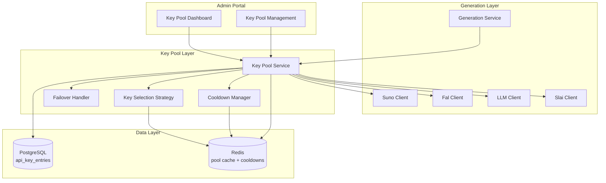
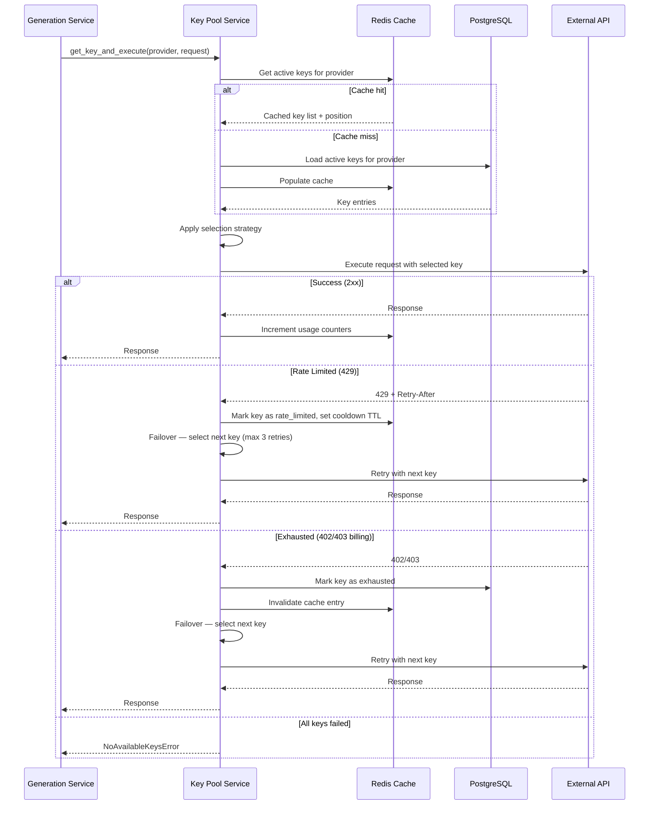
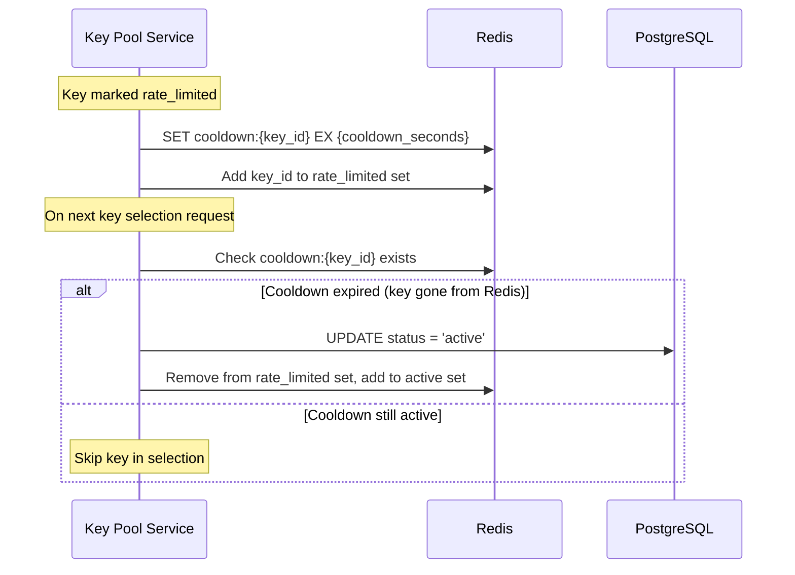

# Design Document: API Key Pool

## Overview

The API Key Pool feature introduces a multi-key management layer between the existing generation service and external AI providers (Suno, FAL.ai, OpenAI, Slai, YouTube, Facebook). Instead of relying on a single API key per provider stored in `system_settings`, the platform maintains a pool of keys per provider with automatic failover, configurable selection strategies, usage tracking, and cooldown-based recovery.

### Key Design Goals

- **High Availability**: Automatic failover to the next available key when one is rate-limited or exhausted
- **Transparent Integration**: The existing `GenerationService` and client protocols require minimal changes — the key pool sits between them and the HTTP clients
- **Operational Visibility**: Real-time health dashboard and usage metrics per key
- **Flexible Selection**: Admin-configurable round-robin or priority-based key selection per provider
- **Security**: All key values encrypted at rest with AES-256

### Technology Choices

- **Encryption**: `cryptography` library (Fernet/AES-256) for key-at-rest encryption — well-maintained, Python-native, avoids database-level encryption complexity
- **Caching**: Redis for in-memory key pool state and round-robin position tracking — already used by the platform for rate limiting and session management
- **Cooldown Scheduling**: Redis TTL keys for cooldown timers — lightweight, no additional task queue dependency needed
- **Database**: PostgreSQL (existing) — new `api_key_entries` and `api_key_usage` tables via Alembic migration

## Architecture

### High-Level Integration



### Request Flow with Key Pool



### Cooldown Recovery Flow



## Components and Interfaces

### New Files Structure

```
platform_api/
├── services/
│   └── key_pool_service.py        # Core key pool logic
├── repositories/
│   └── key_pool_repo.py           # Database operations for key entries
├── routers/
│   └── key_pool.py                # Admin API endpoints
├── models/
│   ├── domain.py                  # + ApiKeyEntry, KeyPoolConfig dataclasses
│   ├── enums.py                   # + KeyStatus, SelectionStrategy enums
│   └── schemas.py                 # + Pydantic request/response models
├── clients/
│   └── key_pool_client_wrapper.py # Wraps existing clients with key selection
└── migrations/
    └── versions/
        └── xxx_add_api_key_pool.py # Alembic migration
```

```
admin_portal/src/
├── pages/
│   └── key-pool/
│       └── index.tsx              # Key Pool management + dashboard page
├── components/
│   └── key-pool/
│       ├── provider-tab.tsx       # Per-provider tab with key list
│       ├── key-entry-row.tsx      # Single key row with actions
│       ├── add-key-dialog.tsx     # Add new key form dialog
│       ├── edit-key-dialog.tsx    # Edit key form dialog
│       ├── provider-settings.tsx  # Strategy + cooldown config
│       ├── health-summary.tsx     # Provider health indicator
│       └── event-log.tsx          # Status transition timeline
├── hooks/
│   └── use-key-pool.ts           # React Query hooks for key pool API
└── types/
    └── key-pool.ts               # TypeScript interfaces
```

### Key Pool Service Interface

```python
from typing import Any, Protocol
from uuid import UUID


class KeyPoolServicePort(Protocol):
    """Port for key pool operations."""

    async def get_key(self, provider: str) -> str:
        """Select the next available API key for a provider.
        
        Raises NoAvailableKeysError if all keys are unavailable.
        """
        ...

    async def execute_with_failover(
        self,
        provider: str,
        execute_fn: Any,  # Callable that takes an API key and returns a response
        max_retries: int = 3,
    ) -> Any:
        """Execute a request with automatic key failover on failure."""
        ...

    async def report_key_success(self, provider: str, key_id: UUID) -> None:
        """Report a successful API call for usage tracking."""
        ...

    async def report_key_failure(
        self, provider: str, key_id: UUID, status_code: int, response_body: str
    ) -> None:
        """Report a failed API call — triggers status transitions and failover."""
        ...

    async def add_key(
        self, provider: str, key_value: str, label: str, priority: int
    ) -> UUID:
        """Add a new key to a provider's pool."""
        ...

    async def remove_key(self, key_id: UUID) -> None:
        """Remove a key from the pool."""
        ...

    async def update_key(
        self, key_id: UUID, *, label: str | None = None, priority: int | None = None, key_value: str | None = None
    ) -> None:
        """Update key metadata."""
        ...

    async def set_key_status(self, key_id: UUID, status: str) -> None:
        """Manually set key status (enable/disable)."""
        ...

    async def get_pool_status(self, provider: str) -> dict:
        """Get pool health summary for a provider."""
        ...

    async def configure_provider(
        self, provider: str, *, strategy: str | None = None, cooldown_seconds: int | None = None
    ) -> None:
        """Configure selection strategy and cooldown for a provider."""
        ...
```

### Key Pool Repository Interface

```python
class KeyPoolRepositoryPort(Protocol):
    """Database operations for API key pool entries."""

    async def list_by_provider(self, provider: str) -> list[ApiKeyEntry]:
        ...

    async def get_active_by_provider(self, provider: str) -> list[ApiKeyEntry]:
        ...

    async def get_by_id(self, key_id: UUID) -> ApiKeyEntry | None:
        ...

    async def create(self, entry: ApiKeyEntry) -> ApiKeyEntry:
        ...

    async def update(self, entry: ApiKeyEntry) -> None:
        ...

    async def delete(self, key_id: UUID) -> None:
        ...

    async def get_provider_config(self, provider: str) -> KeyPoolConfig | None:
        ...

    async def upsert_provider_config(self, config: KeyPoolConfig) -> None:
        ...

    async def increment_counters(
        self, key_id: UUID, *, success: bool, rate_limited: bool = False
    ) -> None:
        ...

    async def reset_daily_counters(self) -> None:
        ...

    async def get_usage_stats(self, key_id: UUID) -> dict:
        ...

    async def get_recent_events(self, provider: str, limit: int = 50) -> list[dict]:
        ...
```

### Client Wrapper Pattern

The key pool integrates with existing clients by wrapping their HTTP call logic:

```python
class KeyPoolClientWrapper:
    """Wraps an existing client to inject API keys from the pool.
    
    Instead of each client holding a single API key from Settings,
    this wrapper intercepts requests and injects the key selected
    by the Key Pool Service.
    """

    def __init__(self, key_pool_service: KeyPoolServicePort, provider: str):
        self._key_pool = key_pool_service
        self._provider = provider

    async def execute(self, request_fn):
        """Execute request_fn with automatic key selection and failover.
        
        request_fn receives the API key as its argument and returns
        the response from the external service.
        """
        return await self._key_pool.execute_with_failover(
            provider=self._provider,
            execute_fn=request_fn,
            max_retries=3,
        )
```

### Admin API Endpoints

| Endpoint | Method | Description |
|----------|--------|-------------|
| `/api/v1/admin/key-pool/{provider}/keys` | GET | List all keys for a provider |
| `/api/v1/admin/key-pool/{provider}/keys` | POST | Add a new key to provider pool |
| `/api/v1/admin/key-pool/keys/{key_id}` | PATCH | Update key label/priority/value |
| `/api/v1/admin/key-pool/keys/{key_id}` | DELETE | Remove key from pool |
| `/api/v1/admin/key-pool/keys/{key_id}/enable` | POST | Set key status to active |
| `/api/v1/admin/key-pool/keys/{key_id}/disable` | POST | Set key status to disabled |
| `/api/v1/admin/key-pool/{provider}/config` | GET | Get provider pool config |
| `/api/v1/admin/key-pool/{provider}/config` | PUT | Update strategy/cooldown |
| `/api/v1/admin/key-pool/{provider}/health` | GET | Get pool health summary |
| `/api/v1/admin/key-pool/{provider}/events` | GET | Get recent status transitions |
| `/api/v1/admin/key-pool/health` | GET | Get all providers health summary |

## Data Models

### Domain Entities

```python
@dataclass
class ApiKeyEntry:
    """A single API key within a provider's pool."""

    id: UUID = field(default_factory=uuid4)
    provider: str = ""                          # "suno", "fal", "openai", "slai", "youtube", "facebook"
    label: str = ""                             # User-friendly label (unique per provider)
    encrypted_key_value: bytes = b""            # AES-256 encrypted key
    priority: int = 50                          # 1 (highest) to 100 (lowest)
    status: KeyStatus = KeyStatus.ACTIVE        # active, rate_limited, exhausted, disabled
    total_requests: int = 0
    daily_requests: int = 0
    success_count: int = 0
    failure_count: int = 0
    rate_limit_hits: int = 0
    last_used_at: datetime | None = None
    last_failure_at: datetime | None = None
    rate_limited_at: datetime | None = None     # When the key entered rate_limited status
    created_at: datetime = field(default_factory=datetime.utcnow)
    updated_at: datetime = field(default_factory=datetime.utcnow)


@dataclass
class KeyPoolConfig:
    """Per-provider pool configuration."""

    id: UUID = field(default_factory=uuid4)
    provider: str = ""
    selection_strategy: SelectionStrategy = SelectionStrategy.PRIORITY
    cooldown_seconds: int = 60                  # 10–3600 range
    created_at: datetime = field(default_factory=datetime.utcnow)
    updated_at: datetime = field(default_factory=datetime.utcnow)


@dataclass
class KeyStatusEvent:
    """Immutable log of a key status transition."""

    id: UUID = field(default_factory=uuid4)
    key_id: UUID = field(default_factory=uuid4)
    provider: str = ""
    key_label: str = ""
    previous_status: KeyStatus = KeyStatus.ACTIVE
    new_status: KeyStatus = KeyStatus.ACTIVE
    trigger_reason: str = ""                    # "rate_limit_429", "exhausted_402", "cooldown_recovery", "admin_disable", "admin_enable"
    http_status_code: int | None = None
    response_summary: str | None = None
    created_at: datetime = field(default_factory=datetime.utcnow)
```

### Enumerations

```python
class KeyStatus(StrEnum):
    """Status of an API key entry in the pool."""
    ACTIVE = "active"
    RATE_LIMITED = "rate_limited"
    EXHAUSTED = "exhausted"
    DISABLED = "disabled"


class SelectionStrategy(StrEnum):
    """Key selection algorithm for a provider pool."""
    ROUND_ROBIN = "round_robin"
    PRIORITY = "priority"
```

### Database Schema (Migration)

```sql
-- Provider-level pool configuration
CREATE TABLE key_pool_configs (
    id UUID PRIMARY KEY DEFAULT gen_random_uuid(),
    provider VARCHAR(50) NOT NULL UNIQUE,
    selection_strategy VARCHAR(20) NOT NULL DEFAULT 'priority',
    cooldown_seconds INTEGER NOT NULL DEFAULT 60 CHECK (cooldown_seconds BETWEEN 10 AND 3600),
    created_at TIMESTAMPTZ NOT NULL DEFAULT NOW(),
    updated_at TIMESTAMPTZ NOT NULL DEFAULT NOW()
);

-- Individual API key entries
CREATE TABLE api_key_entries (
    id UUID PRIMARY KEY DEFAULT gen_random_uuid(),
    provider VARCHAR(50) NOT NULL,
    label VARCHAR(100) NOT NULL,
    encrypted_key_value BYTEA NOT NULL,
    priority INTEGER NOT NULL DEFAULT 50 CHECK (priority BETWEEN 1 AND 100),
    status VARCHAR(20) NOT NULL DEFAULT 'active',
    total_requests INTEGER NOT NULL DEFAULT 0,
    daily_requests INTEGER NOT NULL DEFAULT 0,
    success_count INTEGER NOT NULL DEFAULT 0,
    failure_count INTEGER NOT NULL DEFAULT 0,
    rate_limit_hits INTEGER NOT NULL DEFAULT 0,
    last_used_at TIMESTAMPTZ,
    last_failure_at TIMESTAMPTZ,
    rate_limited_at TIMESTAMPTZ,
    created_at TIMESTAMPTZ NOT NULL DEFAULT NOW(),
    updated_at TIMESTAMPTZ NOT NULL DEFAULT NOW(),
    UNIQUE(provider, label)
);

CREATE INDEX idx_key_entries_provider_status ON api_key_entries(provider, status);
CREATE INDEX idx_key_entries_provider_priority ON api_key_entries(provider, priority);

-- Status transition event log
CREATE TABLE key_status_events (
    id UUID PRIMARY KEY DEFAULT gen_random_uuid(),
    key_id UUID NOT NULL REFERENCES api_key_entries(id) ON DELETE CASCADE,
    provider VARCHAR(50) NOT NULL,
    key_label VARCHAR(100) NOT NULL,
    previous_status VARCHAR(20) NOT NULL,
    new_status VARCHAR(20) NOT NULL,
    trigger_reason VARCHAR(100) NOT NULL,
    http_status_code INTEGER,
    response_summary TEXT,
    created_at TIMESTAMPTZ NOT NULL DEFAULT NOW()
);

CREATE INDEX idx_key_events_provider_created ON key_status_events(provider, created_at DESC);
CREATE INDEX idx_key_events_key_id ON key_status_events(key_id, created_at DESC);
```

### Redis Cache Structure

```
# Active keys per provider (sorted set by priority)
key_pool:{provider}:active → ZSET { key_id: priority_score }

# Round-robin position counter per provider
key_pool:{provider}:rr_position → INT

# Cooldown marker (auto-expires via TTL)
key_pool:{provider}:cooldown:{key_id} → "1" (EX cooldown_seconds)

# Usage counters (daily, reset at midnight UTC)
key_pool:{provider}:{key_id}:daily_requests → INT
key_pool:{provider}:{key_id}:daily_success → INT
key_pool:{provider}:{key_id}:daily_failures → INT

# Rate-limited keys set
key_pool:{provider}:rate_limited → SET { key_id, ... }

# Cache invalidation version
key_pool:{provider}:version → INT
```

### Pydantic Request/Response Schemas

```python
from pydantic import BaseModel, Field
from datetime import datetime
from uuid import UUID


class AddKeyRequest(BaseModel):
    key_value: str = Field(min_length=1, max_length=500)
    label: str = Field(min_length=1, max_length=100)
    priority: int = Field(ge=1, le=100, default=50)


class UpdateKeyRequest(BaseModel):
    label: str | None = Field(None, min_length=1, max_length=100)
    priority: int | None = Field(None, ge=1, le=100)
    key_value: str | None = Field(None, min_length=1, max_length=500)


class KeyEntryResponse(BaseModel):
    id: UUID
    provider: str
    label: str
    masked_key: str          # "sk-ab...xy4z"
    priority: int
    status: str
    total_requests: int
    daily_requests: int
    success_count: int
    failure_count: int
    rate_limit_hits: int
    last_used_at: datetime | None
    last_failure_at: datetime | None
    cooldown_remaining_seconds: int | None = None
    created_at: datetime


class ProviderConfigRequest(BaseModel):
    selection_strategy: str = Field(pattern=r"^(round_robin|priority)$")
    cooldown_seconds: int = Field(ge=10, le=3600)


class ProviderConfigResponse(BaseModel):
    provider: str
    selection_strategy: str
    cooldown_seconds: int


class ProviderHealthResponse(BaseModel):
    provider: str
    total_keys: int
    active_keys: int
    rate_limited_keys: int
    exhausted_keys: int
    disabled_keys: int
    health_indicator: str    # "healthy", "degraded", "critical"


class AllProvidersHealthResponse(BaseModel):
    providers: list[ProviderHealthResponse]


class KeyStatusEventResponse(BaseModel):
    id: UUID
    key_label: str
    previous_status: str
    new_status: str
    trigger_reason: str
    http_status_code: int | None
    created_at: datetime
```

### Encryption Approach

```python
from cryptography.fernet import Fernet

class KeyEncryption:
    """Handles AES-256 encryption/decryption of API key values.
    
    Uses Fernet (symmetric encryption) which provides AES-128-CBC
    with HMAC-SHA256 for authentication. For AES-256, we use a
    derived key via PBKDF2 from the server's master encryption key.
    """

    def __init__(self, master_key: str):
        # Derive a Fernet-compatible key from the master key
        import base64
        from cryptography.hazmat.primitives.kdf.pbkdf2 import PBKDF2HMAC
        from cryptography.hazmat.primitives import hashes

        kdf = PBKDF2HMAC(
            algorithm=hashes.SHA256(),
            length=32,
            salt=b"api-key-pool-salt",  # Static salt — key uniqueness from master_key
            iterations=100_000,
        )
        derived = kdf.derive(master_key.encode())
        self._fernet = Fernet(base64.urlsafe_b64encode(derived))

    def encrypt(self, plaintext: str) -> bytes:
        return self._fernet.encrypt(plaintext.encode())

    def decrypt(self, ciphertext: bytes) -> str:
        return self._fernet.decrypt(ciphertext).decode()
```


## Correctness Properties

*A property is a characteristic or behavior that should hold true across all valid executions of a system — essentially, a formal statement about what the system should do. Properties serve as the bridge between human-readable specifications and machine-verifiable correctness guarantees.*

### Property 1: Encryption round-trip preserves key value

*For any* valid API key string (1–500 characters), encrypting and then decrypting it should produce an identical string, and the encrypted ciphertext should not contain the plaintext as a substring.

**Validates: Requirements 1.6**

### Property 2: Input validation accepts valid entries and rejects invalid ones

*For any* key value with length 1–500, any label with length 1–100 that is unique within the provider, and any priority in range 1–100, the Key Pool Service should accept the entry and set initial status to active. *For any* input that violates these constraints (empty key, label > 100 chars, priority outside 1–100, or duplicate label within same provider), the service should reject the entry with an appropriate validation error.

**Validates: Requirements 1.2, 1.5**

### Property 3: Key removal excludes key from selection pool

*For any* provider pool with N active keys (N ≥ 2), removing one key should result in N−1 keys remaining, and subsequent key selection should never return the removed key's identifier.

**Validates: Requirements 1.3**

### Property 4: Priority update affects subsequent selection order

*For any* provider pool configured with the priority strategy and containing at least 2 keys, updating a key's priority to be the lowest value (highest priority) should cause that key to be selected next.

**Validates: Requirements 1.4**

### Property 5: Round-robin cycles deterministically through all active keys

*For any* provider pool with N active keys configured with round-robin strategy, making N consecutive selections should return each active key exactly once, and making 2N selections should repeat the same sequence.

**Validates: Requirements 2.2**

### Property 6: Priority selection returns lowest-priority-number key

*For any* provider pool configured with priority strategy, the selected key should always be the active key with the lowest priority number. *For any* pool where multiple active keys share the same lowest priority, consecutive selections among those tied keys should cycle in round-robin fashion.

**Validates: Requirements 2.3**

### Property 7: Strategy change takes immediate effect

*For any* provider pool, after changing the selection strategy from one mode to the other, the very next key selection should follow the new strategy's behavior pattern (not the previous strategy's).

**Validates: Requirements 2.4**

### Property 8: HTTP failure triggers correct status transition and failover

*For any* provider pool with at least 2 active keys, when a request returns HTTP 429, the used key's status should transition to rate_limited and the retry should use a different active key. When a request returns HTTP 402 or 403 (billing), the used key's status should transition to exhausted and the retry should use a different active key.

**Validates: Requirements 3.1, 3.2**

### Property 9: Selection only returns active keys

*For any* provider pool containing keys with mixed statuses (active, rate_limited, exhausted, disabled), the key selection function should only ever return a key whose current status is active.

**Validates: Requirements 3.3**

### Property 10: All non-active keys produces NoAvailableKeysError

*For any* provider pool where every key has a non-active status (any combination of rate_limited, exhausted, disabled), attempting to select a key should raise a NoAvailableKeysError that includes the count of keys in each status.

**Validates: Requirements 3.4**

### Property 11: Failover retries are bounded at 3

*For any* provider pool where all key requests fail (all return errors), the total number of request attempts should be at most 3, regardless of the number of keys in the pool.

**Validates: Requirements 3.5**

### Property 12: Cooldown duration uses Retry-After when present, capped at 3600

*For any* rate-limit response, if a Retry-After header is present with a numeric value V, the cooldown duration should be min(V, 3600). If no Retry-After header is present, the cooldown duration should equal the provider's configured cooldown_seconds value.

**Validates: Requirements 4.1, 4.5**

### Property 13: Cooldown recovery restores active status

*For any* key in rate_limited status with a configured cooldown period, after the cooldown period elapses, the key's status should transition back to active and it should become eligible for selection.

**Validates: Requirements 4.2**

### Property 14: Configuration change does not affect existing cooldowns

*For any* provider with a key already in cooldown at duration X, changing the provider's cooldown configuration to a different value Y should not alter the remaining cooldown time for the already-cooling-down key. Only keys that enter rate_limited status after the configuration change should use the new duration.

**Validates: Requirements 4.3**

### Property 15: Exhausted keys never auto-recover

*For any* key with exhausted status, regardless of how much time elapses (even beyond the maximum cooldown of 3600 seconds), the key should remain in exhausted status until explicitly changed by an admin action.

**Validates: Requirements 4.4**

### Property 16: Usage counters are correctly categorized

*For any* sequence of N requests with a given key, where S succeed, F fail (non-429 4xx/5xx), and R receive 429 responses (S + F + R = N), the key's counters should satisfy: total_requests = N, daily_requests = N, success_count = S, failure_count = F, rate_limit_hits = R.

**Validates: Requirements 5.1, 5.2**

### Property 17: Daily counter reset preserves total counters

*For any* set of key entries with arbitrary daily and total counter values, after a daily reset operation, all daily_requests counters should be zero while total_requests, success_count, failure_count, and rate_limit_hits should remain unchanged.

**Validates: Requirements 5.3**

### Property 18: Health indicator correctly reflects pool state

*For any* provider pool with T total keys, A active keys, the health indicator should be: "healthy" when A ≥ 1 and A ≥ T/2 (at least half active), "degraded" when 0 < A < T/2 (less than half active), and "critical" when A = 0 (no active keys).

**Validates: Requirements 7.1**

### Property 19: Empty pool falls back to system_settings key

*For any* provider where the key pool contains zero entries, the Key Pool Service should return the key value from the system_settings table for that provider. *For any* provider where the key pool contains at least one active entry, the service should use the pool and not fall back to system_settings.

**Validates: Requirements 8.3**

## Error Handling

### Error Categories

| Error | HTTP Status | Error Code | Trigger |
|-------|-------------|------------|---------|
| No available keys | 503 | `NO_AVAILABLE_KEYS` | All keys for a provider are non-active |
| Duplicate label | 409 | `DUPLICATE_KEY_LABEL` | Adding a key with an existing label for the same provider |
| Key not found | 404 | `KEY_NOT_FOUND` | Operating on a non-existent key ID |
| Invalid priority | 422 | `VALIDATION_ERROR` | Priority outside 1–100 range |
| Invalid key value | 422 | `VALIDATION_ERROR` | Empty key or exceeds 500 characters |
| Invalid cooldown | 422 | `VALIDATION_ERROR` | Cooldown outside 10–3600 range |
| Encryption failure | 500 | `ENCRYPTION_ERROR` | Master key misconfiguration or corrupted ciphertext |
| Provider not found | 404 | `PROVIDER_NOT_FOUND` | Unknown provider identifier |
| Max retries exceeded | 502 | `UPSTREAM_FAILURE` | All 3 failover attempts failed |

### Error Handling Strategy

```python
class NoAvailableKeysError(PlatformAPIError):
    """Raised when no active keys exist for a provider."""

    def __init__(self, provider: str, status_counts: dict[str, int]):
        super().__init__(
            status_code=503,
            error_code="NO_AVAILABLE_KEYS",
            message=f"No available API keys for provider '{provider}'.",
            details={"provider": provider, "status_counts": status_counts},
        )


class DuplicateKeyLabelError(PlatformAPIError):
    """Raised when a duplicate label is used within the same provider."""

    def __init__(self, provider: str, label: str):
        super().__init__(
            status_code=409,
            error_code="DUPLICATE_KEY_LABEL",
            message=f"Label '{label}' already exists for provider '{provider}'.",
            details={"provider": provider, "label": label},
        )
```

### Resilience Patterns

1. **Cache Degradation**: If Redis is unavailable, fall back to direct PostgreSQL queries with a logged warning. Performance degrades but functionality is preserved.
2. **Failover Circuit**: Maximum 3 retry attempts per request prevents infinite loops when all keys are failing.
3. **Cooldown Capping**: Retry-After values are capped at 3600 seconds to prevent a misbehaving API from indefinitely blocking a key.
4. **Encryption Key Rotation**: If the master encryption key changes, a migration script decrypts with the old key and re-encrypts with the new key. No automatic rotation to avoid data loss risk.

## Testing Strategy

### Property-Based Testing (Hypothesis)

The project already uses `hypothesis>=6.100.0` (in `pyproject.toml` dev dependencies). Each correctness property maps to a property-based test with minimum 100 iterations.

**Library**: Hypothesis (Python)
**Configuration**: `@settings(max_examples=100)` minimum per property test
**Tag format**: `# Feature: api-key-pool, Property {N}: {property_text}`

Property tests will target the pure logic functions:
- Key selection algorithms (round-robin, priority)
- Status transition logic
- Cooldown duration computation
- Counter categorization
- Health indicator calculation
- Encryption round-trip
- Validation rules (accept/reject)

### Unit Tests (pytest)

Example-based tests for:
- Admin API endpoint request/response validation (6.x requirements)
- Specific failover scenario walkthroughs
- Event log content verification (3.6)
- Default strategy on pool creation (2.5)
- Usage statistics response completeness (5.4)

### Integration Tests

- Redis cache population on startup (8.4)
- Redis fallback to DB on cache miss (8.5)
- Counter persistence across simulated restarts (5.5)
- Generation service using pool keys instead of system_settings (8.1)
- Dashboard real-time update timing (7.2)

### Frontend Tests (Vitest + React Testing Library)

The admin portal uses `vitest` and `@testing-library/react`. Frontend tests cover:
- Page renders with all required UI elements per provider
- Add/edit/delete key form interactions
- Confirmation dialogs before destructive actions
- Health indicator badge rendering
- Alert banner on critical state

### Test File Organization

```
platform_api/tests/
├── test_key_pool_service.py          # Property + unit tests for core service
├── test_key_pool_selection.py        # Property tests for selection strategies
├── test_key_pool_failover.py         # Property tests for failover + retry logic
├── test_key_pool_cooldown.py         # Property tests for cooldown recovery
├── test_key_pool_counters.py         # Property tests for usage tracking
├── test_key_pool_encryption.py       # Property tests for encrypt/decrypt round-trip
├── test_key_pool_repo.py             # Integration tests for repository
└── test_key_pool_router.py           # API endpoint tests

admin_portal/tests/
└── key-pool/
    ├── key-pool-page.test.tsx        # Page rendering tests
    ├── provider-tab.test.tsx         # Tab component tests
    └── health-summary.test.tsx       # Health indicator tests
```
