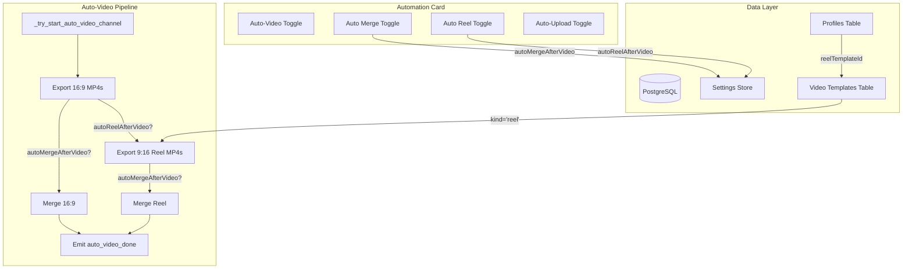
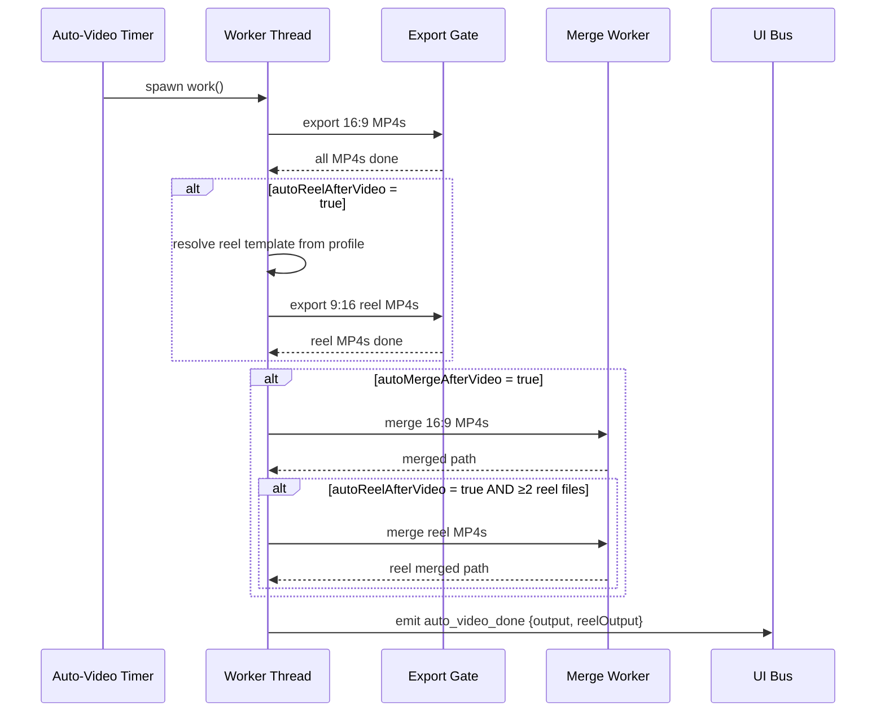

# Design Document: Auto Merge and Reel Video

## Overview

This design adds two automation pipeline gates — **Auto Merge** and **Auto Reel** — to the existing auto-video workflow. Auto Merge converts the currently unconditional post-export merge into a toggled step. Auto Reel introduces a parallel 9:16 portrait video export pipeline that reuses the same background image and batch context, with its own template system and merge behavior.

The feature integrates with:
- The Automation Card toggle UI pattern
- The settings persistence layer (`autoMergeAfterVideo`, `autoReelAfterVideo`)
- The auto-video pipeline's threaded worker model
- The video template and profile systems (new `kind` column, new `reelTemplateId` field)
- The progress page stage detection and display

### Design Decisions

1. **Reel templates share the `video_templates` table** — distinguished by a `kind` column (`"video"` or `"reel"`) rather than a separate table. This keeps CRUD operations unified and avoids schema duplication.

2. **Reel export runs sequentially after standard export** — within the same worker thread, reel MP4s are produced after all 16:9 exports complete. This avoids doubling the concurrent subprocess count and keeps the existing `export_gate` semaphore logic intact.

3. **Separate merge operations** — reel merge and standard merge are independent operations. If one fails, the other proceeds. This maximizes output availability.

4. **Reel videos excluded from YouTube upload** — the done event carries a `reelOutput` field but the YouTube handler ignores it. Reel content targets future Facebook Reel browser automation.

5. **Default `autoMergeAfterVideo` to false** — this makes the new behavior opt-in and preserves backward compatibility (users who relied on unconditional merge must enable the toggle).

## Architecture



### Sequence Flow



## Components and Interfaces

### 1. Settings Toggle Integration

**New setting keys:**
- `autoMergeAfterVideo: bool` — gates the merge step in the auto-video pipeline
- `autoReelAfterVideo: bool` — gates the reel export step

**UI Integration:**
- Two new inline toggles in the Automation Card (between Auto-Video and Auto-Upload)
- Uses existing `_create_music_inline_toggle(label, callback)` pattern
- Callbacks: `_update_music_settings({"autoMergeAfterVideo": bool})` and `_update_music_settings({"autoReelAfterVideo": bool})`

### 2. Auto-Video Pipeline Modifications (`auto_video_handlers.py`)

The `work()` closure in `_try_start_auto_video_channel` gains two new phases:

```python
# After standard 16:9 export completes:
if settings.get("autoReelAfterVideo"):
    reel_mp4s = self._export_reel_videos(plan, expected_mp4s)

if settings.get("autoMergeAfterVideo"):
    merged_path = self._merge_standard(plan, expected_mp4s)
    if settings.get("autoReelAfterVideo") and len(reel_mp4s) >= 2:
        reel_merged_path = self._merge_reels(plan, reel_mp4s)
```

**Key methods to add/modify:**
- `_export_reel_videos(plan, standard_mp4s) -> list[str]` — resolves reel template, renders 9:16 MP4s with `_REEL` suffix
- Merge gating: wrap existing merge block in `if settings.get("autoMergeAfterVideo"):`
- Reel merge: separate `merge_worker.merge()` call for reel files

### 3. AutoVideoCoordinator Extensions

**New method:**
```python
def resolve_reel_plan(self, plan: AutoVideoChannelPlan, settings: dict) -> AutoVideoReelPlan | None
```

Resolves reel template from profile's `reelTemplateId`, returns None if not configured (triggering skip + warning).

**New dataclass:**
```python
@dataclass
class AutoVideoReelPlan:
    reel_template: dict
    width: int   # 1080
    height: int  # 1920
    mp3s: list[str]
    bg_path: str
    logo_path: str
    output_dir: str
    ffmpeg_path: str
    speed_mode: str
    export_workers: int
```

### 4. Database Migrations

**video_templates table — add `kind` column:**
```sql
ALTER TABLE video_templates ADD COLUMN IF NOT EXISTS kind text NOT NULL DEFAULT 'video';
CREATE INDEX IF NOT EXISTS idx_video_templates_kind ON video_templates(kind);
```

**profiles table — add `reel_template_id` column:**
```sql
ALTER TABLE profiles ADD COLUMN IF NOT EXISTS reel_template_id text NOT NULL DEFAULT '';
```

### 5. Template Filtering

**Video template listing** — existing functions gain a `kind` filter parameter:
- `db_list_video_templates(cfg, kind="video")` → returns templates where kind = "video"
- `db_list_video_templates(cfg, kind="reel")` → returns reel templates

The profile video template combo uses `kind="video"`, the new reel template combo uses `kind="reel"`.

### 6. Profile Editor — Reel Template Selector

A new combo box `music_settings_profile_reel_template` positioned adjacent to the existing video template combo. Uses the same CRUD infrastructure but filters by `kind="reel"`.

**Profile save** adds `reelTemplateId` field alongside existing `videoTemplateId`.

### 7. Progress Page Updates

**Converter column** format when `autoReelAfterVideo` is true:
```
MP4 5/5 · Reel 3/5
```

**Merge column** when both toggles active:
```
MERGED_OK_... · MERGED_REEL_OK_...
```

**`_scan_progress_output_dir` changes:**
- Standard MP4: files ending in `.mp4` that do NOT end in `_REEL.mp4` and do NOT start with `MERGED_`
- Reel MP4: files ending in `_REEL.mp4` that do NOT start with `MERGED_REEL_`
- Standard merged: files starting with `MERGED_` and NOT starting with `MERGED_REEL_`
- Reel merged: files starting with `MERGED_REEL_`

### 8. Done Event Schema

```python
{
    "type": "auto_video_done",
    "ok": bool,
    "output": str,        # standard merged path or ""
    "reelOutput": str,    # reel merged path or ""
    "role": str,
    "batchId": str,
    "profileId": str,
}
```

The YouTube upload handler checks only `output` — ignores `reelOutput`.

### 9. Reel MP4 Naming Convention

| File type | Pattern | Example |
|-----------|---------|---------|
| Individual reel | `{trackname}_REEL.mp4` | `song1_REEL.mp4` |
| Merged reel | `MERGED_REEL_{role}_{suffix}.mp4` | `MERGED_REEL_OK_2024-01-15_1_5.mp4` |

## Data Models

### Settings Schema (additions)

| Key | Type | Default | Description |
|-----|------|---------|-------------|
| `autoMergeAfterVideo` | boolean | `false` | Gates merge step in auto-video pipeline |
| `autoReelAfterVideo` | boolean | `false` | Gates reel export step |

### Profile Schema (additions)

| Field | DB Column | Type | Default | Description |
|-------|-----------|------|---------|-------------|
| `reelTemplateId` | `reel_template_id` | text | `""` | Foreign key to video_templates.uid where kind='reel' |

### Video Template Schema (additions)

| Column | Type | Default | Description |
|--------|------|---------|-------------|
| `kind` | text | `"video"` | Template type: "video" or "reel" |

### AutoVideoReelPlan Dataclass

```python
@dataclass
class AutoVideoReelPlan:
    reel_template: dict     # Parsed template JSON for 9:16 rendering
    width: int              # Always 1080
    height: int             # Always 1920
    mp3s: list[str]         # Same MP3 list from the standard plan
    bg_path: str            # Same background image
    logo_path: str          # Same logo from profile
    output_dir: str         # Same output directory
    ffmpeg_path: str        # FFmpeg executable path
    speed_mode: str         # Export speed mode
    export_workers: int     # Number of parallel export workers
```

### Done Event Schema

```python
@dataclass
class AutoVideoDoneEvent:
    type: str = "auto_video_done"
    ok: bool = False
    output: str = ""         # Standard merged path or ""
    reelOutput: str = ""     # Reel merged path or ""
    role: str = ""
    batchId: str = ""
    profileId: str = ""
```


## Correctness Properties

*A property is a characteristic or behavior that should hold true across all valid executions of a system — essentially, a formal statement about what the system should do. Properties serve as the bridge between human-readable specifications and machine-verifiable correctness guarantees.*

### Property 1: Merge gating depends solely on autoMergeAfterVideo

*For any* auto-video pipeline execution with any combination of settings values (including `videoAutoMergeMp4`), the merge step SHALL be invoked if and only if `autoMergeAfterVideo` is true. When false, the done event `output` field SHALL be an empty string regardless of any other setting.

**Validates: Requirements 2.1, 2.2, 2.3**

### Property 2: Reel export count matches MP3 count when enabled

*For any* batch with N MP3 tracks, when `autoReelAfterVideo` is true and a valid reel template is configured, exactly N reel export operations SHALL be initiated. When `autoReelAfterVideo` is false, zero reel export operations SHALL occur regardless of template configuration.

**Validates: Requirements 4.1, 4.6**

### Property 3: Reel plan invariants

*For any* reel plan resolved from a valid standard plan, the reel plan SHALL have width=1080, height=1920, the same `bg_path` as the standard plan, and the same `output_dir` as the standard plan.

**Validates: Requirements 4.2, 4.3, 12.1**

### Property 4: Reel merge gating

*For any* auto-video pipeline completion where `autoReelAfterVideo` is true, reel merge SHALL be invoked if and only if `autoMergeAfterVideo` is true AND the number of successfully exported reel MP4 files is 2 or more. When fewer than 2 reel files exist or `autoMergeAfterVideo` is false, no reel merge SHALL occur.

**Validates: Requirements 5.1, 5.3**

### Property 5: Merge operation isolation

*For any* pipeline execution where both standard and reel merges are attempted, a failure in one merge operation SHALL NOT prevent the other merge from completing. Each merge runs independently and reports its own success/failure.

**Validates: Requirements 5.4**

### Property 6: Template kind filtering

*For any* set of templates in the video_templates table with mixed `kind` values, filtering by kind="video" SHALL return only templates with kind="video", and filtering by kind="reel" SHALL return only templates with kind="reel". No template SHALL appear in both result sets.

**Validates: Requirements 6.2, 6.3**

### Property 7: Reel template CRUD isolation

*For any* CRUD operation (create, update, delete) performed on a reel template (kind="reel"), all video templates (kind="video") SHALL remain unchanged in content, count, and field values.

**Validates: Requirements 8.2, 8.3**

### Property 8: Progress page file classification by naming convention

*For any* set of filenames in an output directory, the scan function SHALL classify files as: (a) standard MP4 if ending in `.mp4` but NOT ending in `_REEL.mp4` and NOT prefixed with `MERGED_`, (b) reel MP4 if ending in `_REEL.mp4` and NOT prefixed with `MERGED_REEL_`, (c) standard merged if prefixed with `MERGED_` but NOT `MERGED_REEL_`, (d) reel merged if prefixed with `MERGED_REEL_`. Every `.mp4` file SHALL belong to exactly one category.

**Validates: Requirements 10.5, 12.4**

### Property 9: Progress stage detection with reel awareness

*For any* batch progress state where `autoReelAfterVideo` is true, the pipeline stage SHALL NOT advance past "Converter" until all expected reel MP4 files are produced. When `autoMergeAfterVideo` is also true, the stage SHALL NOT advance past "Merge" until the reel merge completes.

**Validates: Requirements 10.3, 10.4**

### Property 10: Progress converter column includes reel counts

*For any* batch progress display where `autoReelAfterVideo` is true, the converter column text SHALL include both standard MP4 counts and reel MP4 counts in a format containing both values (e.g., "MP4 {x}/{y} · Reel {a}/{b}").

**Validates: Requirements 10.1**

### Property 11: Done event reelOutput field and YouTube exclusion

*For any* auto_video_done event emitted by the pipeline, the event SHALL contain a `reelOutput` field (string, possibly empty). The YouTube upload handler SHALL process only the `output` field and SHALL never trigger uploads for the value in `reelOutput`.

**Validates: Requirements 11.1, 11.2, 11.3, 11.4**

### Property 12: Reel file naming conventions

*For any* MP3 track with stem name S, the individual reel output SHALL be named `{S}_REEL.mp4`. *For any* role R and batch suffix X, the merged reel output SHALL be named `MERGED_REEL_{R}_{X}.mp4`. These patterns are consistent and invertible (given a reel filename, the original stem/role/suffix can be extracted).

**Validates: Requirements 12.2, 12.3**

## Error Handling

### Merge Failure (Standard)
- **Trigger**: `MergeWorker.merge()` raises `RuntimeError` during standard 16:9 concatenation
- **Behavior**: Set `merged_path = ""`, emit status message with failure reason, proceed to reel merge if applicable
- **Event**: `auto_video_done` emitted with `output=""`, `ok=True` (export succeeded, merge failed)

### Merge Failure (Reel)
- **Trigger**: `MergeWorker.merge()` raises `RuntimeError` during reel concatenation
- **Behavior**: Set `reel_merged_path = ""`, emit warning status message, preserve all individual reel MP4 files
- **Event**: `auto_video_done` emitted with `reelOutput=""`, standard merge unaffected

### Reel Template Missing
- **Trigger**: Profile's `reelTemplateId` is empty or points to a deleted template
- **Behavior**: Skip reel generation entirely for that channel, emit warning status: "Auto-Reel: skipped {role} — no reel template configured"
- **Event**: Pipeline continues to merge phase (standard only)

### Individual Reel Export Failure
- **Trigger**: Single reel render subprocess exits non-zero
- **Behavior**: Log failure for that track, skip that reel output, continue rendering remaining tracks
- **Impact**: Reel merge proceeds with whatever reel MP4s were successfully produced (requires ≥2 for merge)

### Database Migration Failure
- **Trigger**: `ALTER TABLE` for new columns fails (permissions, connection issues)
- **Behavior**: Standard `ensure_database_and_migrate` error path — returns `{"ok": False, "message": ...}`
- **Impact**: App starts without new columns; toggles default to false, reel template selector empty

### Settings Read Failure
- **Trigger**: `autoMergeAfterVideo` or `autoReelAfterVideo` cannot be read from persistence
- **Behavior**: Both default to `false` — no merge, no reel export
- **Impact**: Pipeline behavior matches pre-feature state (except merge is now skipped by default)

## Testing Strategy

### Property-Based Testing

This feature is suitable for property-based testing. The core logic involves:
- Boolean gating decisions (merge/reel enablement)
- File naming convention adherence
- File classification from arbitrary filename inputs
- Template filtering from random template sets
- Event schema invariants

**Library**: [Hypothesis](https://hypothesis.readthedocs.io/) (Python)

**Configuration**: Minimum 100 iterations per property test.

**Tag format**: `Feature: auto-merge-and-reel-video, Property {N}: {title}`

Each correctness property above maps to a single property-based test.

### Unit Tests (Example-Based)

| Area | Test Cases |
|------|-----------|
| Toggle persistence | Verify `autoMergeAfterVideo` and `autoReelAfterVideo` persist on toggle click |
| Toggle restore | Verify toggles restore from settings on page load, default to false |
| Profile save/load | Verify `reelTemplateId` round-trips through save and load |
| Template CRUD | Create/update/delete reel template with kind="reel" |
| Reel template resolution | Profile with valid/missing reelTemplateId |
| Backward compatibility | Existing templates without kind default to "video" |
| Done event schema | Verify event contains all expected fields |

### Integration Tests

| Area | Test Cases |
|------|-----------|
| Full pipeline (merge ON, reel ON) | End-to-end: MP3s → 16:9 export → reel export → both merges → done event |
| Full pipeline (merge OFF, reel ON) | MP3s → 16:9 export → reel export → no merge → done event |
| Full pipeline (merge ON, reel OFF) | MP3s → 16:9 export → standard merge → done event with reelOutput="" |
| Migration | Run migration on fresh DB, verify columns exist with defaults |
| YouTube exclusion | Pipeline completes with reel, verify YouTube upload only receives standard output |

### Edge Case Tests

| Scenario | Expected Behavior |
|----------|-------------------|
| Single reel MP4 with merge ON | Skip reel merge, keep single file |
| All reel exports fail | No reel merge attempted, standard pipeline unaffected |
| Merge failure with reel success | Standard output="", reel merged path populated |
| Empty reelTemplateId | Reel generation skipped, warning emitted |
| Settings read failure | Both toggles default to false |
