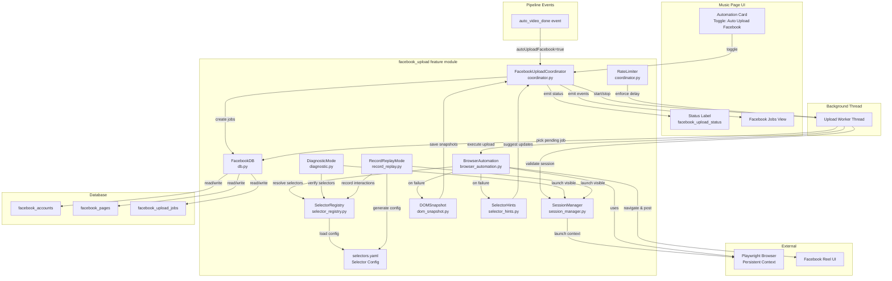
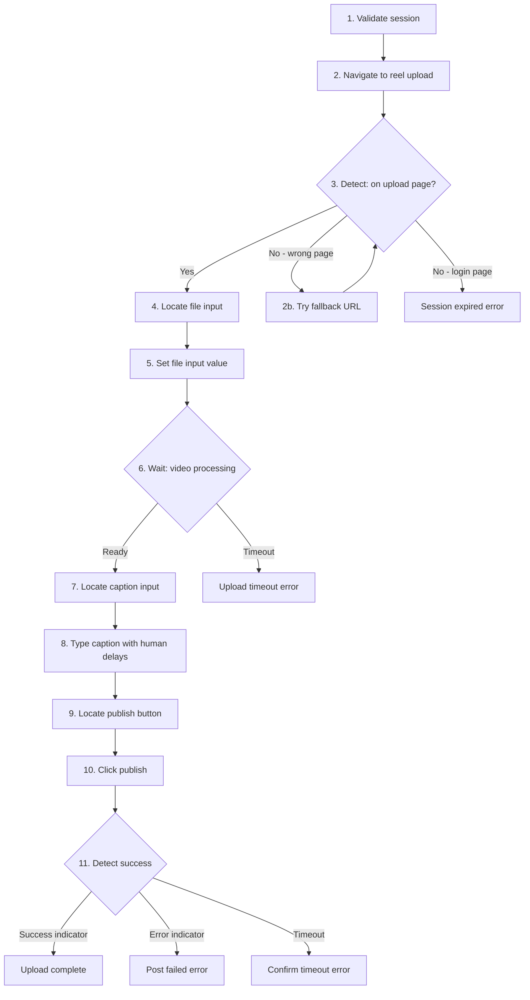
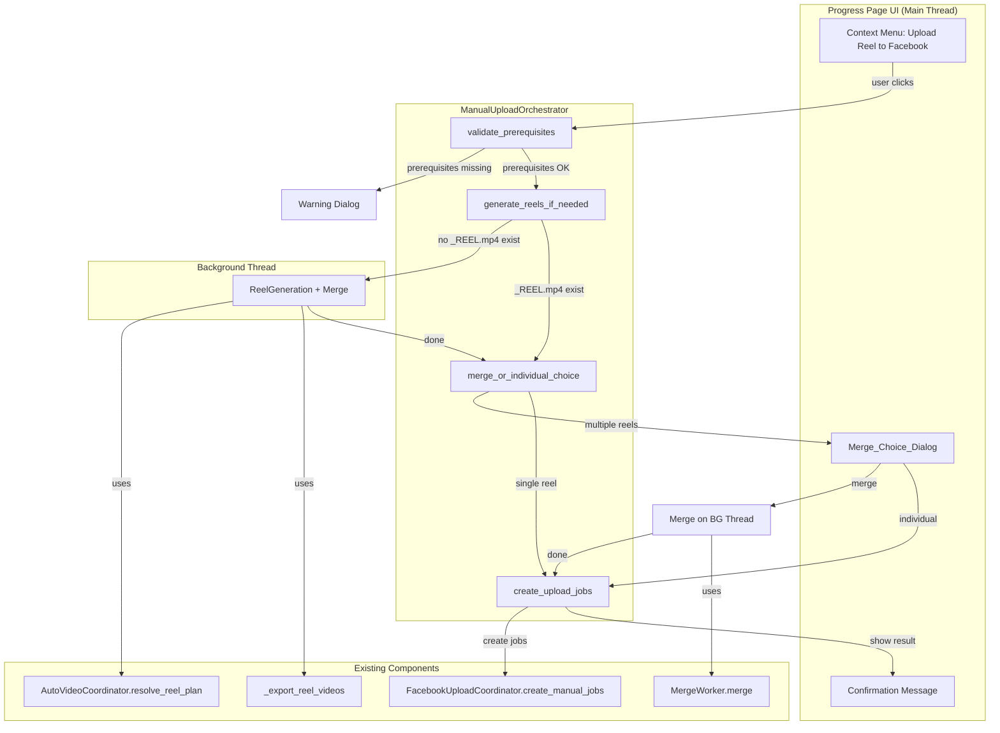
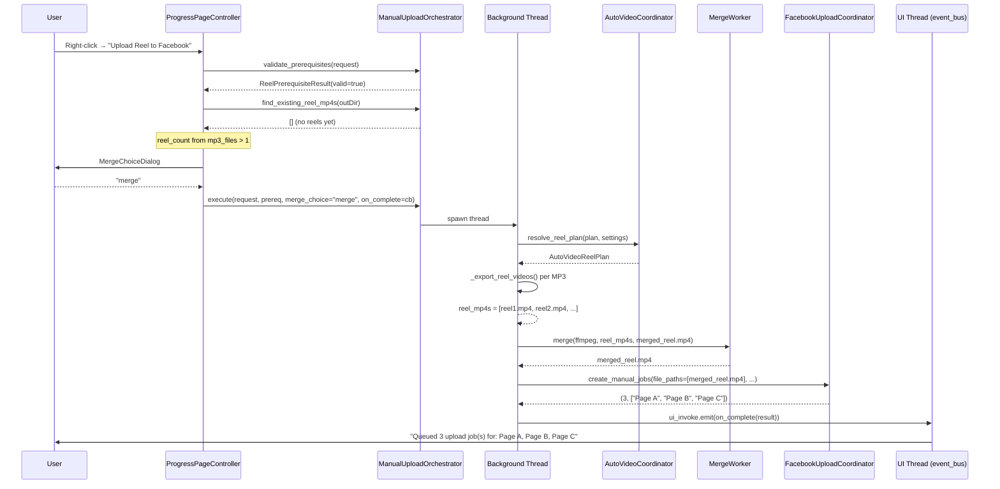
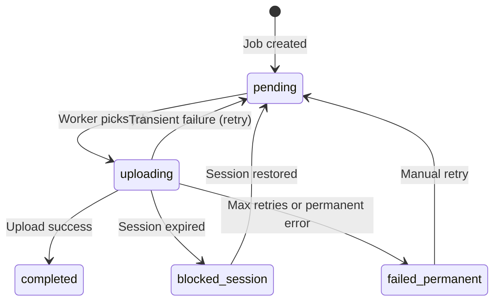

# Design Document: Auto Upload Facebook

## Overview

This design adds automated Facebook page video/reel uploads to the Music page's Automation Card using Playwright browser automation. Unlike the existing YouTube upload feature (which uses OAuth API), this feature drives a pre-logged-in Chrome browser session to navigate Facebook's Reel creation UI and post videos programmatically.

The feature introduces a new feature module (`python_app/features/facebook_upload/`) following the established coordinator pattern. It integrates with the existing auto-video pipeline by subscribing to `auto_video_done` events, creating upload jobs, and processing them sequentially through a background worker thread with rate limiting and retry logic.

### Key Design Decisions

- **Playwright persistent contexts over API**: Facebook's official API requires app review and page access tokens with restrictive rate limits. Browser automation with persistent profiles reuses the user's existing session, avoiding API approval and token management complexity.
- **Single Upload_Worker thread**: Prevents concurrent browser sessions that could trigger Facebook's anti-automation detection. Sequential processing is safer than parallel execution.
- **SQLite-style job queue in PostgreSQL**: Follows the existing `youtube_upload_jobs` pattern — status-driven FIFO queue with claim-based processing, enabling crash recovery and persistence across restarts.
- **Exponential backoff with failure classification**: Different failure types (transient, session, permanent) get different retry strategies, avoiding wasted retries on unrecoverable errors.
- **Fault isolation via thread boundary and exception containment**: All Facebook upload processing runs in a dedicated thread with a top-level exception handler, ensuring failures never propagate to the auto-video pipeline or UI thread.
- **Configuration-driven selectors over hardcoded locators**: All DOM element lookups are defined in an external `selectors.yaml` file with multiple fallback strategies per action. When Facebook changes their UI, updating the YAML file is sufficient — no code changes needed. This decouples automation logic from Facebook's volatile DOM structure.
- **Multi-strategy selector resolution with diagnostics**: Each automation step uses an ordered list of selector strategies (ARIA role → visible text → test ID → CSS → XPath). The resolver logs which strategy succeeded and, on total failure, captures a screenshot + DOM snapshot for debugging. This provides defense-in-depth against UI changes.
- **State detection via URL patterns + content signals**: Instead of relying on fragile CSS selectors to determine "where we are" in the upload flow, the system uses URL patterns and visible page text. These are far more stable across Facebook UI redesigns.
- **Selector auto-update hints**: When all configured selectors fail but a structurally similar element is detected on the page (same ARIA role, similar text content), the system logs a suggestion for what the updated selector value should be. This dramatically reduces debugging time after Facebook UI changes.
- **DOM snapshot on failure for offline debugging**: Every automation failure triggers both a screenshot capture AND a simplified DOM tree export (scripts/styles stripped). This enables offline diagnosis of what changed without needing to reproduce the failure state.
- **Record/Replay mode for selector generation**: A visible-browser mode where the user manually performs the upload flow once. The system records each interaction (clicks, inputs, navigations) and the selectors/attributes of the interacted elements, then generates an updated `selectors.yaml` configuration. This eliminates manual selector hunting.
- **Selector health check / dry-run validation**: The "Test Upload" (dry-run) feature navigates to each automation step and validates every configured selector without performing any write operations. It produces a structured report of healthy vs broken selectors.
- **Page discovery via stable URLs with manual fallback**: Page discovery uses Facebook's stable URL endpoints (`/pages/switching`) rather than scraping dynamic content. If auto-discovery fails, users can paste page URLs directly for manual entry.

## Architecture



### Integration Points

1. **Pipeline → Coordinator**: The `auto_video_done` event (emitted by the merge/reel pipeline) triggers job creation when `autoUploadFacebook` is true.
2. **Coordinator → UI Bus**: Status changes emit `facebook_upload_status` and `facebook_upload_done` events on the UI bus for the Music page to display.
3. **Settings Page**: Account management, page discovery, diagnostic mode, and configuration fields read/write via `Music_Settings` (the `app_settings` key-value table).
4. **Database**: Three new tables (`facebook_accounts`, `facebook_pages`, `facebook_upload_jobs`) following the same PostgreSQL patterns as `youtube_upload_jobs`.
5. **Selector Registry → BrowserAutomation**: All element lookups are delegated to `SelectorRegistry.resolve_element()`, which reads strategies from `selectors.yaml`. This decouples selector knowledge from automation logic — when Facebook changes their UI, only the YAML file needs updating.
6. **Diagnostic Mode → Settings Page**: The "Verify Selectors" / "Run Diagnostic" button in Settings triggers `DiagnosticMode.run_full_diagnostic()` and displays the report.
7. **Record/Replay Mode → Settings Page**: The "Record Upload Flow" button in Settings launches `RecordReplayMode.start_recording()` — opens a visible browser where the user manually performs the upload. On completion, it generates an updated `selectors.yaml`.
8. **DOM Snapshot + Selector Hints → Failure Diagnostics**: When `BrowserAutomation` encounters a total selector failure, it invokes `DOMSnapshot.capture()` and `SelectorHints.find_similar_elements()`. The snapshot is saved to disk, and hint suggestions are included in the job's error details for the user.
9. **Manual Page Entry → Settings Page**: When auto-discovery fails, users can paste Facebook page URLs directly in Settings. The system validates the URL format and stores the page entry without requiring browser automation.

## Components and Interfaces

### FacebookUploadCoordinator (`coordinator.py`)

The central orchestrator following the same dependency injection pattern as `AutoVideoCoordinator` and `YouTubeCoordinator`.

```python
@dataclass
class FacebookUploadHostPort:
    """Protocol for host callbacks injected into the coordinator."""
    settings_accessor: Callable[[], dict]
    db_cfg_accessor: Callable[[], DbCfg | None]
    logger: LoggerPort
    event_bus: EventBusPort
    defer_call: DeferCallFn
    timer_factory: TimerFactory
```

```python
class FacebookUploadCoordinator:
    def __init__(self, *, host: FacebookUploadHostPort) -> None: ...

    # Lifecycle
    def start(self) -> None: ...
    def stop(self) -> None: ...
    def on_app_start(self) -> None: ...  # resets autoUploadFacebook to false

    # Pipeline integration
    def on_auto_video_done(self, event: dict) -> None: ...

    # Toggle management
    def set_auto_upload_enabled(self, enabled: bool) -> None: ...
    def is_auto_upload_enabled(self) -> bool: ...

    # Queue processing
    def process_queue_tick(self) -> None: ...

    # Account management
    def add_account(self, label: str, browser_profile_path: str) -> str: ...
    def remove_account(self, account_uid: str) -> None: ...
    def list_accounts(self) -> list[FacebookAccount]: ...
    def verify_session(self, account_uid: str) -> SessionStatus: ...
    def discover_pages(self, account_uid: str) -> list[FacebookPage]: ...

    # Job management
    def retry_job(self, job_uid: str) -> None: ...
    def list_jobs(self, limit: int = 200) -> list[dict]: ...
```

### SessionManager (`session_manager.py`)

Manages Playwright persistent browser contexts and session health validation.

```python
class SessionStatus(Enum):
    VALID = "valid"
    EXPIRED = "expired"
    UNKNOWN = "unknown"

class SessionManager:
    def __init__(self, *, logger: LoggerPort) -> None: ...

    def validate_session(self, browser_profile_path: str) -> SessionStatus: ...
    def launch_visible_session(self, browser_profile_path: str) -> None: ...
    def create_context(self, browser_profile_path: str, *, headless: bool = True) -> BrowserContext: ...
    def close_context(self, context: BrowserContext) -> None: ...
```

### SelectorRegistry (`selector_registry.py`)

Manages a configuration-driven set of selectors per automation action. Supports multiple fallback strategies per step and is updatable without code changes when Facebook changes their UI.

```python
@dataclass
class SelectorStrategy:
    """A single selector strategy with its method and value."""
    method: str  # "role", "text", "test_id", "css", "xpath", "label"
    value: str
    description: str = ""

@dataclass
class ActionSelectors:
    """All selector strategies for a single automation action/step."""
    action_name: str
    strategies: list[SelectorStrategy]  # Ordered by priority (first = preferred)
    wait_condition: str = "visible"  # "visible", "attached", "stable"
    timeout_override_ms: int | None = None

@dataclass
class SelectorConfig:
    """Full selector configuration with metadata."""
    version: str
    last_verified_at: str  # ISO 8601 timestamp
    last_verified_by: str  # "diagnostic_mode" or "manual"
    actions: dict[str, ActionSelectors]

class SelectorRegistry:
    """Loads and manages selector configurations from a YAML file."""

    CONFIG_PATH = "python_app/features/facebook_upload/selectors.yaml"

    def __init__(self, *, logger: LoggerPort, config_path: str | None = None) -> None: ...

    def load(self) -> None:
        """Load or reload selector config from YAML file."""
        ...

    def get_action(self, action_name: str) -> ActionSelectors:
        """Get the selector strategies for a named action."""
        ...

    def resolve_element(self, page: Page, action_name: str) -> Locator:
        """Try each strategy in priority order until one resolves.
        
        Strategy resolution order:
        1. ARIA role-based (get_by_role)
        2. Visible text content (get_by_text)
        3. data-testid attribute (get_by_test_id)
        4. Accessible label (get_by_label)
        5. CSS selector (locator with CSS)
        6. XPath fallback (locator with XPath)
        
        On success: logs which strategy resolved and at what priority index.
        On failure of all strategies:
          1. Captures a screenshot via DOMSnapshot
          2. Captures a simplified DOM tree (scripts/styles stripped)
          3. Invokes SelectorHints to find similar elements and suggest updates
          4. Raises SelectorResolutionError with failure context
        """
        ...

    def resolve_element_with_report(self, page: Page, action_name: str) -> tuple[Locator, str]:
        """Like resolve_element, but also returns which strategy method succeeded.
        
        Returns (locator, strategy_method) e.g. (locator, "role") or (locator, "text").
        Useful for diagnostic/recording modes.
        """
        ...

    def update_verified_timestamp(self) -> None:
        """Update the last_verified_at timestamp in the config file."""
        ...

    @property
    def config_version(self) -> str: ...

    @property
    def last_verified(self) -> str: ...
```

#### Selector Configuration File (`selectors.yaml`)

```yaml
version: "1.0.0"
last_verified_at: "2024-01-15T10:30:00Z"
last_verified_by: "diagnostic_mode"

actions:
  navigate_to_reel_upload:
    wait_condition: "visible"
    strategies:
      - method: "url_navigation"
        value: "https://www.facebook.com/{page_id}/reels/create"
        description: "Direct URL navigation to reel creation page"
      - method: "url_navigation"
        value: "https://business.facebook.com/latest/content_publishing"
        description: "Fallback via Creator Studio publishing"

  detect_upload_page_ready:
    wait_condition: "stable"
    strategies:
      - method: "role"
        value: "button[name=/upload|add video/i]"
        description: "Upload button by ARIA role"
      - method: "text"
        value: "Add video"
        description: "Upload button by visible text"
      - method: "text"
        value: "Upload video"
        description: "Alt text for upload area"
      - method: "css"
        value: "[data-testid='reel-video-upload-input']"
        description: "File input by test ID"

  file_input:
    wait_condition: "attached"
    strategies:
      - method: "css"
        value: "input[type='file'][accept*='video']"
        description: "Standard file input accepting video"
      - method: "xpath"
        value: "//input[@type='file' and contains(@accept,'video')]"
        description: "XPath fallback for file input"
      - method: "css"
        value: "input[type='file']"
        description: "Any file input (least specific fallback)"

  caption_input:
    wait_condition: "visible"
    strategies:
      - method: "role"
        value: "textbox[name=/description|caption/i]"
        description: "Caption field by ARIA textbox role"
      - method: "label"
        value: "Description"
        description: "Caption field by label"
      - method: "text"
        value: "Write a description"
        description: "Caption field by placeholder text"
      - method: "css"
        value: "[data-testid='reel-caption-input']"
        description: "Caption field by test ID"
      - method: "css"
        value: "[contenteditable='true']"
        description: "Any contenteditable area (may need index)"

  publish_button:
    wait_condition: "visible"
    strategies:
      - method: "role"
        value: "button[name=/publish|post|share/i]"
        description: "Publish button by ARIA role with common names"
      - method: "text"
        value: "Publish"
        description: "Publish button by visible text"
      - method: "text"
        value: "Share now"
        description: "Alt text for publish action"
      - method: "text"
        value: "Post"
        description: "Another alt text for publish"
      - method: "css"
        value: "[data-testid='publish-button']"
        description: "Publish by test ID"

  upload_success_indicator:
    wait_condition: "visible"
    timeout_override_ms: 300000
    strategies:
      - method: "url_pattern"
        value: "/reels/|/videos/|/watch/"
        description: "URL changes to a reel/video permalink"
      - method: "text"
        value: "Your reel is being processed"
        description: "Success message text"
      - method: "text"
        value: "Reel published"
        description: "Alt success message"
      - method: "text"
        value: "shared"
        description: "Generic post shared confirmation"
      - method: "role"
        value: "alert"
        description: "Success toast/alert role"

  page_switcher:
    wait_condition: "visible"
    strategies:
      - method: "url_navigation"
        value: "https://www.facebook.com/pages/switching"
        description: "Stable page switching URL"
      - method: "url_navigation"
        value: "https://www.facebook.com/pages/?category=your_pages"
        description: "Fallback pages list URL"
      - method: "role"
        value: "link[name=/switch|use facebook as/i]"
        description: "Page switch link by role"

  page_list_items:
    wait_condition: "visible"
    strategies:
      - method: "role"
        value: "link"
        description: "Page links in the switcher view"
      - method: "css"
        value: "[data-testid='page-switcher-item']"
        description: "Page items by test ID"
      - method: "xpath"
        value: "//a[contains(@href, '/pages/') or contains(@href, 'page_id')]"
        description: "Links pointing to pages"
```

### BrowserAutomation (`browser_automation.py`)

Encapsulates all Facebook page navigation and form interaction logic. Uses `SelectorRegistry` for all element resolution, providing multi-strategy fallbacks and easy configurability.

```python
@dataclass
class UploadResult:
    success: bool
    error_message: str = ""
    error_category: str = ""  # "transient", "session", "permanent"
    screenshot_path: str = ""
    dom_snapshot_path: str = ""  # Simplified DOM tree captured on failure
    selector_hints: list = None  # SelectorHint suggestions when selectors fail

@dataclass
class StepResult:
    """Result of a single automation step for diagnostic logging."""
    step_name: str
    success: bool
    strategy_used: str = ""  # Which selector strategy worked
    strategies_tried: list[str] = None  # All strategies attempted
    duration_ms: int = 0
    error: str = ""
    hints: list = None  # SelectorHint suggestions when step failed

class BrowserAutomation:
    def __init__(
        self,
        *,
        logger: LoggerPort,
        selector_registry: SelectorRegistry,
        dom_snapshot: DOMSnapshot,
        selector_hints: SelectorHints,
        nav_timeout_ms: int = 60_000,
        upload_timeout_ms: int = 300_000,
        confirm_timeout_ms: int = 30_000,
    ) -> None: ...

    def upload_reel(
        self,
        context: BrowserContext,
        *,
        page_url: str,
        file_path: str,
        caption: str,
        hashtags: str,
    ) -> UploadResult: ...

    def discover_pages(self, context: BrowserContext) -> list[dict]: ...

    def run_selector_health_check(
        self,
        context: BrowserContext,
        *,
        page_url: str,
    ) -> list[StepResult]:
        """Validate all configured selectors by navigating to the upload page.
        
        Unlike a full diagnostic (which walks the entire flow), this:
        1. Navigates to the reel upload page
        2. For EACH action in selectors.yaml, tries all strategies
        3. Reports which actions have working selectors and which are broken
        4. Does NOT interact with any elements (no clicks, no typing)
        5. Returns a StepResult per action with success/failure and hints
        
        This is what the "Test Upload" button in Settings triggers.
        """
        ...

    def _handle_resolution_failure(
        self,
        page: Page,
        action_name: str,
        failed_strategies: list[SelectorStrategy],
    ) -> tuple[str, str, list]:
        """Called when all selector strategies fail for an action.
        
        1. Capture screenshot via DOMSnapshot
        2. Capture simplified DOM tree via DOMSnapshot
        3. Run SelectorHints to find similar elements
        4. Log all hints at WARNING level
        5. Return (screenshot_path, dom_path, hints_list)
        """
        ...

    def run_diagnostic(
        self,
        context: BrowserContext,
        *,
        page_url: str,
    ) -> list[StepResult]:
        """Run diagnostic/recording mode: walk through upload flow step-by-step
        logging what is found at each step without actually posting."""
        ...

    def _detect_page_state(self, page: Page) -> str:
        """Detect current page state using URL patterns and content heuristics.
        
        Returns one of: "login_page", "home", "reel_upload", "reel_published",
                         "page_switcher", "error_page", "unknown"
        """
        ...

    def _wait_for_state(
        self,
        page: Page,
        *,
        expected_states: list[str],
        timeout_ms: int,
    ) -> str:
        """Wait until the page is in one of the expected states.
        Uses URL patterns and page content rather than specific DOM elements."""
        ...
```

### Upload Flow: Step-by-Step with Multi-Strategy Selectors

The upload execution follows this sequence, with each step using the `SelectorRegistry` for resilient element resolution:

#### Known Stable Entry Points for Facebook Reel Upload

The system uses these known navigation routes, ordered by stability/reliability:

| Route | URL Pattern | Stability | Notes |
|-------|-------------|-----------|-------|
| Direct Reel Create | `facebook.com/{page_id}/reels/create` | High | Most direct path; requires page context |
| Creator Studio | `business.facebook.com/latest/content_publishing` | High | Stable business tool; separate UI |
| Page Reel Tab | `facebook.com/{page_id}/reels` + "Create" button | Medium | Tab exists but button selectors change |
| New Post Menu | `facebook.com/{page_id}` → "Create" → "Reel" | Low | Multi-step; menu structure changes often |

**Fallback navigation logic:**
1. Try direct reel creation URL → if page loads with upload UI, proceed
2. If direct URL redirects or shows error, try Creator Studio route
3. If Creator Studio fails, try page reel tab + button click
4. If all routes fail, capture DOM snapshot and report navigation failure



**Step details:**

1. **Validate session**: `SessionManager.validate_session()` checks for authenticated-state indicators.
2. **Navigate to reel upload**: Uses `selectors.yaml → navigate_to_reel_upload` strategies. Primary: direct reel creation URL (`/{page_id}/reels/create`). Fallback: Creator Studio URL (`business.facebook.com/latest/content_publishing`).
3. **Detect page state**: Uses `_detect_page_state()` which checks URL patterns (`/reels/create`, `/content_publishing`) and page content (presence of upload-related text) — not specific CSS classes.
4. **Locate file input**: Uses `selector_registry.resolve_element("file_input")` — tries `input[type='file'][accept*='video']` first, falls back to broader selectors. On failure: `_handle_resolution_failure()` captures screenshot + DOM snapshot and generates selector hints.
5. **Set file input**: Uses Playwright's `set_input_files()` which bypasses UI entirely for file selection.
6. **Wait for video processing**: Detects video thumbnail appearing, progress bar completion, or the caption area becoming active — using multiple indicator strategies.
7. **Locate caption input**: Uses `selector_registry.resolve_element("caption_input")` — tries ARIA role, label, placeholder text, test ID, then contenteditable. On failure: snapshot + hints captured.
8. **Type caption**: Character-by-character with randomized inter-keystroke delays (30-120ms) for anti-detection.
9. **Locate publish button**: Uses `selector_registry.resolve_element("publish_button")` — tries role, text ("Publish", "Share now", "Post"), then test ID. On failure: snapshot + hints captured.
10. **Click publish**: Standard Playwright click with short delay.
11. **Detect success**: Uses `_detect_page_state()` and `selector_registry.resolve_element("upload_success_indicator")` — checks URL change to permalink, success message text, or alert role.

**On any step failure:**
- Screenshot saved to `snapshots/{action}_{timestamp}.png`
- Simplified DOM tree saved to `snapshots/{action}_{timestamp}_dom.html`
- `SelectorHints.find_similar_elements()` scans the page for candidates
- All hints logged at WARNING level and attached to the `UploadResult`
- Job error_message includes hint suggestions for easy selector updating

### Page Discovery with Resilient Navigation

```python
class PageDiscoveryStrategy:
    """Multiple approaches to discover Facebook pages for an account."""

    PRIMARY_URL = "https://www.facebook.com/pages/switching"
    FALLBACK_URLS = [
        "https://www.facebook.com/pages/?category=your_pages",
        "https://www.facebook.com/bookmarks/pages",
        "https://business.facebook.com/latest/home",
    ]

    def discover_pages(self, context: BrowserContext) -> list[dict]:
        """Try multiple navigation paths to find the user's pages.
        
        Strategy order:
        1. Navigate to /pages/switching (most stable, shows page switcher)
        2. Fallback to /pages/?category=your_pages
        3. Fallback to /bookmarks/pages
        4. Fallback to business.facebook.com
        
        At each URL, attempt to extract page names and URLs using
        structural selectors from selector_registry.
        """
        ...

    def _extract_pages_from_switcher(self, page: Page) -> list[dict]:
        """Extract page list using the selector_registry's page_list_items strategies."""
        ...

    def _extract_pages_from_bookmarks(self, page: Page) -> list[dict]:
        """Fallback extraction from bookmarks/pages view."""
        ...

    def _validate_page_url(self, url: str) -> bool:
        """Verify a URL looks like a Facebook page (pattern-based, not selector-based)."""
        ...
```

### Manual Page Entry Fallback

When auto-discovery fails (or the user prefers direct configuration), the system supports manual page URL entry:

```python
class ManualPageEntry:
    """Handles manual page URL entry as a fallback for auto-discovery.
    
    Used when:
    - Auto-discovery fails due to selector breakage
    - User knows their page URLs and prefers not to use browser automation
    - As a quick-add mechanism before running full discovery
    """

    # Accepted URL patterns for Facebook pages
    VALID_PAGE_PATTERNS = [
        r"^https?://(?:www\.)?facebook\.com/[\w.-]+/?$",            # /pagename
        r"^https?://(?:www\.)?facebook\.com/pages/[\w.-]+/\d+/?$",  # /pages/name/id
        r"^https?://(?:www\.)?facebook\.com/profile\.php\?id=\d+$", # /profile.php?id=
    ]

    def __init__(self, *, logger: LoggerPort, db: FacebookDB) -> None: ...

    def add_page_manually(
        self,
        account_uid: str,
        page_url: str,
        page_name: str = "",
    ) -> FacebookPage | None:
        """Validate and add a manually entered Facebook page URL.
        
        1. Validate URL against VALID_PAGE_PATTERNS
        2. Normalize URL (strip trailing slash, ensure https)
        3. If page_name is empty, derive from URL path
        4. Check for duplicates (same account + URL)
        5. Store in facebook_pages table with is_active=True
        6. Return the created FacebookPage or None if invalid
        """
        ...

    def validate_page_url(self, url: str) -> tuple[bool, str]:
        """Check if a URL matches valid Facebook page patterns.
        
        Returns (is_valid, error_message_if_invalid).
        """
        ...

    def normalize_page_url(self, url: str) -> str:
        """Normalize a page URL to canonical form."""
        ...

    def derive_page_name(self, url: str) -> str:
        """Best-effort extraction of page name from URL path."""
        ...
```

### DiagnosticMode (`diagnostic.py`)

A "recording mode" that walks through the upload flow visibly, logging each step for troubleshooting.

```python
@dataclass
class DiagnosticStepReport:
    step_name: str
    action_name: str
    strategies_tried: list[str]
    strategy_that_worked: str | None
    element_found: bool
    element_html_snippet: str  # Outer HTML of found element (truncated to 200 chars)
    page_url: str
    page_state: str
    screenshot_path: str
    notes: str = ""

@dataclass
class DiagnosticReport:
    timestamp: str
    account_label: str
    page_url: str
    steps: list[DiagnosticStepReport]
    overall_success: bool
    broken_steps: list[str]  # Step names where all strategies failed
    recommendations: list[str]  # Human-readable suggestions

class DiagnosticMode:
    """Launches browser visibly and walks through upload flow step-by-step.
    
    Used when:
    - User suspects selectors are broken
    - After Facebook UI updates
    - As part of initial setup verification
    """

    def __init__(
        self,
        *,
        logger: LoggerPort,
        selector_registry: SelectorRegistry,
        session_manager: SessionManager,
    ) -> None: ...

    def run_full_diagnostic(
        self,
        browser_profile_path: str,
        page_url: str,
    ) -> DiagnosticReport:
        """Run the complete upload flow diagnostic (without posting).
        
        1. Launch browser visibly (headless=False)
        2. Validate session health
        3. Navigate to reel upload page (try all strategies)
        4. Check for file input presence
        5. Check for caption input presence
        6. Check for publish button presence
        7. Check for success indicator pattern
        
        At each step:
        - Try all selector strategies and log which ones work
        - Capture a screenshot
        - Record the page URL and detected state
        - Note any broken strategies
        
        Returns a DiagnosticReport with recommendations.
        """
        ...

    def run_page_discovery_diagnostic(
        self,
        browser_profile_path: str,
    ) -> DiagnosticReport:
        """Test page discovery navigation paths."""
        ...
```

### DOMSnapshot (`dom_snapshot.py`)

Captures both screenshots and simplified DOM trees on automation failures. The DOM snapshot strips scripts, styles, and non-visible elements, producing a human-readable tree useful for diagnosing selector breakage offline.

```python
@dataclass
class SnapshotResult:
    """Result of capturing a failure snapshot."""
    screenshot_path: str  # Full path to saved PNG screenshot
    dom_tree_path: str  # Full path to saved HTML/JSON DOM tree
    page_url: str
    page_title: str
    timestamp: str  # ISO 8601
    action_name: str  # Which automation action triggered the failure

class DOMSnapshot:
    """Captures diagnostic snapshots when automation steps fail."""

    SNAPSHOT_DIR = "python_app/features/facebook_upload/snapshots/"

    def __init__(self, *, logger: LoggerPort, snapshot_dir: str | None = None) -> None: ...

    def capture(
        self,
        page: Page,
        *,
        action_name: str,
        reason: str,
    ) -> SnapshotResult:
        """Capture a screenshot + simplified DOM tree for a failure.
        
        1. Take a full-page screenshot (PNG)
        2. Extract page HTML
        3. Strip <script>, <style>, <svg>, and hidden elements
        4. Flatten attributes to only: id, class, role, aria-*, data-testid, type, name, href
        5. Indent as a readable tree
        6. Save both files with timestamp-based naming
        
        Files are saved as:
          snapshots/{action_name}_{timestamp}.png
          snapshots/{action_name}_{timestamp}_dom.html
        """
        ...

    def simplify_dom(self, raw_html: str) -> str:
        """Strip scripts, styles, hidden elements; keep only structural/semantic info.
        
        Retained attributes: id, class, role, aria-label, aria-describedby,
        data-testid, type, name, placeholder, href, src (truncated), alt.
        
        Elements retained: div, span, section, main, nav, header, footer,
        form, input, button, a, textarea, label, h1-h6, p, ul, ol, li, img.
        """
        ...

    def list_snapshots(self, *, limit: int = 20) -> list[SnapshotResult]:
        """List recent snapshots ordered by timestamp descending."""
        ...

    def cleanup_old_snapshots(self, *, keep_last: int = 50) -> int:
        """Remove old snapshots beyond the retention limit. Returns count deleted."""
        ...
```

### SelectorHints (`selector_hints.py`)

When a selector fails but similar elements exist on the page, this component analyzes the current DOM and suggests potential replacement selectors. This reduces manual debugging when Facebook makes minor UI changes.

```python
@dataclass
class SelectorHint:
    """A suggested replacement selector for a failed action."""
    action_name: str
    failed_strategy: SelectorStrategy  # The strategy that failed
    suggested_method: str  # "role", "text", "css", etc.
    suggested_value: str  # The new selector value
    confidence: float  # 0.0 - 1.0 (how likely this is correct)
    reason: str  # Human-readable explanation of why this was suggested
    element_preview: str  # Truncated outer HTML of the candidate element

@dataclass
class HintsReport:
    """All hints generated for a single resolution failure."""
    action_name: str
    timestamp: str
    hints: list[SelectorHint]
    page_url: str

class SelectorHints:
    """Analyzes the DOM to suggest replacement selectors when resolution fails."""

    # Similarity thresholds
    TEXT_SIMILARITY_THRESHOLD = 0.6  # Levenshtein ratio
    ROLE_MATCH_BONUS = 0.3  # Bonus confidence when ARIA role matches

    def __init__(self, *, logger: LoggerPort) -> None: ...

    def find_similar_elements(
        self,
        page: Page,
        action_name: str,
        failed_strategies: list[SelectorStrategy],
    ) -> HintsReport:
        """Analyze the page DOM and find elements similar to what we expected.
        
        Strategy for generating hints:
        1. For each failed strategy, determine what "kind" of element we want:
           - role strategy → look for elements with the same ARIA role
           - text strategy → look for elements with similar text content (fuzzy match)
           - css strategy → look for elements with similar structure/attributes
        
        2. For found candidates, score them:
           - Same ARIA role: +0.3 confidence
           - Similar text (>60% Levenshtein): +0.3 confidence  
           - Same tag type: +0.2 confidence
           - Similar position in DOM hierarchy: +0.2 confidence
        
        3. Return candidates with confidence > 0.4, sorted by confidence desc.
        
        Example output:
          SelectorHint(
            action_name="publish_button",
            failed_strategy=SelectorStrategy(method="text", value="Publish"),
            suggested_method="text",
            suggested_value="Share reel",
            confidence=0.75,
            reason="Found button with role='button' and similar text 'Share reel' (Levenshtein 0.45 to 'Publish', but matches button role)",
            element_preview='<button aria-label="Share reel" class="x1...">'
          )
        """
        ...

    def _find_candidates_for_role(
        self, page: Page, expected_role: str
    ) -> list[dict]: ...

    def _find_candidates_for_text(
        self, page: Page, expected_text: str
    ) -> list[dict]: ...

    def _find_candidates_for_css(
        self, page: Page, expected_css: str
    ) -> list[dict]: ...

    def _score_candidate(
        self,
        candidate: dict,
        failed_strategy: SelectorStrategy,
    ) -> float: ...

    def _text_similarity(self, a: str, b: str) -> float:
        """Compute Levenshtein ratio between two strings."""
        ...
```

### RecordReplayMode (`record_replay.py`)

A visible-browser mode where the user manually performs the upload flow once. The system watches every user interaction, records the sequence of actions and the attributes of interacted elements, then generates an updated `selectors.yaml`. This is the fastest way to fix selectors after a Facebook UI change.

```python
@dataclass
class RecordedInteraction:
    """A single user interaction captured during recording."""
    timestamp: str
    action_type: str  # "click", "fill", "navigate", "file_upload", "keypress"
    element_tag: str  # e.g. "button", "input", "textarea"
    element_attributes: dict[str, str]  # id, class, role, aria-label, text, etc.
    element_text: str  # Visible text content
    element_xpath: str  # Computed XPath to the element
    element_css_path: str  # Computed unique CSS selector
    input_value: str  # For fill/keypress actions, what was typed
    page_url: str  # URL at time of interaction
    screenshot_path: str  # Screenshot taken at this step

@dataclass
class RecordingSession:
    """Complete recording of a manual upload flow."""
    session_id: str
    started_at: str
    completed_at: str
    account_label: str
    page_url: str
    interactions: list[RecordedInteraction]
    generated_config: dict  # The YAML-serializable selector config generated

class RecordReplayMode:
    """Records user interactions in a visible browser to generate selector configs.
    
    Flow:
    1. Launch browser visibly (headless=False) with the user's profile
    2. Navigate to the reel upload page
    3. Display overlay instructions ("Perform each upload step. Click 'Done' when finished.")
    4. Record all user interactions via CDP (Chrome DevTools Protocol) events
    5. On completion, map recorded interactions to logical action names
    6. Generate new SelectorStrategy entries from the recorded element attributes
    7. Write updated selectors.yaml (backing up the previous version)
    """

    # Mapping of upload flow steps to their logical action names
    STEP_DETECTION_HEURISTICS = {
        "file_input": lambda i: i.action_type == "file_upload" or (i.element_tag == "input" and "file" in i.element_attributes.get("type", "")),
        "caption_input": lambda i: i.action_type == "fill" and i.element_tag in ("textarea", "div") and i.element_attributes.get("contenteditable") == "true",
        "publish_button": lambda i: i.action_type == "click" and i.element_tag == "button" and any(kw in (i.element_text or "").lower() for kw in ("publish", "post", "share")),
    }

    def __init__(
        self,
        *,
        logger: LoggerPort,
        selector_registry: SelectorRegistry,
        session_manager: SessionManager,
    ) -> None: ...

    def start_recording(
        self,
        browser_profile_path: str,
        page_url: str,
    ) -> RecordingSession:
        """Launch visible browser and begin recording interactions.
        
        1. Launch browser with headless=False
        2. Navigate to page_url
        3. Attach CDP session event listeners for:
           - DOM.click events
           - Input.dispatchKeyEvent
           - Page.fileChooserOpened
           - Page.navigatedWithinDocument
        4. Show injected overlay with step-by-step instructions
        5. Wait for user to click "Recording Complete" button in overlay
        6. Process recorded interactions
        7. Generate updated selector config
        8. Return the complete RecordingSession
        """
        ...

    def _attach_interaction_listeners(self, page: Page) -> None:
        """Attach CDP event listeners to capture all user interactions."""
        ...

    def _extract_element_info(self, page: Page, selector: str) -> dict:
        """Extract all useful attributes from an element for selector generation.
        
        Extracts: tag, id, class, role, aria-label, aria-describedby,
        data-testid, type, name, placeholder, text content, computed xpath,
        computed CSS path.
        """
        ...

    def _map_interactions_to_actions(
        self, interactions: list[RecordedInteraction]
    ) -> dict[str, RecordedInteraction]:
        """Map recorded interactions to logical action names using heuristics.
        
        Uses STEP_DETECTION_HEURISTICS to classify each interaction.
        Interactions that don't match any heuristic are logged as "unclassified".
        """
        ...

    def _generate_selector_config(
        self, action_map: dict[str, RecordedInteraction]
    ) -> dict:
        """Generate a complete selectors.yaml config from recorded interactions.
        
        For each mapped action, generate strategies in priority order:
        1. ARIA role (if element has a role attribute)
        2. Text content (if element has visible text)
        3. data-testid (if element has data-testid attribute)
        4. Label (if element has aria-label)
        5. CSS (using id or unique class combination)
        6. XPath (computed absolute path)
        """
        ...

    def _backup_existing_config(self) -> str:
        """Backup current selectors.yaml to selectors.yaml.bak.{timestamp}"""
        ...

    def apply_recording(self, session: RecordingSession) -> None:
        """Write the generated config to selectors.yaml after backing up existing."""
        ...
```

### Self-Healing Selector Patterns

The `BrowserAutomation` class implements several resilience patterns that survive Facebook UI changes:

**1. URL-based state detection** — Instead of checking for specific DOM elements to know "where we are", the system checks URL patterns:
```python
STATE_URL_PATTERNS = {
    "login_page": ["/login", "/checkpoint"],
    "home": ["/home", "facebook.com/$"],
    "reel_upload": ["/reels/create", "/content_publishing"],
    "reel_published": ["/reel/", "/videos/", "/watch/"],
    "page_switcher": ["/pages/switching", "/pages/?category"],
    "error_page": ["/error", "sorry"],
}
```

**2. Content-based state detection** — As a secondary signal, check visible text on the page:
```python
STATE_CONTENT_SIGNALS = {
    "reel_upload": ["upload", "add video", "create reel"],
    "reel_published": ["published", "shared", "processing"],
    "login_page": ["log in", "email", "password"],
}
```

**3. Structural/positional selectors** — When CSS class names change, the structure often remains stable:
- Find the Nth button in a known container rather than relying on class names
- Use `role` attributes which are accessibility-mandated and rarely change
- Use `text` content which changes less often than class names

**4. Graceful degradation with diagnostics** — If the preferred strategy fails but a fallback works, the system:
- Logs a warning indicating the primary strategy is broken
- Continues with the fallback
- Includes a recommendation in the next diagnostic report to update `selectors.yaml`
- If ALL strategies fail, captures DOM snapshot + screenshot and generates auto-update hints

**5. DOM Snapshot on every failure** — Gives full offline debugging capability:
- Screenshot captures the visual state at the moment of failure
- Simplified DOM tree (scripts/styles stripped) shows the actual page structure
- Both files are timestamped and associated with the specific action that failed
- Snapshots are auto-cleaned after 50 accumulate to avoid disk bloat

**6. Selector auto-update hints** — Reduces time-to-fix after Facebook changes:
- When resolution fails, `SelectorHints` scans the page for elements with the same ARIA role, similar text, or matching structural position
- Each candidate is scored by confidence (0.0–1.0) based on role match, text similarity (Levenshtein), and DOM position
- High-confidence hints (>0.7) are logged as actionable suggestions: "Try updating `publish_button` text strategy from 'Publish' to 'Share reel'"
- Hints are also surfaced in the UI job error details and diagnostic reports

**7. Record/Replay for zero-effort selector updates** — When many selectors break at once:
- User clicks "Record Upload Flow" in Settings
- Browser opens visibly; user manually performs the upload once
- System records every click, fill, and navigation with full element attributes
- Generates a new `selectors.yaml` with strategies derived from the actual interacted elements
- Previous config is backed up (never overwritten without backup)

### FacebookDB (`db.py`)

Database access layer for Facebook upload state, following the pattern in `youtube_db.py`.

```python
@dataclass(frozen=True)
class FacebookAccount:
    uid: str
    label: str
    browser_profile_path: str
    session_status: str
    created_at: str
    updated_at: str

@dataclass(frozen=True)
class FacebookPage:
    uid: str
    account_uid: str
    page_name: str
    page_url: str
    is_active: bool
    last_verified_at: str

@dataclass(frozen=True)
class FacebookUploadJob:
    uid: str
    account_uid: str
    page_uid: str
    file_path: str
    caption: str
    hashtags: str
    status: str
    attempt_count: int
    next_retry_at: str
    created_at: str
    updated_at: str
    completed_at: str
    error_message: str
    error_category: str
    batch_id: str
    profile_id: str
    role: str

# CRUD functions
def db_migrate_facebook_tables(cfg: DbCfg) -> None: ...
def db_add_facebook_account(cfg: DbCfg, account: dict) -> str: ...
def db_remove_facebook_account(cfg: DbCfg, account_uid: str) -> None: ...
def db_list_facebook_accounts(cfg: DbCfg) -> list[FacebookAccount]: ...
def db_update_account_session_status(cfg: DbCfg, account_uid: str, status: str) -> None: ...

def db_upsert_facebook_pages(cfg: DbCfg, account_uid: str, pages: list[dict]) -> None: ...
def db_list_facebook_pages(cfg: DbCfg, account_uid: str) -> list[FacebookPage]: ...
def db_list_active_facebook_pages(cfg: DbCfg) -> list[FacebookPage]: ...
def db_set_page_active(cfg: DbCfg, page_uid: str, is_active: bool) -> None: ...

def db_enqueue_facebook_upload_job(cfg: DbCfg, job: dict) -> None: ...
def db_pick_next_pending_job(cfg: DbCfg) -> FacebookUploadJob | None: ...
def db_mark_job_uploading(cfg: DbCfg, job_uid: str) -> None: ...
def db_mark_job_completed(cfg: DbCfg, job_uid: str) -> None: ...
def db_mark_job_failed(cfg: DbCfg, job_uid: str, error: str, category: str, attempt_count: int, next_retry_at: str) -> None: ...
def db_mark_job_failed_permanent(cfg: DbCfg, job_uid: str, error: str) -> None: ...
def db_mark_jobs_blocked_session(cfg: DbCfg, account_uid: str) -> int: ...
def db_unblock_session_jobs(cfg: DbCfg, account_uid: str) -> int: ...
def db_retry_job(cfg: DbCfg, job_uid: str) -> None: ...
def db_list_facebook_upload_jobs(cfg: DbCfg, limit: int = 200) -> list[dict]: ...
def db_count_daily_uploads(cfg: DbCfg, page_uid: str) -> int: ...
```

### RateLimiter (embedded in coordinator)

```python
class RateLimiter:
    def __init__(self, *, base_delay_seconds: int = 120, jitter_max_seconds: int = 30) -> None: ...

    def wait_if_needed(self) -> None: ...
    def record_completion(self) -> None: ...
    def compute_delay(self) -> float: ...  # base_delay + random(0, jitter_max)
```

### Module `__init__.py`

```python
from .coordinator import FacebookUploadCoordinator, FacebookUploadHostPort
from .db import (
    FacebookAccount, FacebookPage, FacebookUploadJob,
    db_migrate_facebook_tables,
)
from .session_manager import SessionManager, SessionStatus
from .browser_automation import BrowserAutomation, UploadResult
from .selector_registry import SelectorRegistry, SelectorConfig, ActionSelectors
from .diagnostic import DiagnosticMode, DiagnosticReport
from .dom_snapshot import DOMSnapshot, SnapshotResult
from .selector_hints import SelectorHints, SelectorHint, HintsReport
from .record_replay import RecordReplayMode, RecordingSession
from .manual_page_entry import ManualPageEntry
from .manual_upload import ManualUploadOrchestrator, ManualUploadResult, ReelPrerequisiteResult

__all__ = [...]
```

### Feature Module File Structure

```
python_app/features/facebook_upload/
├── __init__.py              # Public interface declarations
├── coordinator.py           # FacebookUploadCoordinator + RateLimiter
├── db.py                    # Database access layer (FacebookDB)
├── browser_automation.py    # Upload flow execution with selector registry
├── session_manager.py       # Playwright context + session health
├── selector_registry.py     # Multi-strategy selector management
├── selectors.yaml           # Selector configuration (editable without code changes)
├── diagnostic.py            # Diagnostic/recording mode for troubleshooting
├── dom_snapshot.py          # Screenshot + simplified DOM capture on failures
├── selector_hints.py        # Auto-suggest replacement selectors on failure
├── record_replay.py         # Record user interactions to generate selector config
├── manual_page_entry.py     # Manual page URL entry and validation
├── manual_upload.py         # ManualUploadOrchestrator for Progress page manual uploads
└── snapshots/               # Auto-captured failure screenshots and DOM trees
```

## Manual Facebook Upload from Progress Page (Requirement 17)

This section covers the design for right-click "Upload Reel to Facebook" on a single Progress table row. The flow validates prerequisites, generates reel MP4s if needed, optionally merges them, and creates upload jobs — all without requiring the full auto-upload pipeline to be enabled.

### Architecture Overview



### ManualUploadOrchestrator (`manual_upload.py`)

A single-purpose orchestrator that coordinates the prerequisite → reel generation → merge decision → job creation flow when triggered from the Progress page context menu.

```python
@dataclass
class ReelPrerequisiteResult:
    """Result of prerequisite validation for manual Facebook upload."""
    valid: bool
    mp3_files: list[str]       # Found MP3 files in outDir
    bg_image_path: str         # Background image path (empty if missing)
    reel_template: dict | None # Resolved reel template (None if missing)
    missing: list[str]         # Human-readable list of missing items

@dataclass
class ManualUploadRequest:
    """Parameters extracted from Progress row metadata for manual upload."""
    batch_id: str
    profile_id: str
    role: str        # "OK" or "ALT"
    out_dir: str
    ok_profile_id: str
    alt_profile_id: str


class ManualUploadOrchestrator:
    """Orchestrates manual Facebook reel upload from Progress page rows.

    Responsibilities:
    1. Validate Reel_Prerequisites (MP3s, background image, reel template)
    2. Generate reel MP4s if they don't already exist (via _export_reel_videos)
    3. Present Merge_Choice_Dialog when multiple reels exist
    4. Invoke MergeWorker if user chooses merge
    5. Create Facebook_Upload_Jobs via FacebookUploadCoordinator.create_manual_jobs()
    6. Report results back to the UI thread

    Threading model:
    - validate_prerequisites() runs on the UI thread (fast file-system checks)
    - execute() spawns a background thread for reel generation + merge
    - Job creation and confirmation happen via UI bus callback on completion
    """

    def __init__(
        self,
        *,
        logger: LoggerPort,
        auto_video_coordinator: Any,  # AutoVideoCoordinator for resolve_reel_plan
        facebook_coordinator: Any,     # FacebookUploadCoordinator for create_manual_jobs
        settings_accessor: Callable[[], dict],
        profile_accessor: Callable[[str], dict | None],
        get_video_template_fn: Callable[[str], Any],
        event_bus: Any,
        ffmpeg_path_accessor: Callable[[], str],
    ) -> None: ...

    def validate_prerequisites(self, request: ManualUploadRequest) -> ReelPrerequisiteResult:
        """Check that all reel prerequisites exist for the given row.

        Checks performed:
        1. outDir exists and is a directory
        2. At least one *.mp3 file exists in outDir
        3. A background image file exists (checked via profile's bgPath or
           outDir/*_bg.png / *_bg.jpg patterns)
        4. The profile has a reelTemplateId AND that template exists in the DB

        Returns a ReelPrerequisiteResult with valid=True if all pass,
        or valid=False with a populated 'missing' list identifying each
        absent prerequisite.
        """
        ...

    def find_existing_reel_mp4s(self, out_dir: str) -> list[str]:
        """Find all *_REEL.mp4 files in the output directory.

        Returns sorted list of absolute paths to existing reel MP4 files.
        Only includes files > 50KB (to skip corrupt/incomplete files).
        """
        ...

    def execute(
        self,
        request: ManualUploadRequest,
        prerequisites: ReelPrerequisiteResult,
        *,
        merge_choice: str | None = None,  # "merge", "individual", or None (single reel)
        on_complete: Callable[[ManualUploadResult], None] | None = None,
    ) -> None:
        """Execute the reel generation → merge → job creation flow on a background thread.

        Steps:
        1. If no existing _REEL.mp4 files: generate reels using _export_reel_videos
        2. If merge_choice == "merge": run MergeWorker to combine all reels
        3. Create upload jobs via facebook_coordinator.create_manual_jobs()
        4. Invoke on_complete callback on the UI thread with the result

        The on_complete callback is dispatched via event_bus.ui_invoke to ensure
        it runs on the main thread for safe UI updates.
        """
        ...

    def _generate_reels_on_thread(
        self,
        request: ManualUploadRequest,
        prerequisites: ReelPrerequisiteResult,
    ) -> list[str]:
        """Generate reel MP4s using _export_reel_videos. Returns list of reel paths.

        Builds an AutoVideoChannelPlan from the request, resolves the reel plan
        via auto_video_coordinator.resolve_reel_plan(), then calls the export
        function for each MP3 track.
        """
        ...

    def _merge_reels_on_thread(
        self,
        reel_mp4s: list[str],
        out_dir: str,
        ffmpeg_path: str,
    ) -> str:
        """Merge multiple reel MP4s into a single merged file.

        Uses MergeWorker.merge() with target path: {outDir}/merged_reel.mp4
        Returns the path to the merged file.
        """
        ...

    def should_show_merge_dialog(self, reel_count: int) -> bool:
        """Returns True if the Merge_Choice_Dialog should be shown (count > 1)."""
        return reel_count > 1


@dataclass
class ManualUploadResult:
    """Result passed to on_complete callback after background work finishes."""
    success: bool
    jobs_created: int
    page_names: list[str]   # Names of target pages
    file_path: str          # The file (merged or single) used for upload
    error_message: str = ""
```

### FacebookUploadCoordinator.create_manual_jobs()

A new method added to the existing `FacebookUploadCoordinator` for creating upload jobs triggered by manual user action (as opposed to auto-pipeline events).

```python
class FacebookUploadCoordinator:
    # ... existing methods ...

    def create_manual_jobs(
        self,
        *,
        file_paths: list[str],
        batch_id: str,
        profile_id: str,
        role: str,
        caption: str = "",
        hashtags: str = "",
    ) -> tuple[int, list[str]]:
        """Create Facebook upload jobs for a manual upload request.

        Creates one job per file_path per active Facebook page.

        Args:
            file_paths: List of MP4 file paths to upload.
            batch_id: The batch identifier from the Progress row.
            profile_id: The music profile ID.
            role: "OK" or "ALT".
            caption: Resolved caption text (template already expanded).
            hashtags: Hashtag string.

        Returns:
            (total_jobs_created, list_of_target_page_names)

        Behavior:
        - Resolves caption template using batch context if caption is empty
        - Gets all active Facebook pages from the database
        - Creates one FacebookUploadJob per (file, page) combination
        - Each job is created with status="pending"
        - Does NOT start the upload worker (it picks up pending jobs on its own tick)
        - Returns the count and page names for the confirmation message

        Raises:
            ValueError: If no active Facebook pages are configured.
        """
        ...
```

### Integration with ProgressPageController

The existing `_on_progress_table_context_menu()` method gains a new menu action and handler.

#### Context Menu Addition

```python
# In ProgressPageController._on_progress_table_context_menu():
# After the YouTube actions section and separator:

menu.addSeparator()
act_fb_upload = menu.addAction("Upload Reel to Facebook")

# Disable conditions:
has_active_fb_pages = self._has_active_facebook_pages()
if not out_dir or not has_active_fb_pages or role not in {"OK", "ALT"}:
    act_fb_upload.setEnabled(False)
```

#### Handler Method

```python
def _progress_upload_reel_to_facebook(self, meta: dict) -> None:
    """Handle 'Upload Reel to Facebook' context menu action.

    Flow:
    1. Extract ManualUploadRequest from row metadata
    2. Validate prerequisites via ManualUploadOrchestrator.validate_prerequisites()
    3. If invalid: show warning with missing items list, return
    4. If no active Facebook pages: show info directing to Settings, return
    5. Find existing _REEL.mp4 files in outDir
    6. If no reels exist: start background thread for reel generation,
       then continue from step 7 when done
    7. If multiple reels: show Merge_Choice_Dialog
    8. Execute (reel gen + optional merge + job creation) on background thread
    9. On completion: show confirmation with job count and page names
    """
    parent = self._window()
    out_dir = str(meta.get("outDir", "")).strip()
    batch_id = str(meta.get("batchId", "")).strip()
    role = str(meta.get("role", "")).strip().upper()
    profile_id = str(meta.get("okProfileId" if role == "OK" else "altProfileId", "")).strip()

    # Check active Facebook pages first
    if not self._has_active_facebook_pages():
        QMessageBox.information(
            parent,
            "Facebook Upload",
            "No active Facebook pages are configured.\n"
            "Go to Settings → Facebook Upload to add and activate pages.",
        )
        return

    orchestrator = self._get_manual_upload_orchestrator()
    request = ManualUploadRequest(
        batch_id=batch_id,
        profile_id=profile_id,
        role=role,
        out_dir=out_dir,
        ok_profile_id=str(meta.get("okProfileId", "")).strip(),
        alt_profile_id=str(meta.get("altProfileId", "")).strip(),
    )

    # Step 2: Validate prerequisites
    prereq = orchestrator.validate_prerequisites(request)
    if not prereq.valid:
        QMessageBox.warning(
            parent,
            "Facebook Upload",
            "Cannot upload reel — missing prerequisites:\n• "
            + "\n• ".join(prereq.missing),
        )
        return

    # Step 5: Check for existing reel MP4s
    existing_reels = orchestrator.find_existing_reel_mp4s(out_dir)

    # Determine merge choice
    merge_choice: str | None = None
    if not existing_reels:
        # Reels will be generated; determine count from MP3s
        reel_count = len(prereq.mp3_files)
    else:
        reel_count = len(existing_reels)

    if reel_count > 1:
        # Show Merge_Choice_Dialog
        merge_choice = self._show_merge_choice_dialog(reel_count)
        if merge_choice is None:
            return  # User cancelled

    elif reel_count == 1:
        merge_choice = None  # Single reel, no dialog needed

    # Step 8: Execute on background thread
    def on_complete(result: ManualUploadResult):
        if result.success:
            QMessageBox.information(
                parent,
                "Facebook Upload",
                f"Queued {result.jobs_created} upload job(s) for:\n• "
                + "\n• ".join(result.page_names),
            )
        else:
            QMessageBox.warning(
                parent,
                "Facebook Upload",
                f"Upload failed:\n{result.error_message}",
            )
        self._refresh_progress_table_async(force=True)

    orchestrator.execute(
        request,
        prereq,
        merge_choice=merge_choice,
        on_complete=on_complete,
    )
```

#### Helper Methods on ProgressPageController

```python
def _has_active_facebook_pages(self) -> bool:
    """Check if at least one active Facebook page is configured."""
    db_cfg = self._db_cfg()
    if not db_cfg:
        return False
    try:
        from python_app.features.facebook_upload.db import db_list_active_facebook_pages
        pages = db_list_active_facebook_pages(db_cfg)
        return len(pages) > 0
    except Exception:
        return False

def _get_manual_upload_orchestrator(self) -> ManualUploadOrchestrator:
    """Lazily create and return the ManualUploadOrchestrator instance."""
    if not hasattr(self, "_manual_upload_orchestrator"):
        from python_app.features.facebook_upload.manual_upload import ManualUploadOrchestrator
        self._manual_upload_orchestrator = ManualUploadOrchestrator(
            logger=self._logger,
            auto_video_coordinator=self._widget("auto_video_coordinator"),
            facebook_coordinator=self._widget("facebook_upload_coordinator"),
            settings_accessor=self._settings_accessor,
            profile_accessor=self._profile_accessor,
            get_video_template_fn=self._get_video_template_fn,
            event_bus=self._bus,
            ffmpeg_path_accessor=self._ffmpeg_path_accessor,
        )
    return self._manual_upload_orchestrator

def _show_merge_choice_dialog(self, reel_count: int) -> str | None:
    """Show the Merge_Choice_Dialog and return the user's choice.

    Returns "merge", "individual", or None (if cancelled).
    """
    dialog = MergeChoiceDialog(
        parent=self._window(),
        reel_count=reel_count,
    )
    result = dialog.exec()
    if result == QDialog.DialogCode.Accepted:
        return dialog.selected_choice  # "merge" or "individual"
    return None  # Cancelled
```

### Merge_Choice_Dialog UI Component

A simple modal dialog presented when multiple reel MP4s are available and the user must choose how to upload them.

```python
class MergeChoiceDialog(QDialog):
    """Modal dialog for choosing between merging reels or posting individually.

    Layout:
    ┌────────────────────────────────────────────┐
    │  Upload Reel to Facebook                    │
    │                                             │
    │  Found {N} reel videos. How would you       │
    │  like to upload them?                       │
    │                                             │
    │  ○ Merge into one reel video                │
    │    Combines all reels into a single video   │
    │    and uploads once per Facebook page.      │
    │                                             │
    │  ○ Post individual reels separately         │
    │    Uploads each reel as its own post        │
    │    to every active Facebook page.           │
    │                                             │
    │              [Cancel]  [Continue]            │
    └────────────────────────────────────────────┘
    """

    def __init__(self, parent: QWidget, *, reel_count: int) -> None:
        super().__init__(parent)
        self.setWindowTitle("Upload Reel to Facebook")
        self.setModal(True)
        self.setMinimumWidth(400)
        self.selected_choice: str = "merge"  # Default selection
        self._build_ui(reel_count)

    def _build_ui(self, reel_count: int) -> None:
        layout = QVBoxLayout(self)

        # Description label
        desc = QLabel(f"Found {reel_count} reel videos. How would you like to upload them?")
        desc.setWordWrap(True)
        layout.addWidget(desc)

        layout.addSpacing(12)

        # Radio buttons
        self._radio_merge = QRadioButton("Merge into one reel video")
        self._radio_merge.setChecked(True)
        merge_desc = QLabel("Combines all reels into a single video and uploads once per Facebook page.")
        merge_desc.setIndent(24)
        merge_desc.setWordWrap(True)
        merge_desc.setStyleSheet("color: #888;")

        self._radio_individual = QRadioButton("Post individual reels separately")
        individual_desc = QLabel("Uploads each reel as its own post to every active Facebook page.")
        individual_desc.setIndent(24)
        individual_desc.setWordWrap(True)
        individual_desc.setStyleSheet("color: #888;")

        layout.addWidget(self._radio_merge)
        layout.addWidget(merge_desc)
        layout.addSpacing(8)
        layout.addWidget(self._radio_individual)
        layout.addWidget(individual_desc)

        layout.addSpacing(16)

        # Button row
        btn_layout = QHBoxLayout()
        btn_layout.addStretch()
        btn_cancel = QPushButton("Cancel")
        btn_cancel.clicked.connect(self.reject)
        btn_continue = QPushButton("Continue")
        btn_continue.setDefault(True)
        btn_continue.clicked.connect(self._on_continue)
        btn_layout.addWidget(btn_cancel)
        btn_layout.addWidget(btn_continue)
        layout.addLayout(btn_layout)

    def _on_continue(self) -> None:
        self.selected_choice = "merge" if self._radio_merge.isChecked() else "individual"
        self.accept()
```

### Background Thread Orchestration

The `ManualUploadOrchestrator.execute()` method spawns a daemon thread to run reel generation and merge without blocking the UI:

```python
def execute(self, request, prerequisites, *, merge_choice=None, on_complete=None):
    """Spawn background thread for reel generation + merge + job creation."""

    def _background_work():
        try:
            # Step 1: Generate reels if needed
            existing_reels = self.find_existing_reel_mp4s(request.out_dir)
            if not existing_reels:
                reel_mp4s = self._generate_reels_on_thread(request, prerequisites)
            else:
                reel_mp4s = existing_reels

            if not reel_mp4s:
                raise RuntimeError("Reel generation produced no output files")

            # Step 2: Merge if requested
            if merge_choice == "merge" and len(reel_mp4s) > 1:
                ffmpeg_path = self._ffmpeg_path_accessor()
                merged_path = self._merge_reels_on_thread(
                    reel_mp4s, request.out_dir, ffmpeg_path
                )
                upload_files = [merged_path]
            else:
                upload_files = reel_mp4s

            # Step 3: Create upload jobs
            settings = self._settings_accessor()
            caption = self._resolve_caption(request, settings)
            hashtags = str(settings.get("facebookDefaultHashtags", "")).strip()

            jobs_created, page_names = self._facebook_coordinator.create_manual_jobs(
                file_paths=upload_files,
                batch_id=request.batch_id,
                profile_id=request.profile_id,
                role=request.role,
                caption=caption,
                hashtags=hashtags,
            )

            result = ManualUploadResult(
                success=True,
                jobs_created=jobs_created,
                page_names=page_names,
                file_path=upload_files[0] if len(upload_files) == 1 else f"{len(upload_files)} files",
            )
        except Exception as exc:
            self._logger.error(f"Manual Facebook upload failed: {exc}")
            result = ManualUploadResult(
                success=False,
                jobs_created=0,
                page_names=[],
                file_path="",
                error_message=str(exc),
            )

        # Dispatch result to UI thread
        if on_complete:
            self._event_bus.ui_invoke.emit(lambda: on_complete(result))

    thread = threading.Thread(target=_background_work, daemon=True, name="fb-manual-upload")
    thread.start()
```

### Integration Sequence Diagram



### Design Decisions

| Decision | Rationale |
|----------|-----------|
| Separate ManualUploadOrchestrator class | Keeps the ProgressPageController thin. The orchestrator is testable in isolation without Qt dependencies. |
| Prerequisites checked on UI thread | File-system stat calls are fast (<1ms each). Avoids spawning a thread just to show a warning. |
| Background thread for reel generation + merge | Reel export can take 10-60s per track. Blocking the UI thread would freeze the application. |
| Reuse existing _export_reel_videos logic | Avoids duplicating the complex reel rendering pipeline. Uses the same code path as the auto-pipeline. |
| Reuse MergeWorker | Same proven merge logic (FFmpeg concat demuxer with validation) used by auto-merge. |
| create_manual_jobs on coordinator | Centralizes job creation logic (caption resolution, page listing, DB writes) in one place. Shared between auto and manual paths. |
| Dialog only for multiple reels | When there's a single reel, there's no choice to make — skip the dialog for a smoother UX. |
| Lazily instantiate orchestrator | The manual upload path is rarely used; avoid allocating resources until the user actually triggers it. |

## Data Models

### Database Tables

#### `facebook_accounts`

| Column | Type | Constraints | Default |
|--------|------|-------------|---------|
| uid | text | PRIMARY KEY | — |
| label | text | NOT NULL | — |
| browser_profile_path | text | NOT NULL | — |
| session_status | text | NOT NULL | "unknown" |
| created_at | text | NOT NULL | — |
| updated_at | text | NOT NULL | — |

#### `facebook_pages`

| Column | Type | Constraints | Default |
|--------|------|-------------|---------|
| uid | text | PRIMARY KEY | — |
| account_uid | text | FK → facebook_accounts(uid) ON DELETE CASCADE | — |
| page_name | text | NOT NULL | — |
| page_url | text | NOT NULL | — |
| is_active | boolean | NOT NULL | false |
| last_verified_at | text | | — |

#### `facebook_upload_jobs`

| Column | Type | Constraints | Default |
|--------|------|-------------|---------|
| uid | text | PRIMARY KEY | — |
| account_uid | text | NOT NULL | — |
| page_uid | text | NOT NULL | — |
| file_path | text | NOT NULL | — |
| caption | text | | "" |
| hashtags | text | | "" |
| status | text | NOT NULL | "pending" |
| attempt_count | integer | NOT NULL | 0 |
| next_retry_at | text | | — |
| created_at | text | NOT NULL | — |
| updated_at | text | NOT NULL | — |
| completed_at | text | | — |
| error_message | text | | "" |
| error_category | text | | "" |
| batch_id | text | | — |
| profile_id | text | | — |
| role | text | | — |

### Job Status State Machine



### Status Values

- `pending` — Waiting to be processed
- `uploading` — Currently being processed by the Upload Worker
- `completed` — Successfully posted to Facebook
- `failed_permanent` — Exceeded max retries or encountered unrecoverable error
- `blocked_session` — Waiting for session re-authentication

### Settings Keys

| Key | Type | Default | Description |
|-----|------|---------|-------------|
| `autoUploadFacebook` | boolean | false | Master toggle for auto-upload |
| `facebookUploadMode` | string | "merged_reel" | "merged_reel" or "individual_reels" |
| `facebookRateLimitSeconds` | integer | 120 | Minimum delay between uploads (min: 60) |
| `facebookDailyUploadLimit` | integer | 10 | Max uploads per page per 24h window |
| `facebookNavTimeoutSeconds` | integer | 60 | Page navigation timeout |
| `facebookUploadTimeoutSeconds` | integer | 300 | Video upload completion timeout |
| `facebookConfirmTimeoutSeconds` | integer | 30 | Post confirmation timeout |
| `facebookDefaultCaption` | string | "" | Caption template with placeholders |
| `facebookDefaultHashtags` | string | "" | Default hashtags for posts |

### Caption Template Placeholders

| Placeholder | Resolves To |
|-------------|-------------|
| `{track_name}` | Name of the track/batch |
| `{batch_date}` | Date of the batch creation |
| `{profile_name}` | Name of the music profile |
| `{role}` | Role identifier (e.g., "main", "reel") |

### Retry Backoff Schedule

| Attempt | Delay |
|---------|-------|
| 1 | 2 minutes |
| 2 | 5 minutes |
| 3 | 15 minutes |
| 4 | 60 minutes |
| >4 | Marked `failed_permanent` |

### Error Categories

| Category | Examples | Action |
|----------|----------|--------|
| `transient` | Network timeout, temporary UI glitch, element not found | Retry with backoff |
| `session` | Login required, CAPTCHA detected | Block all account jobs |
| `permanent` | File not found, video rejected by Facebook | No retry |


## Correctness Properties

*A property is a characteristic or behavior that should hold true across all valid executions of a system — essentially, a formal statement about what the system should do. Properties serve as the bridge between human-readable specifications and machine-verifiable correctness guarantees.*

### Property 1: Toggle persistence round-trip

*For any* boolean value written to the `autoUploadFacebook` setting, reading the setting back should return that exact boolean value. When no value has been persisted, reading should return `false`.

**Validates: Requirements 1.2, 1.3**

### Property 2: Account storage round-trip

*For any* list of N distinct Facebook accounts (each with a unique label and browser profile path), adding all N accounts and then listing accounts should return exactly N accounts with matching labels and paths.

**Validates: Requirements 2.2, 2.3**

### Property 3: Account removal cascades to pages

*For any* Facebook account with N associated pages (where N ≥ 0), removing the account should result in the account not appearing in the accounts list AND zero pages remaining for that account's uid.

**Validates: Requirements 2.4**

### Property 4: Job creation count in merged_reel mode

*For any* N active Facebook pages (where N ≥ 1) and a valid `reelOutput` file path, when `facebookUploadMode` is "merged_reel" and `autoUploadFacebook` is true, processing an `auto_video_done` event should create exactly N upload jobs, each targeting a distinct page and all referencing the same merged reel file.

**Validates: Requirements 5.1, 10.2**

### Property 5: Job creation count in individual_reels mode

*For any* M individual reel MP4 files (where M ≥ 1) and N active Facebook pages (where N ≥ 1), when `facebookUploadMode` is "individual_reels" and `autoUploadFacebook` is true, processing an `auto_video_done` event should create exactly M × N upload jobs.

**Validates: Requirements 5.2, 10.3**

### Property 6: Jobs are always created with pending status

*For any* valid job creation parameters (account_uid, page_uid, file_path, caption), the resulting `FacebookUploadJob` record should have `status` equal to "pending" and `attempt_count` equal to 0.

**Validates: Requirements 5.4**

### Property 7: FIFO queue ordering

*For any* sequence of N pending jobs with distinct `created_at` timestamps, the job picked by `db_pick_next_pending_job` should always be the one with the earliest `created_at` value.

**Validates: Requirements 6.1**

### Property 8: Rate limiter delay enforcement

*For any* configured `facebookRateLimitSeconds` value D (where D ≥ 60) and jitter range [0, 30], the computed delay between consecutive uploads should be in the range [D, D + 30] seconds.

**Validates: Requirements 6.2, 16.4**

### Property 9: Job status transitions preserve queue on pause

*For any* N pending jobs in the queue, setting `autoUploadFacebook` to false should leave all N jobs in "pending" status (none cancelled, none deleted).

**Validates: Requirements 6.5**

### Property 10: Retry backoff schedule

*For any* failed job with attempt_count in {1, 2, 3, 4}, the computed retry delay should match the schedule: attempt 1 → 120s, attempt 2 → 300s, attempt 3 → 900s, attempt 4 → 3600s. For attempt_count > 4, the job should be marked "failed_permanent".

**Validates: Requirements 8.1, 8.2**

### Property 11: Session failure blocks all account jobs

*For any* account with N pending or uploading jobs (where N ≥ 0), when a session expiry is detected for that account, all N jobs should transition to "blocked_session" status.

**Validates: Requirements 4.3, 8.3**

### Property 12: Session restoration unblocks jobs

*For any* account with N "blocked_session" jobs (where N ≥ 0), when the session is restored (status set to "valid"), all N jobs should transition back to "pending" status.

**Validates: Requirements 8.5**

### Property 13: Error classification completeness

*For any* exception or error string produced during upload execution, the `classify_error` function should return exactly one category from {"transient", "session", "permanent"}.

**Validates: Requirements 8.4**

### Property 14: Caption template resolution

*For any* caption template containing placeholder variables and a valid batch context (with non-empty track_name, batch_date, profile_name, role), the resolved caption should contain each actual context value and should not contain any unresolved `{placeholder}` strings.

**Validates: Requirements 9.2, 9.3**

### Property 15: Caption length enforcement

*For any* string S of any length, applying the caption truncation function should produce a result R where `len(R) <= 2200`. If `len(S) > 2200`, then R should end with "…" (ellipsis) and `len(R) == 2200`.

**Validates: Requirements 9.5**

### Property 16: Exception containment

*For any* exception type raised during `on_auto_video_done` processing or queue tick processing, the coordinator should catch it internally and not propagate it to the caller.

**Validates: Requirements 11.1**

### Property 17: Status event emission on terminal transitions

*For any* job that transitions to "completed" or "failed_permanent" status, the coordinator should emit a `facebook_upload_done` event containing the fields `jobUid` (non-empty string), `ok` (boolean), `error` (string), and `pageId` (non-empty string).

**Validates: Requirements 12.2, 12.4**

### Property 18: Rate limit setting minimum enforcement

*For any* integer value V provided as the rate limit delay, the persisted value should be `max(60, V)`.

**Validates: Requirements 13.2**

### Property 19: Migration idempotence

*For any* database state, running `db_migrate_facebook_tables` twice in succession should produce the same schema as running it once (no errors on second run, no data loss).

**Validates: Requirements 14.4**

### Property 20: Anti-detection timing bounds

*For any* generated interaction delay, it should be in [1.0, 3.0] seconds. *For any* generated keystroke delay, it should be in [30, 120] milliseconds. *For any* generated rate limit jitter, it should be in [0, 30] seconds.

**Validates: Requirements 16.1, 16.2, 16.4**

### Property 21: Daily upload limit enforcement

*For any* Facebook page with N completed uploads in the current 24-hour rolling window where N ≥ the configured `facebookDailyUploadLimit`, the coordinator should skip/pause uploads for that page (not create or process additional jobs for it).

**Validates: Requirements 16.5**

### Property 22: Selector resolution priority ordering

*For any* action with N configured selector strategies (where N ≥ 1), `resolve_element` shall try strategies in the order they appear in the configuration. If strategy K resolves successfully, strategies K+1 through N shall not be attempted.

**Validates: Requirements 7.2, 7.5**

### Property 23: Selector config round-trip

*For any* valid `SelectorConfig` (with version string, timestamp, and a non-empty actions dict), serializing to YAML and deserializing back should produce an equivalent `SelectorConfig` with the same actions, strategies, and metadata.

**Validates: Requirements 15.2**

### Property 24: DOM snapshot capture on resolution failure

*For any* automation action where all configured selector strategies fail, the system shall produce both a screenshot file (PNG) and a simplified DOM tree file (HTML), each with a non-zero file size, saved with a filename containing the action name and a valid ISO 8601 timestamp.

**Validates: Requirements 7.5**

### Property 25: Selector hint confidence bounds

*For any* candidate element found during hint generation, the computed confidence score shall be in the range [0.0, 1.0]. Only candidates with confidence > 0.4 shall be included in the `HintsReport`.

**Validates: Requirements 7.5**

### Property 26: Record/Replay generates valid selector config

*For any* `RecordingSession` with N recorded interactions (where N ≥ 1) that are successfully mapped to logical action names, the generated `SelectorConfig` shall contain at least one `ActionSelectors` entry per mapped action, with each entry having at least one `SelectorStrategy`.

**Validates: Requirements 15.2**

### Property 27: Manual page URL validation

*For any* URL string, `validate_page_url` shall return `(True, "")` if and only if the URL matches one of the accepted Facebook page patterns. For all other strings (including empty, malformed, non-Facebook URLs), it shall return `(False, non_empty_error_message)`.

**Validates: Requirements 3.1**

### Property 28: Health check covers all configured actions

*For any* `selectors.yaml` configuration with N defined actions, `run_selector_health_check` shall return exactly N `StepResult` entries — one per configured action — regardless of how many succeed or fail.

**Validates: Requirements 13.5**

### Property 29: Reel prerequisite validation completeness

*For any* combination of prerequisites (MP3 files present/absent, background image present/absent, reel template present/absent), `validate_prerequisites` shall return `valid=True` if and only if all three are present. When `valid=False`, the `missing` list shall contain one entry for each absent prerequisite and no entries for present ones.

**Validates: Requirements 17.3, 17.4**

### Property 30: Manual upload single-file job creation per page

*For any* single file path and N active Facebook pages (where N ≥ 1), `create_manual_jobs(file_paths=[path])` shall create exactly N upload jobs, each targeting a distinct page and all referencing the same file path.

**Validates: Requirements 17.8, 17.10**

### Property 31: Manual upload multi-file job creation

*For any* M file paths (where M ≥ 1) and N active Facebook pages (where N ≥ 1), `create_manual_jobs(file_paths=paths)` shall create exactly M × N upload jobs.

**Validates: Requirements 17.9**

### Property 32: Manual upload confirmation message accuracy

*For any* successful `ManualUploadResult` with `jobs_created` = K and `page_names` = [p1, p2, ...], the confirmation message displayed to the user shall contain the number K and every page name from the list.

**Validates: Requirements 17.11**

### Property 33: Upload action disable conditions

*For any* row metadata where `outDir` is empty OR no active Facebook pages exist OR `role` is not in {"OK", "ALT"}, the "Upload Reel to Facebook" menu action shall be disabled. It shall be enabled only when all three conditions are satisfied (outDir non-empty AND active pages exist AND role is OK or ALT).

**Validates: Requirements 17.12**

## Error Handling

### Exception Containment Strategy

All coordinator methods that are called from external event handlers (pipeline events, UI signals) are wrapped in a top-level `try/except Exception` block. Caught exceptions are:
1. Logged with full traceback via the injected `LoggerPort`
2. Used to update job status (if applicable)
3. Used to emit a user-facing status message via the event bus
4. **Never re-raised** to the caller

### Failure Classification

The `classify_error` function maps exceptions to categories:

```python
def classify_error(exc: Exception) -> str:
    """Classify an upload error into a recovery category."""
    msg = str(exc).lower()

    # Session failures
    if any(kw in msg for kw in ["login", "captcha", "checkpoint", "session"]):
        return "session"

    # Permanent failures
    if any(kw in msg for kw in ["file not found", "no such file", "rejected", "policy"]):
        return "permanent"

    # Everything else is transient
    return "transient"
```

### Browser Crash Recovery

If Playwright raises `BrowserClosedError` or the browser process is detected as terminated:
1. The coordinator calls `context.close()` (no-op if already closed)
2. The current job is marked as failed with category "transient"
3. A new browser context will be created for the next job after the retry delay

### Initialization Failure

If `db_migrate_facebook_tables` fails or the coordinator's `start()` method encounters an error:
1. The error is logged
2. The coordinator enters a disabled state (`self._disabled = True`)
3. All public methods become no-ops when disabled
4. The rest of the application continues functioning normally

### Database Connection Handling

Following the existing pattern in `youtube_db.py`:
- Each database operation opens its own connection and closes it in a `finally` block
- No long-lived connections are held
- Connection failures during queue processing are treated as transient errors

## Testing Strategy

### Property-Based Testing (Hypothesis)

The project already uses Hypothesis (listed in `[project.optional-dependencies] dev`). Property tests will use this library.

**Configuration:** Each property test runs a minimum of 100 iterations.

**Tag format:** `# Feature: auto-upload-facebook, Property {N}: {title}`

Properties suitable for PBT (from Correctness Properties above):

| Property | What to Generate | What to Assert |
|----------|-----------------|----------------|
| 1: Toggle round-trip | Random booleans | Persist → read === original |
| 2: Account storage | Random labels/paths (st.text) | Add N → list returns N |
| 3: Account cascade | Random accounts + pages | Remove → 0 pages |
| 4: Merged job count | Random N (1-20 pages) | Jobs created == N |
| 5: Individual job count | Random M files × N pages | Jobs created == M × N |
| 6: Pending status | Random job params | status == "pending" |
| 7: FIFO ordering | Random timestamps | Pick == min(created_at) |
| 8: Rate limiter | Random delay (60-600) | Result in [D, D+30] |
| 10: Backoff schedule | Random attempt (1-5) | Matches schedule |
| 13: Error classification | Random error strings | Returns valid category |
| 14: Caption resolution | Random context values | No unresolved placeholders |
| 15: Caption truncation | Random strings (0-5000 chars) | len ≤ 2200, ends with "…" if truncated |
| 18: Rate limit min | Random integers | max(60, V) |
| 19: Migration idempotence | (run twice) | No errors |
| 20: Timing bounds | (generate delays) | All within specified ranges |
| 22: Selector priority | Random N strategies (1-10) | First success stops resolution |
| 23: Selector config round-trip | Random configs | Serialize → deserialize === original |
| 24: DOM snapshot capture | Mock failed page + actions | Both files exist with correct naming |
| 25: Hint confidence bounds | Random candidate elements | All scores in [0.0, 1.0], filtered > 0.4 |
| 26: Record/Replay config gen | Random recorded interactions | Generated config has strategies per action |
| 27: Manual page URL validation | Random URL strings | Correct accept/reject per pattern |
| 28: Health check coverage | Random N-action configs | N StepResults returned |
| 29: Prerequisite validation | Random combos of mp3/bg/template present/absent | valid iff all present; missing lists correct items |
| 30: Single-file job creation | Random N pages (1-20) + single file | Jobs == N, all distinct pages |
| 31: Multi-file job creation | Random M files × N pages | Jobs == M × N |
| 32: Confirmation message | Random job counts + page names | Message contains count + all names |
| 33: Disable conditions | Random row states (outDir, pages, role) | Disabled iff any condition fails |

### Unit Tests (Example-Based)

For criteria classified as EXAMPLE or EDGE_CASE:

- **Toggle reset on startup** (1.5): Verify coordinator `on_app_start()` sets autoUploadFacebook to false
- **Browser profile warning** (2.6): Non-existent path → warning indicator
- **No active pages warning** (5.5): Zero active pages → warning emitted, zero jobs
- **Merged fallback** (10.5): Empty reelOutput → falls back to individual files
- **Navigation failure** (7.5): Simulated error → screenshot + DOM snapshot captured, job failed
- **Browser crash** (11.5): Simulated crash → job marked transient, processing continues
- **Single worker thread** (6.6): Only one thread created
- **Selector YAML loading**: Valid YAML → parsed into SelectorConfig with correct actions
- **Selector YAML missing file**: Non-existent file → clear error with path
- **Selector all-fail with diagnostics**: All strategies fail → SelectorResolutionError raised + screenshot captured + DOM snapshot saved + hints generated
- **Selector config version/timestamp**: After diagnostic run → timestamp updated in YAML
- **Diagnostic broken step detection**: Mocked page with missing elements → broken_steps populated
- **Diagnostic recommendations**: Broken selectors → human-readable fix suggestions generated
- **Page state detection from URL**: Various URL patterns → correct state strings returned
- **Page state detection from content**: Login page text → "login_page" detected
- **Multi-path page discovery**: Primary URL fails → fallback URL tried and pages extracted
- **Manual page entry - valid URL**: Known Facebook page URLs → accepted and stored
- **Manual page entry - invalid URL**: Non-Facebook URLs, empty strings → rejected with error
- **Manual page entry - duplicate detection**: Same URL + account → duplicate prevented
- **DOM snapshot simplification**: Raw HTML with scripts/styles → stripped output contains only structural elements
- **DOM snapshot cleanup**: 60 snapshots on disk → `cleanup_old_snapshots(keep_last=50)` removes 10 oldest
- **Selector hints - role match**: Page with button matching expected role → hint generated with high confidence
- **Selector hints - text similarity**: Page with similar text element → hint with Levenshtein score
- **Selector hints - no candidates**: Page with no similar elements → empty hints list
- **Health check reports all actions**: Config with 7 actions → exactly 7 StepResults returned
- **Health check no-write guarantee**: Health check navigates but never clicks/fills anything
- **Record/Replay - interaction classification**: File input interaction → classified as "file_input" action
- **Record/Replay - config generation**: Recorded button with role + text → generates role strategy + text strategy
- **Record/Replay - backup existing config**: Existing selectors.yaml → backup created before overwrite
- **Record/Replay - unclassified interactions**: Scroll/hover events → logged but not added to config
- **Manual FB upload - reel generation triggered**: No _REEL.mp4 files → _export_reel_videos called
- **Manual FB upload - reel generation skipped**: Existing _REEL.mp4 files → _export_reel_videos NOT called
- **Manual FB upload - merge dialog shown**: 3 reels exist → MergeChoiceDialog presented with correct count
- **Manual FB upload - merge dialog skipped**: 1 reel exists → no dialog, job created directly
- **Manual FB upload - no active pages message**: Zero active pages → informational message directing to Settings
- **Manual FB upload - background thread**: Reel generation runs on non-main thread (threading check)
- **Manual FB upload - merge choice cancel**: User cancels dialog → no jobs created, no side effects
- **Manual FB upload - error during generation**: _export_reel_videos raises → ManualUploadResult.success=False with error message

### Integration Tests

For criteria involving Playwright/browser interaction:

- **Session validation** (4.2): Mocked page content → detect auth state
- **Upload flow** (7.1-7.4): Mocked Playwright → verify navigation and form fill sequence
- **Page discovery** (3.1): Mocked browser → verify page list extraction via multiple navigation paths
- **Selector resolution fallback** (7.2): Mock first strategies failing → verify fallback resolves correctly
- **Diagnostic mode step reporting**: Mocked browser → verify all steps logged with correct strategy info
- **Page state detection**: Various URL + content combinations → verify correct state classification
- **DOM snapshot integration**: Mocked browser with failing selectors → verify screenshot + DOM file created in snapshots dir
- **Selector hints integration**: Mocked page with similar-but-not-matching elements → verify hints report generated with scored candidates
- **Health check integration**: Mocked page with some selectors working, some broken → verify per-action report accuracy
- **Record/Replay CDP capture**: Mocked CDP events → verify interactions are captured with correct element attributes
- **Record/Replay config writing**: Recorded session → verify selectors.yaml is updated and previous version backed up
- **Manual page entry via Settings**: Mocked UI interaction → verify page stored in DB with correct fields
- **Navigation fallback chain**: Primary URL fails (redirects to login) → Creator Studio URL tried → verify second route used
- **Manual FB upload end-to-end merge flow**: Mocked file system + MergeWorker + FacebookCoordinator → verify full merge path produces correct jobs
- **Manual FB upload end-to-end individual flow**: Mocked file system + FacebookCoordinator → verify individual path creates M×N jobs
- **Manual FB upload context menu integration**: Mocked ProgressPageController → verify menu action present and correctly enabled/disabled

### Test File Structure

```
python_app/tests/
  test_facebook_upload_coordinator.py   # Property tests + unit tests for coordinator logic
  test_facebook_upload_db.py            # Property tests for DB round-trips
  test_facebook_upload_caption.py       # Property tests for template resolution and truncation
  test_facebook_upload_rate_limiter.py  # Property tests for timing and rate limiting
  test_facebook_browser_automation.py   # Integration tests with mocked Playwright
  test_facebook_selector_registry.py   # Unit + property tests for selector resolution + config loading
  test_facebook_diagnostic.py          # Unit tests for diagnostic mode reporting
  test_facebook_dom_snapshot.py        # Unit tests for DOM capture and simplification
  test_facebook_selector_hints.py      # Unit + property tests for hint generation and scoring
  test_facebook_record_replay.py       # Unit tests for interaction recording and config generation
  test_facebook_manual_page_entry.py   # Unit + property tests for URL validation and manual entry
  test_facebook_health_check.py        # Integration tests for selector health check dry-run
  test_facebook_manual_upload.py       # Property + unit tests for ManualUploadOrchestrator
```

### Test Dependencies

- `hypothesis` — Property-based testing (already in dev dependencies)
- `pytest` — Test runner (already in dev dependencies)
- `unittest.mock` — Mocking for Playwright and database (stdlib)
- `pyyaml` — YAML parsing for selector configuration (new runtime dependency)
- `rapidfuzz` — Fast Levenshtein distance for selector hint text similarity (new runtime dependency)
- `beautifulsoup4` — HTML parsing for DOM snapshot simplification (new runtime dependency)
- No new test-only dependencies required
