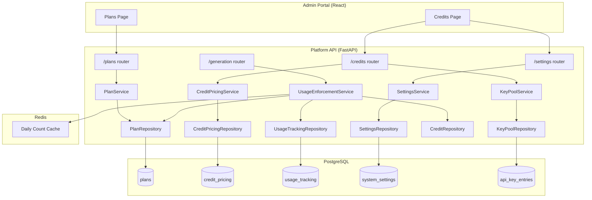
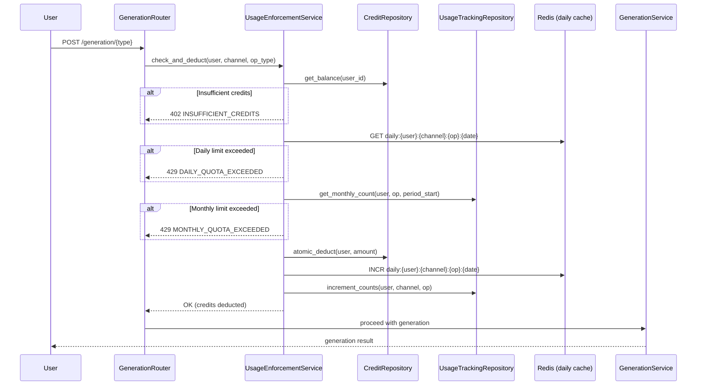
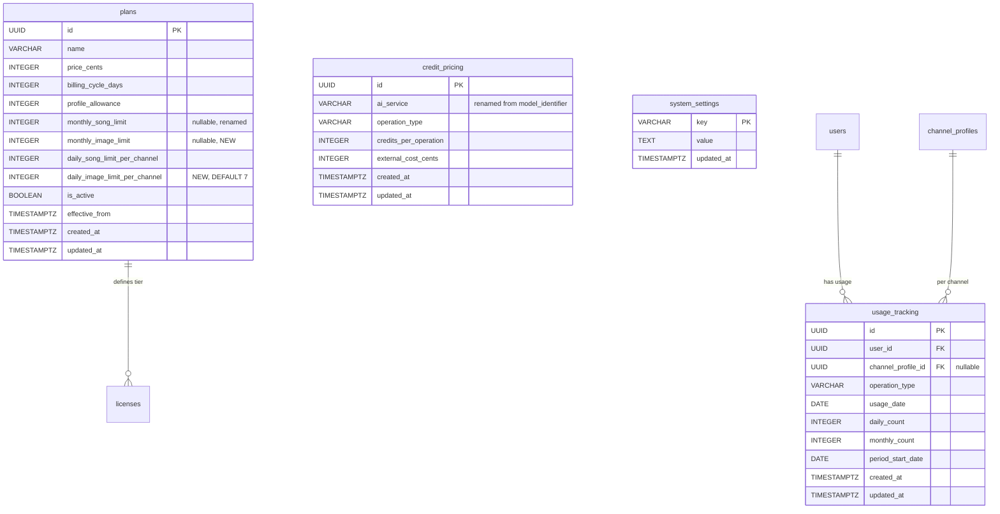

# Design Document: Credit Pricing & Plan Redesign

## Overview

This design overhauls the subscription plan structure and credit pricing configuration to support granular per-service limits, transparent margin calculations, and enforcement of daily/monthly usage quotas. The redesign touches three areas:

1. **Database schema** — new columns on `plans` and `credit_pricing`, a new `usage_tracking` table, and a `system_settings` table for the Global Credit Value.
2. **Platform API** — updated routers, services, and repositories for plan CRUD, pricing with margin computation, usage tracking, and limit enforcement middleware integrated into the generation flow.
3. **Admin Portal** — updated Plans and Credits pages with per-service limit fields, margin display, Global Credit Value configuration, and service availability indicators.

The key design goals are:
- Backwards-compatible migration (existing data preserved with sensible defaults)
- Atomic enforcement checks (credit balance → daily limit → monthly limit) before every generation request
- Pure-function margin computation that derives from a single Global Credit Value setting
- Service availability derived from the existing Key Pool infrastructure

---

## Architecture



### Request Enforcement Flow



---

## Components and Interfaces

### 1. Database Layer (Alembic Migration)

**Migration: `add_per_service_limits_and_usage_tracking`**

Changes to `plans` table:
- Rename `monthly_song_quota` → `monthly_song_limit`
- Add `monthly_image_limit` (INTEGER, nullable, default NULL = unlimited)
- Add `daily_image_limit_per_channel` (INTEGER, NOT NULL, DEFAULT 7)

Changes to `credit_pricing` table:
- Rename `model_identifier` → `ai_service`

New table `system_settings`:
```sql
CREATE TABLE IF NOT EXISTS system_settings (
    key VARCHAR(255) PRIMARY KEY,
    value TEXT NOT NULL,
    updated_at TIMESTAMPTZ NOT NULL DEFAULT NOW()
);
```

New table `usage_tracking`:
```sql
CREATE TABLE usage_tracking (
    id UUID PRIMARY KEY DEFAULT gen_random_uuid(),
    user_id UUID NOT NULL REFERENCES users(id),
    channel_profile_id UUID REFERENCES channel_profiles(id),
    operation_type VARCHAR(50) NOT NULL,
    usage_date DATE NOT NULL,
    daily_count INTEGER NOT NULL DEFAULT 0,
    monthly_count INTEGER NOT NULL DEFAULT 0,
    period_start_date DATE NOT NULL,
    created_at TIMESTAMPTZ NOT NULL DEFAULT NOW(),
    updated_at TIMESTAMPTZ NOT NULL DEFAULT NOW(),
    CONSTRAINT uq_usage_tracking UNIQUE (user_id, channel_profile_id, operation_type, usage_date)
);
CREATE INDEX idx_usage_tracking_monthly ON usage_tracking (user_id, operation_type, period_start_date);
```

### 2. Domain Models

```python
# platform_api/models/domain.py additions

@dataclass
class Plan:
    """Updated with per-service limits."""
    id: UUID
    name: str
    price_cents: int
    billing_cycle_days: int | None
    profile_allowance: int
    monthly_song_limit: int | None      # renamed from monthly_song_quota
    monthly_image_limit: int | None     # NEW
    daily_song_limit_per_channel: int
    daily_image_limit_per_channel: int  # NEW, default 7
    is_active: bool
    effective_from: datetime
    created_at: datetime
    updated_at: datetime


@dataclass
class UsageRecord:
    """Tracks daily and monthly usage per user/channel/operation."""
    id: UUID
    user_id: UUID
    channel_profile_id: UUID | None
    operation_type: str
    usage_date: date
    daily_count: int
    monthly_count: int
    period_start_date: date
    created_at: datetime
    updated_at: datetime
```

### 3. Enums Addition

```python
# platform_api/models/enums.py additions

class AIService(StrEnum):
    SUNO = "suno"
    FAL = "fal"
    OPENAI = "openai"
    DEEPSEEK = "deepseek"
    SLAI = "slai"

class OperationType(StrEnum):
    MUSIC_GENERATION = "music_generation"
    IMAGE_GENERATION = "image_generation"
    TEXT_GENERATION = "text_generation"
    CHANNEL_SETUP = "channel_setup"

class ServiceAvailability(StrEnum):
    AVAILABLE = "available"
    DEGRADED = "degraded"
    UNAVAILABLE = "unavailable"
```

### 4. Platform API — Service Layer

#### UsageEnforcementService (NEW)

```python
class UsageEnforcementService:
    """Enforces credit balance, daily limits, and monthly limits.
    
    Check order (Requirement 6.1):
    1. Credit balance >= credits_per_operation
    2. Daily limit for operation type per channel not reached
    3. Monthly limit for operation type not reached
    
    After all checks pass: atomic deduction + usage increment.
    """

    def __init__(
        self,
        credit_repo: CreditRepository,
        usage_repo: UsageTrackingRepository,
        plan_repo: PlanRepository,
        pricing_service: CreditPricingService,
        redis: Redis,
    ) -> None: ...

    async def check_and_deduct(
        self,
        user_id: UUID,
        channel_profile_id: UUID | None,
        operation_type: OperationType,
        ai_service: str,
    ) -> int:
        """Returns credits_deducted or raises appropriate HTTP error."""
        ...

    def get_daily_limit(self, plan: Plan, operation_type: OperationType) -> int:
        """Pure function: map operation_type to plan's daily limit field."""
        ...

    def get_monthly_limit(self, plan: Plan, operation_type: OperationType) -> int | None:
        """Pure function: map operation_type to plan's monthly limit field.
        Returns None for unlimited (Lifetime plans)."""
        ...
```

#### CreditPricingService (UPDATED)

Updates to existing service:
- Rename `model_identifier` parameter to `ai_service` across all methods
- Add `compute_margin_details()` pure function that uses Global Credit Value
- Add `get_service_availability()` method that queries Key Pool status

```python
# New methods on CreditPricingService

def compute_margin_details(
    self,
    credits_per_operation: int,
    external_cost_cents: int,
    global_credit_value: Decimal | None,
) -> MarginDetails | None:
    """Pure computation of sell_price, profit_margin, profit_margin_percent.
    
    Returns None if global_credit_value is not configured.
    """
    if global_credit_value is None:
        return None
    sell_price_cents = int(credits_per_operation * global_credit_value * 100)
    profit_margin_cents = sell_price_cents - external_cost_cents
    profit_margin_percent = round((profit_margin_cents / sell_price_cents) * 100, 2)
    return MarginDetails(sell_price_cents, profit_margin_cents, profit_margin_percent)

async def get_service_availability(self) -> list[ServiceAvailabilityEntry]:
    """Query Key Pool to determine each AI service's status."""
    ...
```

#### MarginDetails (new dataclass)

```python
@dataclass(frozen=True)
class MarginDetails:
    sell_price_cents: int
    profit_margin_cents: int
    profit_margin_percent: float
```

### 5. Platform API — Router Updates

#### Plans Router (`/plans`)

Updated request/response schemas:
- `PlanResponse` adds `monthly_image_limit`, `daily_image_limit_per_channel`, renames `monthly_song_quota` → `monthly_song_limit`
- `CreatePlanRequest` adds `monthly_image_limit`, `daily_image_limit_per_channel` fields with validation
- `UpdatePlanRequest` adds `monthly_song_limit`, `monthly_image_limit`, `daily_song_limit_per_channel`, `daily_image_limit_per_channel`

Validation rules (Requirement 1.2):
- `monthly_song_limit`: integer 0–100,000 (nullable for unlimited)
- `monthly_image_limit`: integer 0–100,000 (nullable for unlimited)
- `daily_song_limit_per_channel`: integer 1–1,000
- `daily_image_limit_per_channel`: integer 1–1,000

#### Credits Router (`/credits`)

Updated pricing schemas:
- Rename `model_identifier` → `ai_service` in `PricingResponse`, `CreatePricingRequest`, `UpdatePricingRequest`
- Add read-only computed fields to `PricingResponse`: `sell_price_cents`, `profit_margin_cents`, `profit_margin_percent`
- Add `service_availability` field to each pricing entry response

New endpoint:
```
GET /credits/service-availability
```
Returns service availability list per AI service.

New endpoint:
```
GET /credits/global-credit-value
PUT /credits/global-credit-value
```
Admin endpoints for reading/updating the Global Credit Value system setting.

#### Settings Router

The existing settings infrastructure handles the Global Credit Value via `system_settings` table with key `"global_credit_value"`.

### 6. Platform API — Repository Layer

#### UsageTrackingRepository (NEW)

```python
class UsageTrackingRepository:
    """Repository for usage_tracking table operations."""

    async def get_daily_count(
        self, user_id: UUID, channel_profile_id: UUID | None,
        operation_type: str, usage_date: date
    ) -> int: ...

    async def get_monthly_count(
        self, user_id: UUID, operation_type: str, period_start: date
    ) -> int: ...

    async def increment_usage(
        self, user_id: UUID, channel_profile_id: UUID | None,
        operation_type: str, usage_date: date, period_start: date
    ) -> None:
        """UPSERT: increment daily_count and monthly_count atomically."""
        ...
```

#### PlanRepository (UPDATED)

Add method:
```python
async def get_user_active_plan(self, user_id: UUID) -> Plan | None:
    """Get the plan associated with user's active license."""
    ...
```

### 7. Admin Portal — UI Components

#### Plans Page Updates

- Add `monthly_image_limit` numeric input (with "null = unlimited" toggle)
- Add `daily_image_limit_per_channel` numeric input
- Rename "Monthly Quota" column header to "Monthly Song Limit"
- Add "Monthly Image Limit" column
- Add "Daily Image Limit" column
- Update Create/Edit dialogs with new fields and validation

#### Credits Page Updates

**Pricing Table Enhancements:**
- Rename "Model" column to "AI Service"
- Replace free-text model input with dropdown (populated from Key Pool providers endpoint)
- Replace free-text operation type with dropdown (enum: Music_Generation, Image_Generation, Text_Generation, Channel_Setup)
- Add columns: Sell Price ($), Profit Margin ($), Profit Margin (%)
- Add service availability badge (green/yellow/red) beside each AI Service cell

**Global Credit Value Section (new card):**
- Display current Global Credit Value
- Input form to update it (with validation: > 0, ≤ 1.0)
- Reference calculator: "If credit pack is $X for Y credits, then 1 credit = $Z"
- On update: all margin columns recalculate client-side instantly

**State Management:**
- `useGlobalCreditValue()` hook — fetches and caches the Global Credit Value
- Margin computation is done client-side using `globalCreditValue * credits_per_operation` for instant preview
- The backend returns canonical computed margins for persistence

---

## Data Models

### ERD (Relevant Tables)



### Key Data Relationships

- A `Plan` defines limits; the user's active `License` links to a plan
- `usage_tracking` records per (user, channel, operation, day) with both daily and monthly running counts
- `credit_pricing` maps (ai_service, operation_type) → credits_per_operation; unique constraint enforced
- `system_settings` stores `global_credit_value` as a decimal string

### Redis Keys (Usage Caching)

```
daily_usage:{user_id}:{channel_profile_id}:{operation_type}:{YYYY-MM-DD}
```
- Type: INTEGER counter
- TTL: 25 hours (auto-expire after day rolls over)
- Used as a fast-path check before hitting PostgreSQL

---

## Correctness Properties

*A property is a characteristic or behavior that should hold true across all valid executions of a system — essentially, a formal statement about what the system should do. Properties serve as the bridge between human-readable specifications and machine-verifiable correctness guarantees.*

### Property 1: Plan Limit Validation Boundaries

*For any* integer value provided for `monthly_song_limit` or `monthly_image_limit`, the validation function SHALL accept the value if and only if it is in the range [0, 100,000] inclusive; and *for any* integer value provided for `daily_song_limit_per_channel` or `daily_image_limit_per_channel`, the validation function SHALL accept the value if and only if it is in the range [1, 1,000] inclusive.

**Validates: Requirements 1.2**

### Property 2: Margin Computation Correctness

*For any* `credits_per_operation` (integer in [1, 10000]), `external_cost_cents` (non-negative integer), and `global_credit_value` (decimal in (0, 1.0]), the computed `sell_price_cents` SHALL equal `round(credits_per_operation × global_credit_value × 100)`, `profit_margin_cents` SHALL equal `sell_price_cents − external_cost_cents`, and `profit_margin_percent` SHALL equal `round((profit_margin_cents / sell_price_cents) × 100, 2)`.

**Validates: Requirements 2.4**

### Property 3: Global Credit Value Validation

*For any* numeric value submitted as a Global Credit Value update, the validation function SHALL accept the value if and only if it is a positive number strictly greater than 0 and less than or equal to 1.0.

**Validates: Requirements 3.2**

### Property 4: Credit Pack Derived Value

*For any* positive credit pack price (in cents) and positive credit quantity, the derived Global Credit Value displayed SHALL equal `price / quantity` (as a decimal with up to 6 decimal places).

**Validates: Requirements 3.3**

### Property 5: Service Availability Classification

*For any* AI service provider and a set of Key Pool entries for that provider, the service availability SHALL be classified as: "available" when at least one key has status "active", "degraded" when keys exist but none has status "active", and "unavailable" when no key entries exist for the provider.

**Validates: Requirements 4.1**

### Property 6: Onboarding Pricing Resolution with Fallback

*For any* onboarding generation operation (name, logo, cover, description) and a credit pricing configuration, the system SHALL use the `Channel_Setup` pricing entry for that provider if one exists; otherwise it SHALL fall back to the standard `Text_Generation` or `Image_Generation` pricing for that operation type. The selected `credits_per_operation` value SHALL be the exact amount deducted.

**Validates: Requirements 5.5, 3.4**

### Property 7: Enforcement Check Ordering

*For any* generation request where multiple enforcement conditions are violated simultaneously, the system SHALL return the error corresponding to the first failing check in this order: (1) INSUFFICIENT_CREDITS (402), (2) DAILY_QUOTA_EXCEEDED (429), (3) MONTHLY_QUOTA_EXCEEDED (429). Furthermore, *for any* user on a plan with `null` monthly limits, the monthly quota check SHALL be skipped regardless of actual monthly usage count.

**Validates: Requirements 6.1, 6.7**

### Property 8: Usage Counter Isolation

*For any* sequence of generation operations performed by a user, the daily usage count SHALL increment only for the specific (user, channel, operation_type, date) partition, and the monthly usage count SHALL increment only for the specific (user, operation_type, period_start) partition. Increments to one partition SHALL NOT affect counts in any other partition.

**Validates: Requirements 6.5, 6.6**


---

## Error Handling

### Error Responses (Structured JSON Envelope)

All errors follow the existing `PlatformAPIError` pattern with structured JSON:

```json
{
  "error": {
    "code": "ERROR_CODE",
    "message": "Human-readable message",
    "details": { ... }
  }
}
```

### Enforcement Errors

| HTTP Status | Error Code | Trigger | Details Fields |
|---|---|---|---|
| 402 | `INSUFFICIENT_CREDITS` | Balance < credits_per_operation | `required_credits`, `current_balance`, `suggested_pack` |
| 429 | `DAILY_QUOTA_EXCEEDED` | Daily count ≥ daily limit for channel | `limit`, `current_usage`, `reset_time`, `operation_type` |
| 429 | `MONTHLY_QUOTA_EXCEEDED` | Monthly count ≥ monthly limit | `limit`, `current_usage`, `period_end_date`, `operation_type` |
| 429 | `PLAN_LIMIT_ZERO` | Plan has limit set to 0 for operation type | `operation_type`, `plan_name` |
| 503 | `SERVICE_UNAVAILABLE` | AI service has no configured keys | `ai_service`, `message` |

### Admin/Pricing Errors

| HTTP Status | Error Code | Trigger | Details Fields |
|---|---|---|---|
| 400 | `VALIDATION_ERROR` | Invalid plan limits or GCV value | field-specific validation messages |
| 409 | `CONFLICT` | Duplicate (ai_service, operation_type) | `ai_service`, `operation_type` |
| 404 | `NOT_FOUND` | Plan or pricing entry not found | `resource_id` |

### Error Recovery Strategies

1. **Credit deduction failure during enforcement**: No side effects — the request is rejected before any deduction occurs.
2. **Usage increment failure after credit deduction**: Use a PostgreSQL transaction wrapping both the credit deduction and usage increment. If the usage increment fails, the entire transaction rolls back (credits restored).
3. **Concurrent daily limit race condition**: Redis INCR is atomic. Even if two requests race past the PostgreSQL check, the Redis counter ensures accurate counting. PostgreSQL usage_tracking is reconciled on read.
4. **Global Credit Value not configured**: Margin fields return `null`; the system remains functional for credit deductions (which use integer `credits_per_operation` directly).

---

## Testing Strategy

### Property-Based Tests (Hypothesis + fast-check)

Each correctness property is implemented as a property-based test with a minimum of 100 iterations.

**Python (Hypothesis) — Platform API:**

| Property | Test File | Strategy |
|---|---|---|
| Property 1: Plan Limit Validation | `tests/properties/test_plan_validation.py` | Generate random integers, verify boundary acceptance/rejection |
| Property 2: Margin Computation | `tests/properties/test_margin_computation.py` | Generate credits, cost, GCV; verify arithmetic identity |
| Property 3: GCV Validation | `tests/properties/test_gcv_validation.py` | Generate random floats; verify (0, 1.0] acceptance |
| Property 5: Service Availability | `tests/properties/test_service_availability.py` | Generate random key pool states; verify classification |
| Property 6: Pricing Resolution | `tests/properties/test_pricing_resolution.py` | Generate random pricing configs; verify fallback logic |
| Property 7: Enforcement Ordering | `tests/properties/test_enforcement_ordering.py` | Generate states with various violation combinations; verify error order |
| Property 8: Usage Counter Isolation | `tests/properties/test_usage_counters.py` | Generate operation sequences; verify partition independence |

**TypeScript (fast-check) — Admin Portal:**

| Property | Test File | Strategy |
|---|---|---|
| Property 2: Margin Computation (client-side) | `tests/properties/margin-computation.test.ts` | Generate credits, cost, GCV; verify client-side calculation matches spec |
| Property 4: Credit Pack Derived Value | `tests/properties/credit-pack-derivation.test.ts` | Generate price/quantity pairs; verify division result |

**Configuration:**
- Hypothesis: `@settings(max_examples=200)` on each test
- fast-check: `fc.assert(property, { numRuns: 200 })`
- Tag format: `# Feature: credit-pricing-redesign, Property {N}: {title}`

### Unit Tests (pytest + Vitest)

- Plan CRUD operations with edge cases (limit = 0, limit = null for lifetime)
- Pricing CRUD with unique constraint conflict
- GCV not configured → null margins
- Service unavailable → 503 rejection
- Onboarding deduction for each operation type
- Admin portal form validation (Zod schemas)
- Component rendering with mock data

### Integration Tests

- Alembic migration forward/backward with seed data preservation
- Full enforcement flow: create user → assign plan → exhaust daily limit → verify 429
- Concurrent deduction race condition (two simultaneous requests when balance allows only one)
- Key Pool integration: mark all keys as rate_limited → verify "degraded" status returned

### Test Libraries

- **Python**: pytest, pytest-asyncio, Hypothesis, unittest.mock
- **TypeScript**: Vitest, @testing-library/react, MSW, fast-check
