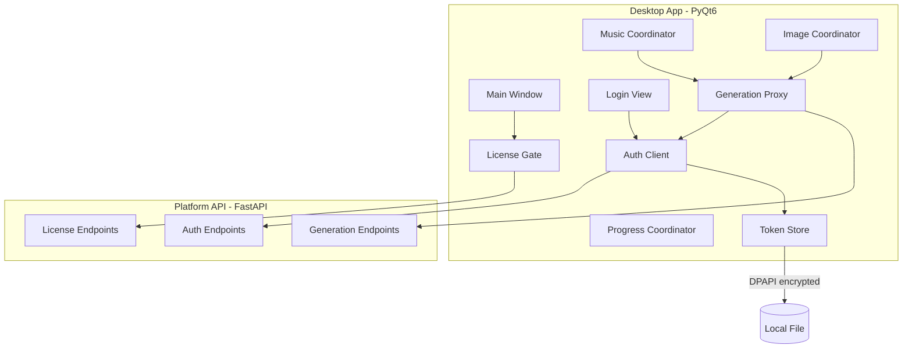
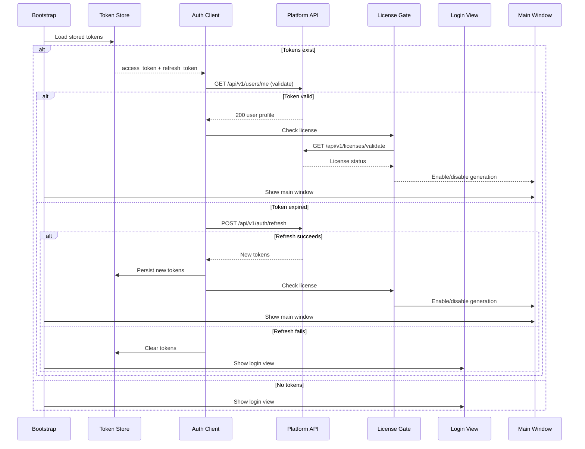
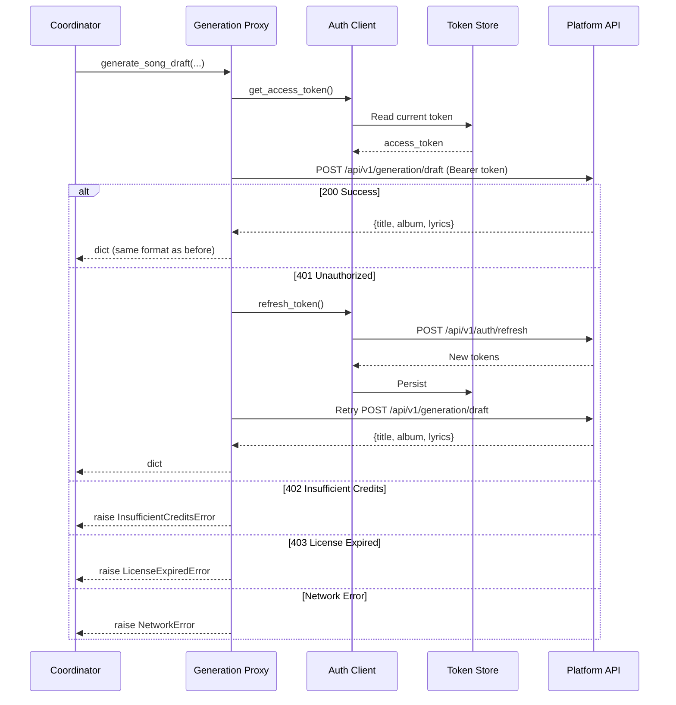

# Design Document: Desktop API Integration

## Overview

This design describes the integration layer between the PyQt6 desktop application and the Platform API. The goal is to route all AI generation services (song drafts, Suno music, images) through the authenticated Platform API, replacing direct external API calls with centralized key management, credit billing, and license enforcement.

### Key Design Goals

- **Transparent Replacement**: Generation proxy modules mirror existing function signatures so coordinators require minimal changes
- **Secure Token Storage**: DPAPI-encrypted local storage for JWT tokens (leveraging existing `services/dpapi.py`)
- **Graceful Degradation**: Network errors, expired tokens, and license issues produce clear user-facing messages through existing error display patterns
- **Minimal Disruption**: Only the service layer changes; coordinators, views, and the design system remain untouched

### Technology Choices

- **HTTP Client**: `httpx` (sync) — lightweight, supports timeouts, connection pooling, and auth headers. Sync because the desktop app's generation calls run on `ThreadPoolExecutor` worker threads (not asyncio).
- **Token Storage**: Windows DPAPI via existing `services/dpapi.py` — already implemented, OS-level encryption tied to the Windows user session
- **Configuration**: Existing settings system with a new `platformApiBaseUrl` key
- **UI Framework**: PyQt6 — Login/Registration view follows existing view patterns in `views/`

## Architecture

### High-Level Integration Architecture



### Application Startup Flow



### Generation Request Flow (with Token Refresh)



### Module Dependency Graph

```
python_app/
├── services/
│   ├── auth_client.py          # NEW — HTTP client for auth endpoints
│   ├── token_store.py          # NEW — DPAPI-based token persistence
│   ├── license_gate.py         # NEW — License validation + feature gating
│   ├── generation_proxy.py     # NEW — Routes generation through Platform API
│   ├── api_errors.py           # NEW — Error types for API integration
│   ├── dpapi.py                # EXISTING — Used by token_store.py
│   ├── image_generation.py     # MODIFIED — Calls generation_proxy instead of FAL/SLAI directly
│   ├── music_generation.py     # MODIFIED — Calls generation_proxy instead of DeepSeek/SLAI directly
│   └── music_suno.py           # MODIFIED — Calls generation_proxy instead of Suno API directly
├── views/
│   ├── login_view.py           # NEW — Login + Registration UI
│   └── login_page_controller.py # NEW — Login view controller
└── app/
    └── bootstrap.py            # MODIFIED — Startup flow with auth check
```

## Components and Interfaces

### 1. Token Store (`python_app/services/token_store.py`)

Persists JWT tokens locally using DPAPI encryption. Tokens are stored as a single encrypted JSON blob in the user's app data directory.

```python
from __future__ import annotations
from dataclasses import dataclass
from pathlib import Path
from typing import Protocol


@dataclass(frozen=True)
class StoredTokens:
    """Immutable token pair loaded from disk."""
    access_token: str
    refresh_token: str


class TokenStorePort(Protocol):
    """Protocol for token persistence."""

    def load(self) -> StoredTokens | None:
        """Load tokens from disk. Returns None if no valid tokens exist."""
        ...

    def save(self, access_token: str, refresh_token: str) -> None:
        """Encrypt and persist tokens to disk."""
        ...

    def clear(self) -> None:
        """Remove stored tokens from disk."""
        ...

    def has_tokens(self) -> bool:
        """Check if token file exists (without decrypting)."""
        ...
```

**Implementation details:**
- Storage path: `%LOCALAPPDATA%/MusicGenerator/auth_tokens.dat`
- Format: DPAPI-encrypted JSON `{"access_token": "...", "refresh_token": "..."}`
- Uses existing `dpapi_encrypt_to_base64` / `dpapi_decrypt_from_base64` from `services/dpapi.py`
- File-level atomic write (write to `.tmp`, rename) to prevent corruption

### 2. Auth Client (`python_app/services/auth_client.py`)

HTTP client for Platform API authentication endpoints. Manages login, registration, token refresh, and logout.

```python
from __future__ import annotations
from dataclasses import dataclass
from typing import Protocol


@dataclass(frozen=True)
class AuthTokens:
    """Token pair returned from auth endpoints."""
    access_token: str
    refresh_token: str
    expires_in: int  # seconds


@dataclass(frozen=True)
class AuthError:
    """Structured auth error response."""
    status_code: int
    message: str
    field_errors: dict[str, str] | None = None  # For 422 validation errors


class AuthClientPort(Protocol):
    """Protocol for authentication operations."""

    def login(self, email: str, password: str) -> AuthTokens:
        """Authenticate with email/password.

        Raises:
            AuthenticationError: On 401 (invalid credentials)
            AccountLockedError: On 403 (account locked)
            NetworkError: On connection failure or timeout
        """
        ...

    def register(self, email: str, password: str, display_name: str) -> None:
        """Register a new account.

        Raises:
            DuplicateEmailError: On 409 (email exists)
            ValidationError: On 422 (field errors)
            NetworkError: On connection failure
        """
        ...

    def refresh(self, refresh_token: str) -> AuthTokens:
        """Obtain new tokens using a refresh token.

        Raises:
            TokenExpiredError: On 401 (refresh failed)
            NetworkError: On connection failure
        """
        ...

    def logout(self, access_token: str, refresh_token: str) -> None:
        """Revoke refresh token server-side. Best-effort (ignores errors)."""
        ...

    def validate(self, access_token: str) -> bool:
        """Check if access token is still valid (GET /users/me).

        Returns True if 200, False on 401.
        Raises NetworkError on connection failure.
        """
        ...
```

**Implementation details:**
- Uses `httpx.Client` (sync) with configurable base URL and 15s default timeout
- Connection pooling via a shared `httpx.Client` instance (thread-safe)
- All methods are called from worker threads (not the Qt main thread)

### 3. License Gate (`python_app/services/license_gate.py`)

Checks user license status and controls feature availability.

```python
from __future__ import annotations
from dataclasses import dataclass
from typing import Protocol


@dataclass(frozen=True)
class LicenseStatus:
    """License validation result."""
    is_active: bool
    plan_name: str | None = None  # "monthly", "yearly", "lifetime"
    expires_at: str | None = None  # ISO datetime or None for lifetime


class LicenseGatePort(Protocol):
    """Protocol for license validation."""

    def validate(self, access_token: str) -> LicenseStatus:
        """Check license status via Platform API.

        Returns LicenseStatus with is_active=False if no license or expired.
        Raises NetworkError on connection failure.
        """
        ...

    def is_generation_allowed(self) -> bool:
        """Check cached license status (no network call).

        Used by UI to enable/disable generation controls.
        """
        ...

    def update_status(self, status: LicenseStatus) -> None:
        """Update the cached license status (called after validation)."""
        ...

    def get_cached_status(self) -> LicenseStatus | None:
        """Return the last known license status or None if not checked."""
        ...
```

**Implementation details:**
- Calls `GET /api/v1/licenses/validate` with Bearer token
- Caches the result in memory for UI gating (no repeated network calls per button click)
- Stale cache is refreshed on app startup and on explicit user action
- When license is invalid, emits an event via the event bus so the UI can disable controls

### 4. Generation Proxy (`python_app/services/generation_proxy.py`)

The core integration module. Routes generation requests through the Platform API while maintaining the same function signatures as existing direct service calls.

```python
from __future__ import annotations
from typing import Any, Protocol


class GenerationProxyPort(Protocol):
    """Protocol for generation operations via Platform API."""

    def generate_song_draft(
        self,
        *,
        language: str,
        creativity_level: int,
        description: str,
        structure: str,
        avoid_titles: list[str] | None = None,
        avoid_albums: list[str] | None = None,
        avoid_openings: list[str] | None = None,
        forced_title: str = "",
        forced_album: str = "",
        forced_opening: str = "",
        on_log: Any = None,
        should_cancel: Any = None,
    ) -> dict[str, str]:
        """Generate a song draft via Platform API.

        Returns dict with keys: 'title', 'album', 'lyrics'
        Same return format as existing generate_song_draft_with_deepseek().

        Raises:
            InsufficientCreditsError: 402 from API
            LicenseExpiredError: 403 from API
            NetworkError: Connection failure
            GenerationError: Other API errors
        """
        ...

    def submit_suno(
        self,
        *,
        model: str,
        title: str,
        lyrics: str,
        style: str,
        instrumental: bool,
    ) -> str:
        """Submit music generation to Suno via Platform API.

        Returns task_id string.
        Same return semantics as suno_api_generate()['taskId'].

        Raises:
            InsufficientCreditsError: 402 from API
            LicenseExpiredError: 403 from API
            NetworkError: Connection failure
            GenerationError: Other API errors
        """
        ...

    def get_suno_status(self, task_id: str) -> dict:
        """Poll Suno task status via Platform API.

        Returns dict with keys: 'status', 'audioUrls' (list or empty)
        Same format as suno_api_try_get_tracks().

        Raises:
            NetworkError: Connection failure
            GenerationError: Other API errors
        """
        ...

    def generate_image(
        self,
        *,
        prompt: str,
        provider: str,
        resolution: str,
        style_strength: float,
        base_image_png_bytes: bytes | None = None,
    ) -> bytes:
        """Generate an image via Platform API.

        Returns PNG image bytes.
        Same return type as fal_generate_image_png_bytes().

        Raises:
            InsufficientCreditsError: 402 from API
            LicenseExpiredError: 403 from API
            NetworkError: Connection failure
            GenerationError: Other API errors
        """
        ...
```

**Implementation details:**

- Uses `httpx.Client` with the stored access token in `Authorization: Bearer` header
- On 401 response: attempts one token refresh via `AuthClient.refresh()`, then retries the request
- On 402: raises `InsufficientCreditsError` with details from response body
- On 403: raises `LicenseExpiredError`
- On network errors: raises `NetworkError` with a human-readable message
- The `on_log` and `should_cancel` parameters are preserved for compatibility but `on_log` logs HTTP timing info and `should_cancel` is checked before the request (cancellation between retries)

**Draft endpoint mapping:**
```
POST /api/v1/generation/draft
Body: {language, creativity_level, description, structure,
       avoid_titles, avoid_albums, avoid_openings,
       forced_title, forced_album, forced_opening}
Response: {title, album, lyrics}
```

**Suno submit mapping:**
```
POST /api/v1/generation/suno
Body: {model, title, lyrics, style, instrumental}
Response 202: {task_id}
```

**Suno status mapping:**
```
GET /api/v1/generation/suno/{task_id}
Response: {status, audio_urls: [...]}
```

**Image mapping:**
```
POST /api/v1/generation/image
Body: {prompt, provider, resolution, style_strength, base_image (base64)}
Response: {image_base64}
```

### 5. API Error Types (`python_app/services/api_errors.py`)

Structured error hierarchy for API integration failures.

```python
class PlatformAPIError(Exception):
    """Base error for all Platform API communication failures."""
    def __init__(self, message: str, status_code: int | None = None):
        super().__init__(message)
        self.status_code = status_code


class NetworkError(PlatformAPIError):
    """Connection failure, timeout, or DNS resolution error."""
    pass


class AuthenticationError(PlatformAPIError):
    """Invalid credentials (401)."""
    pass


class AccountLockedError(PlatformAPIError):
    """Account temporarily locked (403 with lockout reason)."""
    pass


class TokenExpiredError(PlatformAPIError):
    """Both access and refresh tokens are invalid (401 on refresh)."""
    pass


class DuplicateEmailError(PlatformAPIError):
    """Email already registered (409)."""
    pass


class ValidationError(PlatformAPIError):
    """Field validation errors from API (422)."""
    def __init__(self, message: str, field_errors: dict[str, str] | None = None):
        super().__init__(message, 422)
        self.field_errors = field_errors or {}


class InsufficientCreditsError(PlatformAPIError):
    """Not enough credits for the operation (402)."""
    pass


class LicenseExpiredError(PlatformAPIError):
    """License expired or not active (403 with license reason)."""
    pass


class GenerationError(PlatformAPIError):
    """Generation request failed (5xx or unexpected error)."""
    pass
```

### 6. Login View (`python_app/views/login_view.py`)

PyQt6 view implementing the Login and Registration forms. Follows the existing view pattern with a separated page controller.

```python
class LoginView(QWidget):
    """Login/Registration view displayed at application startup.

    Signals:
        login_requested(email: str, password: str)
        register_requested(email: str, password: str, display_name: str)
        switch_to_register()
        switch_to_login()

    Slots:
        show_error(message: str)
        show_field_errors(errors: dict[str, str])
        show_success(message: str)
        set_loading(is_loading: bool)
    """
```

**UI layout:**
- Centered card with the app logo
- Tab-style toggle between "Login" and "Register" (no actual QTabWidget — styled link/button)
- Email field, Password field, optional Display Name field (registration only)
- Submit button with loading spinner state
- Error message area (red text below form)
- Success message area (green text, used after registration)
- Retry button on network errors
- Styled using the existing token-based QSS design system

### 7. Login Page Controller (`python_app/views/login_page_controller.py`)

Connects LoginView signals to AuthClient operations, running auth calls on a worker thread to keep the UI responsive.

```python
class LoginPageController:
    """Orchestrates login/registration logic between view and auth client.

    Dependencies (constructor-injected):
        auth_client: AuthClientPort
        token_store: TokenStorePort
        license_gate: LicenseGatePort
        on_authenticated: Callable[[], None]  # Navigate to main window
    """

    def handle_login(self, email: str, password: str) -> None:
        """Spawn worker thread: auth_client.login() → token_store.save() → license check → on_authenticated()"""
        ...

    def handle_register(self, email: str, password: str, display_name: str) -> None:
        """Spawn worker thread: auth_client.register() → show success → switch to login"""
        ...

    def attempt_auto_login(self) -> None:
        """Called at startup: validate stored tokens or refresh them."""
        ...
```

### 8. Integration Points — Existing Module Changes

**`services/music_generation.py` changes:**
- `generate_song_draft_with_deepseek()` and `generate_song_draft_with_slai()` are replaced by a single call through `GenerationProxy.generate_song_draft()`
- The `api_key` parameter is removed from caller sites (coordinators)
- A thin adapter function wraps `GenerationProxy` to maintain the old signature during transition:

```python
def generate_song_draft(
    *,
    generation_proxy: GenerationProxyPort,
    language: str,
    creativity: int,
    description: str,
    structure: str,
    avoid_titles: list[str] | None = None,
    avoid_albums: list[str] | None = None,
    avoid_openings: list[str] | None = None,
    forced_title: str = "",
    forced_album: str = "",
    forced_opening: str = "",
    should_cancel: Any = None,
    on_log: Any = None,
) -> dict[str, str]:
    """Unified draft generation via Platform API.
    
    Returns: {"title": ..., "album": ..., "lyrics": ...}
    """
    return generation_proxy.generate_song_draft(
        language=language,
        creativity_level=creativity,
        description=description,
        structure=structure,
        avoid_titles=avoid_titles,
        avoid_albums=avoid_albums,
        avoid_openings=avoid_openings,
        forced_title=forced_title,
        forced_album=forced_album,
        forced_opening=forced_opening,
        on_log=on_log,
        should_cancel=should_cancel,
    )
```

**`services/music_suno.py` changes:**
- `suno_api_generate()` calls are replaced by `GenerationProxy.submit_suno()`
- `suno_api_try_get_tracks()` calls are replaced by `GenerationProxy.get_suno_status()`
- Download functions (`download_to_file`, `build_suno_output_paths`, `plan_next_run_dir`) remain unchanged — they operate on local files from URLs returned by the Platform API

**`services/image_generation.py` changes:**
- `_run_one_image_job()` replaces its internal FAL/SLAI provider calls with `GenerationProxy.generate_image()`
- The `api_key` parameter is removed from `_run_job_batch()` and `_run_one_image_job()`
- A `generation_proxy` parameter is added instead

**`features/music/coordinator.py` changes:**
- Constructor gains a `generation_proxy: GenerationProxyPort` dependency
- `prepare_suno_submission()` no longer checks for `sunoApiKey` in settings
- `execute_suno_api_call()` delegates to `generation_proxy.submit_suno()`

**`features/image/coordinator.py` changes:**
- Constructor gains a `generation_proxy: GenerationProxyPort` dependency
- Passes proxy to `run_pending_image_jobs()` instead of API key

**`app/bootstrap.py` changes:**
- Instantiates `TokenStore`, `AuthClient`, `LicenseGate`, `GenerationProxy`
- Checks for stored tokens on startup
- Shows `LoginView` if not authenticated; shows main window if authenticated
- Injects `GenerationProxy` into coordinators that need it

### 9. Configuration Changes

**Removed settings** (from UI and config):
- `sunoApiKey`
- `deepseekApiKey`
- `slaiLlmApiKey`
- `falImgApiKey`
- `slaiImgApiKey`

**New settings:**
- `platformApiBaseUrl` — default: `http://localhost:8000/api/v1`

**Backward compatibility:**
- When loading an existing config file containing removed keys, the settings loader silently ignores them (no crash, no error)
- The settings UI no longer renders input fields for removed keys

## Data Models

### Token Storage Format

```json
{
  "access_token": "eyJhbGciOiJIUzI1NiIsInR...",
  "refresh_token": "dGhpcyBpcyBhIHJlZnJlc2..."
}
```

Stored as: DPAPI-encrypted blob → base64-encoded → written to `auth_tokens.dat`

### Auth Client Request/Response Models

```python
@dataclass(frozen=True)
class LoginRequest:
    email: str
    password: str

@dataclass(frozen=True)
class RegisterRequest:
    email: str
    password: str
    display_name: str

@dataclass(frozen=True)
class TokenResponse:
    access_token: str
    refresh_token: str
    expires_in: int

@dataclass(frozen=True)
class LicenseValidationResponse:
    is_active: bool
    plan_name: str | None
    expires_at: str | None
```

### Generation Proxy Request/Response Models

```python
@dataclass(frozen=True)
class DraftGenerationRequest:
    language: str
    creativity_level: int  # 0-100
    description: str
    structure: str
    avoid_titles: list[str]
    avoid_albums: list[str]
    avoid_openings: list[str]
    forced_title: str
    forced_album: str
    forced_opening: str

@dataclass(frozen=True)
class DraftGenerationResponse:
    title: str
    album: str
    lyrics: str

@dataclass(frozen=True)
class SunoSubmitRequest:
    model: str  # "V5" | "V5_5"
    title: str
    lyrics: str
    style: str
    instrumental: bool

@dataclass(frozen=True)
class SunoStatusResponse:
    status: str  # "PENDING" | "SUCCESS" | "FAILED"
    audio_urls: list[str]  # Empty if not yet complete

@dataclass(frozen=True)
class ImageGenerationRequest:
    prompt: str
    provider: str  # "fal" | "slai"
    resolution: str  # "1920x1080"
    style_strength: float
    base_image: str | None  # base64-encoded PNG or None
```

### Error Response Model (Platform API format)

```python
@dataclass(frozen=True)
class APIErrorResponse:
    """Parsed from Platform API error responses."""
    code: str         # e.g. "INSUFFICIENT_CREDITS"
    message: str      # Human-readable message
    details: dict     # Additional context (optional)
```

## Correctness Properties

*A property is a characteristic or behavior that should hold true across all valid executions of a system — essentially, a formal statement about what the system should do. Properties serve as the bridge between human-readable specifications and machine-verifiable correctness guarantees.*

### Property 1: Token storage round-trip

*For any* pair of non-empty token strings (access_token, refresh_token), saving them to the Token Store and then loading them back should produce an identical pair. Additionally, the raw file on disk should not contain either token string as plaintext.

**Validates: Requirements 1.3, 3.3, 3.6**

### Property 2: 401 triggers exactly one token refresh

*For any* API request that receives a 401 response, the Auth Client should attempt exactly one token refresh before either retrying the request (on refresh success) or propagating the failure (on refresh failure). A second 401 after refresh should not trigger another refresh attempt.

**Validates: Requirements 3.5**

### Property 3: Generation requests include all fields and auth header

*For any* valid generation request (draft, suno, or image) with arbitrary input parameters, the HTTP request sent to the Platform API should: (a) include all input fields correctly mapped in the request body, and (b) include the current access token in the `Authorization: Bearer` header.

**Validates: Requirements 5.1, 5.5, 6.1, 7.1**

### Property 4: Generation response pass-through

*For any* successful Platform API response containing generation results (draft title/album/lyrics, suno task_id, suno audio URLs, or image base64), the Generation Proxy should return the data to the caller without modification — preserving string values exactly and decoding base64 images to their original bytes.

**Validates: Requirements 5.2, 6.2, 6.4, 7.2**

### Property 5: License gate blocks all generation when inactive

*For any* generation operation (draft, suno, image) attempted while the License Gate reports `is_generation_allowed() == False`, the operation should be blocked before any HTTP request is made to the Platform API.

**Validates: Requirements 4.4**

### Property 6: Configuration loading ignores removed keys

*For any* configuration dictionary containing a mix of valid settings keys and removed API key fields (sunoApiKey, deepseekApiKey, slaiLlmApiKey, falImgApiKey, slaiImgApiKey), loading the configuration should succeed without error, the removed keys should be absent from the loaded result, and all valid keys should be preserved with their original values.

**Validates: Requirements 8.3**

### Property 7: Network errors produce descriptive messages

*For any* network failure condition (connection refused, timeout, DNS resolution failure) occurring during a generation request, the raised error should contain a non-empty message that includes either the target URL or the nature of the failure (timeout, connection, DNS).

**Validates: Requirements 9.4**

### Property 8: Field validation errors are fully surfaced

*For any* set of field-level validation errors returned by the Platform API in a 422 response (arbitrary field names and error messages), the Login View should display all field names and their corresponding error messages — none should be silently dropped.

**Validates: Requirements 2.5**

## Error Handling

### Error Propagation Strategy

Errors from the Platform API are translated into typed exceptions at the Generation Proxy boundary. Coordinators catch these and route them through the existing error display mechanisms (event bus → progress table, status bar, or warning dialogs).

| API Response | Desktop Error Type | User-Facing Behavior |
|---|---|---|
| 401 (after refresh failure) | `TokenExpiredError` | Redirect to Login View |
| 402 | `InsufficientCreditsError` | Status message: "Insufficient credits" |
| 403 (license) | `LicenseExpiredError` | Disable generation, show license message |
| 403 (lockout) | `AccountLockedError` | Login form: "Account temporarily locked" |
| 409 | `DuplicateEmailError` | Registration form: "Email already registered" |
| 422 | `ValidationError` | Per-field error messages in form |
| 5xx | `GenerationError` | Status message: "Server error, please retry" |
| Network timeout | `NetworkError` | Status message: "Connection failed" + retry |
| Connection refused | `NetworkError` | Status message: "Cannot reach server" + retry |

### Retry Strategy

- **Token refresh**: Attempted once per request on 401. If refresh itself fails, propagate error immediately.
- **Network errors in generation**: No automatic retry. The error surfaces to the user via the existing progress/error UI. Users can retry manually (same as current behavior with direct API calls).
- **Network errors in login**: Display error with a "Retry" button (manual retry).

### Error Integration with Existing UI

The Generation Proxy raises exceptions that match what coordinators already expect:
- `MusicGenerationCoordinator` catches `RuntimeError` — the proxy raises subclasses of `PlatformAPIError` which inherits from `Exception`. The coordinator's existing `except Exception as exc:` handlers work unchanged.
- The error message text is designed to integrate with existing status display patterns (short, one-line messages).

### Graceful Degradation

- If the Platform API is unreachable at startup, the app shows the Login View with a connection error message. No crash.
- If token refresh fails silently during a background operation, the next user-initiated action will detect the 401 and redirect to login.
- If license check fails due to network error, the cached license status is used. If no cache exists, generation is disabled (fail-safe).

## Testing Strategy

### Dual Testing Approach

This feature uses both example-based unit tests and property-based tests for comprehensive coverage.

### Property-Based Testing

**Library**: Hypothesis (Python) — already used in the project
**Configuration**: `@settings(max_examples=100)` minimum per property test
**Tag format**: `# Feature: desktop-api-integration, Property {number}: {property_text}`

Each correctness property maps to a single property-based test:

| Property | Test Module | Key Generators |
|---|---|---|
| 1: Token round-trip | `tests/services/test_token_store_props.py` | `st.text(min_size=1, max_size=2000)` for token strings |
| 2: 401 refresh | `tests/services/test_auth_client_props.py` | Random API endpoints, mock responses |
| 3: Request mapping | `tests/services/test_generation_proxy_props.py` | Random draft/suno/image params |
| 4: Response pass-through | `tests/services/test_generation_proxy_props.py` | Random response payloads |
| 5: License blocks | `tests/services/test_license_gate_props.py` | Random generation operation types |
| 6: Config ignores removed keys | `tests/services/test_config_props.py` | Random config dicts with mix of valid/removed keys |
| 7: Network error messages | `tests/services/test_generation_proxy_props.py` | Various error conditions |
| 8: Field errors surfaced | `tests/views/test_login_view_props.py` | Random field error dictionaries |

### Example-Based Unit Tests

| Area | Test Focus | Count |
|---|---|---|
| Auth Client | Login/register/refresh/logout happy paths | 6-8 tests |
| Auth Client | Error responses (401, 403, 409, 422, network) | 5-6 tests |
| Token Store | Empty store, corrupt file, permissions | 3-4 tests |
| License Gate | Active/expired/missing license scenarios | 4-5 tests |
| Generation Proxy | Draft/Suno/Image happy paths | 3 tests |
| Generation Proxy | Error responses (402, 403, 5xx) | 4-5 tests |
| Login View | UI state transitions | 5-6 tests |
| Config | Backward compat with old config files | 2-3 tests |
| Bootstrap | Startup flow (tokens present/absent) | 3-4 tests |

### Integration Tests

- End-to-end login → license check → generation flow (mocked Platform API via `respx` or `httpx` mock transport)
- Batch processing flow with mocked API responses verifying progress events fire correctly
- Startup flow with valid/expired/missing tokens

### Test Infrastructure

- **HTTP mocking**: `respx` library for mocking `httpx` requests in tests
- **DPAPI mocking**: Test implementations of `dpapi_encrypt`/`dpapi_decrypt` that use simple base64 (for cross-platform CI)
- **Qt testing**: `pytest-qt` for Login View interaction tests (signal/slot verification)
