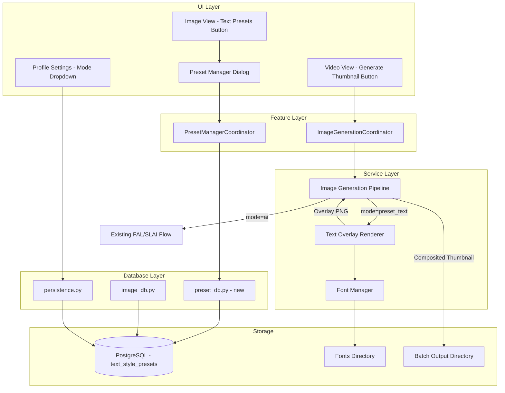

# Design Document: Dynamic Text Overlay

## Overview

This feature adds a programmatic text overlay rendering system as an alternative to the existing AI-based thumbnail overlay generation. The system uses Pillow/PIL to render styled track titles onto transparent PNG canvases, which are then alpha-composited onto AI-generated background images to produce final thumbnails.

The design integrates into the existing `Image_Generation_Pipeline` (`services/image_generation.py`) by adding a new code path for thumbnail jobs when the associated profile is configured for "Preset Text" mode. The existing AI-based flow remains completely unchanged — a simple routing decision at the top of the thumbnail processing block determines which path to take.

Key design decisions:
- **Pillow/PIL for rendering**: Already a project dependency, used throughout `services/image_generation.py`, `visualizer/`, and `views/components/`. No new rendering dependency needed.
- **Hypothesis for property testing**: Already in use (`tests/test_import_migration.py`). Natural fit for validating rendering invariants.
- **PostgreSQL for preset storage**: Consistent with existing data persistence patterns (`database/image_db.py`, `database/persistence.py`).
- **PyQt6 for UI**: Consistent with existing view architecture (`views/image_view.py`, `views/video_view.py`).

## Architecture



### Integration Points

1. **Pipeline branching**: In `_run_one_image_job()`, after determining `kind == "thumbnail"`, check the profile's `thumbnailOverlayMode`. If `"preset_text"`, call the new `Text_Overlay_Renderer` path instead of the existing AI provider path.

2. **Existing compositing reuse**: The `_scale_overlay_center(overlay, 0.91)` and `Image.alpha_composite(bg_cover, overlay)` calls are reused identically — the text overlay renderer produces the same artifact type (transparent RGBA `Image`) that the chroma-key step currently produces.

3. **Job queue compatibility**: No changes to `upsert_image_job`, `mark_image_job_ready`, or the job table UI. The preset-text thumbnails use the same job lifecycle.

## Components and Interfaces

### Text Overlay Renderer (`services/text_overlay_renderer.py`)

Pure rendering service — no database access, no file I/O beyond font loading.

```python
from PIL import Image
from dataclasses import dataclass

@dataclass
class TextStylePreset:
    """Immutable style configuration for text rendering."""
    name: str
    font_path: str
    font_size: int  # pixels, 12–400
    primary_color: str  # RGBA hex e.g. "#FF0000FF"
    position: str  # "top" | "center" | "bottom"

    # Effects (optional with defaults)
    glow_color: str = "#00000000"
    glow_radius: int = 0  # 0–50
    shadow_offset_x: int = 0
    shadow_offset_y: int = 0
    shadow_color: str = "#00000080"
    stroke_width: int = 0  # 0–10
    stroke_color: str = "#000000FF"

    # Gradient
    gradient_enabled: bool = False
    gradient_start_color: str = "#FFFFFFFF"
    gradient_end_color: str = "#000000FF"

    # Layout
    line_spacing: float = 1.4  # 1.0–3.0
    alignment: str = "center"  # "left" | "center" | "right"
    max_text_width_pct: int = 80  # 20–90
    vertical_padding_pct: int = 10  # 2–30


def render_text_overlay(
    titles: list[str],
    preset: TextStylePreset,
    width: int,
    height: int,
    font_manager: "FontManager | None" = None,
) -> Image.Image:
    """
    Render track titles as a styled transparent RGBA overlay.

    Returns an RGBA Image at (width, height) with only the text rendered.
    If titles is empty, returns a fully transparent image.
    """
    ...


def validate_preset(preset: TextStylePreset) -> list[str]:
    """
    Validate preset field constraints. Returns list of error messages (empty = valid).
    Checks: font_size 12–400, glow_radius 0–50, stroke_width 0–10,
    line_spacing 1.0–3.0, max_text_width_pct 20–90, vertical_padding_pct 2–30,
    colors are valid RGBA hex, position/alignment are valid enum values.
    """
    ...
```

### Font Manager (`services/font_manager.py`)

```python
from PIL import ImageFont
from pathlib import Path

class FontManager:
    """Loads and caches fonts from a configurable directory."""

    def __init__(self, fonts_dir: str, default_font_path: str | None = None):
        self._fonts_dir = Path(fonts_dir)
        self._default_font_path = default_font_path
        self._cache: dict[tuple[str, int], ImageFont.FreeTypeFont] = {}

    def load_font(self, font_path: str, size: int) -> ImageFont.FreeTypeFont:
        """Load font at given size. Falls back to default if font_path not found."""
        ...

    def list_available_fonts(self) -> list[str]:
        """List .ttf and .otf files in the fonts directory."""
        ...

    def is_available(self) -> bool:
        """Returns True if fonts directory exists and has at least one font file."""
        ...
```

### Preset Database Layer (`database/preset_db.py`)

```python
from typing import Any
from .persistence import DbCfg

def create_text_style_presets_table(cfg: DbCfg) -> None:
    """Create table if not exists. Called during app migration."""
    ...

def seed_default_presets(cfg: DbCfg) -> None:
    """Insert built-in presets (Neon Glow, Bold Modern, Streetwear) if not already present."""
    ...

def upsert_text_style_preset(cfg: DbCfg, preset: dict) -> dict:
    """Insert or update preset by name. Returns the saved record."""
    ...

def delete_text_style_preset(cfg: DbCfg, preset_id: int) -> None:
    """Remove preset by ID."""
    ...

def list_text_style_presets(cfg: DbCfg) -> list[dict]:
    """Return all presets ordered by name ASC."""
    ...

def pick_least_used_text_preset(cfg: DbCfg, exclude_ids: list[int] | None = None) -> dict | None:
    """Select the preset with the lowest used_count for rotation. Increments used_count and used_at."""
    ...
```

### Preset Manager Coordinator (`features/text_presets/coordinator.py`)

```python
class TextPresetManagerCoordinator:
    """Bridges UI actions to database persistence for text style presets."""

    def __init__(self, host: Any, db_cfg: Any):
        ...

    def load_presets(self) -> list[dict]:
        """Load all presets for UI display."""
        ...

    def save_preset(self, preset_data: dict) -> dict:
        """Validate and persist a preset. Returns saved record or raises ValidationError."""
        ...

    def delete_preset(self, preset_id: int) -> None:
        """Delete with confirmation state management."""
        ...

    def render_preview(self, preset_data: dict, sample_text: str, width: int, height: int) -> Image.Image:
        """Render a preview image for the UI form."""
        ...

    def has_presets(self) -> bool:
        """Check if at least one preset exists (for mode switch validation)."""
        ...
```

### Pipeline Integration (modifications to `services/image_generation.py`)

The thumbnail processing block in `_run_one_image_job()` gains a mode check:

```python
# At the top of the thumbnail block, after resolving bg_cover:
thumbnail_overlay_mode = _get_thumbnail_overlay_mode(db_cfg, profile_id, settings)

if thumbnail_overlay_mode == "preset_text":
    # New path: programmatic text overlay
    titles = _get_track_titles_for_batch(db_cfg, batch_id)
    preset = pick_least_used_text_preset(db_cfg)
    if preset is None:
        raise RuntimeError("No text style presets configured")
    overlay = render_text_overlay(titles, preset_to_dataclass(preset), w, h, font_manager)
    overlay = _scale_overlay_center(overlay, 0.91)
    final = Image.alpha_composite(bg_cover, overlay)
    # ... save and mark ready (same as existing)
else:
    # Existing AI path (unchanged)
    overlay_input_bytes = _build_thumbnail_overlay_input_png(...)
    png_bytes = provider_fn(...)
    overlay = _chroma_key_black_overlay(png_bytes, resolution)
    overlay = _scale_overlay_center(overlay, 0.91)
    final = Image.alpha_composite(bg_cover, overlay)
    # ... save and mark ready
```

## Data Models

### PostgreSQL Table: `text_style_presets`

```sql
CREATE TABLE IF NOT EXISTS text_style_presets (
    id              SERIAL PRIMARY KEY,
    name            TEXT NOT NULL UNIQUE,
    font_path       TEXT NOT NULL DEFAULT '',
    font_size       INTEGER NOT NULL DEFAULT 72,
    primary_color   TEXT NOT NULL DEFAULT '#FFFFFFFF',
    position        TEXT NOT NULL DEFAULT 'center',

    -- Effects
    glow_color      TEXT NOT NULL DEFAULT '#00000000',
    glow_radius     INTEGER NOT NULL DEFAULT 0,
    shadow_offset_x INTEGER NOT NULL DEFAULT 0,
    shadow_offset_y INTEGER NOT NULL DEFAULT 0,
    shadow_color    TEXT NOT NULL DEFAULT '#00000080',
    stroke_width    INTEGER NOT NULL DEFAULT 0,
    stroke_color    TEXT NOT NULL DEFAULT '#000000FF',

    -- Gradient
    gradient_enabled BOOLEAN NOT NULL DEFAULT FALSE,
    gradient_start_color TEXT NOT NULL DEFAULT '#FFFFFFFF',
    gradient_end_color   TEXT NOT NULL DEFAULT '#000000FF',

    -- Layout
    line_spacing        REAL NOT NULL DEFAULT 1.4,
    alignment           TEXT NOT NULL DEFAULT 'center',
    max_text_width_pct  INTEGER NOT NULL DEFAULT 80,
    vertical_padding_pct INTEGER NOT NULL DEFAULT 10,

    -- Rotation tracking
    used_count      INTEGER NOT NULL DEFAULT 0,
    used_at         TIMESTAMP,

    created_at      TIMESTAMP NOT NULL DEFAULT NOW(),
    updated_at      TIMESTAMP NOT NULL DEFAULT NOW()
);
```

### Profile Image Config Extension

The existing `image_config` JSONB field on the `profiles` table gains a new key:

```json
{
  "mode": "bg_thumb",
  "backgroundPrompt": "...",
  "thumbnailPrompt": "...",
  "thumbnailOverlayMode": "ai"
}
```

`thumbnailOverlayMode` accepts `"ai"` (default) or `"preset_text"`.

### Application Settings Extension

The existing settings dictionary gains:

```json
{
  "fontsDirectory": "C:/path/to/fonts"
}
```

## Correctness Properties

*A property is a characteristic or behavior that should hold true across all valid executions of a system — essentially, a formal statement about what the system should do. Properties serve as the bridge between human-readable specifications and machine-verifiable correctness guarantees.*

### Property 1: Preset field constraints are enforced

*For any* randomly generated `TextStylePreset` values, the `validate_preset` function SHALL accept only presets where: font_size is in [12, 400], glow_radius is in [0, 50], stroke_width is in [0, 10], line_spacing is in [1.0, 3.0], max_text_width_pct is in [20, 90], vertical_padding_pct is in [2, 30], position is one of ("top", "center", "bottom"), alignment is one of ("left", "center", "right"), and all color fields are valid 8-character RGBA hex strings. When optional parameters are omitted, defaults SHALL match: glow_radius=0, shadow_offset=(0,0), stroke_width=0, gradient_enabled=False, line_spacing=1.4, alignment="center", max_text_width_pct=80, vertical_padding_pct=10.

**Validates: Requirements 1.1, 1.2, 1.3, 1.4, 1.5**

### Property 2: Preset upsert idempotence

*For any* valid preset name and two distinct sets of preset values, upserting twice with the same name SHALL result in exactly one record in the database, with the field values from the second upsert.

**Validates: Requirements 2.2**

### Property 3: Preset listing is ordered by name

*For any* set of presets with random names persisted to the database, calling `list_text_style_presets` SHALL return them in case-insensitive alphabetical order by name.

**Validates: Requirements 2.4**

### Property 4: Rendering round-trip produces valid RGBA PNG

*For any* valid `TextStylePreset` and non-empty list of track titles, `render_text_overlay` SHALL produce an RGBA `Image` that, when saved as PNG and re-opened, is a valid RGBA image with dimensions exactly matching the specified target resolution (width × height).

**Validates: Requirements 3.1, 3.10**

### Property 5: Multi-line rendering places N titles across N vertical regions

*For any* list of N titles (N ≥ 1) and any valid preset, the rendered overlay SHALL contain non-transparent pixels distributed across N distinct vertical bands, with vertical spacing between bands approximating the preset's line_spacing multiplier relative to font size.

**Validates: Requirements 3.2**

### Property 6: Rendered text never exceeds max width constraint

*For any* valid preset and any list of titles (including very long titles), the bounding box of non-transparent pixels in the rendered overlay SHALL not exceed `max_text_width_pct` percent of the canvas width.

**Validates: Requirements 3.3**

### Property 7: Text position matches layout setting

*For any* valid preset with position set to "top", "center", or "bottom", and any non-empty list of titles, the vertical center of mass of non-transparent pixels in the rendered overlay SHALL fall within the expected region: top third for "top", middle third for "center", bottom third for "bottom".

**Validates: Requirements 3.8**

### Property 8: Least-used rotation selects minimum used_count

*For any* set of presets with varying `used_count` values, `pick_least_used_text_preset` SHALL return the preset with the minimum `used_count`. After selection, that preset's `used_count` SHALL be incremented by 1.

**Validates: Requirements 4.2**

### Property 9: Overlay scaling preserves centering

*For any* RGBA overlay image, applying `_scale_overlay_center(overlay, 0.91)` SHALL produce an image of the same dimensions where non-transparent content is centered both horizontally and vertically, occupying approximately 91% of the original extent.

**Validates: Requirements 4.3**

### Property 10: Form input validation correctness

*For any* string as preset name, any integer as font_size, and any string as color value: validation SHALL reject empty names, font_size outside [12, 400], and color strings that do not match the pattern `#[0-9A-Fa-f]{8}`. Validation SHALL accept all inputs within valid ranges.

**Validates: Requirements 5.5**

## Error Handling

| Scenario | Handling |
|----------|----------|
| No presets exist when `preset_text` mode is active | Pipeline raises `RuntimeError("No text style presets configured")`. Job is marked failed with retry. |
| Font file not found at preset's `font_path` | `FontManager.load_font()` falls back to bundled default sans-serif font. Logs a warning. |
| Fonts directory doesn't exist or is empty | `FontManager.is_available()` returns `False`. UI shows "No custom fonts available" message. Renderer uses default font. |
| Background image not ready for manual thumbnail gen | Pipeline raises `RuntimeError("Background image is not ready yet")` — same as existing behavior. UI shows error toast. |
| Invalid RGBA hex color in preset | `validate_preset()` returns error. UI prevents save. If corrupt data in DB, renderer falls back to white (`#FFFFFFFF`). |
| Text too long even at minimum font size | Renderer uses minimum font size (12px) and allows text to be clipped at max_width boundary rather than crashing. Logs a warning. |
| Profile switch to `preset_text` with no presets | UI validation prevents the switch and displays a message: "Create at least one text style preset first." |
| Database connection failure during preset operations | Existing `connect_db` pattern handles reconnection. Operations raise and job gets retried. |

## Testing Strategy

### Unit Tests (example-based)

- Preset creation with all fields, default values applied correctly
- Gradient rendering produces color variation across vertical axis
- Glow effect widens the non-transparent pixel region
- Stroke effect widens text footprint by stroke width
- Shadow effect places duplicate pixels at specified offset
- Empty title list produces fully transparent image
- Font fallback when file doesn't exist
- Profile mode routing (AI vs preset_text)
- Seed presets created on migration

### Property-Based Tests (Hypothesis)

Library: **Hypothesis** (already installed in project)

Configuration: minimum 100 examples per test, deadline disabled for rendering tests.

Each property test references its design property:

```python
# Feature: dynamic-text-overlay, Property 1: Preset field constraints are enforced
@given(st.builds(TextStylePreset, ...))
@settings(max_examples=100)
def test_preset_validation_constraints(preset):
    ...
```

Property tests to implement:
1. **Preset field constraints** — Generate random field values, verify `validate_preset` correctly accepts/rejects
2. **Preset upsert idempotence** — Generate random presets with same name, verify single record after double upsert
3. **Preset list ordering** — Generate random names, verify alphabetical order
4. **Rendering round-trip** — Generate random valid presets + title lists, verify output is valid RGBA PNG at target dimensions
5. **Multi-line vertical distribution** — Generate N titles, verify N vertical bands in output
6. **Max width constraint** — Generate long titles, verify pixel bounds stay within max_text_width_pct
7. **Position placement** — Generate presets with each position, verify vertical center of mass
8. **Least-used rotation** — Generate presets with random used_counts, verify minimum is selected
9. **Overlay scaling centering** — Generate random overlay images, verify centered scaling
10. **Form validation** — Generate random inputs, verify acceptance/rejection boundaries

### Integration Tests

- Full pipeline flow: enqueue thumbnail job → process with preset_text mode → verify output file exists and is valid PNG
- Profile mode switch with and without existing presets
- Manual thumbnail generation from Video page
- Job queue displays preset-text thumbnails same as AI thumbnails
- Database migration creates table and seeds default presets
