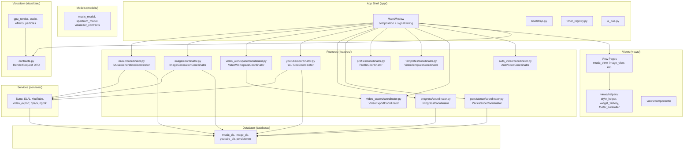

# Design Document: Enterprise Architecture Refactor

## Overview

This design transforms the MusicGenerator Python desktop application from a god-object-centric architecture into a modular, team-scalable enterprise structure. The refactoring decomposes `MainWindow` (~7,200 lines) into a thin composition shell backed by feature coordinators, relocates misplaced modules, enforces layer boundaries, applies dependency injection, and establishes automated import-lint enforcement — all without modifying runtime behavior.

The approach is strictly incremental: each change is a validated Refactor_Slice that preserves existing user-facing behavior. The design follows all governance documents in `python_app/docs/enterprise-architecture-audit/`.

### Key Design Decisions

| Decision | Choice | Rationale |
|----------|--------|-----------|
| Coordinator placement | `features/<feature>/coordinator.py` | Already established pattern (YouTube, Progress, Persistence) |
| Dependency injection style | Constructor parameters with Protocol interfaces | Enables unit testing without Qt, follows Python typing patterns |
| Timer registry location | Stays in `app/timer_registry.py` | Infrastructure concern — only timer **policy** moves to coordinators |
| Import-lint mechanism | pytest-based architecture test using AST scanning | Runs in CI, provides actionable error messages, zero external deps |
| Visualizer DTO location | `visualizer/contracts.py` | Co-located with consumer, importable by callers without circular deps |
| UI helpers target | `views/helpers/` subpackage | Follows ownership map: UI utilities belong in the views layer |
| Controller migration | Absorb into matching feature coordinators | One canonical orchestration home per coordinator conventions |

---

## Architecture

### Target Layer Diagram



### Dependency Flow (Approved Directions)

```
app/ ──→ features/, views/, models/
views/ ──→ models/, visualizer/ (render preview), views/helpers/
features/ ──→ services/, database/, models/, utils/
services/ ──→ database/, models/, utils/
database/ ──→ models/, utils/
visualizer/ ──→ models/ (narrow DTO), external rendering libs
models/ ──→ stdlib only
utils/ ──→ stdlib only
```

### Forbidden Import Directions

| From | Must NOT import | Rule |
|------|----------------|------|
| `views/` | `database/`, `services/` | A, B |
| `services/` | `views/`, `app/` | C, D |
| `database/` | `views/`, `app/` | E |
| `models/` | any internal package | F |
| `visualizer/` | `database/`, `services/`, `app/` | G |
| `features/X` | `features/Y` internals | H |
| `utils/` | any internal package | I |

---

## Components and Interfaces

### 1. Relocated UI Helpers — `views/helpers/`

```python
# views/helpers/__init__.py
from .style_helper import *
from .widget_factory import *
from .footer_controller import FooterController
```

Files moved:
- `app/style_helper.py` → `views/helpers/style_helper.py`
- `app/widget_factory.py` → `views/helpers/widget_factory.py`
- `app/footer_controller.py` → `views/helpers/footer_controller.py`

Internal cross-reference updated: `widget_factory.py` imports `style_helper` via relative `from . import style_helper`.

### 2. MusicGenerationCoordinator

```python
# features/music/coordinator.py

from __future__ import annotations
from typing import Protocol, Any

class MusicDbPort(Protocol):
    def list_songs(self, db_cfg: Any, **filters) -> list[dict]: ...
    def save_generation_batch(self, db_cfg: Any, batch: dict) -> dict: ...
    def update_song_status(self, db_cfg: Any, song_id: str, status: str) -> None: ...

class MusicServicePort(Protocol):
    def submit_to_suno(self, payload: dict) -> dict: ...
    def check_credits(self, api_key: str) -> dict: ...

class EventBusPort(Protocol):
    def emit_music_event(self, event: dict) -> None: ...

class MusicGenerationCoordinator:
    def __init__(
        self,
        db: MusicDbPort,
        service: MusicServicePort,
        bus: EventBusPort,
        settings_accessor: Callable[[], dict],
        db_cfg_accessor: Callable[[], Any],
    ) -> None: ...

    # Methods absorbed from controllers/music_controller.py:
    def prepare_suno_submission(self, song: dict, settings: dict, *, auto: bool) -> dict: ...
    def execute_suno_api_call(self, payload: dict) -> dict: ...
    def process_suno_result(self, payload: dict, task_id: str) -> dict: ...
    def submit_song_to_suno(self, song: dict, settings: dict, *, auto: bool) -> None: ...
    def generate_music_batch(self, request: dict) -> None: ...
    def validate_generation_inputs(self, settings: dict) -> dict: ...
    def create_generation_batch(self, settings: dict, request: dict) -> dict: ...
    def resolve_generation_inputs(self, song_index: int) -> dict: ...

    # Methods absorbed from MainWindow music domain:
    def on_generate_clicked(self) -> None: ...
    def handle_music_event(self, event: dict) -> None: ...
    def refresh_history(self) -> None: ...

    # Settings/profile methods staying from music_controller:
    def update_settings(self, patch: dict) -> dict: ...
    def persist_date_filters(self, source: str = "run") -> None: ...
    def create_profile(self, name: str) -> dict | None: ...
    def save_profile(self, profile_id: str, updates: dict) -> dict | None: ...
    def delete_profile(self, profile_id: str) -> bool: ...
    def load_profiles(self) -> dict: ...

    # Pool/saved-text management:
    def save_saved_text(self, kind: str, name: str, content: str, ...) -> tuple[dict, list[dict]]: ...
    def delete_saved_text(self, kind: str, removed_id: str) -> list[dict]: ...
    def generate_pool(self, kind: str, count: int) -> tuple[bool, str]: ...
    def import_pool(self, kind: str, file_path: str) -> tuple[bool, str]: ...
    def clear_pool(self, kind: str) -> tuple[bool, str]: ...
    def load_pool_data(self, *, kind: str, page: int, page_size: int) -> dict: ...
    def load_saved_texts(self, kind: str) -> dict: ...
```

### 3. ImageGenerationCoordinator

```python
# features/image/coordinator.py

from __future__ import annotations
from typing import Protocol, Any

class ImageDbPort(Protocol):
    def list_image_jobs(self, db_cfg: Any, **filters) -> list[dict]: ...
    def upsert_image_job(self, db_cfg: Any, job: dict) -> None: ...

class ImageServicePort(Protocol):
    def poll_generation_status(self, job_uids: list[str]) -> list[dict]: ...
    def submit_generation(self, request: dict) -> dict: ...

class ImageGenerationCoordinator:
    def __init__(
        self,
        db: ImageDbPort,
        service: ImageServicePort,
        bus: EventBusPort,
        settings_accessor: Callable[[], dict],
        db_cfg_accessor: Callable[[], Any],
    ) -> None: ...

    # Methods absorbed from controllers/image_controller.py:
    def trigger_image_poll(self, *, manual: bool = False, max_jobs: int = 8) -> None: ...
    def ensure_jobs_for_song(self, song: dict) -> None: ...
    def enqueue_manual(self, ...) -> None: ...
    def retry_job(self, job_uid: str) -> None: ...
    def retry_jobs(self, job_uids: list[str]) -> None: ...
    def enqueue_missing_thumbnails(self) -> dict: ...
    def enqueue_thumbnail_for_batch(self, batch_id: str, profile_id: str) -> dict: ...
    def process_poll_result(self, result: dict, *, manual: bool) -> dict: ...
    def list_jobs_for_ui(self, *, from_ymd: str = "", to_ymd: str = "", limit: int = 5000) -> list[dict]: ...
    def group_jobs_for_ui(self, ...) -> tuple[list[dict], bool]: ...
    def build_image_job_rows(self, grouped_rows: list[dict], ui_colors: dict) -> list[dict]: ...

    # Methods absorbed from MainWindow image domain:
    def on_generate_now_clicked(self) -> None: ...
    def on_generate_thumbnails_clicked(self) -> None: ...
    def refresh_jobs_table(self) -> list[dict]: ...
    def on_retry_failed(self) -> None: ...
```

### 4. VideoWorkspaceCoordinator

```python
# features/video_workspace/__init__.py
# features/video_workspace/coordinator.py

class VideoWorkspaceCoordinator:
    def __init__(
        self,
        template_coordinator: Any,
        export_coordinator: Any,
        bus: EventBusPort,
        settings_accessor: Callable[[], dict],
    ) -> None: ...

    def apply_template_to_state(self, template: dict) -> dict: ...
    def resolve_preview_config(self) -> dict: ...
    def prepare_export_handoff(self) -> dict: ...
    def update_resolution(self, width: int, height: int) -> None: ...
    def update_background(self, path: str) -> None: ...
    def update_logo(self, path: str) -> None: ...
```

### 5. SettingsCoordinator (Extension of PersistenceCoordinator)

The existing `PersistenceCoordinator` already owns settings persistence flows. Rather than creating a separate `SettingsCoordinator`, extend the existing coordinator with explicit settings-domain methods:

```python
# features/persistence/coordinator.py (extended)

class PersistenceCoordinator:
    # Existing methods preserved...
    
    # New settings-specific orchestration:
    def save_music_generation_settings(self, settings: dict) -> dict: ...
    def save_image_generation_settings(self, settings: dict) -> dict: ...
    def load_app_configuration(self) -> dict: ...
    def export_settings(self, path: str) -> None: ...
    def import_settings(self, path: str) -> dict: ...
```

### 6. Dependency Injection Protocol Interfaces

```python
# features/ports.py (shared protocol definitions)

from __future__ import annotations
from typing import Protocol, Any, Callable

class EventBusPort(Protocol):
    """Minimal event bus interface for coordinator use."""
    def emit(self, event_name: str, payload: dict) -> None: ...

class LoggerPort(Protocol):
    """Logging interface to decouple from app.logging."""
    def info(self, msg: str) -> None: ...
    def error(self, msg: str) -> None: ...
    def warning(self, msg: str) -> None: ...

class DbCfgAccessor(Protocol):
    """Callable that returns the current database configuration."""
    def __call__(self) -> Any: ...

class SettingsAccessor(Protocol):
    """Callable that returns current application settings dict."""
    def __call__(self) -> dict: ...
```

### 7. Import-Lint Architecture Test

```python
# tests/test_architecture.py

"""
Architecture enforcement test suite.
Scans all Python files and verifies import rules from dependency-rules.md.
"""
import ast
import sys
from pathlib import Path

PYTHON_APP = Path(__file__).parent.parent / "python_app"

FORBIDDEN_IMPORTS = {
    "views": {"database", "services"},
    "services": {"views", "app"},
    "database": {"views", "app"},
    "models": {"views", "app", "services", "database", "features", "controllers", "visualizer"},
    "visualizer": {"database", "services", "app"},
    "utils": {"views", "app", "services", "database", "features", "controllers", "visualizer", "models"},
}

def collect_imports(filepath: Path) -> list[str]:
    """Parse a Python file and return all imported module paths."""
    ...

def test_no_forbidden_imports():
    """For any package with rules, no file imports from a forbidden package."""
    violations = []
    for package, forbidden in FORBIDDEN_IMPORTS.items():
        package_dir = PYTHON_APP / package
        for py_file in package_dir.rglob("*.py"):
            imports = collect_imports(py_file)
            for imp in imports:
                top_package = imp.split(".")[0]
                if top_package in forbidden:
                    violations.append(f"Rule violation: {py_file} imports {imp} (forbidden: {package}→{top_package})")
    assert not violations, "\n".join(violations)

def test_no_cross_feature_internals():
    """features/X must not import features/Y internals."""
    ...
```

### 8. Visualizer DTO Contracts

```python
# visualizer/contracts.py

from __future__ import annotations
from dataclasses import dataclass, field
from typing import Any

@dataclass(frozen=True)
class RenderRequest:
    """DTO passed from app shell / coordinators into the visualizer."""
    audio_path: str
    output_path: str
    width: int
    height: int
    fps: int = 30
    template: dict = field(default_factory=dict)
    background_path: str = ""
    logo_path: str = ""
    duration_sec: float = 0.0

@dataclass(frozen=True)
class PreviewConfig:
    """DTO for configuring the live preview widget."""
    width: int
    height: int
    template: dict = field(default_factory=dict)
    background_path: str = ""
    logo_path: str = ""

@dataclass(frozen=True)
class RenderProgress:
    """DTO emitted by the visualizer during rendering."""
    frame: int
    total_frames: int
    percent: float
    elapsed_sec: float

@dataclass(frozen=True)
class RenderResult:
    """DTO returned when rendering completes."""
    success: bool
    output_path: str
    duration_sec: float
    error: str = ""
```

---

## Data Models

### Existing Models (unchanged)

- `models/music_model.py` — Song data normalization, app data shape
- `models/spectrum_model.py` — Spectrum configuration shapes

### New/Extended Models

#### `models/coordinator_types.py` — Shared coordinator types

```python
from __future__ import annotations
from dataclasses import dataclass
from typing import Any

@dataclass(frozen=True)
class GenerationRequest:
    """Canonical music generation request shape."""
    songs: list[dict]
    settings: dict
    batch_mode: str  # "single" | "batch" | "auto"
    profile_id: str = ""

@dataclass(frozen=True)
class ImageJobRequest:
    """Canonical image generation job request."""
    batch_id: str
    profile_id: str
    role: str  # "background" | "thumbnail"
    prompt: str
    provider: str  # "slai" | "openai"
    dimensions: tuple[int, int] = (1920, 1080)

@dataclass(frozen=True)
class PollResult:
    """Result from an image generation poll."""
    job_uid: str
    status: str  # "pending" | "running" | "done" | "failed"
    image_url: str = ""
    error: str = ""
```

#### `visualizer/contracts.py` — (See Components section above)

### Migration Path for Controller State

The `MusicController` currently holds state via `self.host` reference:
- `self.host.db_cfg` → injected `db_cfg_accessor()`
- `self.host.e_settings` → injected `settings_accessor()`
- `self.host.music_data` → coordinator owns its own data reference
- `self.host._log(...)` → injected `logger: LoggerPort`

The `ImageController` similarly:
- `self.host.db_cfg` → injected `db_cfg_accessor()`
- `self.host.e_settings` → injected `settings_accessor()`
- `self.host._image_poll_worker_active` → coordinator-owned state

---

## Correctness Properties

*A property is a characteristic or behavior that should hold true across all valid executions of a system — essentially, a formal statement about what the system should do. Properties serve as the bridge between human-readable specifications and machine-verifiable correctness guarantees.*

### Property 1: Dependency Rule Compliance

*For any* Python source file in the project, the set of its imported top-level packages must comply with the dependency rules matrix — specifically, no file in `views/` imports `database/` or `services/`, no file in `services/` imports `views/` or `app/`, no file in `database/` imports `views/` or `app/`, no file in `models/` imports any internal package, no file in `visualizer/` imports `database/`, `services/`, or `app/`, and no `features/X` file imports `features/Y` internals.

**Validates: Requirements 8.1, 8.2, 8.3, 8.4, 8.5, 8.6, 12.2**

### Property 2: Import Path Migration Completeness

*For any* Python source file in the project, it should contain zero import references to the old paths `app.style_helper`, `app.widget_factory`, `app.footer_controller`, `controllers.music_controller`, or `controllers.image_controller`.

**Validates: Requirements 1.3, 2.5**

### Property 3: Coordinator Independence from MainWindow

*For any* Feature_Coordinator class in `features/`, its source code should contain zero references to `self.host`, zero `MainWindow` type annotations on instance attributes, and should be instantiable with mock dependencies without requiring a `QApplication` instance.

**Validates: Requirements 6.2, 6.3, 6.5**

### Property 4: Thin Delegator Constraint

*For any* method in `MainWindow` that delegates to a Feature_Coordinator, its body (excluding comments and blank lines) should contain at most 3 executable statements.

**Validates: Requirements 3.2**

### Property 5: Import Hygiene in MainWindow

*For any* import statement in `main_window.py`, it should be declared at module level (not inside a function/method body), should appear exactly once (no duplicates), and should follow PEP 8 ordering (stdlib, third-party, local, separated by blank lines).

**Validates: Requirements 10.1, 10.2, 10.4**

### Property 6: Type Annotation Coverage

*For any* public or protected method in feature coordinators, services, database, and models modules, it should have type annotations on all parameters and the return type.

**Validates: Requirements 11.1, 11.2**

### Property 7: Public API Signature Preservation

*For any* public function in the relocated UI helper modules (`style_helper`, `widget_factory`, `footer_controller`), its function signature (parameter names, parameter order, default values) should be identical before and after relocation.

**Validates: Requirements 1.5**

### Property 8: Compilation Validity

*For any* `.py` file in the `python_app/` directory tree, running `python -m py_compile` should succeed without errors.

**Validates: Requirements 7.5**

---

## Error Handling

### Refactor-Induced Errors

| Error Scenario | Handling Strategy |
|---------------|-------------------|
| ImportError after module relocation | Architecture test catches immediately; CI blocks merge |
| NameError from removed variable (Req 9) | Explicit fix: define `removed` before use in `_delete_music_saved_text` |
| AttributeError from coordinator missing method | Thin delegator in MainWindow raises clear error if coordinator method is None |
| Circular import from DI wiring | Use `TYPE_CHECKING` guards and lazy imports at construction time |
| Coordinator receives None for required dependency | Validate at construction time, raise `ValueError` with descriptive message |

### Coordinator Error Handling Convention

```python
class MusicGenerationCoordinator:
    def __init__(self, db: MusicDbPort, ...):
        if db is None:
            raise ValueError("MusicGenerationCoordinator requires a non-None db dependency")
        self._db = db
        ...

    def submit_song_to_suno(self, song: dict, settings: dict, *, auto: bool) -> None:
        try:
            payload = self.prepare_suno_submission(song, settings, auto=auto)
            result = self._service.submit_to_suno(payload)
            self._bus.emit("music_event", {"type": "submitted", "result": result})
        except Exception as exc:
            self._logger.error(f"Suno submission failed: {exc}")
            self._bus.emit("music_event", {"type": "error", "error": str(exc)})
```

### Bug Fix: `_delete_music_saved_text` (Requirement 9)

```python
# Before (buggy):
def _delete_music_saved_text(self, kind: str, removed_id: str):
    # ... some logic ...
    if condition:
        removed = self.music_controller.delete_saved_text(kind, removed_id)
    # BUG: 'removed' used below without being defined in the else path
    self._refresh_saved_texts(kind, removed)

# After (fixed):
def _delete_music_saved_text(self, kind: str, removed_id: str):
    removed = []  # Define before use
    # ... some logic ...
    if condition:
        removed = self.music_controller.delete_saved_text(kind, removed_id)
    self._refresh_saved_texts(kind, removed)
```

---

## Testing Strategy

### Dual Testing Approach

This refactoring benefits from property-based testing for structural/architectural invariants and example-based tests for behavioral verification.

**Property-Based Tests** (architecture enforcement):
- Import rule compliance across all source files
- Coordinator independence verification
- Thin delegator body-length constraint
- Type annotation coverage scanning
- Import hygiene in MainWindow

**Example-Based Unit Tests** (behavioral correctness):
- Each coordinator method produces identical results to the original controller method
- Bug fix for `_delete_music_saved_text` covers both paths
- Visualizer DTO serialization/deserialization
- Footer controller composition rules

**Integration Tests** (smoke/end-to-end):
- App launches without import errors after relocation
- `python -m py_compile` passes on all files
- `mypy --ignore-missing-imports` passes on annotated modules
- Coordinator can be instantiated with mock dependencies

### Property-Based Testing Configuration

- Library: **Hypothesis** (standard Python PBT library)
- Minimum iterations: 100 per property test
- Each test tagged with: `Feature: enterprise-architecture-refactor, Property {N}: {text}`

### Test File Structure

```
tests/
├── test_architecture.py          # Property tests: import rules, dependency compliance
├── test_coordinator_independence.py  # Property tests: no host refs, mock-instantiable
├── test_import_migration.py      # Property tests: old paths gone
├── test_delegator_thickness.py   # Property tests: MainWindow delegators ≤3 lines
├── test_type_annotations.py      # Property tests: annotation coverage
├── test_music_coordinator.py     # Unit tests: behavioral equivalence
├── test_image_coordinator.py     # Unit tests: behavioral equivalence
├── test_footer_controller.py     # Unit tests: composition rules
├── test_visualizer_contracts.py  # Unit tests: DTO round-trip
└── test_compile_all.py           # Smoke: py_compile on all files
```

### Validation Per Refactor Slice

Each slice must pass before the next begins:
1. `python -m py_compile` on all changed files
2. Architecture test suite (`test_architecture.py`) — no new violations
3. App launches without errors (manual smoke test)
4. Feature-specific actions still work (manual verification per extraction domain)

### Migration Sequence

The refactoring follows a strict ordering aligned with the extraction map:

1. **Phase 1 — Bug fix** (Req 9): Fix `removed` variable in separate slice
2. **Phase 2 — Relocate UI helpers** (Req 1): Move to `views/helpers/`, update imports
3. **Phase 3 — Create coordinator skeletons** (Req 4, 6): Add DI-ready coordinator classes
4. **Phase 4 — Migrate controllers** (Req 2): Absorb `music_controller` and `image_controller`
5. **Phase 5 — Extract MainWindow music domain** (Req 3, 4): Move orchestration to MusicGenerationCoordinator
6. **Phase 6 — Extract MainWindow image domain** (Req 3, 4): Move orchestration to ImageGenerationCoordinator
7. **Phase 7 — Transfer timer policy** (Req 5): Move timer start/stop decisions to coordinators
8. **Phase 8 — Remove self.host pattern** (Req 6): Replace with injected protocols on existing coordinators
9. **Phase 9 — Consolidate imports** (Req 10): Clean up MainWindow imports
10. **Phase 10 — Add type annotations** (Req 11): Annotate public/protected methods
11. **Phase 11 — Harden visualizer boundary** (Req 12): Add DTO contracts
12. **Phase 12 — Enable import-lint enforcement** (Req 8): Add architecture test to CI
