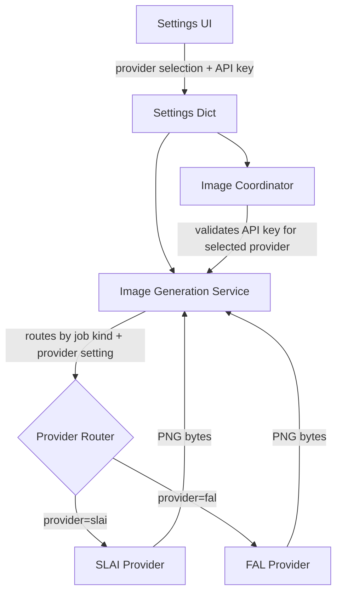
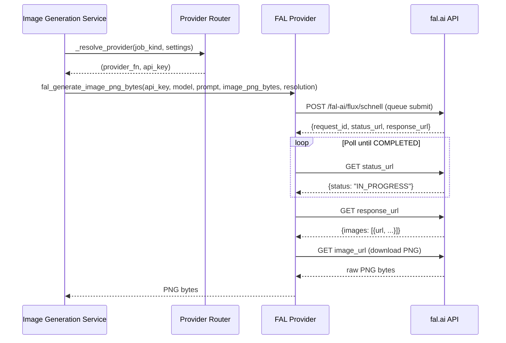

# Design Document: FAL Image Provider

## Overview

This design adds FAL (fal.ai Flux Schnell) as an additional image generation provider alongside the existing SLAI provider. The architecture follows a strategy pattern where the image generation service routes requests to the appropriate provider based on user-configured settings, independently for background and thumbnail image jobs.

The design preserves backward compatibility — SLAI remains the default provider, and existing workflows are unaffected unless the user explicitly selects FAL. The FAL provider module mirrors the SLAI provider's function signature, enabling seamless provider swapping without changes to coordination or job processing logic.

## Architecture

### High-Level Design



### Low-Level Design — Provider Routing Flow



### Design Decisions

1. **Strategy pattern via function reference** — Rather than introducing an abstract base class or protocol for providers, we keep the existing pattern: each provider is a standalone function with an identical signature. The routing layer selects which function to call. This minimizes changes and matches the project's existing style.

2. **Independent provider per job kind** — Background and thumbnail generation use separate provider settings (`imageBackgroundProvider` / `imageThumbnailProvider`). This allows users to mix providers (e.g., FAL for backgrounds, SLAI for thumbnails) without coupling them.

3. **Queue-based async with polling** — The FAL Flux Schnell API uses a queue submission model. The provider submits a request, polls for completion, then downloads the result. This is encapsulated entirely within the `fal_generate_image_png_bytes` function, keeping the same synchronous-return contract as the SLAI provider.

4. **No base image support in FAL** — FAL Flux Schnell is a text-to-image model and does not accept a base image input. The `image_png_bytes` parameter is accepted for signature compatibility but not sent to the API. If future FAL models support image-to-image, this can be extended.

## Components and Interfaces

### New File: `python_app/services/image_provider_fal.py`

```python
def fal_generate_image_png_bytes(
    *,
    api_key: str,
    model: str,
    prompt: str,
    image_png_bytes: bytes,
    resolution: str,
    timeout_sec: int = 120,
) -> bytes:
    """Generate an image using the FAL Flux Schnell API.

    Args:
        api_key: FAL API key for authentication.
        model: Model identifier (reserved for future use; currently uses flux/schnell).
        prompt: Text prompt describing the desired image.
        image_png_bytes: Base image PNG bytes (accepted for signature compatibility;
                         not used by Flux Schnell text-to-image model).
        resolution: Target resolution string (e.g. "1920x1080", "1080x1920").
        timeout_sec: Maximum time to wait for generation (default 120s).

    Returns:
        Raw PNG image bytes.

    Raises:
        RuntimeError: If API key is missing, API returns error, or request times out.
    """
```

### Modified File: `python_app/services/image_generation.py`

New internal helper:

```python
def _resolve_provider(
    kind: str,
    settings: dict,
) -> tuple[Callable[..., bytes], str]:
    """Resolve the provider function and API key for a given job kind.

    Args:
        kind: Job kind — "background" or "thumbnail".
        settings: Current application settings dict.

    Returns:
        Tuple of (provider_function, api_key).

    Raises:
        RuntimeError: If the API key for the selected provider is missing.
    """
```

### Modified File: `python_app/features/image/coordinator.py`

Updated methods:
- `trigger_image_poll()` — Check the API key for the background provider (not hardcoded to SLAI).
- `sync_auto_poll_timer()` — Check the API key for the background provider.

### Modified File: `python_app/models/music_model.py`

New entries in `DEFAULT_SETTINGS`:
```python
"falImgApiKey": "",
"imageBackgroundProvider": "slai",
"imageThumbnailProvider": "slai",
```

### Modified File: `python_app/features/music/settings.py`

Updated `extract_music_settings()` to include:
```python
"falImgApiKey": self._w("music_settings_fal_img_key"),
"imageBackgroundProvider": self._w("music_settings_image_bg_provider", "slai"),
"imageThumbnailProvider": self._w("music_settings_image_thumb_provider", "slai"),
```

Updated `populate_suno_settings_ui()` to populate:
- FAL API key field
- Background provider dropdown
- Thumbnail provider dropdown

### Modified File: `python_app/app/music_ui_handlers.py`

New UI widgets created in the settings panel:
- `music_settings_fal_img_key` — QLineEdit with password echo mode
- `music_settings_image_bg_provider` — QComboBox with items: ("SLAI", "slai"), ("FAL", "fal")
- `music_settings_image_thumb_provider` — QComboBox with items: ("SLAI", "slai"), ("FAL", "fal")

## Data Models

### Settings Keys (additions to DEFAULT_SETTINGS)

| Key | Type | Default | Description |
|-----|------|---------|-------------|
| `falImgApiKey` | `str` | `""` | FAL API key for authentication |
| `imageBackgroundProvider` | `str` | `"slai"` | Provider for background image generation ("slai" or "fal") |
| `imageThumbnailProvider` | `str` | `"slai"` | Provider for thumbnail image generation ("slai" or "fal") |

### FAL API Request Model

```python
# Queue submission payload (POST to https://queue.fal.run/fal-ai/flux/schnell)
{
    "prompt": str,                    # Text prompt
    "image_size": {                   # Target dimensions
        "width": int,
        "height": int,
    },
    "num_inference_steps": 4,         # Fixed for Schnell
    "output_format": "png",
    "num_images": 1,
}
```

### FAL API Response Models

```python
# Queue submission response
{
    "request_id": str,
    "response_url": str,              # URL to fetch result when done
    "status_url": str,                # URL to poll status
}

# Status response
{
    "status": "IN_QUEUE" | "IN_PROGRESS" | "COMPLETED",
}

# Result response
{
    "images": [
        {
            "url": str,               # URL to download generated image
            "width": int,
            "height": int,
            "content_type": str,
        }
    ],
    "seed": int,
    "prompt": str,
}
```

## Correctness Properties

*A property is a characteristic or behavior that should hold true across all valid executions of a system — essentially, a formal statement about what the system should do. Properties serve as the bridge between human-readable specifications and machine-verifiable correctness guarantees.*

### Property 1: Settings persistence round-trip

*For any* valid settings key in {`falImgApiKey`, `imageBackgroundProvider`, `imageThumbnailProvider`} and any valid value for that key, storing the value via the settings accessor and reading it back should return the identical value.

**Validates: Requirements 1.2, 1.3, 2.2, 3.2**

### Property 2: Provider routing correctness

*For any* image job with kind ∈ {"background", "thumbnail"} and any provider setting ∈ {"slai", "fal"}, the image generation service shall call the provider function corresponding to the provider setting for that job kind — specifically, `slai_generate_image_png_bytes` when the setting is "slai" and `fal_generate_image_png_bytes` when the setting is "fal".

**Validates: Requirements 2.4, 3.4, 5.1, 5.2**

### Property 3: API key selection by provider

*For any* provider selection ∈ {"slai", "fal"} and any job kind, the image generation service shall pass the API key from `slaiImgApiKey` when provider is "slai" and from `falImgApiKey` when provider is "fal" to the selected provider function.

**Validates: Requirements 5.3, 5.4**

### Property 4: FAL provider returns valid PNG on success

*For any* valid FAL API response containing an image URL that resolves to PNG data, the `fal_generate_image_png_bytes` function shall return bytes that constitute a valid PNG image (starts with PNG magic bytes and passes image verification).

**Validates: Requirements 4.3**

### Property 5: Missing API key raises descriptive error

*For any* provider selection ∈ {"slai", "fal"} where the corresponding API key setting is empty or whitespace-only, both the provider function and the image generation service shall raise a RuntimeError whose message identifies the provider whose key is missing.

**Validates: Requirements 4.4, 5.5**

### Property 6: FAL error response propagation

*For any* HTTP error status code ∈ {400..599} returned by the FAL API with any error body text, the `fal_generate_image_png_bytes` function shall raise a RuntimeError whose message contains both the HTTP status code and details from the error body.

**Validates: Requirements 4.5**

### Property 7: Coordinator availability reflects selected provider's key

*For any* background provider setting ∈ {"slai", "fal"} and any combination of API key values (present or empty), the image coordinator shall consider image generation available if and only if the API key for the currently selected background provider is non-empty.

**Validates: Requirements 6.1, 6.2, 6.3**

## Error Handling

### FAL Provider Errors

| Condition | Behavior |
|-----------|----------|
| API key empty/whitespace | Raise `RuntimeError("FAL IMG API key is not configured")` |
| Empty prompt | Raise `RuntimeError("Prompt is empty")` |
| HTTP 4xx/5xx from FAL | Raise `RuntimeError` with status code and error details |
| Request timeout | Raise `RuntimeError("FAL image generation timed out after {timeout_sec}s")` |
| Polling timeout (status never reaches COMPLETED) | Raise `RuntimeError` indicating polling timeout |
| Result has no images | Raise `RuntimeError` indicating no images in response |
| Downloaded image is not valid PNG | Raise `RuntimeError` indicating invalid image data |

### Image Generation Service Errors

| Condition | Behavior |
|-----------|----------|
| Selected provider key missing | Raise `RuntimeError("Image generation unavailable: {PROVIDER} IMG API key is missing")` |
| Unknown provider value | Fall back to SLAI (defensive default) |

### Coordinator Error Messages

| Condition | Status Message |
|-----------|---------------|
| Manual poll, provider key missing | `"Image generation unavailable: {PROVIDER} IMG API key is missing"` |
| Auto-poll, provider key missing | Timer stops (no user-visible error) |

### Retry Behavior

The FAL provider implements retry logic consistent with the SLAI provider:
- Queue submission: retry on 5xx status codes, up to 2 attempts
- Status polling: retry on transient network errors, respect timeout_sec budget
- Image download: retry on 5xx, up to 3 attempts with exponential backoff

## Testing Strategy

### Property-Based Tests (using Hypothesis)

Each correctness property maps to a property-based test with minimum 100 iterations:

- **Property 1**: Generate random string values for each settings key, store via settings accessor, read back, assert equality.
- **Property 2**: Generate random (job_kind, provider_setting) pairs, mock both provider functions, run routing, assert correct function called.
- **Property 3**: Generate random (provider, fal_key, slai_key) tuples, mock providers, run routing, assert correct key passed.
- **Property 4**: Generate random valid PNG bytes, mock HTTP responses to return them, call FAL provider, assert returned bytes are valid PNG.
- **Property 5**: Generate random (provider, empty_key_variant) pairs (empty string, whitespace, None-like), assert RuntimeError with provider name.
- **Property 6**: Generate random (status_code ∈ 400..599, error_body_text), mock FAL HTTP to return error, assert RuntimeError contains status and body text.
- **Property 7**: Generate random (provider, key_present_bool) combinations, verify coordinator availability matches expected logic.

Configuration:
- Library: `hypothesis` (already in use per `.hypothesis/` directory in project)
- Minimum iterations: 100 per property (`@settings(max_examples=100)`)
- Tag format: `# Feature: fal-image-provider, Property {N}: {title}`

### Unit Tests (example-based)

- UI widget existence and configuration (Requirements 1.1, 1.4, 2.1, 3.1)
- Default settings values (Requirements 7.1, 7.2, 7.3)
- Timeout handling edge case (Requirement 4.6)
- Empty/missing provider setting defaults to "slai" (Requirements 2.3, 3.3)
- Function signature compatibility check (Requirement 4.1)

### Integration Tests

- FAL API endpoint call with mocked HTTP (Requirement 4.2)
- Full image job execution with FAL provider (mocked HTTP) end-to-end
- Coordinator → Service → Provider chain with real settings dict
