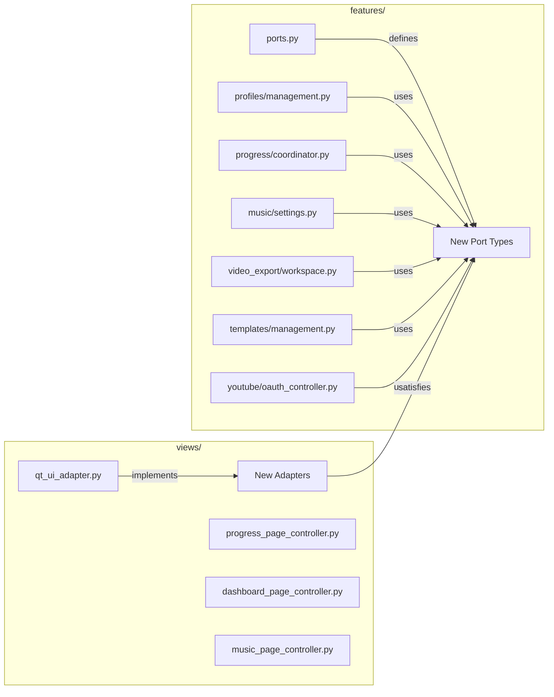

# Design Document: Features PyQt6 Decoupling

## Overview

This design covers the complete removal of PyQt6 imports from the `features/` layer. The project already has a working pattern (established by `features/youtube/coordinator.py`) using injected callables and protocols defined in `features/ports.py` with concrete adapters in `views/helpers/qt_ui_adapter.py`. This spec extends that pattern to the remaining 9 files on the architecture test allowlist.

Two strategies apply:
1. **Relocate** — Three page controllers (`progress_page_controller.py`, `dashboard_page_controller.py`, `music_page_controller.py`) are view-layer code that already use `widget_accessors` patterns. They belong in `views/` and are simply moved there.
2. **Inject** — Six coordinator/management modules contain business logic mixed with Qt widget calls. These are refactored to accept injected callables via constructor parameters or new Port types, keeping the files in `features/`.

After completion, all `PyQt6` entries are removed from `_FORBIDDEN_IMPORT_ALLOWLIST` and the architecture test fully enforces the boundary.

## Architecture



### Relocation Strategy (Page Controllers)

The three page controllers already follow the `widget_accessors` dependency injection pattern and do NOT hold `MainWindow` references. They are view-layer code that ended up in `features/` during early extraction. The fix is a file move:

| Source | Destination |
|--------|-------------|
| `features/progress/progress_page_controller.py` | `views/progress_page_controller.py` |
| `features/progress/dashboard_page_controller.py` | `views/dashboard_page_controller.py` |
| `features/music/music_page_controller.py` | `views/music_page_controller.py` |

All import sites are updated to point to the new paths.

### Injection Strategy (Coordinators/Management)

Each remaining file gets its PyQt6 usages replaced with injected callables:

| File | PyQt6 Usages | Replacement Pattern |
|------|-------------|---------------------|
| `profiles/management.py` | `QListWidgetItem`, `Qt.CheckState`, `QDate`, `QMessageBox` | `list_populate_fn`, `checkbox_read_fn`, `datetime`, `confirm_question_fn` |
| `progress/coordinator.py` | `QTableWidgetItem`, `Qt`, `QMessageBox`, `QTimer`, `QApplication` | `table_item_factory`, `confirm_question_fn`, `process_events_fn`, `TimerFactory` |
| `music/settings.py` | `QTableWidgetItem`, `Qt` | `table_item_factory` |
| `video_export/workspace.py` | `QFileDialog`, `Qt` | `file_dialog_fn`, `dir_dialog_fn`, `list_items_fn` |
| `templates/management.py` | `QMessageBox` | `confirm_question_fn` |
| `youtube/oauth_controller.py` | `QTableWidgetItem`, `Qt`, `QMessageBox` | `table_item_factory`, `warning_fn` |

## Components and Interfaces

### New Port Types in `features/ports.py`

```python
from typing import Callable, Protocol

# Confirmation dialog that returns True if user clicks Yes
ConfirmQuestionFn = Callable[[str, str], bool]

# Warning dialog (informational, no return value needed)
WarningFn = Callable[[str, str], None]

# File open dialog: (parent_title, filter) -> path or ""
FileDialogFn = Callable[[str, str], str]

# Directory selection dialog: (title, default_dir) -> path or ""
DirDialogFn = Callable[[str, str], str]

# Populates a table widget with rows of string cells.
# Each row is a list of (column_index, text, data_role_value) tuples.
TablePopulateFn = Callable[[list[list[tuple[int, str, str]]]], None]

# Returns items from a list widget as list of (display_text, user_role_data) tuples.
ListItemsFn = Callable[[], list[tuple[str, str]]]

# Populates a list widget with (display_text, user_role_data) items.
ListPopulateFn = Callable[[list[tuple[str, str]]], None]

# Reads selected items from a list widget as list of user_role_data strings.
ListSelectedItemsFn = Callable[[], list[str]]

# Process pending UI events (replacement for QApplication.processEvents)
ProcessEventsFn = Callable[[], None]
```

### New Adapters in `views/helpers/qt_ui_adapter.py`

Each new Port type gets a corresponding adapter factory:

- `make_confirm_question_fn(parent)` → wraps `QMessageBox.question` returning `bool`
- `make_warning_fn(parent)` → wraps `QMessageBox.warning` (fire-and-forget)
- `make_file_dialog_fn(parent)` → wraps `QFileDialog.getOpenFileName`
- `make_dir_dialog_fn(parent)` → wraps `QFileDialog.getExistingDirectory`
- `make_table_populate_fn(table_widget)` → wraps QTableWidgetItem creation
- `make_list_items_fn(list_widget)` → reads items from QListWidget
- `make_list_populate_fn(list_widget)` → populates QListWidget with items
- `make_process_events_fn()` → wraps `QApplication.processEvents`

### Refactoring Per Module

#### `features/profiles/management.py`

Current PyQt6 usages:
- `QListWidgetItem` + `Qt.ItemDataRole.UserRole` in `refresh_list()` — replaced with `list_populate_fn` injected callable
- `Qt.CheckState` in `_refresh_profile_image_random()` and `save_profile_details()` — replaced with reading/writing Python `bool` values via widget accessor callables
- `QDate` in `_refresh_profile_youtube_publish_date()` — replaced with Python `datetime.date` and a `set_date_fn` callable
- `QMessageBox` in `save_profile_details()`, `create_profile()`, `delete_profile()` — replaced with `ConfirmQuestionFn` and `WarningFn`

New constructor parameters:
```python
@dataclass(slots=True)
class MusicProfileManagementCoordinator:
    host: "ProfileHostPort"  # narrowed Protocol, no MainWindow
    confirm_question_fn: ConfirmQuestionFn
    warning_fn: WarningFn
```

The `host` type narrows from `MainWindow` to a `ProfileHostPort` Protocol that exposes only the widget-accessor callables needed.

#### `features/progress/coordinator.py`

Current PyQt6 usages:
- `QTableWidgetItem` + `Qt.ItemDataRole.UserRole` + `Qt.AlignmentFlag` in `apply_rows()`, `mark_visible_rows_cancelling()` — replaced with `table_populate_fn`
- `QMessageBox` in `cancel_row()`, other action methods — replaced with `confirm_question_fn` / `warning_fn`
- `QTimer` — already has `TimerFactory` port; ensure all timer usage goes through it
- `QApplication` — not directly used in remaining code (already delegated via `bus.ui_invoke`)

New constructor parameters:
```python
class ProgressCoordinator:
    def __init__(self, *, host, ..., 
                 confirm_question_fn: ConfirmQuestionFn,
                 warning_fn: WarningFn,
                 table_populate_fn: TablePopulateFn | None = None):
```

#### `features/music/settings.py`

Current PyQt6 usages:
- `QTableWidgetItem` + `Qt.ItemDataRole.UserRole` in `refresh_music_pool_table()` — replaced with `table_populate_fn`

New constructor parameter:
```python
class MusicSettingsCoordinator:
    def __init__(self, host, *, table_populate_fn: TablePopulateFn | None = None):
```

#### `features/video_export/workspace.py`

Current PyQt6 usages (all inline imports):
- `QFileDialog.getOpenFileName` in `pick_ffmpeg()` — replaced with `file_dialog_fn`
- `QFileDialog.getExistingDirectory` in `prompt_output_dir_for_export()` — replaced with `dir_dialog_fn`
- `Qt.ItemDataRole.UserRole` in `iter_mp3_paths()`, `current_selected_mp3_path()` — replaced with `list_items_fn`

New constructor parameters:
```python
class VideoWorkspaceStateCoordinator:
    def __init__(self, *, host, ...,
                 file_dialog_fn: FileDialogFn | None = None,
                 dir_dialog_fn: DirDialogFn | None = None,
                 list_items_fn: ListItemsFn | None = None):
```

#### `features/templates/management.py`

Current PyQt6 usages:
- `QMessageBox` in `delete_current_template()` — replaced with `confirm_question_fn`

New constructor parameter:
```python
@dataclass(slots=True)
class TemplateManagementCoordinator:
    host: "TemplateHostPort"
    confirm_question_fn: ConfirmQuestionFn | None = None
```

#### `features/youtube/oauth_controller.py`

Current PyQt6 usages:
- `QTableWidgetItem` + `Qt.ItemDataRole.UserRole` in `refresh_youtube_oauth_apps_table()` — replaced with `table_populate_fn`
- `QMessageBox.warning` / `QMessageBox.question` in CRUD methods — replaced with `warning_fn` / `confirm_question_fn`

New constructor parameters:
```python
class YouTubeOAuthController:
    def __init__(self, *, ...,
                 warning_fn: WarningFn | None = None,
                 confirm_question_fn: ConfirmQuestionFn | None = None,
                 table_populate_fn: TablePopulateFn | None = None):
```

## Data Models

### Port Type Signatures

| Port Name | Signature | Purpose |
|-----------|-----------|---------|
| `ConfirmQuestionFn` | `(title: str, message: str) -> bool` | Yes/No confirmation returning user choice |
| `WarningFn` | `(title: str, message: str) -> None` | Information/warning dialog |
| `FileDialogFn` | `(title: str, filter: str) -> str` | File selection, returns path or `""` |
| `DirDialogFn` | `(title: str, default_dir: str) -> str` | Directory selection, returns path or `""` |
| `TablePopulateFn` | `(rows: list[list[tuple[int, str, str]]]) -> None` | Populates table widget rows |
| `ListItemsFn` | `() -> list[tuple[str, str]]` | Reads (text, data) pairs from list widget |
| `ListPopulateFn` | `(items: list[tuple[str, str]]) -> None` | Populates list widget |
| `ListSelectedItemsFn` | `() -> list[str]` | Reads selected item data from list widget |
| `ProcessEventsFn` | `() -> None` | Processes pending event loop events |

### Existing Ports (Already Defined)

| Port Name | Signature | Status |
|-----------|-----------|--------|
| `ConfirmFn` | `(title: str, message: str) -> None` | Existing — warning-only, no return |
| `InputFn` | `(title, label, items, current) -> (str, bool)` | Existing |
| `TimerFactory` | `(interval_ms, callback) -> TimerHandle` | Existing |
| `TimerHandle` | Protocol with `start/stop/is_active` | Existing |

Note: The existing `ConfirmFn` is a fire-and-forget warning. The new `ConfirmQuestionFn` returns `bool` for yes/no dialogs. Both are needed.


## Correctness Properties

*A property is a characteristic or behavior that should hold true across all valid executions of a system — essentially, a formal statement about what the system should do. Properties serve as the bridge between human-readable specifications and machine-verifiable correctness guarantees.*


### Property 1: Architecture enforcement detects PyQt6 imports in features/

*For any* Python file under `features/` that contains a `PyQt6` import statement (and is not on the allowlist), the `test_no_forbidden_imports` architecture test SHALL report a violation and fail.

**Validates: Requirements 9.2, 9.3**

### Property 2: Public method signatures are preserved after refactoring

*For any* refactored coordinator or management class, the set of public method names and their required positional/keyword parameter names SHALL be identical to (or a superset of) the original class's public API. New parameters must be optional (with defaults).

**Validates: Requirements 1.4, 10.1**

### Property 3: Coordinator delegation to injected callables

*For any* coordinator method that previously constructed Qt widgets or showed Qt dialogs, calling that method on the refactored coordinator SHALL invoke the corresponding injected callable with arguments equivalent to what the original Qt API received — and SHALL NOT import or reference any PyQt6 module.

**Validates: Requirements 2.2, 2.3, 3.2, 3.3, 4.2, 5.2, 6.2, 7.2, 7.3**

### Property 4: List/table data round-trip fidelity

*For any* list of items provided through a `ListItemsFn` or `TablePopulateFn` callable, the coordinator SHALL receive and process the exact same data values as would have been available through direct `Qt.ItemDataRole.UserRole` access on the original widget items.

**Validates: Requirements 5.3, 7.4**

## Error Handling

### Graceful Degradation with None Callables

All injected callables accept `None` as a valid value (Optional type). When a callable is `None`:
- Dialog callables (`confirm_question_fn`, `warning_fn`) → method skips the dialog interaction and uses a safe default (e.g., `False` for confirmation = don't proceed)
- Table/list callables (`table_populate_fn`, `list_items_fn`) → method returns empty data or is a no-op
- File dialog callables (`file_dialog_fn`, `dir_dialog_fn`) → method returns `""` (no selection)

This ensures coordinators remain constructable for unit testing without providing all adapters.

### RuntimeError from Deleted Widgets

The Qt adapter implementations in `qt_ui_adapter.py` wrap all widget calls in try/except for `RuntimeError` (which Qt raises when a C++ widget has been garbage collected but the Python wrapper still exists). Adapters catch this and return safe defaults.

### Migration Safety

During the incremental migration, modules that have been partially refactored can still function:
- The allowlist entries are only removed AFTER the corresponding module passes the architecture test
- Each module is refactored independently; a failure in one does not block others

## Testing Strategy

### Unit Tests (Example-Based)

- **Port existence tests**: Verify each new type alias exists in `features/ports.py` with correct signature
- **Adapter factory tests**: Verify each adapter factory in `qt_ui_adapter.py` returns a callable with the expected behavior (using mock Qt widgets)
- **Checkbox/date conversion tests**: Verify `Qt.CheckState` → `bool` and `QDate` → `datetime.date` conversions produce correct values
- **Import update tests**: After relocation, verify no file imports from old `features/` paths

### Integration Tests

- **Architecture test** (`test_architecture.py`): The existing test is the primary integration verification. After each module is refactored, its allowlist entry is removed and the test is re-run.
- **Behavioral equivalence**: For each refactored coordinator, an integration test with mock callables verifies the same sequence of side effects occurs as the original implementation.

### Property-Based Tests

Property-based testing applies to a limited subset of this spec:

- **Property 1** (Architecture enforcement): Already implemented by the existing `test_no_forbidden_imports` which scans ALL Python files. This is effectively a property test — "for all files in features/, no PyQt6 import exists."
- **Property 2** (Signature preservation): Generate random subsets of public methods and verify they exist with correct signatures on the refactored class.
- **Property 4** (Data round-trip): For any list of `(str, str)` tuples provided via `ListItemsFn`, the coordinator should return exactly the second element of each tuple as path data.

**PBT Library**: `hypothesis` (already in use — `.hypothesis/` directory exists in the project root)

**Configuration**: Minimum 100 iterations per property test.

**Tag format**: `Feature: features-pyqt6-decoupling, Property {N}: {title}`

### Test Execution Order

1. Refactor a module (remove PyQt6 imports, inject callables)
2. Run module-specific unit tests
3. Remove the module's allowlist entry
4. Run `test_architecture.py` to verify enforcement
5. Run full test suite to verify no regressions
