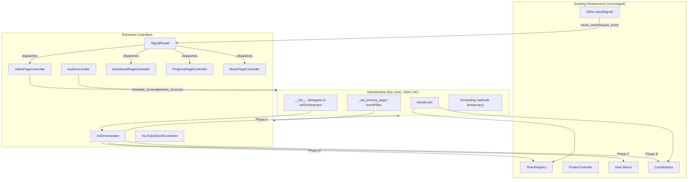
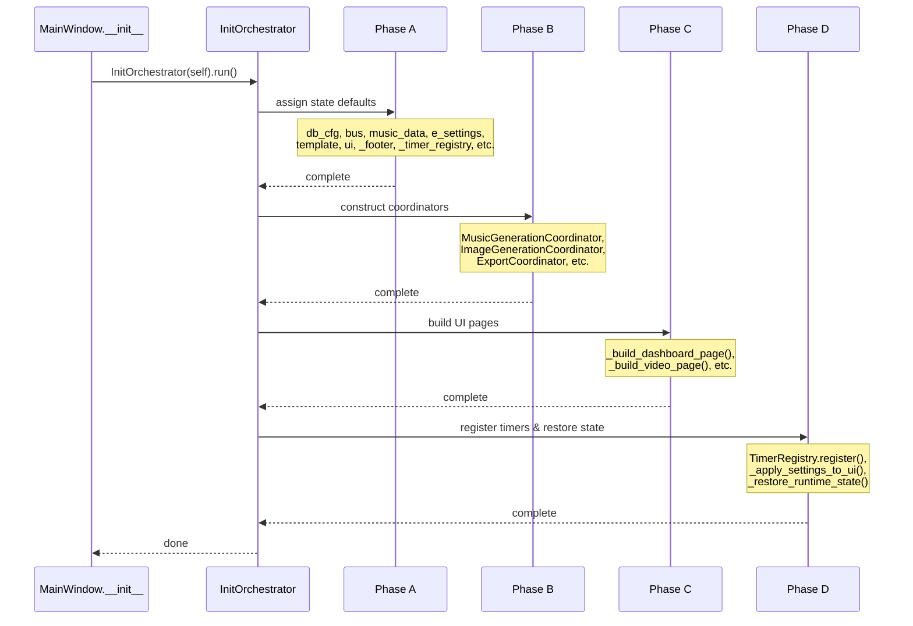

# Design Document: MainWindow Decomposition

## Overview

This design decomposes the ~4181-line `MainWindow` God class into a thin composition shell that delegates to well-defined, single-responsibility controllers and an initialization orchestrator. The decomposition follows the **Mediator pattern** — `MainWindow` remains the central hub that holds references to extracted controllers, while each controller is decoupled from the others and communicates through the existing `UiBus` signal infrastructure.

The key insight is that `MainWindow` currently conflates *composition* (wiring things together) with *behaviour* (owning business logic). After decomposition, `MainWindow` owns only composition — construction, navigation, and lifecycle — while each controller owns its own domain logic.

### Design Goals

1. **Eliminate the God class** — MainWindow body shrinks from ~4181 to <500 non-blank lines
2. **Enable isolated unit testing** — every controller is constructable with mock dependencies
3. **Preserve runtime behaviour** — zero user-facing changes; forwarding methods bridge gaps
4. **Prevent AttributeError bugs** — deterministic 4-phase initialization eliminates ordering issues
5. **Incremental migration** — view mixins continue working unchanged via forwarding methods

### Design Decisions

| Decision | Rationale |
|----------|-----------|
| Mediator over Observer | Controllers need request/response (e.g., read template), not just fire-and-forget events |
| Callable accessors over direct references | Controllers don't hold `MainWindow` — they receive `Callable[[], T]` for the data they need. This enables testing with lambdas returning test fixtures |
| 4-phase init over ad-hoc | Explicit phases with logging make boot-order bugs structurally impossible and diagnosable |
| Forwarding methods over immediate mixin rewrite | Enables incremental delivery; mixins are updated in a follow-up pass |
| Single `SignalRouter` over per-controller subscriptions | Centralizes event mapping, making the routing topology explicit and testable |

---

## Architecture



### Initialization Sequence



---

## Components and Interfaces

### 1. InitOrchestrator

**Location:** `python_app/app/init_orchestrator.py`

**Responsibility:** Execute MainWindow initialization in four deterministic phases with logging and error handling.

```python
class InitOrchestrator:
    """Executes MainWindow.__init__ in four deterministic phases.
    
    Phase-dependency contract: Any attribute read in Phase N must be
    assigned in Phase N-1 or earlier.
    """

    def __init__(self, host: "MainWindow") -> None:
        self._host = host
        self._has_run = False

    def run(self) -> None:
        """Execute all four phases. Raises RuntimeError if called twice."""
        if self._has_run:
            raise RuntimeError("InitOrchestrator.run() called more than once")
        self._has_run = True
        for phase_fn, phase_name in [
            (self._phase_a_state_defaults, "Phase A"),
            (self._phase_b_coordinators, "Phase B"),
            (self._phase_c_ui_build, "Phase C"),
            (self._phase_d_timers_and_restore, "Phase D"),
        ]:
            log_line(f"[STARTUP] {phase_name}: Begin")
            try:
                phase_fn()
            except Exception as exc:
                log_line(f"[STARTUP] {phase_name}: FAILED — {type(exc).__name__}: {exc}")
                raise
            log_line(f"[STARTUP] {phase_name}: Complete")

    def _phase_a_state_defaults(self) -> None: ...
    def _phase_b_coordinators(self) -> None: ...
    def _phase_c_ui_build(self) -> None: ...
    def _phase_d_timers_and_restore(self) -> None: ...
```

**Phase A attributes (minimum contract):**
- `db_cfg` (None)
- `bus` (UiBus instance)
- `music_data` (default_music_app_data())
- `e_settings` (dict)
- `template` (normalize_template(default_template()))
- `ui` (build_ui_tokens())
- `_footer` (FooterController instance)
- `_timer_registry` (TimerRegistry instance)
- `_ffmpeg_path` ("")
- `_output_dir` ("")
- `_app_closing` (False)
- `_primary_page_index` ({})

---

### 2. VideoPageController

**Location:** `python_app/features/video_export/video_page_controller.py`

**Responsibility:** Owns all `_update_*` template parameter methods and `_apply_*_settings` methods for the video editing page.

```python
from collections.abc import Callable
from ..visualizer.contracts import PreviewConfig

class VideoPageController:
    """Owns video template parameter updates and UI ↔ template synchronization."""

    def __init__(
        self,
        *,
        template_accessor: Callable[[], dict],
        template_mutator: Callable[[dict], None],
        preview_accessor: Callable[[], PreviewConfig],
        persist_fn: Callable[[dict], None],
        widget_accessors: dict[str, Callable[[], object]],
    ) -> None: ...

    # ~40 update methods, e.g.:
    def update_bg_brightness(self, v: int) -> None: ...
    def update_logo_size(self, v: int) -> None: ...
    def update_layer_bar_width(self, v: int) -> None: ...
    
    # Apply methods:
    def apply_template_to_controls(self) -> None: ...
    def apply_style_and_audio_settings(self, s: dict) -> None: ...
    def apply_background_settings(self, s: dict) -> None: ...
    def apply_effect_settings(self, s: dict) -> None: ...
    def apply_overlay_settings(self, s: dict) -> None: ...
    def apply_layer_settings(self, s: dict) -> None: ...
```

**Update method contract:** Each `update_*` method:
1. Reads current template via `template_accessor()`
2. Computes the new value from the slider/combo input
3. Applies the change to the template dict
4. Calls `template_mutator(updated_template)` to push to preview
5. Calls `persist_fn(settings_patch)` if the change should be persisted

---

### 3. AudioController

**Location:** `python_app/app/audio_controller.py`

**Responsibility:** Owns pygame audio state (play, pause, stop, seek) and provides a pure `tick()` for the UI timer.

```python
from collections.abc import Callable

class AudioController:
    """Encapsulates pygame audio playback state."""

    def __init__(
        self,
        *,
        preview_accessor: Callable[[], object],
        ui_update_fn: Callable[[float, float], None],
    ) -> None:
        self._preview_accessor = preview_accessor
        self._ui_update_fn = ui_update_fn
        self._audio_paused: bool = False
        self._seek_dragging: bool = False

    def play_audio(self) -> None:
        """Initialize pygame audio and begin playback. Raises RuntimeError if pygame not available."""
        ...

    def toggle_playback(self) -> None: ...
    def pause_audio(self) -> None: ...
    def stop_audio(self) -> None: ...

    def seek_to(self, t_sec: float) -> None:
        """Seek to t_sec, clamped to [0, duration]."""
        ...

    def seek_relative(self, delta_sec: float) -> None: ...

    def get_audio_duration(self) -> float: ...

    def tick(self) -> tuple[float, float]:
        """Return (current_time, duration) without modifying any widget."""
        ...

    def sync_play_button_state(self) -> bool:
        """Return whether audio is currently playing."""
        ...
```

---

### 4. SignalRouter

**Location:** `python_app/app/signal_router.py`

**Responsibility:** Centralizes all UiBus signal subscriptions and dispatches events to the correct handler by `event["type"]`.

```python
import logging
from collections.abc import Callable
from .ui_bus import UiBus

logger = logging.getLogger(__name__)

class SignalRouter:
    """Routes UiBus events to registered handlers by event type."""

    def __init__(
        self,
        *,
        bus: UiBus,
        handlers: dict[str, Callable[[dict], None]],
    ) -> None:
        self._handlers = dict(handlers)
        bus.music_event.connect(self._on_music_event)
        bus.export_event.connect(self._on_export_event)

    def register(self, event_type: str, handler: Callable[[dict], None]) -> None:
        """Register a handler for late-bound events."""
        self._handlers[event_type] = handler

    def _on_music_event(self, event: dict) -> None:
        self._dispatch(event, source="music_event")

    def _on_export_event(self, event: dict) -> None:
        self._dispatch(event, source="export_event")

    def _dispatch(self, event: dict, *, source: str) -> None:
        event_type = str(event.get("type", "")).strip()
        handler = self._handlers.get(event_type)
        if handler is not None:
            handler(event)
        else:
            logger.debug("SignalRouter: no handler for %s.%s", source, event_type)
```

---

### 5. DashboardPageController

**Location:** `python_app/features/progress/dashboard_page_controller.py`

**Responsibility:** Dashboard data refresh, profile combo syncing, failure context menu.

```python
from collections.abc import Callable
from ...database.persistence import DbCfg
from ...app.ui_bus import UiBus

class DashboardPageController:
    def __init__(
        self,
        *,
        db_cfg_accessor: Callable[[], DbCfg | None],
        bus: UiBus,
        settings_accessor: Callable[[], dict],
        widget_accessors: dict[str, Callable[[], object]],
    ) -> None: ...

    def refresh_dashboard_async(self, *, force: bool = False) -> None: ...
    def apply_dashboard_model(self, model: dict) -> None: ...
    def dashboard_sync_profile_combo(self) -> None: ...
    def dashboard_selected_profile_id(self) -> str: ...
    def dashboard_failure_meta_at(self, row_index: int) -> dict: ...
    def on_dashboard_failures_context_menu(self, pos: "QPoint") -> None: ...
```

---

### 6. ProgressPageController

**Location:** `python_app/features/progress/progress_page_controller.py`

**Responsibility:** Progress table refresh with cancellation tokens, row context menus, merge orchestration.

```python
from collections.abc import Callable
from ...database.persistence import DbCfg
from ...app.ui_bus import UiBus
from ..merge.worker import MergeWorker

class ProgressPageController:
    def __init__(
        self,
        *,
        db_cfg_accessor: Callable[[], DbCfg | None],
        bus: UiBus,
        settings_accessor: Callable[[], dict],
        merge_worker: MergeWorker,
        widget_accessors: dict[str, Callable[[], object]],
    ) -> None:
        self._refresh_token: int = 0  # cancellation token

    def refresh_progress_table_async(self, *, force: bool = False) -> None:
        """Increment token, spawn background query, discard results from older tokens."""
        self._refresh_token += 1
        current_token = self._refresh_token
        # ... background query ...
        # On result: if self._refresh_token != current_token: return (stale)
        ...

    def collect_progress_rows(self, *, limit: int, active_only: bool, from_ymd: str = "", to_ymd: str = "") -> list[dict]: ...
    def apply_progress_rows(self, rows: list[dict]) -> None: ...
    def cancel_row(self, meta: dict) -> None: ...
    def restart_images(self, meta: dict, *, background: bool, thumbnail: bool) -> None: ...
    def restart_merge_only(self, meta: dict) -> None: ...
    # ... additional methods ...
```

---

### 7. MusicPageController

**Location:** `python_app/features/music/music_page_controller.py`

**Responsibility:** Music generation UI state, pool management, ngrok control, history interaction.

```python
from collections.abc import Callable
from .coordinator import MusicGenerationCoordinator
from ...database.persistence import DbCfg
from ...app.ui_bus import UiBus
from ...views.helpers.footer_controller import FooterController

class MusicPageController:
    def __init__(
        self,
        *,
        music_coordinator: MusicGenerationCoordinator,
        db_cfg_accessor: Callable[[], DbCfg | None],
        bus: UiBus,
        settings_accessor: Callable[[], dict],
        footer: FooterController,
        widget_accessors: dict[str, Callable[[], object]],
    ) -> None: ...

    def on_music_generate_clicked(self) -> None:
        """Validate UI state, then delegate to music_coordinator."""
        self._music_coordinator.on_generate_clicked()

    def refresh_music_ui(self) -> None: ...
    def on_music_ngrok_start(self) -> None: ...
    def on_music_ngrok_stop(self) -> None: ...
    # ... additional methods ...
```

---

### 8. YouTubeOAuthController

**Location:** `python_app/features/youtube/oauth_controller.py`

**Responsibility:** OAuth app CRUD, profile connection/disconnection, secret encryption.

```python
from collections.abc import Callable
from ...database.persistence import DbCfg
from ..youtube.db import (
    db_get_youtube_oauth_app,
    db_list_youtube_oauth_apps,
    db_upsert_youtube_oauth_app,
    db_delete_youtube_oauth_app,
    db_count_profiles_using_youtube_oauth_app,
)
from ...services.dpapi import dpapi_encrypt_to_base64, dpapi_decrypt_from_base64

class YouTubeOAuthController:
    def __init__(
        self,
        *,
        db_cfg_accessor: Callable[[], DbCfg | None],
        youtube_coordinator: "YouTubeCoordinator",
        settings_accessor: Callable[[], dict],
        widget_accessors: dict[str, Callable[[], object]],
        persist_fn: Callable[[dict], None] | None = None,
    ) -> None: ...

    def refresh_youtube_oauth_apps_table(self, *, selected_id: str = "") -> None: ...
    def on_youtube_oauth_app_selected(self, row_index: int) -> None: ...
    def new_youtube_oauth_app(self) -> None: ...
    
    def save_youtube_oauth_app(self) -> None:
        """Encrypt secret, persist, refresh table."""
        # ... 
        enc = dpapi_encrypt_to_base64(secret)
        db_upsert_youtube_oauth_app(self._db_cfg_accessor(), {..., "clientSecretEnc": enc})
        ...

    def delete_youtube_oauth_app(self) -> None: ...
    def resolve_youtube_oauth_client(self, profile_id: str) -> tuple[str, str]: ...
```

---

### 9. Thin MainWindow Shell

After decomposition, `MainWindow.__init__` becomes:

```python
class MainWindow(QMainWindow, DashboardViewMixin, WorkflowViewMixin, ...):
    def __init__(self) -> None:
        super().__init__()
        InitOrchestrator(self).run()

    def closeEvent(self, event: QCloseEvent) -> None:
        self._app_closing = True
        self.youtube_coordinator.cancel_runtime_jobs(stop_timer=True, clear_running=True)
        self._cancel_unfinished_background_jobs(reason="app_close")
        self._music_coordinator.stop_polling()
        self._image_coordinator.stop_polling()
        self._timer_registry.stop_all()
        event.accept()

    def _set_primary_page(self, page_key: str) -> None: ...
    def _tick_ui(self) -> None: ...
    def eventFilter(self, watched: QObject, event: QEvent) -> bool: ...

    # Forwarding methods (temporary, removed when mixins are updated):
    def _update_bg_brightness(self, v: int) -> None:  # TODO: remove after view mixin update
        self._video_controller.update_bg_brightness(v)
```

---

## Data Models

### Phase-Dependency Map

The InitOrchestrator enforces this dependency graph:

| Phase | Assigns | May Read |
|-------|---------|----------|
| A — State Defaults | `db_cfg`, `bus`, `music_data`, `e_settings`, `template`, `ui`, `_footer`, `_timer_registry`, `_ffmpeg_path`, `_output_dir`, `_app_closing`, `_primary_page_index`, `_audio_paused`, `_seek_dragging` | Nothing (only constants) |
| B — Coordinators | `_music_coordinator`, `_image_coordinator`, `export_coordinator`, `persistence_coordinator`, `progress_coordinator`, `youtube_coordinator`, `auto_video_coordinator`, `music_settings_coordinator`, `profile_coordinator`, `profile_mgmt_coordinator`, `template_coordinator`, `workspace_coordinator`, `_signal_router`, `_video_controller`, `_audio_controller` | Phase A attributes |
| C — UI Build | All widget attributes (`primary_stack`, `mp3_list`, `preview`, `seek_slider`, etc.), `_primary_nav_buttons` | Phase A + B attributes |
| D — Timers & Restore | Timer registrations, runtime state restored | Phase A + B + C attributes |

### Controller Dependency Matrix

| Controller | Dependencies (via constructor) |
|------------|-------------------------------|
| VideoPageController | `template_accessor`, `template_mutator`, `preview_accessor`, `persist_fn`, `widget_accessors` |
| AudioController | `preview_accessor`, `ui_update_fn` |
| SignalRouter | `bus: UiBus`, `handlers: dict[str, Callable]` |
| DashboardPageController | `db_cfg_accessor`, `bus`, `settings_accessor`, `widget_accessors` |
| ProgressPageController | `db_cfg_accessor`, `bus`, `settings_accessor`, `merge_worker`, `widget_accessors` |
| MusicPageController | `music_coordinator`, `db_cfg_accessor`, `bus`, `settings_accessor`, `footer`, `widget_accessors` |
| YouTubeOAuthController | `db_cfg_accessor`, `youtube_coordinator`, `settings_accessor`, `widget_accessors`, `persist_fn` |

### Event Routing Map (SignalRouter handlers dict)

```python
handlers = {
    # music_event types
    "song": self._handle_song,
    "progress": self._handle_progress,
    "status": self._handle_status,
    "lyrics_polished": self._handle_lyrics_polished,
    "suno_result": self._handle_suno_result,
    "suno_poll_result": self._handle_suno_poll_result,
    "suno_schedule_poll": self._handle_suno_schedule_poll,
    "done": self._handle_done,
    "image_poll_started": self._handle_image_poll_started,
    "auto_video_status": self._handle_auto_video_status,
    "auto_video_done": self._handle_auto_video_done,
    "youtube_connect_select_channel": self._handle_youtube_connect_select_channel,
    "youtube_connect_done": self._handle_youtube_connect_done,
    "youtube_playlists_loaded": self._handle_youtube_playlists_loaded,
    "youtube_upload_status": self._handle_youtube_upload_status,
    "youtube_upload_progress": self._handle_youtube_upload_progress,
    "youtube_upload_done": self._handle_youtube_upload_done,
    # export_event types
    "started": self._handle_export_started,
    "stage_changed": self._handle_export_stage_changed,
    "progress": self._handle_export_progress,
    "completed": self._handle_export_completed,
    "failed": self._handle_export_failed,
    "status": self._handle_export_status,
}
```

---

## Correctness Properties

*A property is a characteristic or behavior that should hold true across all valid executions of a system — essentially, a formal statement about what the system should do. Properties serve as the bridge between human-readable specifications and machine-verifiable correctness guarantees.*

### Property 1: Phase ordering guarantees attribute availability

*For any* coordinator constructor invoked in Phase B, every attribute it reads on the host object shall already have been assigned during Phase A (or earlier in Phase B). Equivalently, instrumenting `__getattr__` on the host during Phase B shall never observe an `AttributeError` for any attribute in the Phase A contract list.

**Validates: Requirements 1.2, 1.3, 10.1, 10.2**

### Property 2: Phase exception handling preserves diagnostics

*For any* phase (A, B, C, D) and *for any* exception raised within that phase, the InitOrchestrator shall call `log_line` with a message containing the phase name and the exception message, then re-raise the same exception instance without wrapping or suppressing it.

**Validates: Requirements 1.6**

### Property 3: Phase lifecycle logging brackets every phase

*For any* phase (A, B, C, D) that completes successfully, exactly two `log_line` calls shall be emitted — one containing "Begin" and one containing "Complete" — with the phase name in both messages.

**Validates: Requirements 1.7**

### Property 4: Template update pipeline invariant

*For any* `update_*` method on VideoPageController and *for any* valid integer value within the slider's range, calling the method shall: (1) invoke `template_accessor` exactly once, (2) invoke `template_mutator` with a dict that differs from the original template in the expected key, and (3) not raise any exception when constructed with mock dependencies.

**Validates: Requirements 2.3, 12.1**

### Property 5: Audio seek clamping

*For any* float `t_sec` (including negative values, zero, and values exceeding duration), `AudioController.seek_to(t_sec)` shall result in an effective seek position within `[0, duration]` where `duration` is the current audio duration.

**Validates: Requirements 3.4**

### Property 6: Audio tick purity

*For any* audio state (playing, paused, stopped) and *for any* current time and duration values, `AudioController.tick()` shall return a `tuple[float, float]` and shall not invoke any method on any widget (verified by asserting zero calls on mock widget objects).

**Validates: Requirements 3.5**

### Property 7: Signal dispatch correctness

*For any* event dict with a `"type"` field, the SignalRouter shall: (a) if a handler is registered for that type, call the handler exactly once with the event dict; (b) if no handler is registered, log a debug-level message and not raise any exception. Additionally, *for any* event type string registered via `register()`, subsequent events of that type shall be dispatched to the newly registered handler.

**Validates: Requirements 4.3, 4.4, 4.5, 12.3**

### Property 8: Stale refresh cancellation

*For any* sequence of N rapid calls to `ProgressPageController.refresh_progress_table_async()` (N ≥ 2), only the result corresponding to the Nth (most recent) call shall be applied to the progress table; all earlier results shall be silently discarded when they arrive.

**Validates: Requirements 6.3**

### Property 9: Secret encryption round-trip

*For any* non-empty client secret string passed to `YouTubeOAuthController.save_youtube_oauth_app()`, the controller shall call `dpapi_encrypt_to_base64(secret)` before persisting, and when loading the same record for display, shall call `dpapi_decrypt_from_base64(encrypted)` to recover the original secret.

**Validates: Requirements 8.3**

### Property 10: InitOrchestrator single-run guard

*For any* InitOrchestrator instance, calling `run()` a second time shall raise `RuntimeError` regardless of whether the first call succeeded or failed.

**Validates: Requirements 10.4**

### Property 11: Timer callback safety

*For any* timer callback registered in Phase D, all attributes it accesses on the host shall have been assigned in Phase A, B, or C (all of which complete before Phase D starts the timers). Equivalently, no timer callback shall trigger an `AttributeError`.

**Validates: Requirements 10.3**

### Property 12: Graceful degradation with None db_cfg

*For any* controller that accepts a `db_cfg_accessor` (DashboardPageController, ProgressPageController, MusicPageController, YouTubeOAuthController), when `db_cfg_accessor()` returns `None`, calling any refresh or query method shall complete without raising an exception and shall not attempt database operations.

**Validates: Requirements 12.4**

---

## Error Handling

### InitOrchestrator Failures

- Each phase is wrapped in try/except that logs the phase name + exception, then re-raises
- No partial state cleanup — if Phase B fails, Phase A's assignments remain on MainWindow (acceptable since the app will terminate)
- `RuntimeError` on double-run prevents accidental re-initialization

### Controller Construction Failures

- Controllers receive `Callable` accessors, not raw values. If an accessor raises (e.g., widget not yet built), the exception propagates to the caller
- Controllers SHALL NOT swallow exceptions silently; they log and re-raise

### Database Unavailability (`db_cfg = None`)

- All controllers check `db_cfg_accessor()` at the start of database operations
- If `None`, the operation is skipped with a log message and the UI shows a "Database not configured" state
- No `AttributeError` — the `None` check happens before any DB function call

### Signal Dispatch Failures

- If a handler raises, the exception propagates (PyQt's signal mechanism will log it)
- Unregistered event types are logged at DEBUG level and discarded (not an error)

### Audio Failures

- `play_audio()` raises `RuntimeError("pygame not initialized")` if `pygame.mixer.get_init()` returns falsy
- seek operations are clamped — out-of-range values never reach pygame

---

## Testing Strategy

### Testing Approach

This feature is well-suited for property-based testing because:
- Controllers have pure-function-like update methods (input → template mutation)
- The phase ordering guarantee is a universal invariant over all coordinators
- Signal dispatch is a generic routing function testable over all event types
- Seek clamping is a mathematical invariant over all floats

### Property-Based Tests (using `hypothesis`)

Each correctness property maps to one property-based test. Configuration:
- **Minimum 100 iterations** per property test
- **Library:** `hypothesis` (already in project — `.hypothesis/` directory exists)
- **Tag format:** `# Feature: main-window-decomposition, Property N: <title>`

| Property | Test File | Key Generators |
|----------|-----------|----------------|
| 1 — Phase ordering | `tests/test_init_orchestrator_props.py` | `st.sampled_from(phase_a_attributes)` |
| 2 — Exception handling | `tests/test_init_orchestrator_props.py` | `st.from_type(Exception)`, `st.sampled_from(phases)` |
| 3 — Lifecycle logging | `tests/test_init_orchestrator_props.py` | `st.sampled_from(phases)` |
| 4 — Template update | `tests/test_video_page_controller_props.py` | `st.integers(min_value=0, max_value=400)`, `st.sampled_from(update_methods)` |
| 5 — Seek clamping | `tests/test_audio_controller_props.py` | `st.floats(allow_nan=False)`, `st.floats(min_value=0.1, max_value=600.0)` |
| 6 — Tick purity | `tests/test_audio_controller_props.py` | `st.floats(min_value=0)`, `st.sampled_from(["playing", "paused", "stopped"])` |
| 7 — Signal dispatch | `tests/test_signal_router_props.py` | `st.text(min_size=1)`, `st.dictionaries(st.text(), st.text())` |
| 8 — Stale cancellation | `tests/test_progress_controller_props.py` | `st.integers(min_value=2, max_value=20)` |
| 9 — Encryption round-trip | `tests/test_youtube_oauth_props.py` | `st.text(min_size=1, max_size=200)` |
| 10 — Single-run guard | `tests/test_init_orchestrator_props.py` | (no generator needed — deterministic) |
| 11 — Timer callback safety | `tests/test_init_orchestrator_props.py` | `st.sampled_from(timer_callbacks)` |
| 12 — None db_cfg | `tests/test_controller_degradation_props.py` | `st.sampled_from(controllers)`, `st.sampled_from(refresh_methods)` |

### Unit Tests (example-based)

| Test File | Coverage |
|-----------|----------|
| `tests/test_init_orchestrator.py` | Constructor, phase call order, closeEvent delegation |
| `tests/test_video_page_controller.py` | Specific update methods with concrete values, apply methods |
| `tests/test_audio_controller.py` | play/pause/stop sequences, RuntimeError on uninitialized pygame |
| `tests/test_signal_router.py` | Registration, dispatch, late registration |
| `tests/test_dashboard_page_controller.py` | Profile combo sync, failure meta extraction |
| `tests/test_progress_page_controller.py` | Context menu actions, merge orchestration |
| `tests/test_music_page_controller.py` | Generate delegation, ngrok control |
| `tests/test_youtube_oauth_controller.py` | Save/delete CRUD, encryption calls |

### Integration / Smoke Tests

| Test | Purpose |
|------|---------|
| `tests/test_architecture.py` (existing) | Verify MainWindow < 500 LOC, no `_update_*` methods remain |
| `tests/test_compile_all.py` (existing) | Verify all modules import without error |
| Manual QA | Startup time, all pages functional, export/upload workflows |

### Test Configuration

```python
# conftest.py or pytest.ini
[tool:pytest]
testpaths = python_app/tests
markers =
    property: property-based tests (hypothesis)
    unit: example-based unit tests
    integration: integration tests requiring QApplication

# hypothesis profile
[hypothesis]
max_examples = 100
deadline = 2000
```
