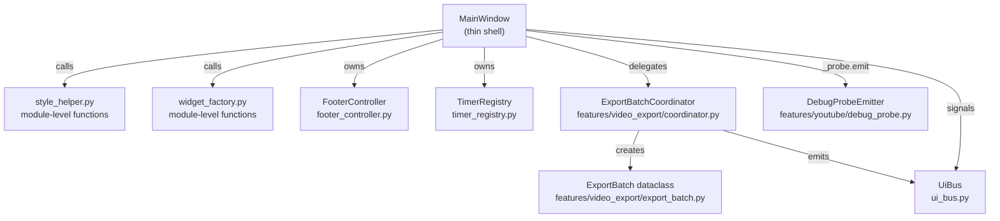

# Design Document — `main_window.py` God-Class Refactor

## Overview

`main_window.py` is a 7 000+ line `MainWindow` class that conflates UI construction,
theme application, export-batch state management, database persistence, music generation,
image generation, YouTube upload orchestration, calendar widgets, footer status, and multiple
polling timers into a single file. It also contains inline debug probes, duplicate import
blocks, a known `removed` variable bug, and no central timer lifecycle.

This design describes how to decompose the God class into focused, single-purpose modules
while preserving all existing runtime behaviour and without introducing new third-party
dependencies. The migration is incremental — each extracted module replaces its counterpart
in `MainWindow` with delegation calls while the coordinator pattern that is already used
throughout the codebase (`YouTubeCoordinator`, `PersistenceCoordinator`, etc.) is extended
consistently.

### Goals

- Each extracted module is independently importable and unit-testable without standing up the
  full PyQt6 application.
- `MainWindow` becomes a thin orchestrator / shell that wires coordinators together and
  delegates domain logic.
- All existing manual smoke tests continue to pass unchanged.
- No new third-party dependencies are introduced.
- The codebase is left in a cleanly typed state (`mypy --strict` clean on modified lines,
  Python 3.10+ built-in generic annotations throughout).

---

## Architecture

The refactored system introduces five new modules inside the existing package hierarchy and
migrates the `ExportBatch` dataclass to its own file. `MainWindow` continues to exist and
own all Qt widget references; it delegates domain work to coordinators that receive their
dependencies via constructor injection.



### Migration strategy

Each requirement is an independent change slice that can be merged on its own branch:

| Slice | Module / Change |
|-------|-----------------|
| 1 | Extract `StyleHelper` → `style_helper.py` |
| 2 | Extract `WidgetFactory` → `widget_factory.py` |
| 3 | Extract `FooterController` → `footer_controller.py` |
| 4 | Move `ExportBatch` + add `ExportBatchCoordinator` |
| 5 | Add `TimerRegistry` → `timer_registry.py` |
| 6 | Replace debug probes with `DebugProbeEmitter` |
| 7 | Consolidate imports to module level |
| 8 | Fix `removed` variable bug |
| 9 | Apply DI to all five coordinators |
| 10 | Add type annotations |

---

## Components and Interfaces

### 1. `style_helper.py`

**Path:** `python_app/app/style_helper.py`

All widget-styling helpers are extracted as **module-level functions** that receive the
target widget and UI-token dict as explicit parameters. No `MainWindow` import is required.

```python
# python_app/app/style_helper.py
from __future__ import annotations

from PyQt6.QtCore import Qt
from PyQt6.QtGui import QColor, QIcon, QPixmap, QPainter
from PyQt6.QtSvg import QSvgRenderer
from PyQt6.QtWidgets import QPushButton, QLabel, QWidget
from pathlib import Path


def refresh_widget_style(widget: QWidget) -> None: ...
def set_widget_property(widget: QWidget, name: str, value: str) -> None: ...
def set_panel_role(widget: QWidget, role: str) -> None: ...
def set_label_role(label: QLabel, role: str) -> None: ...
def set_button_role(button: QPushButton, role: str) -> None: ...
def set_field_role(widget: QWidget, role: str) -> None: ...
def apply_cta_button(button: QPushButton, variant: str, tokens: dict[str, str]) -> None: ...
def apply_card_field(widget: QWidget) -> None: ...
def render_svg_icon(
    svg_path: str,
    size: int,
    color: str,
    *,
    cache: dict[tuple[str, int, str], QIcon] | None = None,
) -> QIcon: ...
```

**None / deleted-widget guard:** Every function checks `widget is None` at entry and wraps
the body in `try/except RuntimeError` to silently return when the underlying C++ object
has been destroyed.

**`MainWindow` change:** Replace each `def _set_panel_role(...)` etc. with a call to the
module-level function, forwarding `self.ui` (the token dict) as required. After the
refactoring, `grep -n "def _set_panel_role\|def _apply_cta_button\|def _render_svg_icon"
main_window.py` must return zero matches inside the class body.

---

### 2. `widget_factory.py`

**Path:** `python_app/app/widget_factory.py`

All reusable widget-construction helpers extracted as module-level functions. Functions
that construct Qt widgets receive the UI-token dict and any callbacks as explicit
parameters. Pure-computation helpers (`split_metric_text`, `format_music_updated_at`)
require no Qt context at all and are callable without a `QApplication` instance.

```python
# python_app/app/widget_factory.py
from __future__ import annotations

from collections.abc import Callable
from PyQt6.QtCore import Qt, QDate
from PyQt6.QtWidgets import (
    QComboBox, QDateEdit, QHBoxLayout, QLabel, QPushButton,
    QSlider, QVBoxLayout, QWidget,
)
from .app_widgets import AppDateEdit  # re-exported from widgets.py


def split_metric_text(text: str) -> tuple[str, str]: ...
def format_music_updated_at(value: str) -> str: ...
def create_metric_header(
    initial_text: str, tokens: dict[str, str]
) -> tuple[QHBoxLayout, QLabel]: ...
def add_slider_row(
    layout: QVBoxLayout,
    initial_text: str,
    minimum: int,
    maximum: int,
    value: int,
    on_change: Callable[[int], None],
    tokens: dict[str, str],
    *,
    single_step: int = 1,
    page_step: int | None = None,
    tick_interval: int | None = None,
) -> tuple[QLabel, QSlider]: ...
def configure_step_slider(
    slider: QSlider,
    event_target: QWidget,
    *,
    minimum_width: int | None = None,
    single_step: int = 1,
    page_step: int = 5,
    wheel_step: int = 2,
) -> QSlider: ...
def add_toggle_row(
    layout: QVBoxLayout,
    label_text: str,
    on_change: Callable[[], None],
    tokens: dict[str, str],
) -> QPushButton: ...
def add_form_row(
    layout: QVBoxLayout,
    label_text: str,
    field: QWidget,
    tokens: dict[str, str],
    *,
    apply_card_field: bool = False,
    label_min_width: int = 80,
) -> QLabel: ...
def make_panel_section(
    title_text: str,
    tokens: dict[str, str],
    *,
    subtitle_text: str = "",
    soft: bool = False,
) -> tuple[QWidget, QVBoxLayout]: ...
def set_metric_text(metric_value_label: QLabel, text: str) -> None: ...
def create_calendar_picker(
    on_change: Callable[[], None],
    tokens: dict[str, str],
    *,
    width: int = 108,
) -> QDateEdit: ...
def calendar_picker_value(picker: QDateEdit | None) -> str: ...
def set_calendar_picker_value(picker: QDateEdit | None, value: str) -> None: ...
```

**`MainWindow` change:** Existing `_add_*` / `_create_*` / `_make_panel_section` methods
become thin wrappers that call the factory functions, forwarding `self.ui`. The original
method names are removed from the class body once all view mixins have been updated.

---

### 3. `FooterController`

**Path:** `python_app/app/footer_controller.py`

Owns the three footer status string fields and the priority/composition rule that currently
lives in `_refresh_footer_status`.

```python
# python_app/app/footer_controller.py
from __future__ import annotations

from collections.abc import Callable
from PyQt6.QtWidgets import QLabel


class FooterController:
    def __init__(
        self,
        label_accessor: Callable[[], QLabel | None],
    ) -> None:
        self._label_accessor = label_accessor
        self._global_status_message: str = ""
        self._music_status_message: str = ""
        self._music_suno_status_message: str = ""

    def set_status(self, message: str, *, source: str = "") -> None: ...
    def set_music_status(self, message: str) -> None: ...
    def set_suno_status(self, message: str) -> None: ...
    def refresh(self) -> None: ...
```

**Composition rule** (implemented in `refresh()`):

```
if _music_suno_status_message is non-empty
   AND _global_status_message == _music_status_message:
    display = f"{_music_status_message} · {_music_suno_status_message}"
else:
    display = _global_status_message or _music_status_message or "Ready"
```

**Guard:** If `label_accessor()` returns `None`, or if `label.setText(...)` raises a
`RuntimeError` (destroyed C++ object), `refresh()` silently skips the update.

**`MainWindow` change:** `__init__` constructs `self._footer = FooterController(lambda: getattr(self, "footer_left_label", None))`.
All domain methods that previously wrote to `self._global_status_message` etc. now call
`self._footer.set_status(...)` / `self._footer.set_music_status(...)` etc. instead.

---

### 4. `ExportBatch` + `ExportBatchCoordinator`

#### 4a. `export_batch.py`

**Path:** `python_app/features/video_export/export_batch.py`

The `ExportBatch` dataclass is moved here verbatim — identical field names, types, and
`field(default_factory=...)` defaults. The existing `coordinator.py` in the same package
gains an `ExportBatchCoordinator` class.

```python
# python_app/features/video_export/export_batch.py
from __future__ import annotations

from dataclasses import dataclass, field
from .export import ExportJob  # type: ignore[attr-defined]


@dataclass
class ExportBatch:
    batch_key: str
    output_dir: str
    ffmpeg_path: str
    bg_path: str
    logo_path: str
    queue: list[str] = field(default_factory=list)
    jobs: dict[str, ExportJob] = field(default_factory=dict)
    job_state: dict[str, dict] = field(default_factory=dict)
    mp3s: list[str] = field(default_factory=list)
    total_count: int = 0
    completed_count: int = 0
    failed_count: int = 0
    outputs_by_mp3: dict[str, str] = field(default_factory=dict)
    running: bool = False
    auto_merge_after: bool = False
```

#### 4b. `ExportBatchCoordinator`

Added to `python_app/features/video_export/coordinator.py`.

```python
class ExportBatchCoordinator:
    def __init__(
        self,
        ffmpeg_path: str,
        output_dir: str,
        bg_path: str,
        logo_path: str,
        bus: UiBus,
    ) -> None: ...

    def start_batch(self, mp3s: list[str], *, auto_merge_after: bool = False) -> str: ...
    def complete_batch(self, batch_key: str, *, ok: bool, error: str = "") -> None: ...
    def get_batch(self, batch_key: str) -> ExportBatch | None: ...
    def update_db_cfg(self, cfg: DbCfg | None) -> None: ...
```

`start_batch` raises `ValueError` (with the offending parameter name in the message) if
any of `ffmpeg_path`, `output_dir`, `bg_path`, or `logo_path` is empty **before** creating
any `ExportBatch` instance. On success, it creates an `ExportBatch`, inserts it into the
internal registry `_export_batches: dict[str, ExportBatch]`, and returns the `batch_key`.

`complete_batch` emits:
- `bus.export_event.emit({"type": "export_done", "ok": True,  "batchKey": batch_key, ...})` on success
- `bus.export_event.emit({"type": "export_done", "ok": False, "batchKey": batch_key, "error": "<message>", ...})` on failure

**Deprecation shim in `main_window.py`:**

```python
# deprecated: import from features.video_export.export_batch
from .features.video_export.export_batch import ExportBatch  # noqa: F401
```

The shim is removed once all consumers have been updated.

---

### 5. `TimerRegistry`

**Path:** `python_app/app/timer_registry.py`

```python
# python_app/app/timer_registry.py
from __future__ import annotations

from collections.abc import Callable
from PyQt6.QtCore import QObject, QTimer


class TimerRegistry:
    def __init__(self, parent: QObject | None = None) -> None: ...

    def register(
        self,
        name: str,
        interval_ms: int,
        callback: Callable[[], None],
        *,
        page_gate: str | None = None,
    ) -> QTimer: ...

    def stop_all(self) -> None: ...

    def sync(self, name: str, *, enabled: bool) -> None: ...

    def set_active_page(self, page: str) -> None: ...
```

**`register` semantics:**

- Creates a `QTimer(parent)` with the given interval and connects it to `callback` (wrapped
  with a page-gate guard when `page_gate` is not `None`).
- Stores the timer in `_timers: dict[str, QTimer]`.
- Raises `ValueError` if `name` is already registered.

**Page-gate guard:** The wrapper checks `self._active_page == page_gate` before invoking
the original callback. The timer still fires at its full interval; when the page does not
match, the callback is skipped silently.

**`stop_all` semantics:** Calls `timer.stop()` on every registered timer that is currently
active. This is called from `MainWindow.closeEvent` before `super().closeEvent(ev)`.

**`sync` semantics:** Idempotent — starts the timer if `enabled=True` and it is not already
running; stops it if `enabled=False` and it is running; no-op otherwise.

**Nine registered timers** (created once in `MainWindow.__init__` after UI build):

| Name | Interval | Page gate |
|------|----------|-----------|
| `image_auto_poll` | 30 000 ms | `None` |
| `image_live_refresh` | 1 500 ms | `"image"` |
| `auto_video` | 30 000 ms | `None` |
| `progress_live_refresh` | 2 500 ms | `"progress"` |
| `dashboard_live_refresh` | 4 500 ms | `"home"` |
| `youtube_auto_poll` | 30 000 ms | `None` |
| `music_suno_poll` | 30 000 ms | `None` |
| `music_render` | 200 ms | `None` |
| `music_heartbeat` | 60 000 ms | `None` |

**`MainWindow` change:**
- `_ensure_image_timers`, `_ensure_auto_video_timer`, `_ensure_progress_timers`,
  `_ensure_dashboard_timers` are removed.
- `_sync_image_auto_poll_timer`, `_sync_auto_video_timer`, `_sync_youtube_auto_poll_timer`
  are replaced with `self._timer_registry.sync(name, enabled=bool_expr)`.
- `closeEvent` calls `self.youtube_coordinator.cancel_runtime_jobs(...)` first, then
  `self._timer_registry.stop_all()`.

---

### 6. `DebugProbeEmitter`

**Path:** `python_app/features/youtube/debug_probe.py`

```python
# python_app/features/youtube/debug_probe.py
from __future__ import annotations

import logging
import os
from pathlib import Path


class DebugProbeEmitter:
    def __init__(self, env_file: str) -> None:
        self._env_file = env_file
        self._logger = logging.getLogger("mg.debug_probe")

    def emit(
        self,
        *,
        hypothesis: str,
        location: str,
        msg: str,
        data: dict[str, object],
    ) -> None: ...
```

`emit` is a no-op unless `os.environ.get("MG_DEBUG_PROBES") == "1"`. When enabled it:

1. Reads `session_id` and `hypothesis_id` from `self._env_file` (if it exists; ignores
   parse errors silently).
2. Calls `self._logger.debug(msg, extra={"session_id": ..., "hypothesis_id": ...,
   "location": location, "msg": msg, "data": data})`.

It does **not** open any network connection and does **not** write to stdout/stderr.

**Module-level singleton** in `main_window.py` (or in `_run_one_youtube_upload_job`'s
containing module):

```python
_probe = DebugProbeEmitter(".dbg/youtube-upload-issues.env")
```

The four `exec()`/`urllib.request` blocks in `_run_one_youtube_upload_job` are replaced with:

```python
_probe.emit(hypothesis="A", location="_run_one_youtube_upload_job:job-picked",
            msg="yt job picked", data={...})
_probe.emit(hypothesis="B", location="_run_one_youtube_upload_job:mp4-not-ready",
            msg="mp4 not ready", data={...})
_probe.emit(hypothesis="C", location="_run_one_youtube_upload_job:pre-upload",
            msg="pre-upload check", data={...})
_probe.emit(hypothesis="D", location="_run_one_youtube_upload_job:upload-exception",
            msg="upload exception", data={...})
```

---

### 7. Import consolidation

All `import` and `from … import` statements in `main_window.py` are moved to the top of
the file in PEP 8 order (standard library → third-party → local). Duplicate `import time`,
`import json`, and `import urllib.request` lines are removed. Inline imports inside method
bodies (e.g. `import json, urllib.request` inside `_run_one_youtube_upload_job`) are
eliminated. After the change `python -m py_compile python_app/app/main_window.py` must
succeed and `flake8 --select=F401,E401` must report zero violations on all seven files.

---

### 8. `removed` variable bug fix

In `_delete_music_saved_text` the status message currently references `removed`, which is
never assigned. The fix captures the row before the deletion call:

```python
def _delete_music_saved_text(self, kind: str) -> None:
    widget, name_edit, match_edit, editor = self._music_text_widget_bundle(kind)
    rows = list(self._music_collection(kind))
    if widget is None:
        return
    idx = int(widget.currentRow() if hasattr(widget, "currentRow") else -1)
    if idx < 0 or idx >= len(rows):
        return
    removed_id = str((rows[idx] or {}).get("id", "")).strip()
    deleted_row = dict(rows[idx])               # captured before deletion
    updated_rows = self.music_controller.delete_saved_text(kind, removed_id)
    self._refresh_music_saved_text_list(kind)
    self._refresh_music_match_structure_options()
    self._refresh_music_ui()
    # ... widget selection / clear logic unchanged ...
    self._set_music_status(f"Deleted {deleted_row.get('name', 'item')}")
```

`removed` does not appear anywhere in the method body after the fix.

---

### 9. Dependency injection for coordinators

Each of the five coordinators (`MusicController`, `ImageController`, `YouTubeCoordinator`,
`ExportBatchCoordinator`, `PersistenceCoordinator`) gains a constructor that accepts
`db_cfg: DbCfg | None`, `bus: UiBus`, and any other required collaborators as individually
named, typed parameters. The dataclass `host: "MainWindow"` field is removed.

`MainWindow.__init__` passes these arguments explicitly:

```python
self.persistence_coordinator = PersistenceCoordinator(
    db_cfg=self.db_cfg, bus=self.bus, music_data=self.music_data, e_settings=self.e_settings
)
self.music_controller = MusicController(
    db_cfg=self.db_cfg, bus=self.bus, music_data=self.music_data, e_settings=self.e_settings,
    poll_pending_suno=poll_and_download_pending_suno,
    list_pending_suno_tasks=list_pending_suno_tasks,
    upsert_suno_task=upsert_suno_task,
    list_songs_by_batch_id=music_list_songs_by_batch_id,
)
# ... and so on for ImageController, YouTubeCoordinator, ExportBatchCoordinator
```

A new `update_db_cfg(cfg: DbCfg | None) -> None` method is added to each coordinator.
`MainWindow` calls it on all five after a successful database reconnection.

Coordinators access `MainWindow` state only via values passed into their constructors or
into individual method arguments — never via `self.host.some_attribute`.

---

## Data Models

### `ExportBatch` (unchanged fields, new location)

```
ExportBatch
  batch_key:         str
  output_dir:        str
  ffmpeg_path:       str
  bg_path:           str
  logo_path:         str
  queue:             list[str]               (default_factory=list)
  jobs:              dict[str, ExportJob]    (default_factory=dict)
  job_state:         dict[str, dict]         (default_factory=dict)
  mp3s:              list[str]               (default_factory=list)
  total_count:       int                     (= 0)
  completed_count:   int                     (= 0)
  failed_count:      int                     (= 0)
  outputs_by_mp3:    dict[str, str]          (default_factory=dict)
  running:           bool                    (= False)
  auto_merge_after:  bool                    (= False)
```

All field names, types, and defaults are preserved exactly — only the physical file
location changes (from `main_window.py` to `export_batch.py`).

### `FooterController` internal state

```
FooterController
  _label_accessor:              Callable[[], QLabel | None]
  _global_status_message:       str  (= "")
  _music_status_message:        str  (= "")
  _music_suno_status_message:   str  (= "")
```

### `TimerRegistry` internal state

```
TimerRegistry
  _timers:       dict[str, QTimer]
  _active_page:  str  (= "")
```

---

## Correctness Properties

*A property is a characteristic or behavior that should hold true across all valid
executions of a system — essentially, a formal statement about what the system should do.
Properties serve as the bridge between human-readable specifications and machine-verifiable
correctness guarantees.*

The prework analysis found the following acceptance criteria suitable for property-based
testing. Property reflection was applied to eliminate redundant properties before writing
this section.

---

### Property 1: FooterController composition rule is always respected

*For any* combination of `_global_status_message`, `_music_status_message`, and
`_music_suno_status_message` string values, calling the corresponding setter methods and
then `refresh()` must produce text on the label that satisfies the documented composition
rule:
- If `_music_suno_status_message` is non-empty **and** `_global_status_message` equals
  `_music_status_message`, the displayed text is
  `"{_music_status_message} · {_music_suno_status_message}"`.
- Otherwise the displayed text is `_global_status_message`, or `_music_status_message` if
  global is empty, or `"Ready"` if all three are empty.

**Validates: Requirements 3.3**

---

### Property 2: ExportBatchCoordinator emits correct payload shape on completion and failure

*For any* `batch_key` string and completion outcome (`ok=True` or `ok=False` with an
arbitrary `error` message string), calling `complete_batch(batch_key, ok=ok, error=error)`
must cause `bus.export_event.emit` to be called exactly once with a `dict` that contains
`"type": "export_done"`, `"ok": bool(ok)`, and — when `ok` is `False` — an `"error"` key
whose value equals the supplied error string.

**Validates: Requirements 4.4**

---

### Property 3: `start_batch` raises ValueError for any empty required parameter

*For any* combination of `(ffmpeg_path, output_dir, bg_path, logo_path)` strings where at
least one of the four is empty or whitespace-only, calling
`ExportBatchCoordinator.start_batch(...)` must raise `ValueError` before any `ExportBatch`
instance is created (i.e. the internal registry remains empty after the call).

**Validates: Requirements 4.5**

---

### Property 4: TimerRegistry raises ValueError for duplicate timer names

*For any* timer name registered once with `TimerRegistry.register(name, ...)`, calling
`register` again with the same `name` must always raise `ValueError`, regardless of the
`interval_ms`, `callback`, or `page_gate` arguments supplied in the second call.

**Validates: Requirements 5.2**

---

### Property 5: `TimerRegistry.sync` is idempotent

*For any* registered timer name and boolean `enabled` value, calling `sync(name, enabled=enabled)`
twice in succession must leave the timer in the same state (`timer.isActive() == enabled`)
as calling it once — i.e. the second call is always a no-op when the timer is already in
the requested state.

**Validates: Requirements 5.4**

---

### Property 6: Page-gate suppresses callback when page does not match

*For any* `page_gate` string and `active_page` string supplied to `TimerRegistry`, when a
timer has been registered with that `page_gate`, manually firing the timer's timeout must
invoke the original callback **if and only if** `active_page == page_gate`.

**Validates: Requirements 5.5**

---

### Property 7: `DebugProbeEmitter.emit` produces no side effects when probe flag is absent or not "1"

*For any* combination of `hypothesis`, `location`, `msg`, and `data` arguments, calling
`DebugProbeEmitter.emit(...)` when `MG_DEBUG_PROBES` is absent from the environment or set
to any value other than the string `"1"` must produce: (a) no file system writes, (b) no
network connections, and (c) no writes to stdout or stderr.

**Validates: Requirements 6.6, 12.5**

---

### Property 8: `DebugProbeEmitter.emit` always records all five structured fields when probes are enabled

*For any* `hypothesis`, `location`, `msg`, and `data` dict, calling `emit(...)` with
`MG_DEBUG_PROBES=1` in the environment must cause the `logging.DEBUG` handler on
`logging.getLogger("mg.debug_probe")` to receive a `LogRecord` whose `extra` contains
all five fields: `session_id`, `hypothesis_id`, `location`, `msg`, and `data`, and where
`location` and `msg` match the values passed to `emit`.

**Validates: Requirements 6.3**

---

### Property 9: `_delete_music_saved_text` never raises NameError, UnboundLocalError, or KeyError after the fix

*For any* `rows` list of dicts (including dicts with and without a `"name"` key) and any
valid index `0 ≤ idx < len(rows)`, the fixed `_delete_music_saved_text` method must
complete without raising `NameError`, `UnboundLocalError`, or `KeyError` when
`music_controller.delete_saved_text` returns successfully.

**Validates: Requirements 8.3**

---

## Error Handling

### `StyleHelper` and `WidgetFactory`

- Any function that receives `widget=None` returns immediately without raising.
- Any call to a Qt method on a widget whose C++ object has been deleted is wrapped in
  `try/except RuntimeError` that silently returns.

### `FooterController`

- `label_accessor()` may return `None`; `refresh()` checks for `None` before calling
  `setText`.
- `setText` is wrapped in `try/except RuntimeError` to handle destroyed widgets.

### `ExportBatchCoordinator`

- `start_batch` raises `ValueError` (not silently discards) when a required path argument
  is empty; this gives callers a clear signal rather than a silent batch creation failure.
- Completion and failure events are emitted even if the batch key is not found in the
  registry (the event carries `"ok": False` in that case).

### `TimerRegistry`

- `register` raises `ValueError` on duplicate names; callers must guarantee uniqueness
  (typically by registering each timer exactly once in `MainWindow.__init__`).
- `stop_all` is exception-safe: each timer stop is wrapped in `try/except Exception`.
- `sync` is a no-op if the timer name is not registered (logs a warning at DEBUG level).

### `DebugProbeEmitter`

- When `MG_DEBUG_PROBES != "1"`, `emit` returns immediately — no file or network
  operations can raise.
- When probes are enabled, the env-file parse is wrapped in `try/except Exception` so a
  malformed `.env` file does not break the upload path.
- All logging calls are `try/except`-guarded so a misconfigured log handler cannot crash
  the upload worker.

---

## Testing Strategy

### Overview

The dual testing approach uses:
- **Unit tests** (example-based): verify specific scenarios, edge cases, error conditions,
  and API contracts.
- **Property-based tests**: verify universal properties across many generated inputs using
  `hypothesis` (already available in the project's dependency graph via `pytest`).

Each extracted module that contains no Qt widget construction and no I/O is callable
without a `QApplication` instance. Qt-bearing modules are tested with `pytest-qt`'s
`qtbot` fixture.

### Unit tests — example-based

Location: `python_app/tests/`

| File | What it tests |
|------|---------------|
| `test_style_helper.py` | Each function with a `MagicMock` widget; `None` widget guard; `RuntimeError` guard |
| `test_widget_factory.py` | `split_metric_text`, `format_music_updated_at` (no Qt needed); `create_calendar_picker`, `add_slider_row` with `qtbot` |
| `test_footer_controller.py` | Construction; `None` label guard; `RuntimeError` guard on `setText`; concrete composition scenarios |
| `test_export_batch.py` | `ExportBatch` construction and field defaults; import from new location |
| `test_export_batch_coordinator.py` | `start_batch` with all valid paths; import-only smoke test |
| `test_timer_registry.py` | `register` success; `stop_all` stops active timers; all nine named timers |
| `test_debug_probe.py` | `emit` with `MG_DEBUG_PROBES` absent; no stdout/stderr pollution |
| `test_delete_music_saved_text.py` | Correct status message; call order; no NameError/UnboundLocalError/KeyError |

### Property-based tests

Using `hypothesis` (`from hypothesis import given, strategies as st`). Each property test
runs a minimum of 100 examples (`settings(max_examples=100)`).

| Test function | Property | Tag |
|---------------|----------|-----|
| `test_footer_composition_rule` | Property 1 | `Feature: main-window-refactor, Property 1` |
| `test_export_batch_coordinator_event_shape` | Property 2 | `Feature: main-window-refactor, Property 2` |
| `test_start_batch_empty_param_raises` | Property 3 | `Feature: main-window-refactor, Property 3` |
| `test_timer_registry_duplicate_raises` | Property 4 | `Feature: main-window-refactor, Property 4` |
| `test_timer_registry_sync_idempotent` | Property 5 | `Feature: main-window-refactor, Property 5` |
| `test_timer_registry_page_gate` | Property 6 | `Feature: main-window-refactor, Property 6` |
| `test_debug_probe_no_side_effects` | Property 7 | `Feature: main-window-refactor, Property 7` |
| `test_debug_probe_structured_log_fields` | Property 8 | `Feature: main-window-refactor, Property 8` |
| `test_delete_music_saved_text_no_name_error` | Property 9 | `Feature: main-window-refactor, Property 9` |

### Static analysis gates

These must pass before any slice is merged:

```bash
python -m py_compile python_app/app/main_window.py
flake8 --select=F401,E401 \
    python_app/app/main_window.py \
    python_app/app/style_helper.py \
    python_app/app/widget_factory.py \
    python_app/app/footer_controller.py \
    python_app/app/timer_registry.py \
    python_app/features/video_export/export_batch.py \
    python_app/features/youtube/debug_probe.py
mypy --strict \
    python_app/app/style_helper.py \
    python_app/app/widget_factory.py \
    python_app/app/footer_controller.py \
    python_app/app/timer_registry.py \
    python_app/features/video_export/export_batch.py \
    python_app/features/youtube/debug_probe.py
```

### Manual smoke test checklist (for Requirement 11)

After all slices are applied, the following manual checks must pass:

1. Application starts; startup log confirms all three phases complete before the window is
   visible.
2. Music generation: status bar updates; database record written.
3. Image generation: status bar updates; image file written to `output_dir`.
4. Video export: batch created; progress updates; MP4 written to `output_dir`.
5. YouTube upload: job queued; upload progress shown; record updated in DB.
6. Template save: template persisted; name appears in template list after restart.
7. Settings change: change persisted; appears after restart.
8. Close window: all nine timers stop; no hung threads.
