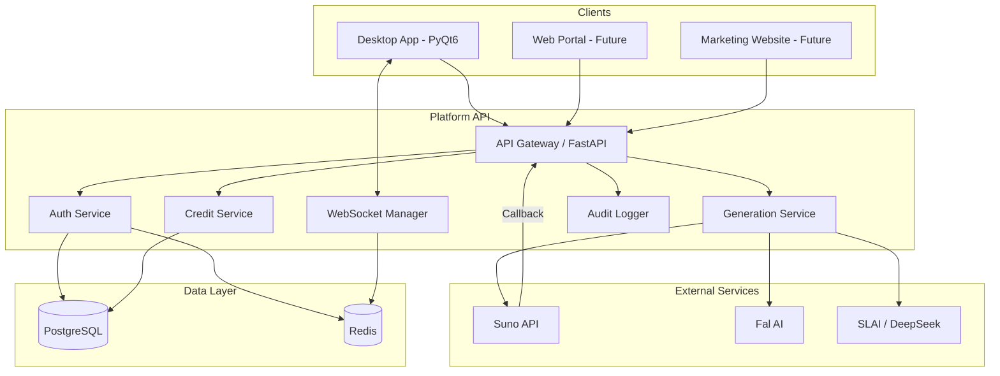
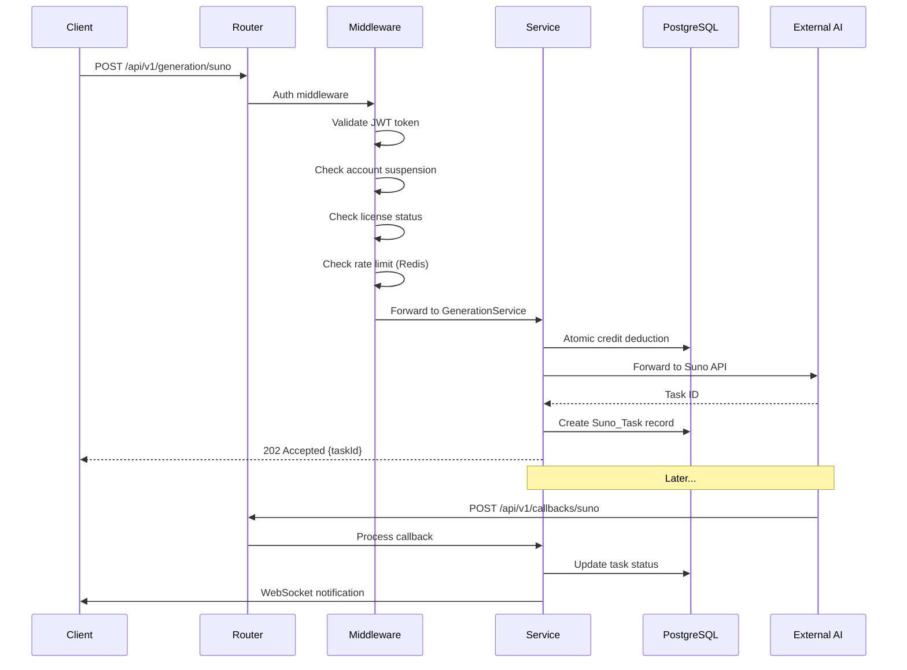
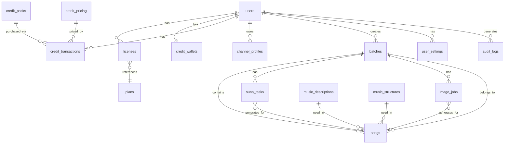

# Design Document: Platform API

## Overview

The Platform API is a Python-based REST backend service that centralizes authentication, AI service proxying, credit management, and data storage for the music generation ecosystem. It replaces the desktop app's direct connections to external AI services (Suno, Fal AI, SLAI/DeepSeek) with an authenticated middleware layer that manages user credentials, licenses, credits, and generation pipelines.

### Key Design Goals

- **Centralized Authentication**: JWT-based auth with refresh tokens replaces per-service API key storage in the desktop app
- **Credit Monetization**: Configurable per-model credit pricing with atomic deduction enables profit margins on AI operations
- **Callback Consolidation**: Public callback endpoints replace the desktop app's local ngrok tunnel for Suno notifications
- **Multi-Client Support**: REST API + WebSocket serves Desktop App, future Web Portal, and Marketing Website
- **Extensibility**: Protocol-based dependency injection (matching existing `features/ports.py` pattern) enables testing and future provider additions

### Technology Stack

- **Framework**: FastAPI (Python 3.11+) — async-first, OpenAPI auto-docs, Pydantic validation
- **Database**: PostgreSQL 15+ with asyncpg driver
- **Auth**: PyJWT for token issuance/validation, bcrypt (passlib) for password hashing
- **WebSocket**: FastAPI WebSocket with per-user connection management
- **Task Queue**: Background tasks via FastAPI BackgroundTasks for non-blocking operations
- **Caching**: Redis for rate limiting, token blocklist, and external balance caching
- **Migration**: Alembic for schema versioning


## Architecture

### High-Level Architecture



### Layered Architecture

The API follows a clean layered architecture matching the existing project's ports/adapters pattern:

```
┌─────────────────────────────────────────────────┐
│  Transport Layer (FastAPI routers, WebSocket)    │
├─────────────────────────────────────────────────┤
│  Application Layer (Service classes)            │
├─────────────────────────────────────────────────┤
│  Domain Layer (Models, business rules)          │
├─────────────────────────────────────────────────┤
│  Infrastructure Layer (DB repos, HTTP clients)  │
└─────────────────────────────────────────────────┘
```


### Request Flow



## Components and Interfaces

### Project Structure

```
platform_api/
├── main.py                    # FastAPI app factory
├── config.py                  # Settings from env/config
├── dependencies.py            # FastAPI dependency injection
├── middleware/
│   ├── auth.py                # JWT validation middleware
│   ├── rate_limit.py          # Per-user rate limiting
│   └── audit.py               # Request audit logging
├── routers/
│   ├── auth.py                # /api/v1/auth/*
│   ├── users.py               # /api/v1/users/*
│   ├── licenses.py            # /api/v1/licenses/*
│   ├── plans.py               # /api/v1/plans/*
│   ├── credits.py             # /api/v1/credits/*
│   ├── profiles.py            # /api/v1/profiles/*
│   ├── prompts.py             # /api/v1/prompts/* (Admin)
│   ├── generation.py          # /api/v1/generation/*
│   ├── callbacks.py           # /api/v1/callbacks/*
│   ├── settings_router.py     # /api/v1/settings/*
│   ├── admin.py               # /api/v1/admin/*
│   ├── health.py              # /api/v1/health
│   └── ws.py                  # /api/v1/ws
├── services/
│   ├── auth_service.py        # Authentication logic
│   ├── user_service.py        # User CRUD
│   ├── license_service.py     # License management
│   ├── credit_service.py      # Wallet + deduction
│   ├── profile_service.py     # Channel profiles
│   ├── prompt_service.py      # Music prompts
│   ├── generation_service.py  # AI proxy orchestration
│   ├── batch_service.py       # Batch orchestration
│   ├── settings_service.py    # App settings
│   ├── notification_service.py# WebSocket dispatch
│   └── audit_service.py       # Audit log writes
├── repositories/
│   ├── user_repo.py
│   ├── license_repo.py
│   ├── credit_repo.py
│   ├── profile_repo.py
│   ├── prompt_repo.py
│   ├── task_repo.py
│   ├── batch_repo.py
│   ├── settings_repo.py
│   └── audit_repo.py
├── models/
│   ├── domain.py              # Domain dataclasses
│   ├── schemas.py             # Pydantic request/response
│   └── enums.py               # Enumerations
├── clients/
│   ├── suno_client.py         # Suno API HTTP client
│   ├── fal_client.py          # Fal AI HTTP client
│   ├── slai_client.py         # SLAI HTTP client
│   └── llm_client.py          # DeepSeek/SLAI LLM client
├── ports/
│   ├── __init__.py
│   ├── auth_port.py           # Protocol interfaces
│   ├── credit_port.py
│   ├── generation_port.py
│   └── notification_port.py
└── migrations/
    └── versions/              # Alembic migrations
```


### Core Service Interfaces (Protocol-Based)

Following the existing `features/ports.py` pattern, services depend on Protocol interfaces:

```python
from typing import Protocol

class AuthServicePort(Protocol):
    async def authenticate(self, email: str, password: str) -> TokenPair: ...
    async def refresh_token(self, refresh_token: str) -> TokenPair: ...
    async def validate_token(self, token: str) -> TokenPayload: ...
    async def revoke_tokens(self, user_id: str) -> None: ...

class CreditServicePort(Protocol):
    async def get_balance(self, user_id: str) -> int: ...
    async def deduct(self, user_id: str, amount: int, reason: str, ref_id: str) -> bool: ...
    async def refund(self, user_id: str, amount: int, reason: str, ref_id: str) -> None: ...
    async def purchase_pack(self, user_id: str, pack_id: str, payment_ref: str) -> int: ...

class GenerationServicePort(Protocol):
    async def submit_suno(self, user_id: str, request: SunoRequest) -> str: ...
    async def submit_image(self, user_id: str, request: ImageRequest) -> bytes: ...
    async def submit_draft(self, user_id: str, request: DraftRequest) -> SongDraft: ...

class NotificationServicePort(Protocol):
    async def push(self, user_id: str, event: str, payload: dict) -> None: ...
    async def queue(self, user_id: str, event: str, payload: dict) -> None: ...
```

### API Endpoint Summary

| Group | Endpoint | Method | Auth | Description |
|-------|----------|--------|------|-------------|
| Auth | `/api/v1/auth/login` | POST | None | Email/password login |
| Auth | `/api/v1/auth/register` | POST | None | New user registration |
| Auth | `/api/v1/auth/refresh` | POST | None | Refresh access token |
| Auth | `/api/v1/auth/logout` | POST | User | Revoke refresh token |
| Users | `/api/v1/users/me` | GET | User | Current user profile |
| Users | `/api/v1/users/me` | PATCH | User | Update own profile |
| Users | `/api/v1/users` | GET | Admin | Paginated user list |
| Users | `/api/v1/users/{id}` | PATCH | Admin | Update user |
| Users | `/api/v1/users/{id}/suspend` | POST | Admin | Suspend user |
| Users | `/api/v1/users/{id}/reactivate` | POST | Admin | Reactivate user |
| Users | `/api/v1/users/{id}` | DELETE | Admin | Soft-delete user |
| Licenses | `/api/v1/licenses` | POST | Admin | Create license |
| Licenses | `/api/v1/licenses/{id}/assign` | POST | Admin | Assign to user |
| Licenses | `/api/v1/licenses/{id}/revoke` | POST | Admin | Revoke license |
| Licenses | `/api/v1/licenses/validate` | GET | User | Validate own license |
| Plans | `/api/v1/plans` | GET | Admin | List plans |
| Plans | `/api/v1/plans/{id}` | PATCH | Admin | Update plan config (incl. is_active toggle) |
| Plans | `/api/v1/plans/offers` | GET/POST | Admin | Launch offers |
| Credits | `/api/v1/credits/balance` | GET | User | Wallet balance + txns |
| Credits | `/api/v1/credits/packs` | GET | User | Available packs |
| Credits | `/api/v1/credits/purchase` | POST | User | Purchase pack |
| Credits | `/api/v1/credits/pricing` | GET | Admin | Pricing table |
| Credits | `/api/v1/credits/pricing` | POST/PUT | Admin | Set credit price |
| Credits | `/api/v1/credits/adjust` | POST | Admin | Manual adjustment |
| Profiles | `/api/v1/profiles` | GET | User | List own profiles |
| Profiles | `/api/v1/profiles` | POST | User | Create profile |
| Profiles | `/api/v1/profiles/{id}` | PUT | User | Update profile |
| Profiles | `/api/v1/profiles/{id}` | DELETE | User | Delete profile |
| Profiles | `/api/v1/profiles/{id}/stats` | GET | Admin | Profile usage stats |
| Prompts | `/api/v1/prompts/descriptions` | GET/POST | Admin | Song descriptions |
| Prompts | `/api/v1/prompts/descriptions/{id}` | PUT/DELETE | Admin | Manage description |
| Prompts | `/api/v1/prompts/structures` | GET/POST | Admin | Song structures |
| Prompts | `/api/v1/prompts/structures/{id}` | PUT/DELETE | Admin | Manage structure |
| Generation | `/api/v1/generation/draft` | POST | User | Generate song draft |
| Generation | `/api/v1/generation/suno` | POST | User | Submit to Suno |
| Generation | `/api/v1/generation/suno/{taskId}` | GET | User | Suno task status |
| Generation | `/api/v1/generation/image` | POST | User | Generate image |
| Batch | `/api/v1/batches` | POST | User | Create batch run |
| Batch | `/api/v1/batches/{id}` | GET | User | Batch status |
| Callbacks | `/api/v1/callbacks/suno` | POST | None* | Suno callback |
| Settings | `/api/v1/settings` | GET | User | Get merged settings |
| Settings | `/api/v1/settings` | PATCH | User | Patch settings |
| Admin | `/api/v1/admin/suno-balance` | GET | Admin | External credit balance |
| Admin | `/api/v1/admin/audit-log` | GET | Admin | Query audit log |
| Admin | `/api/v1/admin/rate-limits` | GET/PUT | Admin | Rate limit config |
| Health | `/api/v1/health` | GET | None | Service health |
| WebSocket | `/api/v1/ws` | WS | User | Real-time events |

*Callback endpoints validate via HMAC signature or IP allowlist instead of JWT.


### Key Algorithms

#### Atomic Credit Deduction

Credits are deducted using PostgreSQL's `SELECT ... FOR UPDATE SKIP LOCKED` pattern:

```python
async def atomic_deduct(pool, user_id: str, amount: int, ref_id: str) -> bool:
    async with pool.acquire() as conn:
        async with conn.transaction():
            row = await conn.fetchrow(
                """
                UPDATE credit_wallets
                SET balance = balance - $2
                WHERE user_id = $1 AND balance >= $2
                RETURNING balance
                """,
                user_id, amount
            )
            if row is None:
                return False  # Insufficient balance
            await conn.execute(
                """
                INSERT INTO credit_transactions
                (user_id, amount, direction, reason, ref_id, created_at)
                VALUES ($1, $2, 'debit', $3, $4, NOW())
                """,
                user_id, amount, "generation", ref_id
            )
            return True
```

#### Authorization Chain

Middleware enforces checks in strict order per Requirement 16.7:

```python
async def authorization_chain(request: Request) -> AuthContext:
    # 1. Token validity → 401
    payload = validate_jwt(request.headers.get("Authorization"))
    if not payload:
        raise HTTPException(401, "Invalid or missing token")
    
    # 2. Account suspension → 403
    user = await user_repo.get(payload.user_id)
    if user.status == "suspended":
        raise HTTPException(403, "Account suspended")
    
    # 3. License status → 403 (generation endpoints only)
    if is_generation_endpoint(request.url.path):
        license = await license_repo.get_active(payload.user_id)
        if not license or license.is_expired:
            raise HTTPException(403, "License expired or missing")
    
    # 4. Credit balance → 402 (generation endpoints only)
    if is_generation_endpoint(request.url.path):
        cost = get_operation_cost(request)
        balance = await credit_repo.get_balance(payload.user_id)
        if balance < cost:
            raise HTTPException(402, "Insufficient credits")
    
    return AuthContext(user=user, payload=payload)
```

#### Account Lockout (Requirement 1.7)

```python
LOCKOUT_THRESHOLD = 5
LOCKOUT_DURATION_SEC = 900  # 15 minutes

async def check_lockout(redis, email: str) -> None:
    key = f"auth:lockout:{email}"
    if await redis.exists(key):
        raise HTTPException(403, "Account locked for 15 minutes")

async def record_failed_attempt(redis, email: str) -> None:
    key = f"auth:failures:{email}"
    count = await redis.incr(key)
    await redis.expire(key, LOCKOUT_DURATION_SEC)
    if count >= LOCKOUT_THRESHOLD:
        await redis.setex(f"auth:lockout:{email}", LOCKOUT_DURATION_SEC, "1")
        await redis.delete(key)
```

#### Quota Consumption Order (Requirement 6.12-6.13)

For Monthly/Yearly users, plan quota is consumed before wallet credits:

```python
async def consume_generation_credit(user_id: str, operation_cost: int) -> None:
    user = await user_repo.get(user_id)
    plan = await license_repo.get_active_plan(user_id)
    
    if plan and plan.type in ("monthly", "yearly"):
        remaining_quota = plan.monthly_quota - plan.current_month_usage
        if remaining_quota > 0:
            # Consume from plan quota first
            await license_repo.increment_usage(user_id, 1)
            return
    
    # Plan quota exhausted or Lifetime user — deduct from wallet
    success = await credit_service.deduct(user_id, operation_cost, "generation")
    if not success:
        raise InsufficientCreditsError(required=operation_cost)
```


#### Duplicate Suno Request Detection (Requirement 11.5)

```python
import hashlib, json

def compute_suno_request_hash(model: str, title: str, lyrics: str, style: str, instrumental: bool) -> str:
    normalized = {
        "model": model.strip(),
        "title": title.strip(),
        "lyrics": lyrics.strip(),
        "style": style.strip(),
        "instrumental": bool(instrumental),
    }
    return hashlib.sha256(
        json.dumps(normalized, sort_keys=True, ensure_ascii=False).encode()
    ).hexdigest()
```

#### Song Structure Validation (Requirement 10.3)

```python
import re

def validate_lyrics_structure(lyrics: str, structure_headers: list[str]) -> bool:
    lines = [l.strip() for l in lyrics.strip().splitlines() if l.strip()]
    if not lines:
        return False
    
    # No content before first header
    if structure_headers and not re.match(r"^\[.+\]$", lines[0]):
        return False
    
    # Headers appear in exact order
    header_positions = []
    for i, line in enumerate(lines):
        if re.match(r"^\[.+\]$", line):
            header_positions.append((i, line))
    
    found_headers = [h for _, h in header_positions]
    if found_headers != structure_headers:
        return False
    
    # Minimum content lines
    content_lines = [l for l in lines if not re.match(r"^\[.+\]$", l)]
    min_required = max(16, len(structure_headers) * 4) if structure_headers else 32
    return len(content_lines) >= min_required
```

#### Rate Limiting (Sliding Window)

```python
async def check_rate_limit(redis, user_id: str, endpoint_type: str, limit: int, window_sec: int) -> bool:
    key = f"ratelimit:{user_id}:{endpoint_type}"
    now = time.time()
    pipe = redis.pipeline()
    pipe.zremrangebyscore(key, 0, now - window_sec)
    pipe.zadd(key, {str(now): now})
    pipe.zcard(key)
    pipe.expire(key, window_sec)
    results = await pipe.execute()
    count = results[2]
    return count <= limit
```

## Data Models

### Entity Relationship Diagram




### Database Schema

```sql
-- Users and Authentication
CREATE TABLE users (
    id UUID PRIMARY KEY DEFAULT gen_random_uuid(),
    email VARCHAR(255) UNIQUE NOT NULL,
    password_hash VARCHAR(255) NOT NULL,
    display_name VARCHAR(50) NOT NULL,
    role VARCHAR(20) NOT NULL DEFAULT 'user',  -- 'user' | 'admin'
    status VARCHAR(20) NOT NULL DEFAULT 'active',  -- 'active' | 'suspended' | 'deleted'
    suspension_reason TEXT,
    deleted_at TIMESTAMPTZ,
    created_at TIMESTAMPTZ NOT NULL DEFAULT NOW(),
    updated_at TIMESTAMPTZ NOT NULL DEFAULT NOW()
);

CREATE TABLE refresh_tokens (
    id UUID PRIMARY KEY DEFAULT gen_random_uuid(),
    user_id UUID NOT NULL REFERENCES users(id),
    token_hash VARCHAR(64) NOT NULL UNIQUE,
    expires_at TIMESTAMPTZ NOT NULL,
    revoked_at TIMESTAMPTZ,
    created_at TIMESTAMPTZ NOT NULL DEFAULT NOW()
);

-- Plans and Licenses
CREATE TABLE plans (
    id UUID PRIMARY KEY DEFAULT gen_random_uuid(),
    name VARCHAR(50) NOT NULL UNIQUE,  -- 'monthly' | 'yearly' | 'lifetime'
    price_cents INTEGER NOT NULL,
    billing_cycle_days INTEGER,  -- NULL for lifetime
    profile_allowance INTEGER NOT NULL,
    monthly_song_quota INTEGER,  -- NULL for lifetime
    daily_song_limit_per_channel INTEGER NOT NULL DEFAULT 7,
    is_active BOOLEAN NOT NULL DEFAULT true,  -- FALSE prevents new license creation/assignment; existing licenses unaffected
    effective_from TIMESTAMPTZ NOT NULL DEFAULT NOW(),
    created_at TIMESTAMPTZ NOT NULL DEFAULT NOW(),
    updated_at TIMESTAMPTZ NOT NULL DEFAULT NOW()
);

CREATE TABLE plan_offers (
    id UUID PRIMARY KEY DEFAULT gen_random_uuid(),
    plan_id UUID NOT NULL REFERENCES plans(id),
    promo_price_cents INTEGER NOT NULL,
    max_redemptions INTEGER NOT NULL,
    current_redemptions INTEGER NOT NULL DEFAULT 0,
    is_active BOOLEAN NOT NULL DEFAULT true,
    created_at TIMESTAMPTZ NOT NULL DEFAULT NOW()
);

CREATE TABLE licenses (
    id UUID PRIMARY KEY DEFAULT gen_random_uuid(),
    license_key VARCHAR(64) UNIQUE NOT NULL,
    plan_id UUID NOT NULL REFERENCES plans(id),
    user_id UUID REFERENCES users(id),
    status VARCHAR(20) NOT NULL DEFAULT 'unassigned',  -- 'unassigned'|'active'|'expired'|'revoked'
    activated_at TIMESTAMPTZ,
    expires_at TIMESTAMPTZ,
    revoked_at TIMESTAMPTZ,
    created_at TIMESTAMPTZ NOT NULL DEFAULT NOW()
);

-- Credit System
CREATE TABLE credit_wallets (
    user_id UUID PRIMARY KEY REFERENCES users(id),
    balance INTEGER NOT NULL DEFAULT 0 CHECK (balance >= 0 AND balance <= 10000000),
    updated_at TIMESTAMPTZ NOT NULL DEFAULT NOW()
);

CREATE TABLE credit_packs (
    id UUID PRIMARY KEY DEFAULT gen_random_uuid(),
    name VARCHAR(100) NOT NULL,
    price_cents INTEGER NOT NULL,
    song_credits INTEGER NOT NULL,
    request_count INTEGER NOT NULL,
    is_active BOOLEAN NOT NULL DEFAULT true,
    created_at TIMESTAMPTZ NOT NULL DEFAULT NOW(),
    updated_at TIMESTAMPTZ NOT NULL DEFAULT NOW()
);

CREATE TABLE credit_pricing (
    id UUID PRIMARY KEY DEFAULT gen_random_uuid(),
    model_identifier VARCHAR(100) NOT NULL,
    operation_type VARCHAR(50) NOT NULL,
    credits_per_operation INTEGER NOT NULL CHECK (credits_per_operation >= 1 AND credits_per_operation <= 10000),
    external_cost_cents INTEGER,  -- actual API cost for margin calc
    created_at TIMESTAMPTZ NOT NULL DEFAULT NOW(),
    updated_at TIMESTAMPTZ NOT NULL DEFAULT NOW(),
    UNIQUE(model_identifier, operation_type)
);

CREATE TABLE credit_transactions (
    id UUID PRIMARY KEY DEFAULT gen_random_uuid(),
    user_id UUID NOT NULL REFERENCES users(id),
    amount INTEGER NOT NULL,
    direction VARCHAR(10) NOT NULL,  -- 'credit' | 'debit' | 'refund'
    reason VARCHAR(100) NOT NULL,
    ref_id VARCHAR(255),  -- batch_id, pack_id, task_id
    pack_id UUID REFERENCES credit_packs(id),
    payment_ref VARCHAR(255),
    created_at TIMESTAMPTZ NOT NULL DEFAULT NOW()
);
CREATE INDEX idx_credit_txn_user_created ON credit_transactions(user_id, created_at DESC);

-- Channel Profiles
CREATE TABLE channel_profiles (
    id UUID PRIMARY KEY DEFAULT gen_random_uuid(),
    user_id UUID NOT NULL REFERENCES users(id),
    name VARCHAR(100) NOT NULL,
    folder_name VARCHAR(100),
    run_prefix VARCHAR(64),
    logo_path VARCHAR(500),
    video_template_id VARCHAR(64),
    reel_template_id VARCHAR(64),
    output_resolution VARCHAR(20) DEFAULT '1920x1080',
    image_config JSONB NOT NULL DEFAULT '{}',
    youtube_config JSONB NOT NULL DEFAULT '{}',
    created_at TIMESTAMPTZ NOT NULL DEFAULT NOW(),
    updated_at TIMESTAMPTZ NOT NULL DEFAULT NOW(),
    UNIQUE(user_id, name)
);

-- Music Prompts (Admin-managed)
CREATE TABLE music_descriptions (
    id UUID PRIMARY KEY DEFAULT gen_random_uuid(),
    name VARCHAR(100) NOT NULL UNIQUE,
    content TEXT NOT NULL CHECK (char_length(content) BETWEEN 1 AND 5000),
    match_key VARCHAR(100),
    created_at TIMESTAMPTZ NOT NULL DEFAULT NOW(),
    updated_at TIMESTAMPTZ NOT NULL DEFAULT NOW()
);

CREATE TABLE music_structures (
    id UUID PRIMARY KEY DEFAULT gen_random_uuid(),
    name VARCHAR(100) NOT NULL UNIQUE,
    content TEXT NOT NULL CHECK (char_length(content) BETWEEN 1 AND 5000),
    match_key VARCHAR(100),
    created_at TIMESTAMPTZ NOT NULL DEFAULT NOW(),
    updated_at TIMESTAMPTZ NOT NULL DEFAULT NOW()
);

-- Generation Pipeline
CREATE TABLE batches (
    id UUID PRIMARY KEY DEFAULT gen_random_uuid(),
    user_id UUID NOT NULL REFERENCES users(id),
    ok_profile_id UUID REFERENCES channel_profiles(id),
    alt_profile_id UUID REFERENCES channel_profiles(id),
    song_count INTEGER NOT NULL CHECK (song_count BETWEEN 1 AND 50),
    language VARCHAR(20) NOT NULL DEFAULT 'en',
    creativity_level INTEGER NOT NULL DEFAULT 50 CHECK (creativity_level BETWEEN 0 AND 100),
    pairing_mode VARCHAR(20) NOT NULL DEFAULT 'match_key',
    status VARCHAR(20) NOT NULL DEFAULT 'pending',
    ok_run_dir VARCHAR(500),
    alt_run_dir VARCHAR(500),
    created_at TIMESTAMPTZ NOT NULL DEFAULT NOW(),
    updated_at TIMESTAMPTZ NOT NULL DEFAULT NOW()
);

CREATE TABLE songs (
    id UUID PRIMARY KEY DEFAULT gen_random_uuid(),
    batch_id UUID NOT NULL REFERENCES batches(id),
    batch_index INTEGER NOT NULL,
    user_id UUID NOT NULL REFERENCES users(id),
    title VARCHAR(255),
    album VARCHAR(255),
    lyrics TEXT,
    description_id UUID REFERENCES music_descriptions(id),
    structure_id UUID REFERENCES music_structures(id),
    status VARCHAR(30) NOT NULL DEFAULT 'pending',
    -- 'pending'|'draft_ready'|'draft_failed'|'suno_pending'|'suno_success'|'suno_failed'
    created_at TIMESTAMPTZ NOT NULL DEFAULT NOW(),
    updated_at TIMESTAMPTZ NOT NULL DEFAULT NOW()
);

CREATE TABLE suno_tasks (
    id UUID PRIMARY KEY DEFAULT gen_random_uuid(),
    song_id UUID REFERENCES songs(id),
    user_id UUID NOT NULL REFERENCES users(id),
    batch_id UUID REFERENCES batches(id),
    request_hash VARCHAR(64) NOT NULL,
    model VARCHAR(20) NOT NULL,  -- 'V5' | 'V5_5'
    title VARCHAR(255) NOT NULL,
    lyrics TEXT,
    style VARCHAR(255),
    instrumental BOOLEAN NOT NULL DEFAULT false,
    external_task_id VARCHAR(100),
    status VARCHAR(20) NOT NULL DEFAULT 'pending',  -- 'pending'|'success'|'failed'
    audio_url_ok VARCHAR(1000),
    audio_url_alt VARCHAR(1000),
    output_dir_ok VARCHAR(500),
    output_dir_alt VARCHAR(500),
    downloaded_ok BOOLEAN NOT NULL DEFAULT false,
    downloaded_alt BOOLEAN NOT NULL DEFAULT false,
    created_at TIMESTAMPTZ NOT NULL DEFAULT NOW(),
    updated_at TIMESTAMPTZ NOT NULL DEFAULT NOW(),
    UNIQUE(user_id, request_hash)
);

CREATE TABLE image_jobs (
    id UUID PRIMARY KEY DEFAULT gen_random_uuid(),
    song_id UUID REFERENCES songs(id),
    user_id UUID NOT NULL REFERENCES users(id),
    batch_id UUID REFERENCES batches(id),
    profile_id UUID REFERENCES channel_profiles(id),
    kind VARCHAR(20) NOT NULL,  -- 'background' | 'thumbnail'
    channel_role VARCHAR(10) NOT NULL,  -- 'OK' | 'ALT'
    prompt TEXT,
    provider VARCHAR(20),  -- 'fal' | 'slai'
    resolution VARCHAR(20) DEFAULT '1920x1080',
    style_strength NUMERIC(3,2) DEFAULT 0.6,
    status VARCHAR(20) NOT NULL DEFAULT 'pending',
    attempt_count INTEGER NOT NULL DEFAULT 0,
    output_image_path VARCHAR(500),
    error TEXT,
    created_at TIMESTAMPTZ NOT NULL DEFAULT NOW(),
    updated_at TIMESTAMPTZ NOT NULL DEFAULT NOW()
);

-- Application Settings
CREATE TABLE user_settings (
    id UUID PRIMARY KEY DEFAULT gen_random_uuid(),
    user_id UUID NOT NULL REFERENCES users(id),
    key VARCHAR(255) NOT NULL,
    value_type VARCHAR(20) NOT NULL,  -- 'string'|'integer'|'float'|'boolean'|'json'
    value TEXT NOT NULL,
    created_at TIMESTAMPTZ NOT NULL DEFAULT NOW(),
    updated_at TIMESTAMPTZ NOT NULL DEFAULT NOW(),
    UNIQUE(user_id, key)
);

CREATE TABLE system_settings (
    key VARCHAR(255) PRIMARY KEY,
    value_type VARCHAR(20) NOT NULL,
    value TEXT NOT NULL,
    updated_at TIMESTAMPTZ NOT NULL DEFAULT NOW()
);

-- Audit and Rate Limiting
CREATE TABLE audit_logs (
    id UUID PRIMARY KEY DEFAULT gen_random_uuid(),
    actor_id UUID REFERENCES users(id),
    action_type VARCHAR(100) NOT NULL,
    target_resource VARCHAR(255),
    outcome VARCHAR(20) NOT NULL,  -- 'success' | 'failure'
    credit_impact INTEGER NOT NULL DEFAULT 0,
    source_ip VARCHAR(45),
    client_id VARCHAR(100),
    endpoint_path VARCHAR(255),
    metadata JSONB,
    created_at TIMESTAMPTZ NOT NULL DEFAULT NOW()
);
CREATE INDEX idx_audit_actor_created ON audit_logs(actor_id, created_at DESC);
CREATE INDEX idx_audit_action_created ON audit_logs(action_type, created_at DESC);

CREATE TABLE rate_limit_config (
    id UUID PRIMARY KEY DEFAULT gen_random_uuid(),
    endpoint_type VARCHAR(50) NOT NULL UNIQUE,
    max_requests INTEGER NOT NULL DEFAULT 60,
    window_seconds INTEGER NOT NULL DEFAULT 60,
    updated_at TIMESTAMPTZ NOT NULL DEFAULT NOW()
);

-- WebSocket notification queue
CREATE TABLE notification_queue (
    id UUID PRIMARY KEY DEFAULT gen_random_uuid(),
    user_id UUID NOT NULL REFERENCES users(id),
    event_type VARCHAR(50) NOT NULL,
    payload JSONB NOT NULL,
    delivered BOOLEAN NOT NULL DEFAULT false,
    created_at TIMESTAMPTZ NOT NULL DEFAULT NOW(),
    expires_at TIMESTAMPTZ NOT NULL DEFAULT (NOW() + INTERVAL '24 hours')
);
CREATE INDEX idx_notif_user_pending ON notification_queue(user_id, delivered, created_at)
    WHERE delivered = false;

-- Plan usage tracking
CREATE TABLE plan_usage (
    id UUID PRIMARY KEY DEFAULT gen_random_uuid(),
    user_id UUID NOT NULL REFERENCES users(id),
    license_id UUID NOT NULL REFERENCES licenses(id),
    period_start DATE NOT NULL,
    period_end DATE NOT NULL,
    songs_used INTEGER NOT NULL DEFAULT 0,
    UNIQUE(user_id, license_id, period_start)
);
```


### Pydantic Request/Response Models (Key Examples)

```python
from pydantic import BaseModel, EmailStr, Field
from datetime import datetime
from enum import Enum

class LoginRequest(BaseModel):
    email: EmailStr
    password: str = Field(min_length=8, max_length=128)

class TokenResponse(BaseModel):
    access_token: str
    refresh_token: str
    token_type: str = "bearer"
    expires_in: int  # seconds

class RegisterRequest(BaseModel):
    email: EmailStr
    password: str = Field(min_length=8, max_length=128)
    display_name: str = Field(min_length=2, max_length=50)

class SunoGenerationRequest(BaseModel):
    model: str = Field(pattern=r"^(V5|V5_5)$")
    title: str = Field(min_length=1, max_length=255)
    lyrics: str = Field(min_length=1)
    style: str = Field(min_length=1, max_length=255)
    instrumental: bool = False

class ImageGenerationRequest(BaseModel):
    kind: str = Field(pattern=r"^(background|thumbnail)$")
    prompt: str = Field(min_length=1, max_length=2000)
    image_base64: str  # PNG bytes as base64
    resolution: str = Field(pattern=r"^\d+x\d+$")
    style_strength: float = Field(ge=0.0, le=1.0, default=0.6)

class DraftGenerationRequest(BaseModel):
    language: str = Field(default="en", max_length=20)
    creativity_level: int = Field(ge=0, le=100, default=50)
    description_id: str | None = None
    structure_id: str | None = None
    avoid_titles: list[str] = Field(default_factory=list, max_length=200)
    avoid_albums: list[str] = Field(default_factory=list, max_length=200)
    avoid_openings: list[str] = Field(default_factory=list, max_length=200)
    forced_title: str | None = None
    forced_album: str | None = None
    forced_opening: str | None = None

class BatchCreateRequest(BaseModel):
    ok_profile_id: str
    alt_profile_id: str
    song_count: int = Field(ge=1, le=50)
    language: str = Field(default="en")
    creativity_level: int = Field(ge=0, le=100, default=50)
    pairing_mode: str = Field(default="match_key")

class WalletBalanceResponse(BaseModel):
    balance: int
    plan_quota_remaining: int | None
    recent_transactions: list[dict]
    
class BatchStatusResponse(BaseModel):
    batch_id: str
    total_songs: int
    drafts_completed: int
    drafts_failed: int
    suno_submitted: int
    suno_completed: int
    suno_failed: int
    audio_downloaded: int
    images_completed: int
```


## Correctness Properties

*A property is a characteristic or behavior that should hold true across all valid executions of a system — essentially, a formal statement about what the system should do. Properties serve as the bridge between human-readable specifications and machine-verifiable correctness guarantees.*

### Property 1: Password hashing round-trip with bcrypt work factor

*For any* valid password string (8–128 characters with at least one uppercase, one lowercase, and one digit), hashing it with the auth service should produce a bcrypt hash with work factor ≥ 12 that successfully verifies against the original password.

**Validates: Requirements 1.5**

### Property 2: Account lockout threshold

*For any* email address and sequence of N consecutive failed authentication attempts, the account should be locked if and only if N ≥ 5. For N < 5, subsequent valid credentials should succeed.

**Validates: Requirements 1.7**

### Property 3: Password validation rules

*For any* string S, the password validator should accept S if and only if S has length between 8 and 128 characters (inclusive) and contains at least one uppercase letter, one lowercase letter, and one digit.

**Validates: Requirements 2.3, 2.4**


### Property 4: Registration validation completeness

*For any* registration request with at least one invalid field (invalid email format, password failing requirements, or display name outside 2–50 characters), the error response should identify all invalid fields — not just the first one encountered.

**Validates: Requirements 2.4**

### Property 5: Paginated list invariants

*For any* dataset of user records and any filter/pagination parameters (page, page_size between 1 and 100, status filter, date range), the returned results should: contain at most page_size items, all match the applied filters, and be in consistent order across pages with no duplicates or gaps.

**Validates: Requirements 3.1, 20.2**

### Property 6: Credit pricing validation and margin calculation

*For any* credit pricing record with charge C (integer in [1, 10000]) and external cost E, the calculated margin should equal C − E. Any pricing with C < 1 or C > 10000 or non-integer C should be rejected.

**Validates: Requirements 5.1, 5.4, 5.5**

### Property 7: Atomic credit deduction never overdraws

*For any* wallet with balance B and any set of concurrent deduction requests each of amount A, the final balance should be ≥ 0, and exactly ⌊B/A⌋ deductions should succeed (the rest rejected with insufficient-credits error).

**Validates: Requirements 7.1, 7.2, 7.3, 7.4**

### Property 8: Credit refund restores exact amount

*For any* successful credit deduction of amount A followed by a delivery failure (network error, timeout, or non-retryable external error), the refund should restore exactly A credits to the wallet, resulting in the same balance as before the deduction.

**Validates: Requirements 7.6**


### Property 9: Plan quota consumed before wallet

*For any* Monthly or Yearly user with remaining plan quota Q > 0 and wallet balance W, a generation request should decrement the plan quota by 1 (not the wallet). Only when Q = 0 should the wallet be decremented by the configured credit cost.

**Validates: Requirements 6.12**

### Property 10: Wallet balance invariant (non-negative, bounded)

*For any* sequence of valid credit operations (purchases, deductions, refunds, adjustments), the wallet balance should remain within [0, 10,000,000] at all times. Any operation that would bring the balance outside this range should be rejected.

**Validates: Requirements 6.4, 6.7, 6.10**

### Property 11: Channel profile count enforcement

*For any* user with plan profile limit L and current profile count C, creating a new profile should succeed if C < L and fail with profile-limit-exceeded error if C ≥ L.

**Validates: Requirements 8.1, 8.4**

### Property 12: Channel profile name uniqueness per user

*For any* user U and profile name N already used by U, attempting to create another profile with name N should be rejected. Profile names up to 100 characters that are unique per user should be accepted.

**Validates: Requirements 8.2**

### Property 13: Profile list ordering

*For any* set of channel profiles belonging to a user, the list endpoint should return them sorted by name in ascending alphabetical order.

**Validates: Requirements 8.7**

### Property 14: Music prompt validation (descriptions and structures)

*For any* song description or structure with name between 1–100 characters (unique within its type) and content between 1–5000 characters, creation should succeed. Names outside 1–100 characters, duplicate names, or content outside 1–5000 characters should be rejected.

**Validates: Requirements 9.1, 9.2**


### Property 15: Song data visibility scoping

*For any* song query by a regular (non-Admin) user, the response should contain title, album, and lyrics but should NOT include the description content or structure content used for generation.

**Validates: Requirements 9.5**

### Property 16: matchKey pairing correctness

*For any* set of descriptions with matchKeys and structures with matchKeys, the pairing algorithm should produce pairs where both items share the same matchKey. Descriptions or structures with a matchKey that has no counterpart should be skipped and not assigned to any song.

**Validates: Requirements 9.6**

### Property 17: Cyclic structure assignment

*For any* list of N structures and a batch of M songs (M ≥ 1), the structure assigned to song at index i should be structures[i % N]. In shuffle mode, every structure should appear before any structure repeats (within each full cycle).

**Validates: Requirements 9.7**

### Property 18: Song structure validation

*For any* lyrics string and ordered list of structure headers, the validator should return true if and only if: (a) headers appear in the exact specified order, (b) no content lines appear before the first header, and (c) the number of non-header lines ≥ max(16, len(headers) × 4) when headers exist, or ≥ 32 when no headers are provided.

**Validates: Requirements 10.3**

### Property 19: Title/album avoid list enforcement

*For any* generated title T and avoid list A, if normalized(T) matches any entry in normalized(A), the draft should be rejected and generation should retry. Normalization is case-insensitive, whitespace-trimmed comparison.

**Validates: Requirements 10.4**

### Property 20: Forced values override

*For any* draft generation request with forced_title set to V, the returned song draft should have title exactly equal to V regardless of LLM output. Same for forced_album and forced_opening.

**Validates: Requirements 10.6**


### Property 21: Suno request hash determinism and collision resistance

*For any* Suno request parameters (model, title, lyrics, style, instrumental), computing the SHA-256 hash should be deterministic (same inputs → same hash). For any two distinct parameter sets differing in at least one field, the hashes should differ.

**Validates: Requirements 11.5**

### Property 22: Error classification (retryable vs permanent)

*For any* HTTP error response from an external AI service, status codes 5xx, 429, and timeouts should be classified as retryable, while 4xx status codes (except 429) should be classified as permanent. The classification should include a retry-after duration in seconds for retryable errors.

**Validates: Requirements 11.7, 12.5**

### Property 23: Image request validation ranges

*For any* image generation request, resolution width and height must each be between 512 and 2048, style_strength must be between 0.0 and 1.0 inclusive, prompt must be 1–2000 characters, and base64 payload must decode to ≤ 10 MB. Requests violating any constraint should be rejected with a validation error identifying each invalid field.

**Validates: Requirements 12.6**

### Property 24: Batch cost pre-check

*For any* batch request with song_count S, the required cost should be (LLM_credit_cost + Suno_credit_cost) × S. If the user's available balance (wallet + remaining plan quota value) is less than the required cost, the batch should be rejected with an insufficient-credits error.

**Validates: Requirements 13.6**

### Property 25: Settings merge precedence

*For any* key K present in both system defaults and user settings, the merged result for K should be the user's value. For keys only in system defaults, the system default should be returned. For keys only in user settings, the user's value should be returned.

**Validates: Requirements 14.1**


### Property 26: Settings patch idempotence

*For any* settings state S and patch P containing 1–50 key-value pairs, after applying P: all keys in P should have P's values, and all keys not in P should retain their values from S. Applying the same patch twice should produce the same result as applying it once.

**Validates: Requirements 14.2**

### Property 27: Settings value round-trip

*For any* value of a supported type (string ≤ 10000 chars, integer, float, boolean, or JSON object ≤ 64 KB), storing it and then retrieving it should produce an equivalent value.

**Validates: Requirements 14.3**

### Property 28: Sensitive settings exclusion

*For any* settings response returned to a client, no key matching sensitive patterns (containing database credentials, external API keys, or connection strings) should appear in the response.

**Validates: Requirements 14.4**

### Property 29: User-scoped data isolation

*For any* request from a User-role account, all returned records (profiles, songs, batches, tasks) should belong exclusively to that authenticated user. No other user's data should be visible.

**Validates: Requirements 16.2**

### Property 30: Authorization check ordering

*For any* request with multiple failing authorization conditions, the response status code should correspond to the highest-priority failing check in this order: invalid/missing token (401), suspended account (403), expired/revoked license (403), insufficient credits (402).

**Validates: Requirements 16.7**

### Property 31: Rate limit enforcement

*For any* rate limit configuration of L requests per W-second window for endpoint type T, a user making requests to T should have the first L requests succeed and the (L+1)th request return 429 with a Retry-After header. No credits should be deducted for rejected requests.

**Validates: Requirements 19.1, 19.2, 19.3**

### Property 32: Audit log completeness and immutability

*For any* state-changing or security-relevant operation, an audit log entry should be created containing all required fields (actor_id, action_type, target_resource, timestamp, credit_impact, outcome, source_ip, client_id, endpoint_path). No existing audit log entry should be modifiable or deletable via any API operation.

**Validates: Requirements 20.1, 20.4**

### Property 33: Daily quota enforcement per channel

*For any* user with plan daily limit D per channel and current day's usage of N songs for a specific channel, generation should succeed if N < D and fail with quota-exceeded error (indicating limit, current usage, and reset time) if N ≥ D.

**Validates: Requirements 4.6**


## Error Handling

### Error Response Format

All error responses follow a consistent JSON structure:

```json
{
  "error": {
    "code": "INSUFFICIENT_CREDITS",
    "message": "Wallet balance (42) is below the required amount (100)",
    "details": {
      "required": 100,
      "current_balance": 42,
      "operation": "suno_generation"
    }
  }
}
```

### Error Code Catalog

| HTTP Status | Error Code | Trigger | Requirement |
|-------------|-----------|---------|-------------|
| 400 | VALIDATION_ERROR | Invalid request fields | 2.4, 12.6 |
| 401 | INVALID_TOKEN | Missing/expired/malformed JWT | 16.3 |
| 401 | AUTHENTICATION_FAILED | Wrong credentials (generic) | 1.2 |
| 402 | INSUFFICIENT_CREDITS | Wallet balance too low | 7.4, 16.6 |
| 403 | ACCOUNT_SUSPENDED | User account suspended | 16.4 |
| 403 | ACCOUNT_LOCKED | 5 failed attempts, 15min lock | 1.7 |
| 403 | LICENSE_EXPIRED | License past billing cycle | 4.8, 16.5 |
| 403 | LICENSE_MISSING | No active license | 16.5 |
| 403 | FORBIDDEN | Non-admin on admin endpoint | 3.5 |
| 404 | NOT_FOUND | Resource doesn't exist | 3.6, 8.5 |
| 409 | DUPLICATE_EMAIL | Email already registered | 2.2 |
| 409 | DUPLICATE_LICENSE | Same plan type already active | 4.9 |
| 409 | DUPLICATE_PRICING | Model+operation already exists | 5.7 |
| 409 | DUPLICATE_REQUEST | Suno request hash exists | 11.5 |
| 422 | QUOTA_EXCEEDED | Daily/monthly song limit hit | 4.6 |
| 422 | PROFILE_LIMIT_EXCEEDED | Max profiles for plan reached | 8.4 |
| 422 | WALLET_OVERFLOW | Purchase would exceed 10M | 6.10 |
| 429 | RATE_LIMITED | Per-user rate limit exceeded | 19.1 |
| 500 | INTERNAL_ERROR | Unhandled server error | — |
| 502 | EXTERNAL_SERVICE_ERROR | AI service returned error | 11.7, 12.5 |
| 503 | PLATFORM_BALANCE_LOW | Platform Suno credits low | 15.3 |

### Retry Strategy

For retryable external service errors:
- **Client-facing**: Return error with `retry_after` field (seconds until retry)
- **Internal retry**: Generation service retries transient failures (timeout, 5xx) up to 2 times with exponential backoff (2s, 4s)
- **Credit safety**: Credits are refunded on final failure, not on intermediate retries

### Timeout Management

| Operation | Timeout | Action on Timeout |
|-----------|---------|-------------------|
| Suno API forward | 30s | Return retryable error |
| Image generation | 60s | Return retryable error |
| LLM draft generation | 30s per attempt | Retry up to max attempts |
| Suno callback wait | 300s (configurable) | Refund credits, mark failed |
| Health check deps | 3s per service | Mark as degraded |
| WebSocket ping/pong | 10s | Close connection |


### Exception Hierarchy

```python
class PlatformAPIError(Exception):
    """Base exception for all platform API errors."""
    status_code: int = 500
    error_code: str = "INTERNAL_ERROR"

class AuthenticationError(PlatformAPIError):
    status_code = 401
    error_code = "AUTHENTICATION_FAILED"

class AccountLockedError(PlatformAPIError):
    status_code = 403
    error_code = "ACCOUNT_LOCKED"

class InsufficientCreditsError(PlatformAPIError):
    status_code = 402
    error_code = "INSUFFICIENT_CREDITS"

class QuotaExceededError(PlatformAPIError):
    status_code = 422
    error_code = "QUOTA_EXCEEDED"

class ExternalServiceError(PlatformAPIError):
    status_code = 502
    error_code = "EXTERNAL_SERVICE_ERROR"
    retryable: bool = False
    retry_after: int | None = None
```

### Global Exception Handler

```python
@app.exception_handler(PlatformAPIError)
async def platform_error_handler(request: Request, exc: PlatformAPIError):
    body = {
        "error": {
            "code": exc.error_code,
            "message": str(exc),
            "details": getattr(exc, "details", None),
        }
    }
    if hasattr(exc, "retry_after") and exc.retry_after:
        body["error"]["retry_after"] = exc.retry_after
    
    # Audit log for security-relevant failures
    if exc.status_code in (401, 403):
        await audit_service.log_security_event(request, exc)
    
    return JSONResponse(status_code=exc.status_code, content=body)
```

## Testing Strategy

### Dual Testing Approach

The Platform API testing strategy combines property-based testing (for universal properties with wide input spaces) and example-based testing (for specific flows, integrations, and edge cases).

### Property-Based Testing (Hypothesis)

The project already uses `pytest` + `hypothesis` for property-based testing. Each correctness property defined above maps to a property-based test.

**Configuration:**
- Library: `hypothesis` (already in dev dependencies)
- Minimum iterations: 100 per property test
- Each test is tagged with: `Feature: platform-api, Property {N}: {title}`

**Test Structure:**
```python
from hypothesis import given, strategies as st, settings

@settings(max_examples=100)
@given(
    balance=st.integers(min_value=0, max_value=10_000_000),
    deduction=st.integers(min_value=1, max_value=10_000),
)
def test_property_7_atomic_deduction_never_overdraws(balance, deduction):
    """Feature: platform-api, Property 7: Atomic credit deduction never overdraws"""
    wallet = CreditWallet(balance=balance)
    success = wallet.try_deduct(deduction)
    if balance >= deduction:
        assert success
        assert wallet.balance == balance - deduction
    else:
        assert not success
        assert wallet.balance == balance  # unchanged
```


**Key Property Tests by Domain:**

| Domain | Properties | Key Strategies |
|--------|-----------|----------------|
| Auth | 1, 2, 3, 4 | `st.text()`, `st.emails()`, password generators |
| Credits | 6, 7, 8, 9, 10, 24 | `st.integers()`, concurrent execution simulation |
| Profiles | 11, 12, 13, 14 | `st.text(max_size=100)`, name generators |
| Generation | 18, 19, 20, 21, 22, 23 | Lyrics generators, hash inputs, HTTP codes |
| Settings | 25, 26, 27, 28 | `st.dictionaries()`, type-aware value generators |
| Authorization | 29, 30, 31 | Role/status combinations, request generators |
| Data | 5, 32, 33 | Record generators, filter combinations |
| Prompts | 16, 17 | matchKey generators, structure lists |

### Example-Based Unit Tests (pytest)

For specific scenarios, edge cases, and integration points:

- **Auth flows**: Login, refresh, logout, lockout, registration
- **License lifecycle**: Create → assign → activate → expire → renew
- **Credit purchase**: Successful purchase, failed payment, overflow
- **Batch orchestration**: Full pipeline happy path, partial failures
- **WebSocket**: Connection, notification delivery, queue drain
- **Health check**: Healthy, degraded, unhealthy states

### Integration Tests

Mock external services (Suno, Fal AI, SLAI, DeepSeek) and test full request flows:

- Complete generation pipeline (draft → Suno → images)
- Callback processing
- WebSocket notification delivery
- Rate limiting under load
- Concurrent credit operations

### Test Directory Structure

```
tests/
├── platform_api/
│   ├── properties/
│   │   ├── test_auth_properties.py       # Properties 1-4
│   │   ├── test_credit_properties.py     # Properties 6-10, 24
│   │   ├── test_profile_properties.py    # Properties 11-14
│   │   ├── test_generation_properties.py # Properties 18-23
│   │   ├── test_settings_properties.py   # Properties 25-28
│   │   ├── test_authz_properties.py      # Properties 29-31
│   │   ├── test_data_properties.py       # Properties 5, 32, 33
│   │   └── test_prompt_properties.py     # Properties 15-17
│   ├── unit/
│   │   ├── test_auth_service.py
│   │   ├── test_credit_service.py
│   │   ├── test_license_service.py
│   │   ├── test_generation_service.py
│   │   ├── test_batch_service.py
│   │   └── test_settings_service.py
│   ├── integration/
│   │   ├── test_auth_flow.py
│   │   ├── test_generation_pipeline.py
│   │   ├── test_websocket.py
│   │   └── test_callbacks.py
│   └── conftest.py                       # Shared fixtures
```

### Test Fixtures and Factories

```python
# conftest.py shared fixtures
import pytest
from hypothesis import strategies as st

@st.composite
def valid_passwords(draw):
    """Generate passwords meeting security requirements."""
    upper = draw(st.sampled_from("ABCDEFGHIJKLMNOPQRSTUVWXYZ"))
    lower = draw(st.sampled_from("abcdefghijklmnopqrstuvwxyz"))
    digit = draw(st.sampled_from("0123456789"))
    rest = draw(st.text(
        alphabet=st.characters(whitelist_categories=("L", "N", "P")),
        min_size=5, max_size=125
    ))
    password = upper + lower + digit + rest
    # Shuffle to avoid predictable position
    chars = list(password)
    draw(st.randoms()).shuffle(chars)
    return "".join(chars)

@st.composite  
def valid_registration(draw):
    """Generate valid registration requests."""
    return {
        "email": draw(st.emails()),
        "password": draw(valid_passwords()),
        "display_name": draw(st.text(min_size=2, max_size=50, 
                           alphabet=st.characters(whitelist_categories=("L", "N", "Z")))),
    }
```

