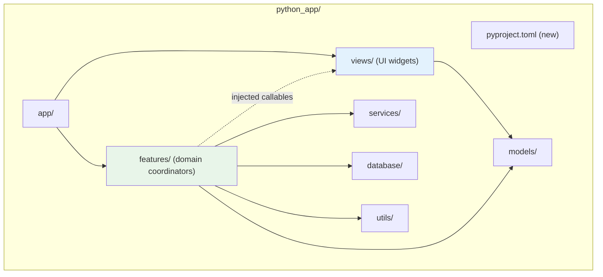

# Design Document: Project Structure Cleanup

## Overview

This design specifies how to modernize the MusicGenerator `python_app/` packaging, remove stale artifacts, enforce clean layer boundaries between `features/` and `views/`, decouple the `YouTubeCoordinator` from PyQt6, and standardize feature sub-package exports. The work is structured as five independent but sequentially-applied changes that collectively produce a well-layered, reproducibly-buildable codebase.

### Design Goals

- **Reproducible builds**: A single `pyproject.toml` declares all metadata, dependencies, and tooling.
- **Clean working tree**: No orphaned build artifacts, one-off scripts, or duplicate files.
- **Strict layering**: `views/` owns widget construction; `features/` owns domain orchestration with no direct PyQt6 imports.
- **Testability**: Coordinators accept injected callables for UI interactions, enabling unit testing without a Qt event loop.
- **Consistent conventions**: Every feature sub-package exports its coordinator and is re-exported at the top level.

## Architecture



### Layer Rules (enforced by `tests/test_architecture.py`)

| Source Package | May Import | Must NOT Import |
|---|---|---|
| `features/` | `services/`, `database/`, `models/`, `utils/` | `views/`, `app/`, **`PyQt6`** (new rule) |
| `views/` | `models/`, `utils/`, `features/` (ports only) | `database/`, `services/` |
| `services/` | `models/`, `utils/`, `database/` | `views/`, `app/` |

## Components and Interfaces

### Component 1: Build System (`pyproject.toml`)

A new `python_app/pyproject.toml` replaces the informal `requirements.txt` and provides:

```toml
[build-system]
requires = ["setuptools>=68.0"]
build-backend = "setuptools.build_meta"

[project]
name = "music-generator"
version = "1.0.0"
description = "PyQt6-based music generation, video export, and YouTube upload desktop application"
requires-python = ">=3.11"
license = {text = "MIT"}

dependencies = [
    "PyQt6==6.6.1",
    "psutil==5.9.8",
    "moderngl==5.10.0",
    "google-auth==2.28.1",
    "google-auth-oauthlib==1.2.0",
    "google-api-python-client==2.118.0",
]

[project.optional-dependencies]
dev = ["pytest>=7.4", "hypothesis>=6.92", "mypy>=1.8", "ruff>=0.2", "pytest-qt>=4.3"]
test = ["pytest>=7.4", "hypothesis>=6.92", "pytest-qt>=4.3"]

[project.scripts]
music-generator = "python_app.app.bootstrap:run"

[tool.pytest.ini_options]
testpaths = ["tests"]
pythonpath = ["."]

[tool.mypy]
strict = true
python_version = "3.11"
```

**Design Decision**: Exact version pins for runtime dependencies ensure reproducible builds. Dev/test groups use minimum versions (`>=`) since tooling compatibility is broader. The actual pinned versions will be determined from the current working environment at implementation time.

### Component 2: Stale Artifact Cleanup

A deterministic script/checklist that removes:

1. **Orphaned `__pycache__/` directories** — A directory is orphaned when *every* `.pyc` file inside it lacks a corresponding `.py` source in the parent directory. The cleanup logic:
   ```python
   for cache_dir in python_app.rglob("__pycache__"):
       parent = cache_dir.parent
       pyc_files = list(cache_dir.glob("*.pyc"))
       orphaned = all(
           not (parent / pyc.stem.split(".")[0]).with_suffix(".py").exists()
           for pyc in pyc_files
       )
       if orphaned:
           shutil.rmtree(cache_dir)
   ```

2. **`python_app/tools/` directory** — Contains `extract_components.py`, `extract_views.py`, `refactor_imports.py`, `remove_components.py`, `remove_methods.py`, `__init__.py`. All are one-off refactoring scripts no longer referenced.

3. **`python_app/SLAI-IMG.json`** — Duplicate of the repository-root copy.

4. **Temp files** — Files matching `**/video_templates_local.json.*.tmp` (currently two exist at the root of `python_app/`).

5. **Verification** — `.gitignore` already contains `**/__pycache__/` and `*.py[cod]`; no changes needed.

### Component 3: View Mixin Relocation

Both `features/progress/view.py` and `features/video_export/view.py` are thin re-export shims:

```python
# features/progress/view.py (BEFORE — to be deleted)
from ...views.progress_view import ProgressViewMixin
__all__ = ["ProgressViewMixin"]
```

**Relocation steps:**

1. Delete `features/progress/view.py` and `features/video_export/view.py`.
2. Remove `ProgressViewMixin` from `features/progress/__init__.py` exports.
3. Update any import that references `features.progress.view` or `features.video_export.view` to import from `views.progress_view` or `views.video_view` directly.
4. The canonical definitions already live in `views/progress_view.py` and `views/video_view.py` — no moves needed there.

**Import rewriting approach**: Use AST-based scanning (same approach as `test_architecture.py`) to find all files importing from the old paths and rewrite them. Verify with `ast.parse()` that modified files remain syntactically valid.

### Component 4: YouTubeCoordinator Decoupling

The `YouTubeCoordinator` currently imports `QTimer`, `QInputDialog`, and `QMessageBox` directly. These must be replaced with injected callables following the project's existing `ports.py` protocol pattern.

#### New Protocol: `UIInteractionPort`

```python
# features/ports.py (additions)
from typing import Callable, Protocol

class TimerHandle(Protocol):
    """Abstract handle for a periodic timer."""
    def start(self) -> None: ...
    def stop(self) -> None: ...
    def is_active(self) -> bool: ...

class UIInteractionPort(Protocol):
    """UI interaction callables injected into coordinators."""
    confirm_fn: Callable[[str, str], None]
    input_fn: Callable[[str, str, list[str], int], tuple[str, bool]]
    timer_factory: Callable[[int, Callable[[], None]], TimerHandle]
```

#### Constructor Changes

```python
class YouTubeCoordinator:
    def __init__(
        self,
        *,
        host: YouTubeHostPort,
        confirm_fn: Callable[[str, str], None] | None = None,
        input_fn: Callable[[str, str, list[str], int], tuple[str, bool]] | None = None,
        timer_factory: Callable[[int, Callable[[], None]], TimerHandle] | None = None,
        # ... existing params
    ) -> None:
        self._confirm = confirm_fn or self._noop_confirm
        self._input = input_fn or self._noop_input
        self._timer_factory = timer_factory or self._noop_timer_factory
```

#### Replacement Mapping

| Current PyQt6 Usage | Replacement |
|---|---|
| `QMessageBox.warning(host, title, msg)` | `self._confirm(title, msg)` |
| `QInputDialog.getItem(host, title, label, items, idx, False)` | `self._input(title, label, items, idx)` |
| `QTimer(host)` with `setInterval`/`timeout.connect`/`start`/`stop`/`isActive` | `self._timer_factory(interval_ms, callback)` returning `TimerHandle` |

#### Qt-Side Adapter (in `app/` or `views/`)

```python
# views/helpers/qt_ui_adapter.py
from PyQt6.QtCore import QTimer
from PyQt6.QtWidgets import QMessageBox, QInputDialog, QWidget

class QtTimerHandle:
    def __init__(self, interval_ms: int, callback, parent: QWidget):
        self._timer = QTimer(parent)
        self._timer.setInterval(interval_ms)
        self._timer.timeout.connect(callback)

    def start(self) -> None:
        self._timer.start()

    def stop(self) -> None:
        self._timer.stop()

    def is_active(self) -> bool:
        return self._timer.isActive()

def make_confirm_fn(parent: QWidget):
    def confirm(title: str, message: str) -> None:
        QMessageBox.warning(parent, title, message)
    return confirm

def make_input_fn(parent: QWidget):
    def input_fn(title: str, label: str, items: list[str], current: int) -> tuple[str, bool]:
        return QInputDialog.getItem(parent, title, label, items, current, False)
    return input_fn
```

#### Architecture Test Update

Add `"PyQt6"` to the forbidden imports set for `features/`:

```python
FORBIDDEN_IMPORTS: dict[str, set[str]] = {
    "features": {"views", "app", "PyQt6"},  # NEW
    # ... existing rules
}
```

### Component 5: Feature Export Standardization

#### Current State

| Sub-package | Has `coordinator.py` | Exports Coordinator in `__init__.py` | Re-exported in top-level |
|---|---|---|---|
| `auto_video` | ✅ | ❌ (empty `__init__.py`) | ❌ |
| `image` | ? | ? | ❌ |
| `image_prompts` | ✅ | ✅ | ✅ |
| `merge` | ? | ? | ❌ |
| `music` | ✅ | ✅ | ✅ |
| `persistence` | ✅ | ✅ | ✅ |
| `profiles` | ✅ | ✅ | ✅ |
| `progress` | ✅ | ✅ | ✅ |
| `templates` | ✅ | ✅ | ✅ |
| `text_presets` | ? | ? | ❌ |
| `video_export` | ✅ | ✅ | ✅ |
| `video_workspace` | ? | ? | ❌ |
| `youtube` | ✅ | ✅ | ✅ |

#### Convention to Enforce

1. Every sub-package with `coordinator.py` must export its `*Coordinator` class from `__init__.py`.
2. Sub-packages without `coordinator.py` must export at least one public class.
3. `features/__init__.py` must import and re-export at least one symbol from every sub-package.
4. A new test (`test_feature_exports.py` or integrated into `test_architecture.py`) enforces this convention dynamically.

## Data Models

### TimerHandle Protocol

```python
class TimerHandle(Protocol):
    """Minimal timer abstraction for coordinator use."""
    def start(self) -> None: ...
    def stop(self) -> None: ...
    def is_active(self) -> bool: ...
```

### pyproject.toml Schema (relevant fields)

```
[project]
  name: str
  version: str (semver)
  description: str
  requires-python: str (PEP 440)
  license: {text: str}
  dependencies: list[str] (PEP 508)

[project.optional-dependencies]
  dev: list[str]
  test: list[str]

[project.scripts]
  music-generator: str (entry point)
```

No database schema changes are required for this feature.

## Correctness Properties

*A property is a characteristic or behavior that should hold true across all valid executions of a system — essentially, a formal statement about what the system should do. Properties serve as the bridge between human-readable specifications and machine-verifiable correctness guarantees.*

### Property 1: Orphaned cache directory identification

*For any* directory tree containing `__pycache__/` directories with `.pyc` files, the cleanup logic SHALL remove a `__pycache__/` directory if and only if every `.pyc` file within it has no corresponding `.py` source file in the parent directory.

**Validates: Requirements 2.1**

### Property 2: Import rewriting preserves valid Python

*For any* syntactically valid Python source file containing an import from an old feature view path (e.g., `features.progress.view`), the import rewriter SHALL produce a file that is still parseable by `ast.parse()` and contains the equivalent import from the new views path.

**Validates: Requirements 3.3**

### Property 3: confirm_fn replaces all QMessageBox calls

*For any* YouTubeCoordinator state that triggers a user confirmation dialog, invoking the corresponding method SHALL call the injected `confirm_fn` callable with `(title: str, message: str)` arguments and SHALL NOT import or reference `QMessageBox`.

**Validates: Requirements 4.2**

### Property 4: input_fn replaces all QInputDialog calls

*For any* YouTubeCoordinator state that requires user selection from a list of items, invoking the corresponding method SHALL call the injected `input_fn` callable with `(title: str, label: str, items: list[str], current: int)` arguments and return the `tuple[str, bool]` result.

**Validates: Requirements 4.3**

### Property 5: timer_factory replaces all QTimer usage

*For any* interval and callback pair, when the YouTubeCoordinator creates a timer, it SHALL call the injected `timer_factory(interval_ms, callback)` and use the returned `TimerHandle` for `start()`, `stop()`, and `is_active()` operations.

**Validates: Requirements 4.4**

### Property 6: Feature export consistency

*For any* feature sub-package directory under `features/` that contains an `__init__.py`, if it also contains a `coordinator.py` module then its `__init__.py` SHALL export at least one class whose name ends with `Coordinator`, AND the top-level `features/__init__.py` SHALL import at least one public symbol from that sub-package.

**Validates: Requirements 5.2, 5.3**

## Error Handling

### Build System Errors
- If `pip install -e .` fails due to missing system dependencies (e.g., Qt libraries), the error message from pip is sufficient — no custom handling needed.
- Version pin conflicts surface at install time with clear pip resolver output.

### Cleanup Errors
- If a file cannot be deleted (permissions, lock), the cleanup script logs a warning and continues. All deletions are idempotent — running cleanup twice has no additional effect.
- The script never deletes files outside `python_app/` to prevent accidental damage.

### Import Rewriting Errors
- If a rewritten file fails `ast.parse()` validation, the rewrite is rolled back (original file preserved) and an error is reported.
- The rewriter operates on a copy and only replaces the original on successful validation.

### YouTubeCoordinator Fallback
- If `confirm_fn`, `input_fn`, or `timer_factory` are `None` at construction, the coordinator uses no-op implementations that log a warning. This prevents crashes but surfaces misconfiguration during development.
- The `TimerHandle` returned by no-op factory has `start()`/`stop()` as no-ops and `is_active()` always returns `False`.

### Export Standardization Errors
- If a sub-package `__init__.py` cannot be imported (syntax error, missing dependency), the export-consistency test reports the import error as a test failure with the traceback.

## Testing Strategy

### Property-Based Tests (Hypothesis)

Property-based testing applies to the pure-logic components of this feature:

- **Orphaned cache identification** (Property 1): Generate random directory structures with varying `.py`/`.pyc` combinations. Verify the cleanup predicate correctly identifies orphaned directories.
- **Import rewriting** (Property 2): Generate random Python source strings containing imports. Verify rewriting preserves parseability and correctly substitutes paths.
- **confirm_fn invocation** (Property 3): Generate random profile/db states and verify the coordinator calls confirm_fn.
- **input_fn invocation** (Property 4): Generate random channel lists and verify input_fn is called with correct arguments.
- **timer_factory usage** (Property 5): Generate random interval/callback pairs and verify timer_factory is used.
- **Feature export consistency** (Property 6): This is tested as an architectural invariant over the actual codebase (all sub-packages).

**Configuration**: Each property test runs a minimum of 100 iterations. Tests use Hypothesis with `@settings(max_examples=100)`.

**Tag format**: `# Feature: project-structure-cleanup, Property {N}: {description}`

### Unit Tests (pytest)

- `pyproject.toml` field validation (SMOKE tests for Requirements 1.1–1.6)
- Stale artifact absence checks (Requirements 2.2–2.5)
- View mixin file absence (Requirements 3.1, 3.2, 3.6)
- YouTubeCoordinator instantiation without PyQt6 (Requirement 4.5)
- Architecture test passes with new PyQt6 rule (Requirement 4.6)
- `auto_video` exports `AutoVideoCoordinator` (Requirement 5.1)

### Integration Tests

- `pip install -e .` in a fresh virtualenv (Requirements 1.7, 1.8)
- Full test suite green after each change (Requirements 2.6, 3.4, 3.5, 5.5)

### Test Library

- **Property-based testing**: `hypothesis` (already in use — `.hypothesis/` directory exists)
- **Test runner**: `pytest` (already in use)
- **Qt mocking**: `pytest-qt` for any tests that need Qt fixtures
