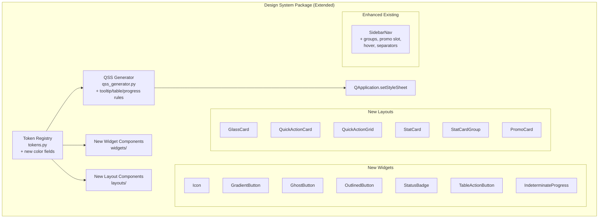

# Design Document: UI Component Library

## Overview

This design extends the existing `python_app/design_system/` package with a comprehensive set of higher-level UI components and updated token palette to match a modern dashboard aesthetic: deep navy backgrounds, cyan/teal accents, glass-morphism card surfaces, gradient buttons with glow effects, status badges, icon integration, and reusable composite components (quick-action grids, stat cards, promotional cards).

The extension builds on top of the established architecture (TokenRegistry, QSSGenerator, widget/layout modules) without breaking backward compatibility. All new components consume design tokens through the same patterns already established—QSS property selectors, frozen dataclass tokens, and the QSSGenerator pipeline.

### Design Decisions

- **Extended ColorTokens dataclass**: Add new fields (surface_elevated, accent_glow, border_glass, status colors, secondary accent) to the existing `ColorTokens` rather than creating a separate token class. This maintains the single-source-of-truth pattern.
- **QGraphicsDropShadowEffect for glow**: Qt's built-in drop shadow effect provides hardware-accelerated glow simulation without custom paint overrides, keeping the gradient button implementation straightforward.
- **SVG icon rendering via QSvgRenderer**: Uses Qt's built-in SVG support (from PyQt6-svg) rather than rasterizing at load time, allowing clean scaling and color tinting via SVG attribute manipulation.
- **Composition over inheritance for composite widgets**: Quick_Action_Grid, Stat_Card_Group, and similar containers compose simpler widget types rather than subclassing, following the existing Card/Panel pattern.
- **Signal-based interaction pattern**: All clickable components emit typed Qt signals (consistent with SidebarNav.navigation_requested), keeping UI logic decoupled from widget internals.
- **QPainter gradient rendering for Gradient_Button**: Since QSS doesn't support `linear-gradient` on QPushButton backgrounds, the button uses a custom `paintEvent` with `QLinearGradient` for the background while inheriting QSS for text styling and sizing.

## Architecture



### Package Structure Extension

```
python_app/design_system/
├── tokens.py                # Extended ColorTokens with new fields
├── qss_generator.py         # Extended with tooltip, enhanced table/input/progress rules
├── widgets/
│   ├── buttons.py           # + GhostButton, OutlinedButton (new variants)
│   ├── gradient_button.py   # NEW: GradientButton with QPainter gradient + glow
│   ├── status_badge.py      # NEW: StatusBadge (pill + dot modes)
│   ├── icon.py              # NEW: Icon widget (SVG rendering + tinting)
│   ├── table_action_button.py  # NEW: TableActionButton (compact, icon-only/text modes)
│   ├── indeterminate_progress.py  # NEW: IndeterminateProgress animated bar
│   └── ... (existing unchanged)
├── layouts/
│   ├── glass_card.py        # NEW: GlassCard (frosted-glass surface)
│   ├── quick_action.py      # NEW: QuickActionCard + QuickActionGrid
│   ├── stat_card.py         # NEW: StatCard + StatCardGroup
│   ├── promo_card.py        # NEW: PromoCard (gradient CTA)
│   ├── sidebar_nav.py       # ENHANCED: groups, promo slot, hover, separators
│   └── ... (existing unchanged)
└── assets/
    └── icons/               # NEW: SVG icon assets directory (Lucide-style)
```

## Components and Interfaces

### Extended Token Registry (`tokens.py`)

```python
@dataclass(frozen=True)
class ColorTokens:
    # Existing fields preserved...
    surface_base: str
    surface_raised: str
    surface_overlay: str
    surface_sunken: str
    
    # NEW: Additional surface level
    surface_elevated: str       # #1e2548 range — cards/elevated elements
    
    # Existing text tokens preserved...
    text_primary: str
    text_secondary: str
    text_muted: str
    
    # Existing accent preserved...
    accent: str
    accent_hover: str
    accent_pressed: str
    
    # NEW: Accent glow for button effects
    accent_glow: str            # accent at ~40% opacity for box-shadow simulation
    
    # NEW: Secondary accent (purple)
    secondary_accent: str       # #7c3aed
    secondary_accent_hover: str # #a855f7
    
    # Existing semantic colors preserved...
    success: str
    success_hover: str
    warning: str
    warning_hover: str
    danger: str
    danger_hover: str
    
    # NEW: Status colors (distinct from semantic action colors)
    status_active: str          # #10b981 (green)
    status_inactive: str        # #6b7280 (gray)
    status_premium: str         # #a855f7 (purple)
    status_warning: str         # #f59e0b (orange)
    
    # Existing borders preserved...
    border: str
    border_strong: str
    separator: str
    
    # NEW: Glass-morphism border
    border_glass: str           # rgba white at 10% opacity as hex (#ffffff1a)
    
    # Existing interactive preserved...
    selection: str
    focus_ring: str
```

The default dark theme values update to the deep navy palette:
- `surface_base` → `#0a0e27`
- `surface_raised` → `#0f1538`
- `surface_overlay` → `#1a1f3a`
- `surface_sunken` → `#070b1e`
- `surface_elevated` → `#1e2548`
- `accent` → `#00d4ff`
- `accent_glow` → `#00d4ff66` (40% opacity)
- `secondary_accent` → `#7c3aed`
- `border_glass` → `#ffffff1a`

### Validation Extension

The `TokenRegistry.validate_variant()` method extends to validate:
- All color tokens match `#RRGGBB` or `#RRGGBBAA` pattern
- Typography size tokens are positive integers in range 8–72
- Spacing tokens are non-negative integers in range 0–64
- Shape radius tokens are non-negative integers in range 0–32

```python
import re

_HEX_COLOR_RE = re.compile(r"^#[0-9a-fA-F]{6}([0-9a-fA-F]{2})?$")

def validate_variant(self, tokens: ThemeTokens) -> list[str]:
    """Extended validation with value constraint checking."""
    errors: list[str] = []
    
    # Existing field-presence validation...
    
    # Color format validation
    for f in fields(tokens.colors):
        val = getattr(tokens.colors, f.name)
        if val is not None and not _HEX_COLOR_RE.match(val):
            errors.append(f"colors.{f.name}: '{val}' is not a valid hex color")
    
    # Typography range validation
    for f in fields(tokens.typography):
        if f.name == "font_family":
            continue
        val = getattr(tokens.typography, f.name)
        if f.name.startswith("size_") and not (8 <= val <= 72):
            errors.append(f"typography.{f.name}: {val} not in range 8-72")
    
    # Spacing range validation
    for f in fields(tokens.spacing):
        val = getattr(tokens.spacing, f.name)
        if not (0 <= val <= 64):
            errors.append(f"spacing.{f.name}: {val} not in range 0-64")
    
    # Shape range validation
    for f in fields(tokens.shape):
        val = getattr(tokens.shape, f.name)
        if f.name.startswith("radius_") and not (0 <= val <= 32):
            errors.append(f"shape.{f.name}: {val} not in range 0-32")
    
    return errors
```

### Icon Widget (`widgets/icon.py`)

```python
from PyQt6.QtWidgets import QWidget
from PyQt6.QtSvg import QSvgRenderer
from PyQt6.QtCore import QSize, QRectF
from PyQt6.QtGui import QPainter, QColor

_SIZES = {"small": 16, "medium": 20, "large": 24, "xlarge": 32}
_ICON_DIR = Path(__file__).parent.parent / "assets" / "icons"
_FALLBACK_ICON = "circle"  # placeholder

class Icon(QWidget):
    """SVG icon widget with color tinting and size variants."""
    
    def __init__(
        self,
        name: str,
        size: str = "medium",
        color: str | None = None,
        opacity: float = 1.0,
        parent: QWidget | None = None,
    ) -> None: ...
    
    def setColor(self, color: str) -> None: ...
    def setOpacity(self, opacity: float) -> None: ...
    def paintEvent(self, event) -> None: ...
```

The icon loads SVG from `assets/icons/{name}.svg`. If the file doesn't exist, it falls back to a placeholder and logs a warning. Color tinting is applied by modifying the SVG `stroke` attribute before rendering (since Lucide icons use stroke-based drawing).

### Glass Card (`layouts/glass_card.py`)

```python
from PyQt6.QtWidgets import QWidget, QVBoxLayout
from PyQt6.QtCore import pyqtSignal, Qt

class GlassCard(QWidget):
    """Glass-morphism card with semi-transparent background and frosted border."""
    
    clicked = pyqtSignal()
    
    def __init__(
        self,
        title: str = "",
        subtitle: str = "",
        clickable: bool = False,
        padding: int = 16,
        border_radius: int = 12,
        parent: QWidget | None = None,
    ) -> None: ...
    
    def setTitle(self, title: str) -> None: ...
    def setSubtitle(self, subtitle: str) -> None: ...
    def addWidget(self, widget: QWidget) -> None: ...
    def enterEvent(self, event) -> None: ...  # border brightness on hover
    def leaveEvent(self, event) -> None: ...
    def mousePressEvent(self, event) -> None: ...  # emit clicked if clickable
```

Visual styling: `surface_elevated` background, `border_glass` 1px border, `radius_lg` (12px) corners. Hover state brightens border to ~20% white opacity.

### Status Badge (`widgets/status_badge.py`)

```python
class StatusBadge(QWidget):
    """Colored pill badge or dot indicator for item status."""
    
    VARIANTS = {"active", "inactive", "premium", "warning"}
    
    def __init__(
        self,
        text: str = "",
        variant: str = "active",
        dot_mode: bool = False,
        background_color: str | None = None,
        text_color: str | None = None,
        parent: QWidget | None = None,
    ) -> None: ...
    
    def setVariant(self, variant: str) -> None: ...
```

In pill mode: rounded-full corners, 6px horizontal padding, 2px vertical padding, caption font size. In dot mode: 8px diameter circle, no text.

### Gradient Button (`widgets/gradient_button.py`)

```python
from PyQt6.QtWidgets import QPushButton, QGraphicsDropShadowEffect
from PyQt6.QtGui import QPainter, QLinearGradient, QColor

class GradientButton(QPushButton):
    """Primary CTA button with linear gradient background and glow effect."""
    
    def __init__(
        self,
        text: str = "",
        icon_name: str | None = None,
        parent: QWidget | None = None,
    ) -> None: ...
    
    def paintEvent(self, event) -> None: ...  # QPainter gradient fill
    def enterEvent(self, event) -> None: ...  # intensify glow
    def leaveEvent(self, event) -> None: ...  # restore default glow
```

Uses `QGraphicsDropShadowEffect` with `accent_glow` color for the outer glow. The gradient goes from `accent` → lighter variant. Disabled state removes the shadow effect and uses a flat muted background.

### Ghost and Outlined Buttons (`widgets/buttons.py` extension)

```python
class GhostButton(QPushButton):
    """Text-only button with transparent background and accent text."""
    
    def __init__(
        self,
        text: str = "",
        icon_name: str | None = None,
        danger: bool = False,
        parent: QWidget | None = None,
    ) -> None:
        super().__init__(text, parent)
        role = "ghostDanger" if danger else "ghost"
        self.setProperty("uiRole", role)

class OutlinedButton(QPushButton):
    """Border-only button with accent border and text."""
    
    def __init__(
        self,
        text: str = "",
        icon_name: str | None = None,
        danger: bool = False,
        parent: QWidget | None = None,
    ) -> None:
        super().__init__(text, parent)
        role = "outlinedDanger" if danger else "outlined"
        self.setProperty("uiRole", role)
```

QSS handles styling via `uiRole` property selectors for ghost/outlined/ghostDanger/outlinedDanger variants.

### Quick Action Components (`layouts/quick_action.py`)

```python
from PyQt6.QtWidgets import QWidget, QGridLayout, QVBoxLayout
from PyQt6.QtCore import pyqtSignal

class QuickActionCard(QWidget):
    """Clickable card with centered icon and label."""
    
    action_triggered = pyqtSignal(str)
    
    def __init__(
        self,
        key: str,
        icon_name: str,
        label: str,
        parent: QWidget | None = None,
    ) -> None: ...

class QuickActionGrid(QWidget):
    """Grid layout for QuickActionCard items."""
    
    action_triggered = pyqtSignal(str)
    
    def __init__(
        self,
        actions: list[dict],  # [{"key": str, "icon_name": str, "label": str}]
        columns: int = 4,
        gap: int = 12,
        parent: QWidget | None = None,
    ) -> None: ...
```

### Stat Card Components (`layouts/stat_card.py`)

```python
class StatCard(QWidget):
    """Key-value metric display with optional icon."""
    
    def __init__(
        self,
        label: str,
        value: str,
        icon_name: str | None = None,
        parent: QWidget | None = None,
    ) -> None: ...
    
    def setValue(self, value: str) -> None: ...

class StatCardGroup(QWidget):
    """Horizontal/vertical arrangement of StatCards with separators."""
    
    def __init__(
        self,
        stats: list[dict],  # [{"label": str, "value": str, "icon_name": str | None}]
        orientation: str = "horizontal",
        parent: QWidget | None = None,
    ) -> None: ...
```

### Promo Card (`layouts/promo_card.py`)

```python
class PromoCard(QWidget):
    """Gradient-background promotional CTA card for sidebar areas."""
    
    action_clicked = pyqtSignal()
    
    def __init__(
        self,
        title: str,
        description: str = "",
        button_text: str = "",
        icon_name: str | None = None,
        gradient_start: str = "#7c3aed",
        gradient_end: str = "#3b82f6",
        parent: QWidget | None = None,
    ) -> None: ...
```

Uses custom `paintEvent` with `QLinearGradient` for the gradient background. Contains title label, description label, and a button that emits `action_clicked`.

### Enhanced Sidebar Navigation (`layouts/sidebar_nav.py`)

Extensions to the existing `SidebarNav`:

```python
class SidebarNav(QWidget):
    navigation_requested = pyqtSignal(str)
    
    def __init__(
        self,
        items: list[dict],
        # items now support: {"key", "icon", "label", "group": str|None, "separator": bool}
        bottom_widget: QWidget | None = None,  # NEW: promo card slot
        parent: QWidget | None = None,
    ) -> None: ...
    
    def setBottomWidget(self, widget: QWidget) -> None: ...  # NEW
```

Enhancements:
- Group headers rendered as uppercase muted text labels
- Item `separator` flag renders a horizontal divider line below that item
- Hover state adds subtle background tint to inactive items
- Active state uses semi-transparent accent background + accent icon tint
- Bottom slot area for `PromoCard` or arbitrary widget

### Table Action Button (`widgets/table_action_button.py`)

```python
class TableActionButton(QPushButton):
    """Compact button for table action columns."""
    
    def __init__(
        self,
        text: str = "",
        icon_name: str | None = None,
        variant: str = "ghost",  # "ghost", "outlined", "launch"
        parent: QWidget | None = None,
    ) -> None: ...
```

The "launch" variant uses accent background. Icon-only mode sets no text and reduces padding.

### Indeterminate Progress (`widgets/indeterminate_progress.py`)

```python
from PyQt6.QtWidgets import QWidget
from PyQt6.QtCore import QTimer, QPropertyAnimation

class IndeterminateProgress(QWidget):
    """Animated horizontal bar indicating loading state."""
    
    def __init__(self, parent: QWidget | None = None) -> None: ...
    def start(self) -> None: ...
    def stop(self) -> None: ...
    def paintEvent(self, event) -> None: ...  # animated accent segment
```

Uses `QPropertyAnimation` on an internal position property to sweep a colored segment left-to-right continuously.

### QSS Generator Extensions

The `QSSGenerator.generate()` method adds new section builders:

```python
def generate(self) -> str:
    sections = [
        # ... existing sections ...
        self._tooltips(),          # NEW: QToolTip styling
        self._ghost_outlined(),    # NEW: ghost/outlined button roles
        self._enhanced_tables(),   # NEW: alternating rows, header treatment
        self._enhanced_inputs(),   # NEW: min-height, placeholder color, glow focus
        self._enhanced_progress(), # NEW: caption text, rounded endpoints
    ]
    return "\n\n".join(sections)
```

New QSS rules generated:
- `QToolTip` — overlay background, semi-transparent border, 6px radius
- `QMenu` — enhanced with glass-morphism border, reduced-opacity separator
- `QPushButton[uiRole="ghost"]` — transparent bg, accent text, hover tint
- `QPushButton[uiRole="outlined"]` — transparent bg, accent border, filled on hover
- `QPushButton[uiRole="ghostDanger"]` / `QPushButton[uiRole="outlinedDanger"]` — danger color variants
- `QTableWidget` — alternating `surface_raised`/`surface_base` row backgrounds
- `QHeaderView::section` — uppercase treatment (smaller font-size), muted text, bottom border
- Input fields — `min-height: 38px`, placeholder in `text_muted`, accent border + glow on focus
- `QProgressBar` — 7px height, rounded chunk endpoints, caption text centered

## Data Models

### Extended Token Value Types

| Category    | New Token Path             | Python Type | Range/Constraints           |
|-------------|---------------------------|-------------|-----------------------------|
| Color       | `colors.surface_elevated`  | `str`       | `#RRGGBB`                   |
| Color       | `colors.accent_glow`       | `str`       | `#RRGGBBAA`                 |
| Color       | `colors.secondary_accent`  | `str`       | `#RRGGBB`                   |
| Color       | `colors.secondary_accent_hover` | `str`  | `#RRGGBB`                   |
| Color       | `colors.status_active`     | `str`       | `#RRGGBB`                   |
| Color       | `colors.status_inactive`   | `str`       | `#RRGGBB`                   |
| Color       | `colors.status_premium`    | `str`       | `#RRGGBB`                   |
| Color       | `colors.status_warning`    | `str`       | `#RRGGBB`                   |
| Color       | `colors.border_glass`      | `str`       | `#RRGGBBAA`                 |

### Status Badge Variant Map

| Variant     | Background Token       | Text Color       |
|-------------|----------------------|------------------|
| `active`    | `status_active`       | white            |
| `inactive`  | `status_inactive`     | white            |
| `premium`   | `status_premium`      | white            |
| `warning`   | `status_warning`      | white (or dark)  |

### Icon Size Map

| Size Variant | Pixels | Use Case                    |
|--------------|--------|-----------------------------|
| `small`      | 16px   | Inline, table cells         |
| `medium`     | 20px   | Navigation, badges          |
| `large`      | 24px   | Cards, section headers      |
| `xlarge`     | 32px   | Feature highlights, heroes  |

### Quick Action Descriptor

```python
@dataclass
class ActionDescriptor:
    key: str        # Unique action identifier (emitted in signal)
    icon_name: str  # SVG icon name from assets/icons/
    label: str      # Display text below icon
```

### Stat Descriptor

```python
@dataclass
class StatDescriptor:
    label: str              # Muted metric label
    value: str              # Primary metric value text
    icon_name: str | None   # Optional icon name
```


## Correctness Properties

*A property is a characteristic or behavior that should hold true across all valid executions of a system—essentially, a formal statement about what the system should do. Properties serve as the bridge between human-readable specifications and machine-verifiable correctness guarantees.*

### Property 1: Token-to-QSS Color Round Trip

*For any* valid ThemeTokens instance (with all color fields matching `#RRGGBB` or `#RRGGBBAA`), every color token value present in the token set SHALL appear verbatim as a substring in the QSS string produced by `QSSGenerator.generate()`.

**Validates: Requirements 1.7, 15.6**

### Property 2: Token Validation Catches Invalid Values

*For any* ThemeTokens instance containing one or more invalid field values (color not matching `#RRGGBB(AA)?`, typography size outside 8–72, spacing outside 0–64, or shape radius outside 0–32), `TokenRegistry.validate_variant()` SHALL return a non-empty error list containing the path of every invalid field. Conversely, *for any* fully valid ThemeTokens instance, validation SHALL return an empty list.

**Validates: Requirements 15.1, 15.2, 15.3, 15.4, 15.5**

### Property 3: GlassCard Configuration Preservation

*For any* valid padding integer (0–64), valid border-radius integer (0–32), non-empty title string, and non-empty subtitle string, creating a `GlassCard(title=t, subtitle=s, padding=p, border_radius=r)` SHALL result in the title label displaying text `t`, the subtitle label displaying text `s`, and the card's internal layout having content margins equal to `p` on all sides.

**Validates: Requirements 2.2, 2.3, 2.4, 2.7**

### Property 4: GlassCard Clickable Signal Emission

*For any* GlassCard created with `clickable=True`, simulating a mouse press event SHALL cause the `clicked` signal to be emitted exactly once.

**Validates: Requirements 2.6**

### Property 5: StatusBadge Variant-to-Color Mapping

*For any* variant string in `{"active", "inactive", "premium", "warning"}`, creating a `StatusBadge(variant=v)` SHALL apply the background color corresponding to the matching status token (`status_active`, `status_inactive`, `status_premium`, `status_warning`). Additionally, *for any* valid hex color strings passed as `background_color` and `text_color` overrides, those override colors SHALL be used instead of the variant defaults.

**Validates: Requirements 3.2, 3.4, 3.6**

### Property 6: QuickActionCard Signal Emission with Key

*For any* non-empty action key string, creating a `QuickActionCard(key=k)` and simulating a click SHALL emit the `action_triggered` signal with the value `k`.

**Validates: Requirements 5.3**

### Property 7: QuickActionGrid Item Count and Column Layout

*For any* list of action descriptors (1–20 items) and column count (1–8), creating a `QuickActionGrid(actions=items, columns=cols)` SHALL render exactly `len(items)` child QuickActionCard widgets arranged in a grid with `cols` columns.

**Validates: Requirements 5.5, 5.6**

### Property 8: StatCard Value Display and Update

*For any* non-empty label string, initial value string, and subsequent new value string, creating a `StatCard(label=l, value=v)` SHALL display `l` as the label and `v` as the value. Calling `setValue(new_v)` SHALL update the displayed value to `new_v` without changing the label text.

**Validates: Requirements 6.1, 6.6**

### Property 9: StatCardGroup Renders Correct Item Count

*For any* list of stat descriptors (1–12 items), creating a `StatCardGroup(stats=items)` SHALL render exactly `len(items)` StatCard children.

**Validates: Requirements 6.4, 6.5**

### Property 10: PromoCard Content Display and Signal

*For any* non-empty title, description, and button_text strings, and any two valid hex color strings for gradient start/end, creating a `PromoCard(title=t, description=d, button_text=bt, gradient_start=gs, gradient_end=ge)` SHALL display all three text values. Clicking the action button SHALL emit the `action_clicked` signal.

**Validates: Requirements 7.1, 7.2, 7.4, 7.6**

### Property 11: Ghost and Outlined Button Role Mapping

*For any* button type in `{GhostButton, OutlinedButton}` and danger flag in `{True, False}`, creating the button SHALL set the `uiRole` dynamic property to the correct value: `"ghost"`, `"ghostDanger"`, `"outlined"`, or `"outlinedDanger"` respectively.

**Validates: Requirements 12.1, 12.2, 12.6**

### Property 12: Icon Size Variant Mapping

*For any* size variant in `{"small", "medium", "large", "xlarge"}` with expected pixel values `{16, 20, 24, 32}`, creating an `Icon(name=n, size=s)` SHALL result in the widget's fixed width and height equaling the expected pixel value for that variant.

**Validates: Requirements 9.1, 9.3**

### Property 13: Icon Opacity and Color Storage

*For any* valid opacity float in `[0.0, 1.0]` and any valid hex color string, creating an `Icon(opacity=o, color=c)` SHALL store those values such that `icon.opacity == o` and `icon.color == c`.

**Validates: Requirements 9.2, 9.6**

### Property 14: SidebarNav Item Rendering and Separator Flags

*For any* non-empty list of valid navigation item dictionaries (each with "key", "icon", "label", and optional "separator" boolean and "group" string), creating a `SidebarNav(items=items)` SHALL render navigation entries for all items, and items with `separator=True` SHALL have a divider rendered below them.

**Validates: Requirements 8.1, 8.4, 8.7**

### Property 15: QSS Structural Completeness for New Selectors

*For any* valid ThemeTokens instance, the QSS string produced by `QSSGenerator.generate()` SHALL contain selectors for `QToolTip`, `QPushButton[uiRole="ghost"]`, `QPushButton[uiRole="outlined"]`, `QPushButton[uiRole="ghostDanger"]`, `QPushButton[uiRole="outlinedDanger"]`, and `QProgressBar` with `:hover` pseudo-state rules for the ghost/outlined variants.

**Validates: Requirements 12.3, 12.4, 13.1, 13.2, 14.1**


## Error Handling

### Token Registry Errors

| Scenario | Behavior |
|----------|----------|
| Color token not matching `#RRGGBB` or `#RRGGBBAA` | `ValueError` raised listing all invalid color tokens |
| Typography size outside 8–72 range | `ValueError` raised listing invalid size tokens |
| Spacing value outside 0–64 range | `ValueError` raised listing invalid spacing tokens |
| Shape radius outside 0–32 range | `ValueError` raised listing invalid shape tokens |
| Multiple invalid tokens | Single `ValueError` with ALL invalid fields listed (not fail-fast) |

### Icon Widget Errors

| Scenario | Behavior |
|----------|----------|
| Icon name not found in `assets/icons/` directory | Fallback placeholder icon rendered, warning logged via `logging.warning()` |
| Invalid size variant string | Falls back to "medium" (20px) with warning log |
| Opacity outside 0.0–1.0 | Clamped to nearest bound (0.0 or 1.0) with warning log |

### Status Badge Errors

| Scenario | Behavior |
|----------|----------|
| Unknown variant string | Falls back to "inactive" variant with warning log |
| Invalid hex color override | Uses variant default color, logs warning |

### Gradient Button Errors

| Scenario | Behavior |
|----------|----------|
| Icon name provided but not found | Button renders text-only, logs warning |
| Button disabled programmatically | Glow effect removed, flat muted background applied |

### Quick Action Grid Errors

| Scenario | Behavior |
|----------|----------|
| Action descriptor missing "key" field | `ValueError` raised listing the malformed descriptor |
| Column count < 1 | Clamped to 1 with warning log |
| Empty actions list | Empty grid rendered (no error) |

### Stat Card Errors

| Scenario | Behavior |
|----------|----------|
| Empty stats list to StatCardGroup | Empty container rendered (no error) |
| setValue called with None | Empty string displayed, no crash |

### Promo Card Errors

| Scenario | Behavior |
|----------|----------|
| Invalid gradient color strings | Falls back to default purple-to-blue gradient with warning log |

### Sidebar Navigation Errors

| Scenario | Behavior |
|----------|----------|
| Item missing required "key" field | `ValueError` raised (existing behavior preserved) |
| Unknown group name in items | Group header rendered as-is (no validation on group strings) |
| bottom_widget is None | Bottom slot area empty (no error) |

### QSS Generator Errors

| Scenario | Behavior |
|----------|----------|
| Tokens contain non-hex characters in color fields | Should be caught by validation before reaching generator; if somehow passed, values interpolated as-is (Qt ignores invalid color) |
| Missing new token fields in older theme variants | `ValueError` during registration (new fields are required) |


## Testing Strategy

### Property-Based Testing (Hypothesis)

The project already has `hypothesis>=6.92` as a dev/test dependency. Each correctness property above maps to a single property-based test running **minimum 100 iterations**.

**Library:** [Hypothesis](https://hypothesis.readthedocs.io/) (already in `pyproject.toml`)

**Test file location:** `python_app/tests/test_ui_component_library_properties.py`

**Configuration:**
```python
from hypothesis import given, settings, assume
from hypothesis.strategies import (
    text, integers, sampled_from, lists, fixed_dictionaries,
    composite, floats, booleans, from_regex
)

@settings(max_examples=100)
```

**Tag format for each test:**
```python
# Feature: ui-component-library, Property 1: Token-to-QSS Color Round Trip
```

**Custom strategies needed:**
- `valid_hex_color()` — generates strings matching `#[0-9a-fA-F]{6}` or `#[0-9a-fA-F]{8}`
- `invalid_hex_color()` — generates strings that do NOT match valid hex pattern
- `valid_theme_tokens()` — generates complete ThemeTokens with all new fields populated with valid values
- `valid_padding()` — integers in range 0–64
- `valid_border_radius()` — integers in range 0–32
- `valid_typography_size()` — integers in range 8–72
- `valid_spacing()` — integers in range 0–64
- `valid_shape_radius()` — integers in range 0–32
- `nav_item_dicts()` — generates lists of `{"key": str, "icon": str, "label": str, "separator": bool, "group": str|None}` dicts
- `action_descriptors()` — generates lists of `{"key": str, "icon_name": str, "label": str}` dicts
- `stat_descriptors()` — generates lists of `{"label": str, "value": str, "icon_name": str|None}` dicts

### Unit Tests (pytest)

**Test file location:** `python_app/tests/test_ui_component_library_unit.py`

Example-based tests covering:
- Default dark theme has correct new token values (surface_elevated, accent_glow, status colors, etc.)
- GlassCard hover applies border style change
- StatusBadge dot_mode renders 8px circle with no text
- GradientButton has QGraphicsDropShadowEffect attached
- GradientButton hover increases blur radius, press decreases it
- GradientButton disabled removes shadow effect
- Icon fallback behavior when file not found
- IndeterminateProgress animation starts/stops correctly
- TableActionButton icon-only vs icon-with-text modes
- SidebarNav bottom slot renders provided widget
- QSS output contains `min-height: 38px` for input fields
- QSS output contains `text-align: center` for progress bar text

### Integration Tests (pytest-qt)

**Test file location:** `python_app/tests/test_ui_component_library_integration.py`

Integration tests requiring `QApplication`:
- GlassCard renders correctly inside a parent layout
- QuickActionGrid signal propagation (card click → grid signal)
- SidebarNav with PromoCard in bottom slot renders correctly
- Global QSS with new tokens applied styles all new button variants
- Full component tree: GlassCard containing StatCardGroup renders without error

### Test Balance

- **Property tests (15 properties × 100+ iterations):** Verify universal correctness of token validation, QSS generation, component configuration, signal emission, and role mapping
- **Unit tests (~25 tests):** Cover specific visual behaviors, edge cases, disabled states, fallback logic, and animation state
- **Integration tests (~5 tests):** Verify Qt runtime rendering, signal propagation through composed widgets, and QSS cascade with new selectors

