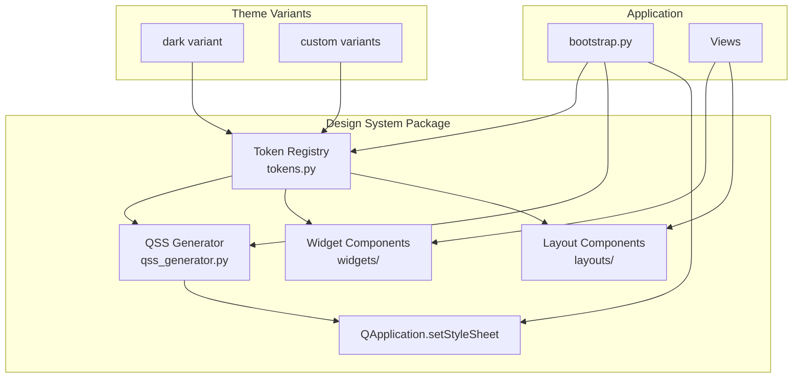

# Design Document: UI Design System

## Overview

This design defines a comprehensive, scalable UI design system for the MusicGenerator PyQt6 desktop application. The system replaces the current monolithic `theme.py` (a single dictionary of token values and a large f-string QSS builder) with a modular architecture composed of:

1. **Token Registry** — A typed, validatable store of all design values (colors, typography, spacing, shape)
2. **QSS Generator** — A structured stylesheet compiler that builds valid Qt Style Sheets from tokens
3. **Widget Components** — Reusable, self-styling PyQt6 widgets (buttons, toggles, sliders, inputs, transport controls)
4. **Layout Components** — Structural containers (cards, panels, sidebar navigation)
5. **Theme Variant System** — Multi-theme support with runtime switching
6. **Developer Documentation** — Pattern library with usage examples and migration guide

The design system is incrementally adoptable: global QSS provides baseline styling to all widgets, while design system components deliver richer behavior. Existing views continue to function without modification during migration.

### Design Decisions

- **Python dataclass tokens over raw dict**: Provides type safety, IDE autocomplete, and immutability guarantees
- **QSS over per-widget paintEvent**: Leverages Qt's built-in styling cascade, reducing custom paint code and enabling global theme switches
- **Dynamic properties for variants**: Uses Qt's `setProperty()` + QSS property selectors (already established in the codebase via `uiRole`, `uiPanel`, `uiField`)
- **Hypothesis for PBT**: Already a dev dependency; natural fit for property-based testing of token validation and QSS generation

## Architecture



The design system lives in a new package: `python_app/design_system/`. This separates concerns from the existing `app/theme.py` (which remains for backward compatibility during migration) and the `views/components/` package (which holds domain-specific widgets like SpectrumPreview).

### Package Structure

```
python_app/design_system/
├── __init__.py              # Public API exports
├── tokens.py                # Token Registry (dataclasses + variant loading)
├── qss_generator.py         # QSS string compilation from tokens
├── widgets/
│   ├── __init__.py
│   ├── buttons.py           # PrimaryButton, SecondaryButton, DangerButton, etc.
│   ├── toggle_switch.py     # ToggleSwitch with animation
│   ├── custom_slider.py     # CustomSlider with accent fill
│   ├── inputs.py            # StyledLineEdit, StyledComboBox, StyledSpinBox
│   ├── labels.py            # TypedLabel for each typography level
│   ├── transport.py         # TransportButton, SeekBar
│   └── now_playing_card.py  # NowPlayingCard composite widget
├── layouts/
│   ├── __init__.py
│   ├── card.py              # Card container
│   ├── panel.py             # Panel with header/content areas
│   ├── sidebar_nav.py       # SidebarNav navigation component
│   └── section_divider.py   # Horizontal separator line
└── _compat.py               # Backward-compatibility shims (deprecation warnings)
```

## Components and Interfaces

### Token Registry (`tokens.py`)

```python
from __future__ import annotations
from dataclasses import dataclass, fields, asdict
from typing import ClassVar

@dataclass(frozen=True)
class ColorTokens:
    # Surfaces (4 levels)
    surface_base: str       # Deepest background (#111a28)
    surface_raised: str     # Sidebar/panels (#141d2c)
    surface_overlay: str    # Dropdowns/popups (#162233)
    surface_sunken: str     # Inputs/insets (#0e1623)
    
    # Text hierarchy (3 levels)
    text_primary: str       # Main text (#eef4ff)
    text_secondary: str     # Less prominent (#d9e5fb)
    text_muted: str         # Hints/disabled (#8ea4c7)
    
    # Accent / semantic
    accent: str             # Primary accent (#00bcd4)
    accent_hover: str       # Hover state
    accent_pressed: str     # Pressed state
    success: str            # Green (#198754)
    success_hover: str
    warning: str            # Amber (#b86917)
    warning_hover: str
    danger: str             # Red (#aa2e2e)
    danger_hover: str
    
    # Borders/separators
    border: str             # Standard border (#27354b)
    border_strong: str      # Emphasized border (#31435d)
    separator: str          # Divider lines (#27354b)
    
    # Interactive
    selection: str           # Selection highlight
    focus_ring: str          # Focus border color (accent)

@dataclass(frozen=True)
class TypographyTokens:
    font_family: str         # "Segoe UI"
    size_title: int          # 18px
    size_subtitle: int       # 14px
    size_body: int           # 12px
    size_caption: int        # 10px
    weight_regular: int      # 400
    weight_medium: int       # 500
    weight_bold: int         # 700

@dataclass(frozen=True)
class SpacingTokens:
    # Component padding
    padding_sm: int          # 4px
    padding_md: int          # 8px
    padding_lg: int          # 16px
    # Layout gaps
    gap_sm: int              # 4px
    gap_md: int              # 8px
    gap_lg: int              # 16px
    # Margins
    margin_sm: int           # 4px
    margin_md: int           # 12px
    margin_lg: int           # 24px

@dataclass(frozen=True)
class ShapeTokens:
    radius_sm: int           # 4px
    radius_md: int           # 8px
    radius_lg: int           # 12px
    border_width_thin: int   # 1px
    border_width_medium: int # 2px

@dataclass(frozen=True)
class ThemeTokens:
    """Complete token set for a theme variant."""
    colors: ColorTokens
    typography: TypographyTokens
    spacing: SpacingTokens
    shape: ShapeTokens

class TokenRegistry:
    """Singleton registry holding the active ThemeTokens and variant catalog."""
    
    _variants: dict[str, ThemeTokens]
    _active_variant: str
    
    def __init__(self) -> None: ...
    def register_variant(self, name: str, tokens: ThemeTokens) -> None: ...
    def set_active(self, variant: str) -> None: ...
    def get_active(self) -> ThemeTokens: ...
    def get_token(self, path: str) -> str | int: ...
    def as_dict(self) -> dict[str, str | int]: ...
    def validate_variant(self, tokens: ThemeTokens) -> list[str]: ...
```

**Key behaviors:**
- `register_variant()` validates all required keys are present; raises `ValueError` listing missing keys if not
- `set_active()` switches the active variant (used for runtime theme switching)
- `get_token("colors.accent")` provides dot-path access to any token value
- `as_dict()` returns a flat `dict[str, str|int]` for backward compatibility with the existing `build_ui_tokens()` pattern

### QSS Generator (`qss_generator.py`)

```python
class QSSGenerator:
    """Produces a valid QSS string from ThemeTokens."""
    
    def __init__(self, tokens: ThemeTokens) -> None: ...
    def generate(self) -> str: ...
    
    # Internal section builders
    def _base_widgets(self) -> str: ...
    def _buttons(self) -> str: ...
    def _inputs(self) -> str: ...
    def _lists_and_tables(self) -> str: ...
    def _scrollbars(self) -> str: ...
    def _sliders(self) -> str: ...
    def _tabs(self) -> str: ...
    def _menus(self) -> str: ...
    def _checkboxes(self) -> str: ...
    def _progress_bars(self) -> str: ...
    def _style_roles(self) -> str: ...
```

The generator produces rules for: QPushButton, QLabel, QLineEdit, QComboBox, QSlider, QProgressBar, QCheckBox, QTabWidget, QTableWidget, QListWidget, QScrollBar, QSpinBox, QTextEdit, QMenu.

It generates property-selector rules for all Style_Roles: `uiRole="primary"`, `uiRole="secondary"`, `uiRole="danger"`, `uiRole="success"`, `uiRole="toggle"`, `uiRole="transport"`, `uiRole="transportPrimary"`, etc.

Pseudo-states covered: `:hover`, `:pressed`, `:checked`, `:disabled`, `:focus`.

### Widget Components

#### Buttons (`widgets/buttons.py`)

```python
class DesignButton(QPushButton):
    """Base button that applies a Style_Role via property."""
    def __init__(self, text: str, variant: str = "primary", parent=None): ...

class PrimaryButton(DesignButton): ...
class SecondaryButton(DesignButton): ...
class DangerButton(DesignButton): ...
class SuccessButton(DesignButton): ...
class IconButton(QPushButton): ...
class ToggleButton(QPushButton): ...
```

#### Toggle Switch (`widgets/toggle_switch.py`)

```python
class ToggleSwitch(QWidget):
    toggled = pyqtSignal(bool)
    
    def __init__(self, label: str = "", label_position: str = "right", parent=None): ...
    def isChecked(self) -> bool: ...
    def setChecked(self, checked: bool) -> None: ...
    def paintEvent(self, event) -> None: ...  # Custom paint: track + knob
    def mousePressEvent(self, event) -> None: ...
    def keyPressEvent(self, event) -> None: ...  # Space toggles
```

Uses `QPropertyAnimation` on a `_knob_position` property for the 150ms slide transition. Custom `paintEvent` draws a rounded track and circular knob using token colors.

#### Custom Slider (`widgets/custom_slider.py`)

```python
class CustomSlider(QSlider):
    def __init__(self, orientation=Qt.Orientation.Horizontal, 
                 minimum=0, maximum=100, step=1, parent=None): ...
```

Styled via QSS for groove and handle. The filled portion uses `QSlider::sub-page:horizontal` selector with accent color.

#### Input Components (`widgets/inputs.py`)

```python
class StyledLineEdit(QLineEdit):
    def __init__(self, field_variant: str = "standalone", placeholder: str = "", parent=None): ...

class StyledComboBox(QComboBox):
    def __init__(self, field_variant: str = "standalone", parent=None): ...

class StyledSpinBox(QSpinBox):
    def __init__(self, field_variant: str = "standalone", parent=None): ...
```

Each sets `uiField` property to `"card"` or `"standalone"` matching the existing QSS pattern.

#### Typography Labels (`widgets/labels.py`)

```python
class TypedLabel(QLabel):
    LEVELS = ("page_title", "section_title", "subtitle", "body", "caption", "muted")
    
    def __init__(self, text: str, level: str = "body", parent=None): ...
    def setLevel(self, level: str) -> None: ...
```

Maps each level to the corresponding `uiRole` property value for QSS styling.

#### Transport Controls (`widgets/transport.py`)

```python
class TransportButton(QPushButton):
    SIZES = {"small": 28, "medium": 36, "large": 44}
    
    def __init__(self, icon_name: str, size: str = "medium", 
                 variant: str = "default", tooltip: str = "", parent=None): ...

class SeekBar(QWidget):
    valueChanged = pyqtSignal(int)
    
    def __init__(self, parent=None): ...
    def setRange(self, minimum: int, maximum: int) -> None: ...
    def setValue(self, value: int) -> None: ...
    def setDuration(self, total_ms: int) -> None: ...
```

SeekBar composes a `CustomSlider` with two `TypedLabel`s (elapsed/total) in an `QHBoxLayout`.

#### Now Playing Card (`widgets/now_playing_card.py`)

```python
class NowPlayingCard(QWidget):
    def __init__(self, parent=None): ...
    def setTrackInfo(self, title: str, artist: str, duration: str = "", 
                     album_art_path: str = "") -> None: ...
```

### Layout Components

#### Card (`layouts/card.py`)

```python
class Card(QWidget):
    def __init__(self, title: str = "", padding: int = None, parent=None): ...
    def addWidget(self, widget: QWidget) -> None: ...
    def setTitle(self, title: str) -> None: ...
```

#### Panel (`layouts/panel.py`)

```python
class Panel(QWidget):
    def __init__(self, header: str = "", show_border: bool = True, parent=None): ...
    def setHeaderWidget(self, widget: QWidget) -> None: ...
    def addContent(self, widget: QWidget) -> None: ...
```

#### Sidebar Navigation (`layouts/sidebar_nav.py`)

```python
class SidebarNav(QWidget):
    navigation_requested = pyqtSignal(str)
    
    def __init__(self, items: list[dict], parent=None): ...
    def setActiveItem(self, page_key: str) -> None: ...
```

Items format: `[{"key": "music", "icon": "music.svg", "label": "Music"}, ...]`

#### Section Divider (`layouts/section_divider.py`)

```python
class SectionDivider(QWidget):
    def __init__(self, parent=None): ...
    def paintEvent(self, event) -> None: ...
```

### Backward Compatibility (`_compat.py`)

```python
import logging
import warnings

logger = logging.getLogger("design_system.compat")

def check_inline_stylesheet_conflict(widget: QWidget, role_name: str) -> None:
    """Log deprecation warning if widget has both inline stylesheet and a design system role."""
    if widget.styleSheet().strip():
        logger.warning(
            f"Widget {widget.objectName() or widget.__class__.__name__} has both "
            f"inline stylesheet and design system role '{role_name}'. "
            f"Consider removing the inline stylesheet for full design system control."
        )
```

## Data Models

### Token Value Types

| Category    | Token Path Example         | Python Type | Range/Constraints       |
|-------------|---------------------------|-------------|-------------------------|
| Color       | `colors.accent`           | `str`       | Valid CSS hex (#RRGGBB) |
| Typography  | `typography.size_body`    | `int`       | 8–72 px                 |
| Spacing     | `spacing.padding_md`      | `int`       | 0–64 px                 |
| Shape       | `shape.radius_md`         | `int`       | 0–32 px                 |

### Theme Variant Registration

```python
# Variant is a complete ThemeTokens instance
dark_theme = ThemeTokens(
    colors=ColorTokens(
        surface_base="#111a28",
        surface_raised="#141d2c",
        # ... all required fields
    ),
    typography=TypographyTokens(font_family="Segoe UI", ...),
    spacing=SpacingTokens(...),
    shape=ShapeTokens(...),
)

registry = TokenRegistry()
registry.register_variant("dark", dark_theme)
registry.set_active("dark")
```

### Flat Dict Compatibility

The `TokenRegistry.as_dict()` method produces a flat dictionary matching the existing `build_ui_tokens()` shape for backward compatibility:

```python
{
    "app_bg": "#111a28",
    "sidebar_bg": "#141d2c",
    "text": "#eef4ff",
    "primary": "#00bcd4",
    ...
}
```

This allows `build_app_stylesheet()` in `app/theme.py` to consume the new token system during migration.


## Correctness Properties

*A property is a characteristic or behavior that should hold true across all valid executions of a system—essentially, a formal statement about what the system should do. Properties serve as the bridge between human-readable specifications and machine-verifiable correctness guarantees.*

### Property 1: Token-to-QSS Round Trip

*For any* valid ThemeTokens instance, every color token value present in the token set SHALL appear verbatim in the QSS string produced by `QSSGenerator.generate()`.

**Validates: Requirements 1.5, 1.6**

### Property 2: QSS Structural Completeness

*For any* valid ThemeTokens instance, the QSS string produced by `QSSGenerator.generate()` SHALL contain selectors for all 14 required base widget types (QPushButton, QLabel, QLineEdit, QComboBox, QSlider, QProgressBar, QCheckBox, QTabWidget, QTableWidget, QListWidget, QScrollBar, QSpinBox, QTextEdit, QMenu), all defined Style_Role property selectors, and pseudo-state rules (:hover, :pressed, :checked, :disabled) for interactive widgets.

**Validates: Requirements 2.2, 2.3, 2.4, 12.3**

### Property 3: QSS Syntactic Validity

*For any* valid ThemeTokens instance, the QSS string produced by `QSSGenerator.generate()` SHALL have balanced curly braces, no empty rule blocks, and every rule block SHALL contain at least one property declaration.

**Validates: Requirements 2.6**

### Property 4: Button Variant-to-Property Mapping

*For any* valid button variant string in the set {"primary", "secondary", "danger", "success", "toggle", "transport", "transportPrimary"}, creating a `DesignButton(variant=v)` SHALL result in `widget.property("uiRole") == v`.

**Validates: Requirements 3.7**

### Property 5: Toggle Switch Signal Correctness

*For any* initial boolean state and any sequence of toggle operations on a ToggleSwitch, each toggle SHALL emit the `toggled` signal with the boolean value equal to the negation of the state before that toggle.

**Validates: Requirements 4.5**

### Property 6: Slider Configuration Bounds

*For any* valid integer triple (minimum, maximum, step) where minimum < maximum and step > 0, creating a `CustomSlider(minimum=min, maximum=max, step=step)` SHALL result in `slider.minimum() == min`, `slider.maximum() == max`, and `slider.singleStep() == step`.

**Validates: Requirements 5.6**

### Property 7: Input Field Variant Mapping

*For any* input component class (StyledLineEdit, StyledComboBox, StyledSpinBox) and any valid field variant in {"card", "standalone"}, creating the component with that variant SHALL result in `widget.property("uiField") == variant`.

**Validates: Requirements 6.5, 6.6**

### Property 8: Card and Panel Configuration Application

*For any* valid padding integer (0–64) and any non-empty title string, creating a `Card(title=t, padding=p)` SHALL result in the card's internal layout having content margins equal to p on all sides, and the title label displaying text t.

**Validates: Requirements 7.1, 7.3, 7.4**

### Property 9: SidebarNav Item Rendering and Signal Emission

*For any* non-empty list of valid navigation item dictionaries (each with "key", "icon", "label"), creating a `SidebarNav(items=items)` SHALL render exactly `len(items)` navigation entries, and clicking any item SHALL emit the `navigation_requested` signal with that item's "key" value.

**Validates: Requirements 8.1, 8.4, 8.5**

### Property 10: Typography Label Level Mapping and Stability

*For any* valid typography level in {"page_title", "section_title", "subtitle", "body", "caption", "muted"} and any non-empty text string, creating a `TypedLabel(text=t, level=l)` SHALL set the correct `uiRole` property for that level, and subsequently calling `setText(new_text)` SHALL not alter the `uiRole` property.

**Validates: Requirements 9.1, 9.4**

### Property 11: TransportButton Size Mapping

*For any* valid size variant in {"small", "medium", "large"} with expected pixels {28, 36, 44}, creating a `TransportButton(size=s)` SHALL result in the button's fixed width and height equaling the expected pixel value for that variant.

**Validates: Requirements 10.2**

### Property 12: SeekBar Time Formatting

*For any* non-negative integer time value in milliseconds (0 ≤ ms ≤ 86_400_000), setting the SeekBar value SHALL display the elapsed time label formatted as "MM:SS" corresponding to `ms // 1000` seconds.

**Validates: Requirements 10.6**

### Property 13: Deprecation Warning for Stylesheet Conflicts

*For any* QWidget instance that has a non-empty inline stylesheet AND has a design system Style_Role applied via `check_inline_stylesheet_conflict()`, the system SHALL emit a warning log message containing both the widget identifier and the role name.

**Validates: Requirements 12.5**

### Property 14: Theme Variant Validation

*For any* ThemeTokens-like object that is missing one or more required fields, `TokenRegistry.register_variant()` SHALL raise a `ValueError` whose message contains the name of every missing field. Conversely, *for any* complete, valid ThemeTokens instance with a non-empty variant name, registration SHALL succeed without error.

**Validates: Requirements 15.1, 15.3, 15.4**

## Error Handling

### Token Registry Errors

| Scenario | Behavior |
|----------|----------|
| Missing required token key in variant | `ValueError` raised listing all missing keys |
| Invalid color hex format | `ValueError` with invalid value and expected format |
| Unknown variant name in `set_active()` | `KeyError` with available variant names listed |
| Token path not found in `get_token()` | `KeyError` with the invalid path and available paths |

### QSS Generator Errors

| Scenario | Behavior |
|----------|----------|
| Invalid token types passed | `TypeError` raised before generation begins |
| Token values produce invalid QSS (e.g., unescaped quotes) | Values are sanitized by stripping non-hex chars from colors before interpolation |

### Widget Component Errors

| Scenario | Behavior |
|----------|----------|
| Unknown button variant string | Falls back to "primary" variant with warning log |
| Unknown typography level | Falls back to "body" level with warning log |
| Invalid slider min/max (min ≥ max) | `ValueError` raised at construction |
| Invalid field variant | Falls back to "standalone" with warning log |

### Layout Component Errors

| Scenario | Behavior |
|----------|----------|
| SidebarNav receives item without required "key" field | `ValueError` listing the malformed item |
| Card padding exceeds valid range (0–64) | Clamped to nearest valid bound with warning log |
| NowPlayingCard album art path doesn't exist | Placeholder graphic displayed (no error raised) |

### Backward Compatibility

| Scenario | Behavior |
|----------|----------|
| Widget with inline stylesheet + design system role | Deprecation warning logged, both styles coexist (Qt cascade) |
| Old `build_ui_tokens()` called | Delegates to `TokenRegistry.as_dict()` transparently |
| Unknown `uiRole` value in legacy code | QSS falls through to base widget styling (no crash) |

## Testing Strategy

### Property-Based Testing (Hypothesis)

The project already has `hypothesis>=6.92` as a dev/test dependency. Each correctness property above maps to a single property-based test running **minimum 100 iterations**.

**Library:** [Hypothesis](https://hypothesis.readthedocs.io/) (already in `pyproject.toml` `[project.optional-dependencies]`)

**Test file location:** `python_app/tests/test_design_system_properties.py`

**Configuration:**
```python
from hypothesis import given, settings, assume
from hypothesis.strategies import (
    text, integers, sampled_from, lists, fixed_dictionaries, composite
)

@settings(max_examples=100)
```

**Tag format for each test:**
```python
# Feature: ui-design-system, Property 1: Token-to-QSS Round Trip
```

**Custom strategies needed:**
- `valid_color_hex()` — generates strings like `#RRGGBB`
- `valid_theme_tokens()` — generates complete `ThemeTokens` instances with valid values
- `partial_theme_tokens()` — generates `ThemeTokens`-like dicts with random fields removed
- `valid_nav_items()` — generates lists of `{"key": str, "icon": str, "label": str}` dicts

### Unit Tests (pytest)

**Test file location:** `python_app/tests/test_design_system_unit.py`

Example-based tests for:
- Default dark theme has expected accent color range
- Each button component type sets the correct role
- ToggleSwitch keyboard accessibility (Space key)
- NowPlayingCard placeholder behavior
- SectionDivider rendering
- Pattern library markdown file exists and has required sections

### Integration Tests (pytest-qt)

**Test file location:** `python_app/tests/test_design_system_integration.py`

Integration tests requiring `QApplication`:
- Global QSS applied at startup styles widgets
- Design system widget renders inside existing view
- Runtime theme switching updates all widgets
- Inline stylesheet coexistence with design system roles

### Test Balance

- **Property tests (14 properties × 100+ iterations):** Verify universal correctness of token validation, QSS generation, and component property mapping
- **Unit tests (~20 tests):** Cover specific examples, edge cases, and error conditions
- **Integration tests (~5 tests):** Verify Qt runtime behavior with actual QApplication

