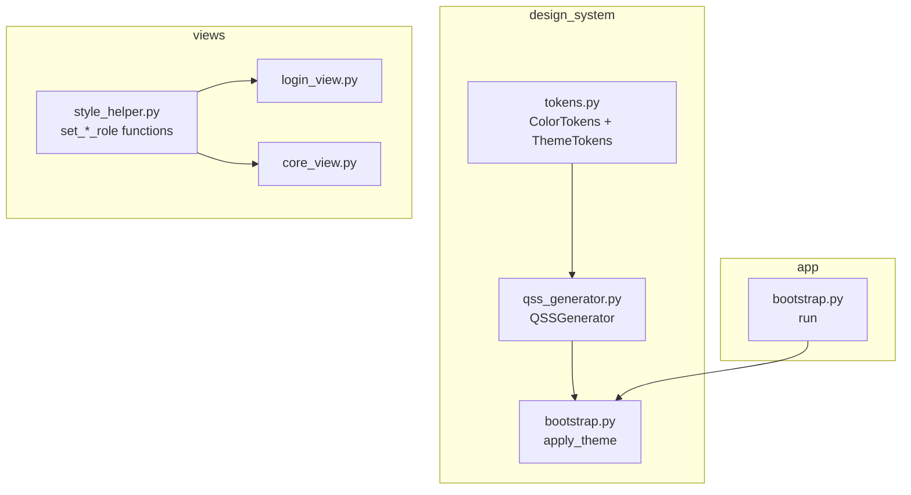

# Design Document: Unified Style System

## Overview

This design consolidates the MusicGenerator desktop app's seven competing style sources into a single Master QSS pipeline: `ThemeTokens → QSSGenerator → QApplication.setStyleSheet()`. It then extends that pipeline with new section builders for the app shell (title bar, sidebar, login screen) and migrates all inline `setStyleSheet()` calls to property-selector-based styling.

The key architectural insight is that Qt's cascading specificity rules mean inline styles always override the global QSS. By eliminating all inline calls and relying exclusively on dynamic property selectors (`uiPanel`, `uiRole`, `uiField`), we get a single, predictable style source that can be themed at runtime by regenerating one QSS string.

### Design Decisions

1. **No new style mechanism** — extend the existing `QSSGenerator` section-builder pattern rather than introducing CSS-in-Python abstractions.
2. **Additive token changes** — new `ColorTokens` fields are added to the existing frozen dataclass; no breaking changes to the constructor.
3. **Property selectors over object names** — using `widget[uiPanel="titleBar"]` rather than `#titleBar` because properties are reusable across instances and don't require globally unique names.
4. **Deprecation-warning guard on legacy module** — allows gradual discovery of stale imports without hard-crashing in production.

## Architecture

### Style Flow (Single Pipeline)

```mermaid
flowchart LR
    A[ThemeTokens\n(frozen dataclass)] --> B[QSSGenerator.generate()]
    B --> C[Master QSS string]
    C --> D[QApplication.setStyleSheet()]
    D --> E[All widgets styled via\nproperty selectors]
```

### Elimination Points

| Eliminated Source | Replacement |
|---|---|
| `theme.py` `build_app_stylesheet()` | `QSSGenerator.generate()` via `apply_theme()` |
| `theme.py` `build_ui_tokens()` | `TokenRegistry.as_dict()` |
| `widget.setStyleSheet(...)` in views | `set_panel_role()` / `set_button_role()` / `set_field_role()` → QSS property selectors |
| `apply_cta_button()` inline QSS | New `uiRole="gradientPrimary"` property selector |
| Login view inline QSS | New `uiPanel="brandGradient"`, `uiPanel="loginTabBar"`, `uiRole="loginTabActive"`, `uiField="loginInput"` selectors |

### Module Dependency (After Migration)



## Components and Interfaces

### 1. Extended ColorTokens

New fields added to `ColorTokens` frozen dataclass:

```python
@dataclass(frozen=True)
class ColorTokens:
    # ... existing fields ...
    
    # Navigation active state gradient
    nav_active_gradient_start: str   # #7c3aed
    nav_active_gradient_end: str     # #a855f7
    
    # Brand gradient (login + marketing)
    brand_gradient_start: str        # #4c1d95
    brand_gradient_mid: str          # #6d28d9
    brand_gradient_end: str          # #a855f7
    
    # Title bar
    title_bar_bg: str                # matches surface_base
```

### 2. QSSGenerator — New Section Builders

The `generate()` method adds three new section builder calls:

```python
def generate(self) -> str:
    sections = [
        # ... existing 18 sections ...
        self._title_bar(),          # NEW
        self._sidebar_nav(),        # NEW
        self._login_shell(),        # NEW
        self._gradient_buttons(),   # NEW
    ]
    return "\n\n".join(sections)
```

#### `_title_bar()` Builder

Produces QSS for:
- `QWidget[uiPanel="titleBar"]` — 40px height, background from `title_bar_bg`, no border
- `QToolButton[uiRole="windowControl"]` — transparent bg, 32×28 fixed size, hover overlay
- `QToolButton[uiRole="windowClose"]` — extends windowControl with danger-red hover bg
- `QLabel[uiRole="appTitle"]` — brand title styling

#### `_sidebar_nav()` Builder

Produces QSS for:
- `QWidget[uiPanel="sidebar"]` — fixed 200px max-width, background `surface_base`
- `QPushButton[uiRole="navItem"]` — icon+text layout, 12px font, 20px icon, transparent bg
- `QPushButton[uiRole="navItem"]:hover` — `surface_overlay` background
- `QPushButton[uiRole="navItemActive"]` — purple gradient pill background using `nav_active_gradient_start` → `nav_active_gradient_end`
- `QWidget[uiPanel="userProfile"]` — bottom-anchored section with muted text

#### `_login_shell()` Builder

Produces QSS for:
- `QWidget[uiPanel="brandGradient"]` — purple gradient using `brand_gradient_start` → `brand_gradient_mid` → `brand_gradient_end`
- `QWidget[uiPanel="loginTabBar"]` — dark semi-transparent container with glass border
- `QPushButton[uiRole="loginTabActive"]` — purple gradient pill, white text, bold
- `QPushButton[uiRole="loginTabInactive"]` — transparent bg, muted text, hover tint
- `QLineEdit[uiField="loginInput"]` — 48px height, 15px font, `secondary_accent_hover` focus border

#### `_gradient_buttons()` Builder

Produces QSS for:
- `QPushButton[uiRole="gradientPrimary"]` — purple gradient matching brand gradient start→end, white text, 44px height, 8px radius
- `QPushButton[uiRole="gradientPrimary"]:hover` — lighter gradient
- `QPushButton[uiRole="gradientPrimary"]:pressed` — darker gradient
- `QPushButton[uiRole="gradientPrimary"]:disabled` — flat surface_overlay

### 3. Style Helper Updates

The `apply_cta_button()` function is refactored:

```python
def apply_cta_button(button: QPushButton | None, variant: str, tokens: dict[str, str]) -> None:
    """Style *button* as a CTA — now purely via property role (no inline QSS)."""
    if button is None:
        return
    role_map = {
        "primary": "gradientPrimary",
        "success": "success",
        "warning": "warning",
    }
    role = role_map.get(str(variant or "primary"), "primary")
    set_button_role(button, role)
    button.setCursor(Qt.CursorShape.PointingHandCursor)
    button.setMinimumHeight(max(40, button.minimumHeight()))
```

### 4. Legacy Theme Deprecation Guard

```python
# python_app/app/theme.py
import warnings

def build_ui_tokens() -> dict[str, str]:
    warnings.warn(
        "build_ui_tokens() is deprecated. Use TokenRegistry.as_dict() instead.",
        DeprecationWarning,
        stacklevel=2,
    )
    from python_app.design_system.tokens import TokenRegistry
    return TokenRegistry().as_dict()  # type: ignore[return-value]

def build_app_stylesheet(*args, **kwargs) -> str:
    warnings.warn(
        "build_app_stylesheet() is deprecated. Use design_system.bootstrap.apply_theme() instead.",
        DeprecationWarning,
        stacklevel=2,
    )
    return ""
```

### 5. Title Bar Widget Interface

```python
class TitleBarWidget(QWidget):
    """Custom frameless title bar with app branding and window controls."""
    
    minimize_clicked = pyqtSignal()
    maximize_clicked = pyqtSignal()
    close_clicked = pyqtSignal()
    
    def __init__(self, parent: QWidget | None = None) -> None:
        super().__init__(parent)
        set_panel_role(self, "titleBar")
        self.setFixedHeight(40)
        self._build_ui()
    
    def _build_ui(self) -> None:
        # Left: logo SVG + app name label
        # Right: notification button + minimize + maximize + close
        ...
```

### 6. Sidebar Widget Interface

```python
class SidebarWidget(QWidget):
    """Left navigation sidebar with icon+text items and user profile."""
    
    nav_item_clicked = pyqtSignal(str)  # emits page key
    
    def __init__(self, nav_items: list[NavItem], parent: QWidget | None = None) -> None:
        super().__init__(parent)
        set_panel_role(self, "sidebar")
        self.setFixedWidth(200)
        self._build_ui(nav_items)
    
    def set_active(self, page_key: str) -> None:
        """Update active state — switches uiRole between navItem and navItemActive."""
        ...
```

### 7. Login View Refactored Interface

The `LoginView` retains its public signal/slot API but internally replaces all `setStyleSheet()` calls with property assignments:

```python
# Brand panel
set_panel_role(brand_panel, "brandGradient")

# Tab bar
set_panel_role(tab_container, "loginTabBar")
set_button_role(login_tab_btn, "loginTabActive")
set_button_role(register_tab_btn, "loginTabInactive")

# Form inputs
set_field_role(email_input, "loginInput")
set_field_role(password_input, "loginInput")

# Submit buttons
set_button_role(submit_btn, "gradientPrimary")

# Window controls
set_button_role(close_btn, "windowClose")  # QToolButton variant
```

## Data Models

### Token Additions

| Field | Type | Value | Rationale |
|---|---|---|---|
| `nav_active_gradient_start` | `str` | `#7c3aed` | Purple gradient pill start (matches `secondary_accent`) |
| `nav_active_gradient_end` | `str` | `#a855f7` | Purple gradient pill end (matches `secondary_accent_hover`) |
| `brand_gradient_start` | `str` | `#4c1d95` | Deep purple for login brand panel |
| `brand_gradient_mid` | `str` | `#6d28d9` | Mid purple |
| `brand_gradient_end` | `str` | `#a855f7` | Light purple (same as nav end) |
| `title_bar_bg` | `str` | `#0a0e27` | Matches `surface_base` for seamless boundary |

### TokenRegistry.as_dict() Extension

The flat dictionary adds these mappings for backward compat:

```python
"nav_active_start": c.nav_active_gradient_start,
"nav_active_end": c.nav_active_gradient_end,
"brand_gradient_start": c.brand_gradient_start,
"brand_gradient_mid": c.brand_gradient_mid,
"brand_gradient_end": c.brand_gradient_end,
"title_bar_bg": c.title_bar_bg,
```

### QSS Property Selector Registry

Complete set of new property selectors introduced:

| Selector | Widget Type | Context |
|---|---|---|
| `uiPanel="titleBar"` | QWidget | Title bar container |
| `uiPanel="sidebar"` | QWidget | Left nav panel |
| `uiPanel="userProfile"` | QWidget | Sidebar user section |
| `uiPanel="brandGradient"` | QWidget | Login brand panel |
| `uiPanel="loginTabBar"` | QWidget | Login tab container |
| `uiRole="windowControl"` | QToolButton | Minimize/maximize btns |
| `uiRole="windowClose"` | QToolButton | Close button (danger) |
| `uiRole="appTitle"` | QLabel | App name in title bar |
| `uiRole="navItem"` | QPushButton | Inactive nav button |
| `uiRole="navItemActive"` | QPushButton | Active nav button |
| `uiRole="loginTabActive"` | QPushButton | Active login tab |
| `uiRole="loginTabInactive"` | QPushButton | Inactive login tab |
| `uiRole="gradientPrimary"` | QPushButton | Purple gradient CTA |
| `uiField="loginInput"` | QLineEdit | Hero-scale form input |


## Correctness Properties

*A property is a characteristic or behavior that should hold true across all valid executions of a system — essentially, a formal statement about what the system should do. Properties serve as the bridge between human-readable specifications and machine-verifiable correctness guarantees.*

### Property 1: QSS Completeness — All Shell Selectors Present with Token-Derived Values

*For any* valid `ThemeTokens` instance (with all new fields populated), the QSS string produced by `QSSGenerator.generate()` SHALL contain property selector rules for all 14 new selectors (`titleBar`, `sidebar`, `userProfile`, `brandGradient`, `loginTabBar`, `windowControl`, `windowClose`, `appTitle`, `navItem`, `navItemActive`, `loginTabActive`, `loginTabInactive`, `gradientPrimary`, `loginInput`) and the color values in those rules SHALL be derived from the corresponding token fields.

**Validates: Requirements 2.1, 2.3, 2.4, 2.5, 3.1, 3.2, 3.3, 3.4, 3.5, 3.6, 3.7**

### Property 2: QSS Legacy Selector Preservation

*For any* valid `ThemeTokens` instance, the QSS string produced by `QSSGenerator.generate()` SHALL contain every `uiPanel`, `uiRole`, and `uiField` property selector that was present in the legacy `build_app_stylesheet()` output (specifically: `appRoot`, `appHeader`, `sidebarLeft`, `sidebarRight`, `appNav`, `center`, `footer`, `section`, `softSection`, `primary`, `secondary`, `danger`, `success`, `warning`, `toolbar`, `toggle`, `transport`, `transportPrimary`, `compactSecondary`, `tableIcon`, `appNavButton`, `headerLogout`, `trackList`, `card`, `standalone`).

**Validates: Requirements 7.2, 7.3**

### Property 3: TokenRegistry.as_dict() Key Compatibility

*For any* valid `ThemeTokens` instance registered in `TokenRegistry`, the key set returned by `as_dict()` SHALL be a superset of the 37 keys returned by the legacy `build_ui_tokens()` function, and every value SHALL be a non-empty string.

**Validates: Requirements 1.3, 7.4**

### Property 4: Style Helper Property Assignment Round-Trip

*For any* QWidget-like object and any non-empty role string, calling `set_panel_role(widget, role)` SHALL result in `widget.property("uiPanel") == role`, and equivalently for `set_button_role`/`"uiRole"`, `set_label_role`/`"uiRole"`, and `set_field_role`/`"uiField"`.

**Validates: Requirements 7.1**

### Property 5: Sidebar Active State Toggle Exclusivity

*For any* `SidebarWidget` with N navigation items (N ≥ 2), calling `set_active(key)` SHALL set exactly one button's `uiRole` property to `"navItemActive"` and all other buttons' `uiRole` to `"navItem"`.

**Validates: Requirements 5.3**

### Property 6: Token Validator Hex Format Enforcement

*For any* string value assigned to a `ColorTokens` color field, `TokenRegistry.validate_variant()` SHALL return an error if the value does not match the regex `^#[0-9a-fA-F]{6}([0-9a-fA-F]{2})?$`, and SHALL return no error for that field if it does match.

**Validates: Requirements 8.7**

## Error Handling

| Scenario | Handling |
|---|---|
| Legacy `build_ui_tokens()` / `build_app_stylesheet()` called | Emit `DeprecationWarning`, return compatible fallback (dict from registry / empty string) |
| Invalid token value in custom theme variant | `TokenRegistry.register_variant()` raises `ValueError` with all invalid fields listed |
| `set_*_role()` called with deleted/None widget | Graceful no-op (existing try/except RuntimeError pattern preserved) |
| Arrow SVG files missing at startup | `apply_theme()` proceeds without arrow URLs; combo/spin boxes use default OS arrows |
| `switch_theme()` called with unregistered variant | Raises `KeyError` with list of available variants |
| Login view receives focus before QSS applied | Harmless — widgets render with default Qt style until apply_theme runs |

## Testing Strategy

### Property-Based Tests (Hypothesis)

The following properties should be tested with Hypothesis using a minimum of **100 iterations** per property test. The test library is **Hypothesis** (already in use per project conventions).

| Property | Generator Strategy | Assertion |
|---|---|---|
| Property 1 (QSS Completeness) | `@st.composite` generating random valid `ThemeTokens` with randomized hex colors | QSS string contains all 14 new selectors; each selector's rule body contains the corresponding token value |
| Property 2 (Legacy Selectors) | Same random `ThemeTokens` generator | QSS string contains all 25+ legacy selector strings |
| Property 3 (as_dict Keys) | Same random `ThemeTokens` generator | `set(as_dict().keys()) >= LEGACY_KEYS` and all values are non-empty `str` |
| Property 4 (Style Helper Round-Trip) | `st.text(min_size=1, max_size=50, alphabet=st.characters(whitelist_categories=("L", "N")))` for role strings | After `set_*_role(mock_widget, role)`, `mock_widget.property(prop_name) == role` |
| Property 5 (Sidebar Toggle) | `st.lists(st.text(min_size=1, max_size=20), min_size=2, max_size=10, unique=True)` for nav keys | Exactly one button has `navItemActive`, rest have `navItem` |
| Property 6 (Hex Validation) | `st.from_regex(r"^#[0-9a-fA-F]{6,8}$")` for valid, `st.text()` for invalid | Validator errors list empty for valid, non-empty for invalid |

**Tag format:** Each test is tagged with a comment:
```python
# Feature: unified-style-system, Property 1: QSS contains all 14 new shell selectors with token-derived values
```

### Unit Tests (pytest)

- **Token field values**: Verify `DEFAULT_DARK_THEME` contains all 6 new fields with correct hex values (Req 8.1–8.6)
- **Deprecation warnings**: Verify `build_ui_tokens()` and `build_app_stylesheet()` emit `DeprecationWarning` (Req 1.4)
- **apply_cta_button() no inline style**: Mock QPushButton, call `apply_cta_button()`, assert `setStyleSheet` not called (Req 2.6)
- **TitleBarWidget composition**: Verify height=40, contains logo/name/window-control children (Req 4.1, 4.2, 4.5)
- **SidebarWidget composition**: Verify fixedWidth=200, contains nav buttons and user profile (Req 5.1, 5.2, 5.5)
- **LoginView property roles**: Verify brand panel has `uiPanel="brandGradient"`, submit has `uiRole="gradientPrimary"` (Req 6.1, 6.3, 6.5, 6.6)

### Integration Tests

- **Full app startup**: `apply_theme(mock_app)` produces QSS and sets it on the app (Req 1.1)
- **Window drag/double-click**: Simulate mouse events on title bar (Req 4.3, 4.4)
- **Regression suite**: All 156 existing tests pass without modification (Req 7.5)

### Static Analysis Checks

- **No inline styles in views**: Grep `python_app/views/` for `.setStyleSheet(` — must return 0 hits (Req 2.2, 4.6, 5.6, 6.7)
- **No legacy imports**: Grep for `from python_app.app.theme import` — must return 0 direct usage in non-test code (Req 1.2)
