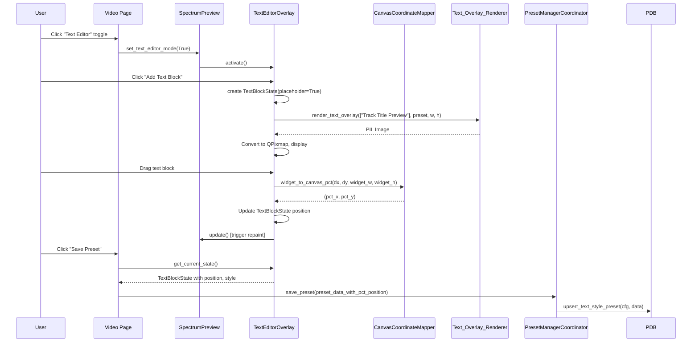

# Design Document: Video Preview Text Editor

## Overview

This feature adds an interactive text overlay editor directly within the Video page's live preview canvas (`SpectrumPreview` QOpenGLWidget). Users visually design text style presets by positioning, resizing, and styling text blocks on top of the actual background image in real-time — replacing the form-only workflow of the existing `PresetManagerDialog`.

The design introduces a **Text_Editor_Overlay** layer that sits on top of the existing OpenGL render pipeline, intercepts mouse events in "text editor mode", and provides a WYSIWYG experience for preset creation. The overlay reuses the existing `Text_Overlay_Renderer` and `TextStylePreset` data model from the `dynamic-text-overlay` spec, extending it with percentage-based positioning (x_pct, y_pct) for resolution-independent coordinate mapping.

Key design decisions:
- **QPainter overlay on QOpenGLWidget**: Rather than adding more OpenGL draw calls, the text editor overlay uses `QPainter` drawn after `paintGL()` completes via `paintEvent()` override with `QPainter.beginNativePainting()`. This gives access to Qt's rich text rendering, selection handles, and mouse interaction without touching the GL pipeline.
- **Percentage-based coordinate system**: All positions are stored as percentages (0–100%) of canvas dimensions, making presets resolution-independent.
- **Reuse existing rendering**: The editor uses `Text_Overlay_Renderer.render_text_overlay()` to generate a PIL Image for each text block, then converts it to a QImage for display. This ensures pixel-perfect fidelity between editor preview and thumbnail output.
- **Debounced re-rendering**: Style and text changes are debounced (300ms) before triggering expensive Pillow re-renders, keeping the UI responsive during rapid edits.
- **Mode-based interaction**: A toggle button switches between normal preview interaction (background drag, visualizer position) and text editor interaction (text block select, drag, resize).

## Architecture

```mermaid
graph TD
    subgraph Video Page UI
        VP[VideoViewMixin._build_video_workspace_page]
        TB[Text Editor Toggle Button]
        SP[Style Properties Panel]
        PT[Preset Toolbar - Save/Load/Add]
    end

    subgraph Preview Widget Layer
        ARB[AspectRatioBox]
        SPW[SpectrumPreview - QOpenGLWidget]
        TEO[TextEditorOverlay - QPainter layer]
        TBM[TextBlockModel - state list]
    end

    subgraph Coordinate System
        CCS[CanvasCoordinateMapper]
    end

    subgraph Existing Infrastructure
        TOR[Text_Overlay_Renderer]
        FM[FontManager]
        PMC[PresetManagerCoordinator]
        PDB[preset_db.py]
    end

    VP --> TB
    VP --> SP
    VP --> PT
    VP --> ARB
    ARB --> SPW
    SPW --> TEO
    TEO --> TBM
    TEO --> CCS
    TEO --> TOR
    SP --> TEO
    PT --> PMC
    PMC --> PDB
    PMC --> TOR
    CCS --> ARB
    TOR --> FM

    style TEO fill:#2d5a27,stroke:#4a9e3f
    style CCS fill:#2d4a5a,stroke:#3f7e9e
    style TBM fill:#4a2d5a,stroke:#7e3f9e
```



### Component Interaction Flow



## Components and Interfaces

### CanvasCoordinateMapper (`views/components/canvas_coordinate_mapper.py`)

Pure utility class for coordinate conversions between widget pixels, canvas percentages, and output resolution pixels.

```python
from dataclasses import dataclass


@dataclass(frozen=True)
class CanvasRect:
    """The actual content area within the widget (accounting for aspect ratio letterboxing)."""
    x: int  # offset from widget left edge
    y: int  # offset from widget top edge
    width: int
    height: int


class CanvasCoordinateMapper:
    """Converts between widget pixels, canvas percentages (0-100), and output pixels."""

    def __init__(self, widget_width: int, widget_height: int, target_width: int, target_height: int):
        self._widget_w = widget_width
        self._widget_h = widget_height
        self._target_w = target_width
        self._target_h = target_height
        self._canvas_rect = self._compute_canvas_rect()

    def _compute_canvas_rect(self) -> CanvasRect:
        """Compute the content area within the widget that maps to the target resolution,
        accounting for aspect ratio differences (letterboxing/pillarboxing)."""
        ...

    def widget_to_pct(self, widget_x: int, widget_y: int) -> tuple[float, float]:
        """Convert widget pixel position to canvas percentage (0-100).
        Accounts for aspect ratio offset."""
        ...

    def pct_to_widget(self, pct_x: float, pct_y: float) -> tuple[int, int]:
        """Convert canvas percentage to widget pixel position."""
        ...

    def pct_to_output(self, pct_x: float, pct_y: float) -> tuple[int, int]:
        """Convert canvas percentage to output resolution pixel position."""
        ...

    def output_to_pct(self, output_x: int, output_y: int) -> tuple[float, float]:
        """Convert output pixel position to canvas percentage."""
        ...

    def widget_delta_to_pct_delta(self, dx: int, dy: int) -> tuple[float, float]:
        """Convert a widget-space pixel delta to a percentage delta."""
        ...

    @property
    def canvas_rect(self) -> CanvasRect:
        """The content area within the widget."""
        return self._canvas_rect

    def update(self, widget_width: int, widget_height: int,
               target_width: int, target_height: int) -> None:
        """Recalculate on resize or resolution change."""
        ...
```

### TextBlockState (`views/components/text_block_state.py`)

Data model for a single text block on the canvas.

```python
from dataclasses import dataclass, field
from services.text_overlay_renderer import TextStylePreset


@dataclass
class TextBlockState:
    """Mutable state for a single text block in the editor."""

    # Identity
    block_id: str  # UUID for tracking

    # Content
    text: str = "Track Title Preview"
    is_placeholder: bool = True  # True = shows placeholder text for track titles

    # Position (percentage of canvas, 0-100)
    x_pct: float = 50.0  # center of text block, horizontal
    y_pct: float = 50.0  # center of text block, vertical

    # Style (mirrors TextStylePreset fields)
    font_path: str = ""
    font_size: int = 72
    primary_color: str = "#FFFFFFFF"
    glow_color: str = "#00000000"
    glow_radius: int = 0
    shadow_offset_x: int = 0
    shadow_offset_y: int = 0
    shadow_color: str = "#00000080"
    stroke_width: int = 0
    stroke_color: str = "#000000FF"
    gradient_enabled: bool = False
    gradient_start_color: str = "#FFFFFFFF"
    gradient_end_color: str = "#000000FF"
    line_spacing: float = 1.4
    alignment: str = "center"
    max_text_width_pct: int = 80
    vertical_padding_pct: int = 10

    # Editor state (not persisted)
    is_selected: bool = False
    _cached_pixmap: object = field(default=None, repr=False)
    _cache_key: str = field(default="", repr=False)

    def to_preset(self, name: str) -> TextStylePreset:
        """Convert current state to a TextStylePreset for rendering or saving."""
        ...

    def to_preset_dict(self, name: str) -> dict:
        """Convert to dict suitable for PresetManagerCoordinator.save_preset().
        Includes x_pct, y_pct as additional fields for position persistence."""
        ...

    @classmethod
    def from_preset_dict(cls, data: dict) -> "TextBlockState":
        """Restore a TextBlockState from a saved preset dict."""
        ...
```

### TextEditorOverlay (`views/components/text_editor_overlay.py`)

The interactive overlay layer that handles text block rendering, selection, dragging, and resizing.

```python
from PyQt6.QtCore import Qt, QTimer, QRectF, pyqtSignal
from PyQt6.QtGui import QPainter, QPixmap, QImage, QCursor, QPen, QBrush, QColor
from PyQt6.QtWidgets import QWidget

from .canvas_coordinate_mapper import CanvasCoordinateMapper
from .text_block_state import TextBlockState


class TextEditorOverlay:
    """Manages the interactive text editing layer on top of SpectrumPreview.

    This is NOT a separate QWidget — it draws using QPainter during the
    SpectrumPreview's paint event and handles mouse events forwarded from
    the SpectrumPreview.
    """

    # Signals emitted by the overlay (connected to SpectrumPreview signals)
    HANDLE_SIZE = 8  # pixels, size of selection handles
    MIN_FONT_SIZE = 12
    MAX_FONT_SIZE = 400
    MIN_WIDTH_PCT = 20
    MAX_WIDTH_PCT = 90

    def __init__(self, preview_widget: "SpectrumPreview"):
        self._preview = preview_widget
        self._active = False
        self._blocks: list[TextBlockState] = []
        self._selected_block: TextBlockState | None = None
        self._mapper: CanvasCoordinateMapper | None = None
        self._dragging = False
        self._resizing = False
        self._resize_handle: str | None = None  # e.g., "top-left", "right", etc.
        self._drag_start: tuple[int, int] | None = None
        self._render_timer = QTimer()
        self._render_timer.setSingleShot(True)
        self._render_timer.setInterval(300)
        self._render_timer.timeout.connect(self._do_deferred_render)

    def activate(self) -> None:
        """Enter text editor mode."""
        ...

    def deactivate(self) -> None:
        """Exit text editor mode. Hides handles but keeps blocks visible."""
        ...

    @property
    def is_active(self) -> bool:
        return self._active

    def add_block(self, text: str = "", placeholder: bool = True) -> TextBlockState:
        """Add a new text block to the canvas."""
        ...

    def remove_block(self, block_id: str) -> None:
        """Remove a text block from the canvas."""
        ...

    def select_block(self, block: TextBlockState | None) -> None:
        """Select a block (or deselect if None)."""
        ...

    # --- Rendering ---

    def paint(self, painter: QPainter, widget_width: int, widget_height: int) -> None:
        """Draw all text blocks and selection handles. Called from SpectrumPreview.paintEvent()."""
        ...

    def _render_block_pixmap(self, block: TextBlockState) -> QPixmap:
        """Render a text block using Text_Overlay_Renderer, convert to QPixmap."""
        ...

    def _schedule_rerender(self, block: TextBlockState) -> None:
        """Debounced re-render after style/text change."""
        ...

    def _do_deferred_render(self) -> None:
        """Execute the debounced render."""
        ...

    # --- Mouse interaction ---

    def handle_mouse_press(self, x: int, y: int, button: Qt.MouseButton) -> bool:
        """Handle mouse press. Returns True if event was consumed."""
        ...

    def handle_mouse_move(self, x: int, y: int) -> bool:
        """Handle mouse move. Returns True if event was consumed."""
        ...

    def handle_mouse_release(self, x: int, y: int, button: Qt.MouseButton) -> bool:
        """Handle mouse release. Returns True if event was consumed."""
        ...

    def _hit_test_block(self, x: int, y: int) -> TextBlockState | None:
        """Find which text block (if any) is under the given widget position."""
        ...

    def _hit_test_handle(self, x: int, y: int) -> str | None:
        """Find which selection handle (if any) is under the given widget position.
        Returns handle name (e.g., 'top-left', 'right') or None."""
        ...

    def _get_handle_rects(self, block: TextBlockState) -> dict[str, QRectF]:
        """Compute the 8 handle rectangles for a selected block."""
        ...

    # --- Clamping ---

    def _clamp_position(self, block: TextBlockState) -> None:
        """Clamp block position to keep at least 10% visible within canvas."""
        ...

    def _clamp_dimensions(self, block: TextBlockState) -> None:
        """Enforce min/max font size and width constraints."""
        ...

    # --- Coordinate mapping ---

    def update_mapper(self, widget_w: int, widget_h: int,
                      target_w: int, target_h: int) -> None:
        """Update the coordinate mapper on resize or resolution change."""
        ...

    # --- State export ---

    def get_blocks(self) -> list[TextBlockState]:
        """Get current text block states for saving."""
        return list(self._blocks)

    def load_from_preset(self, preset_data: dict) -> None:
        """Load a saved preset into the canvas as a text block."""
        ...
```

### SpectrumPreview Modifications

The existing `SpectrumPreview` class is extended with text editor mode support:

```python
# Additions to SpectrumPreview class:

class SpectrumPreview(QOpenGLWidget):
    # ... existing code ...

    # New: text editor overlay
    text_editor_overlay: TextEditorOverlay  # initialized in __init__

    def set_text_editor_mode(self, enabled: bool) -> None:
        """Toggle text editor mode on/off."""
        if enabled:
            self.text_editor_overlay.activate()
            self._bg_edit_mode = False  # disable conflicting drag
        else:
            self.text_editor_overlay.deactivate()

    def paintEvent(self, event):
        """Override to add QPainter overlay after GL rendering."""
        super().paintEvent(event)  # triggers paintGL
        if self.text_editor_overlay.is_active or self.text_editor_overlay.get_blocks():
            painter = QPainter(self)
            painter.setRenderHint(QPainter.RenderHint.Antialiasing)
            self.text_editor_overlay.paint(painter, self.width(), self.height())
            painter.end()

    def mousePressEvent(self, ev):
        if self.text_editor_overlay.is_active:
            if self.text_editor_overlay.handle_mouse_press(
                int(ev.position().x()), int(ev.position().y()), ev.button()
            ):
                ev.accept()
                self.update()
                return
        # ... existing drag logic ...

    def mouseMoveEvent(self, ev):
        if self.text_editor_overlay.is_active:
            if self.text_editor_overlay.handle_mouse_move(
                int(ev.position().x()), int(ev.position().y())
            ):
                ev.accept()
                self.update()
                return
        # ... existing logic ...

    def mouseReleaseEvent(self, ev):
        if self.text_editor_overlay.is_active:
            if self.text_editor_overlay.handle_mouse_release(
                int(ev.position().x()), int(ev.position().y()), ev.button()
            ):
                ev.accept()
                self.update()
                return
        # ... existing logic ...

    def paintGL(self):
        # ... existing code ...
        # FIX: Ensure viewport matches widget dimensions exactly
        w = self.width()
        h = self.height()
        self.ctx.viewport = (0, 0, w, h)
        # ... rest of existing paintGL ...
```

### Style Properties Panel (`views/components/text_style_panel.py`)

A dockable/collapsible panel in the Video page right sidebar for editing the selected text block's style properties.

```python
from PyQt6.QtWidgets import (
    QWidget, QVBoxLayout, QHBoxLayout, QLabel, QComboBox,
    QSlider, QSpinBox, QPushButton, QLineEdit, QDoubleSpinBox,
    QColorDialog, QCheckBox
)
from PyQt6.QtCore import pyqtSignal


class TextStylePanel(QWidget):
    """Panel for editing text block style properties with live preview updates."""

    style_changed = pyqtSignal(dict)  # Emits the changed style dict

    def __init__(self, font_manager, parent=None):
        super().__init__(parent)
        self._font_manager = font_manager
        self._debounce_timer = QTimer()
        self._debounce_timer.setSingleShot(True)
        self._debounce_timer.setInterval(300)
        self._debounce_timer.timeout.connect(self._emit_style)
        self._build_ui()

    def _build_ui(self) -> None:
        """Build the style panel with all controls."""
        # Font selection dropdown (from FontManager)
        # Font size slider (12-400)
        # Primary color picker
        # Stroke width slider (0-10) + color picker
        # Glow radius slider (0-50) + color picker
        # Shadow offset x/y spinboxes + color picker
        # Gradient toggle + start/end color pickers
        # Line spacing slider (1.0-3.0)
        # Max width slider (20-90%)
        # Vertical padding slider (2-30%)
        ...

    def set_from_block(self, block: "TextBlockState") -> None:
        """Populate panel controls from a text block's current state."""
        ...

    def get_style_dict(self) -> dict:
        """Get current panel values as a style dict."""
        ...

    def _emit_style(self) -> None:
        """Emit style_changed after debounce period."""
        ...

    def _on_field_changed(self) -> None:
        """Called when any field changes. Starts debounce timer."""
        ...
```

### Video Page Integration

The `VideoViewMixin._build_video_workspace_page()` is extended with:

```python
# In header_layout, alongside existing "Live Preview" and "Background" buttons:
self.btn_text_editor = QPushButton('Text Editor')
self._set_button_role(self.btn_text_editor, 'toolbar')
self.btn_text_editor.setCheckable(True)
self.btn_text_editor.toggled.connect(self._toggle_text_editor_mode)
header_layout.addWidget(self.btn_text_editor)

# Text editor toolbar (visible when text editor mode is active)
self.text_editor_toolbar = TextEditorToolbar(parent=self)
# Contains: Add Text Block, Load Preset dropdown, Save Preset button, text input field

# Style panel added to right sidebar (visible when a block is selected)
self.text_style_panel = TextStylePanel(font_manager=self._font_manager)
self.text_style_panel.style_changed.connect(self._on_text_style_changed)
self.text_style_panel.setVisible(False)
```

## Data Models

### TextBlockState Fields (in-memory, per canvas session)

| Field | Type | Range | Description |
|-------|------|-------|-------------|
| block_id | str | UUID | Unique identifier |
| text | str | any | Display text content |
| is_placeholder | bool | True/False | Whether showing placeholder mode |
| x_pct | float | 0–100 | Horizontal center position as % of canvas |
| y_pct | float | 0–100 | Vertical center position as % of canvas |
| font_path | str | path | Font file path |
| font_size | int | 12–400 | Font size in pixels at target resolution |
| primary_color | str | RGBA hex | Main text color |
| glow_color | str | RGBA hex | Glow effect color |
| glow_radius | int | 0–50 | Glow blur radius |
| shadow_offset_x | int | pixels | Shadow X offset |
| shadow_offset_y | int | pixels | Shadow Y offset |
| shadow_color | str | RGBA hex | Shadow color |
| stroke_width | int | 0–10 | Stroke thickness |
| stroke_color | str | RGBA hex | Stroke color |
| gradient_enabled | bool | True/False | Gradient fill toggle |
| gradient_start_color | str | RGBA hex | Gradient top color |
| gradient_end_color | str | RGBA hex | Gradient bottom color |
| line_spacing | float | 1.0–3.0 | Line spacing multiplier |
| alignment | str | left/center/right | Text alignment |
| max_text_width_pct | int | 20–90 | Max width as % of canvas |
| vertical_padding_pct | int | 2–30 | Vertical padding as % |

### Database Extension: `text_style_presets` table

The existing `text_style_presets` table gains two new columns for position storage:

```sql
ALTER TABLE text_style_presets
    ADD COLUMN IF NOT EXISTS position_x_pct REAL DEFAULT NULL,
    ADD COLUMN IF NOT EXISTS position_y_pct REAL DEFAULT NULL;
```

When `position_x_pct` and `position_y_pct` are `NOT NULL`, the pipeline uses these percentage coordinates for pixel placement instead of the generic `position` field ("top"/"center"/"bottom").

### Preset Dict Extension

The preset dict exchanged between coordinator and database gains:

```python
{
    # ... existing fields ...
    "position_x_pct": 50.0,   # nullable, percentage 0-100
    "position_y_pct": 35.0,   # nullable, percentage 0-100
}
```

When these fields are present, `Text_Overlay_Renderer` uses them for absolute positioning. When absent, it falls back to the existing `position` field behavior.

## Correctness Properties

*A property is a characteristic or behavior that should hold true across all valid executions of a system — essentially, a formal statement about what the system should do. Properties serve as the bridge between human-readable specifications and machine-verifiable correctness guarantees.*

### Property 1: Viewport matches widget dimensions (zero offset)

*For any* widget dimensions (width, height) reported by the SpectrumPreview widget, the OpenGL viewport set during paintGL SHALL always equal `(0, 0, width, height)` with no padding or offset.

**Validates: Requirements 1.1, 1.2, 1.3, 1.4**

### Property 2: Coordinate round-trip within tolerance

*For any* valid percentage position (x_pct in [0, 100], y_pct in [0, 100]) and any supported output resolution (width ≥ 100, height ≥ 100), converting from percentage to pixel coordinates and back to percentage SHALL produce values within 0.5% of the original values.

**Validates: Requirements 8.3, 4.3, 8.2, 8.4**

### Property 3: Aspect-ratio-aware coordinate mapping

*For any* widget dimensions and target output dimensions with differing aspect ratios, the CanvasCoordinateMapper SHALL compute a content rect within the widget that matches the target aspect ratio, and all coordinate conversions SHALL map through this content rect (not the full widget area).

**Validates: Requirements 8.5**

### Property 4: All text blocks rendered

*For any* list of N text blocks (1 ≤ N ≤ 20) with valid states, the TextEditorOverlay.paint() call SHALL render exactly N pixmaps on the canvas.

**Validates: Requirements 2.2**

### Property 5: Editor rendering matches output rendering

*For any* valid TextBlockState, the pixmap rendered by the TextEditorOverlay using Text_Overlay_Renderer at the target resolution SHALL be pixel-identical to calling render_text_overlay directly with the equivalent TextStylePreset and the same dimensions.

**Validates: Requirements 2.4**

### Property 6: Drag position converts correctly to canvas percentages

*For any* starting position (x_pct, y_pct) and any widget-space drag delta (dx, dy pixels), the resulting position SHALL equal the starting position plus the delta converted to percentage units via `(dx / canvas_rect.width * 100, dy / canvas_rect.height * 100)`.

**Validates: Requirements 4.2**

### Property 7: Position clamping keeps 10% visible

*For any* text block with any bounding box size and any position (including extreme out-of-bounds values), after clamping, at least 10% of the block's width SHALL overlap with the canvas horizontally AND at least 10% of the block's height SHALL overlap with the canvas vertically.

**Validates: Requirements 4.5**

### Property 8: Eight selection handles at correct positions

*For any* text block bounding box (x, y, width, height) where width > 0 and height > 0, the computed selection handles SHALL produce exactly 8 rectangles: one at each corner (top-left, top-right, bottom-left, bottom-right) and one at each edge midpoint (top, right, bottom, left), each positioned at the corresponding geometric point of the bounding box.

**Validates: Requirements 5.1**

### Property 9: Corner resize preserves aspect ratio

*For any* text block with initial bounding box (w, h) where w > 0 and h > 0, and any corner drag delta, the resulting dimensions (w', h') SHALL satisfy `|w'/h' - w/h| < 0.01` (aspect ratio preserved within floating point tolerance).

**Validates: Requirements 5.2**

### Property 10: Dimension bounds enforcement

*For any* resize operation on a text block, the resulting font_size SHALL be clamped to [12, 400] and the resulting max_text_width_pct SHALL be clamped to [20, 90], regardless of the drag magnitude or direction.

**Validates: Requirements 5.5, 5.6**

### Property 11: Preset save captures complete canvas state

*For any* valid TextBlockState with position (x_pct, y_pct) and all style fields set, converting to a preset dict via `to_preset_dict()` and restoring via `from_preset_dict()` SHALL produce a TextBlockState where all position and style fields match the original (round-trip preservation).

**Validates: Requirements 6.2**

### Property 12: Multi-line text renders all lines

*For any* text content with N lines (N ≥ 1, separated by newlines) and any valid line_spacing value, the rendered text block SHALL contain non-transparent pixels distributed across N distinct vertical regions.

**Validates: Requirements 3.4**

## Error Handling

| Scenario | Handling |
|----------|----------|
| No text blocks on canvas when saving | Show info message: "Add at least one text block before saving a preset." |
| Font file not found during editor rendering | FontManager falls back to bundled default font. Log warning. |
| Invalid color value in style panel | Color picker ensures valid RGBA hex. Manual text input validated on blur with fallback to previous valid value. |
| Widget size is 0 during resize (minimized window) | CanvasCoordinateMapper guards against division by zero. Skip rendering when widget dimensions ≤ 0. |
| Preset name empty on save | Validation prevents save. Show inline error: "Preset name is required." |
| No presets in database for Load action | Show disabled Load button with tooltip: "No saved presets available." |
| render_text_overlay raises exception | Catch in `_render_block_pixmap`, display error placeholder (red outline box with "Render Error" text). Log full traceback. |
| Text block dragged off-screen rapidly | Clamping function runs on every mouse move, not just on release. Ensures 10% visibility at all times. |
| Resolution change while editing | CanvasCoordinateMapper.update() recalculates all pixel positions from stored percentages. No data loss. |
| Very long text exceeding canvas | Existing Text_Overlay_Renderer auto-shrinks font to fit max_text_width_pct. Editor respects same behavior. |

## Testing Strategy

### Unit Tests (example-based)

- CanvasCoordinateMapper initialization with various widget/target combinations
- TextBlockState.to_preset_dict() / from_preset_dict() with concrete examples
- Handle hit-testing with specific click positions inside and outside handles
- Mode toggle enables/disables background drag correctly
- Debounce timer fires only once for rapid changes
- Empty text block list produces no paint calls
- Style panel field constraints match expected min/max values
- Placeholder badge visibility in placeholder vs custom text modes
- Integration: save preset from editor, load it back, verify canvas state

### Property-Based Tests (Hypothesis)

Library: **Hypothesis** (already installed in project)

Configuration: minimum 100 examples per test, deadline disabled for rendering tests.

Each property test references its design property:

```python
# Feature: video-preview-text-editor, Property 1: Viewport matches widget dimensions
@given(
    width=st.integers(min_value=1, max_value=4096),
    height=st.integers(min_value=1, max_value=4096),
)
@settings(max_examples=100)
def test_viewport_matches_widget_dimensions(width, height):
    ...

# Feature: video-preview-text-editor, Property 2: Coordinate round-trip within tolerance
@given(
    x_pct=st.floats(min_value=0.0, max_value=100.0),
    y_pct=st.floats(min_value=0.0, max_value=100.0),
    target_w=st.integers(min_value=100, max_value=7680),
    target_h=st.integers(min_value=100, max_value=4320),
)
@settings(max_examples=100)
def test_coordinate_round_trip(x_pct, y_pct, target_w, target_h):
    ...
```

Property tests to implement:
1. **Viewport-widget invariant** — Generate random widget sizes, verify viewport = (0, 0, w, h)
2. **Coordinate round-trip** — Generate random percentages and resolutions, verify round-trip within 0.5%
3. **Aspect-ratio mapping** — Generate widgets and targets with different aspect ratios, verify content rect has correct aspect ratio
4. **All blocks rendered** — Generate N blocks, verify N pixmaps drawn
5. **Editor matches renderer** — Generate random presets, verify pixel-identical output
6. **Drag position conversion** — Generate positions and deltas, verify correct percentage math
7. **Position clamping** — Generate extreme positions and block sizes, verify 10% overlap
8. **Handle placement** — Generate random bounding boxes, verify 8 handles at correct positions
9. **Corner resize aspect ratio** — Generate initial sizes and drag deltas, verify aspect ratio preserved
10. **Dimension bounds** — Generate extreme resize operations, verify clamping to [12,400] / [20,90]
11. **Preset round-trip** — Generate random TextBlockState, verify to_dict/from_dict round-trip
12. **Multi-line rendering** — Generate multi-line text with random line_spacing, verify N vertical regions

### Integration Tests

- Full flow: activate text editor → add block → drag → resize → style → save preset → verify in database
- Load saved preset → verify canvas shows correct position and style
- Generate thumbnail with editor-saved preset → verify pixel positions match percentages
- Resolution change during editing → verify text blocks maintain relative positions
- Mode toggle doesn't break existing audio playback or background interactions
- Multiple text blocks interact correctly (select one deselects other)
