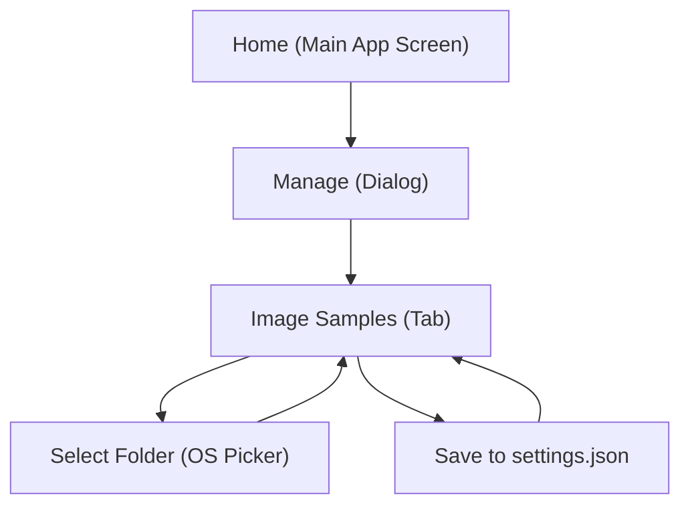

## 1. Product Overview
Convert the existing **Image Samples** management tab from a manual table editor into a **folder-based thumbnail gallery**.
You will be able to choose an image folder, preview its contents as thumbnails, and save the chosen folder so it persists across app restarts.

## 2. Core Features

### 2.1 Feature Module
1. **Home (Main App Screen)**: access the Manage dialog.
2. **Manage (Dialog)**: switch between management tabs.
3. **Image Samples (Tab)**: select an image folder, view thumbnail gallery, save folder selection.

### 2.2 Page Details
| Page Name | Module Name | Feature description |
|-----------|-------------|---------------------|
| Home (Main App Screen) | Manage entry point | Open the Manage dialog from the main UI. |
| Manage (Dialog) | Tab navigation | Switch to **Image Samples** tab from the tabs list. |
| Image Samples (Tab) | Folder selector | Display current selected folder path; open OS folder picker via **Select Folder**; show validation messages when folder is missing/unreadable. |
| Image Samples (Tab) | Gallery grid | Render a scrollable grid of thumbnails discovered in the selected folder; show filename on hover (or below thumbnail) and show a larger preview when a thumbnail is clicked. |
| Image Samples (Tab) | Refresh & Empty states | Provide **Refresh** to re-scan the folder; show empty state when no supported images exist. |
| Image Samples (Tab) | Save folder selection | Persist selected folder path to **settings.json** so it reloads on next app launch; show “Saved”/error feedback. |

## 3. Core Process
**User flow**
1. You open **Manage**.
2. You go to **Image Samples**.
3. You click **Select Folder** and choose a directory containing images.
4. The app scans the folder and shows a thumbnail gallery.
5. You click **Save** to persist the selected directory in **settings.json**.
6. When you reopen the app later, the same folder is automatically selected and the gallery loads.

