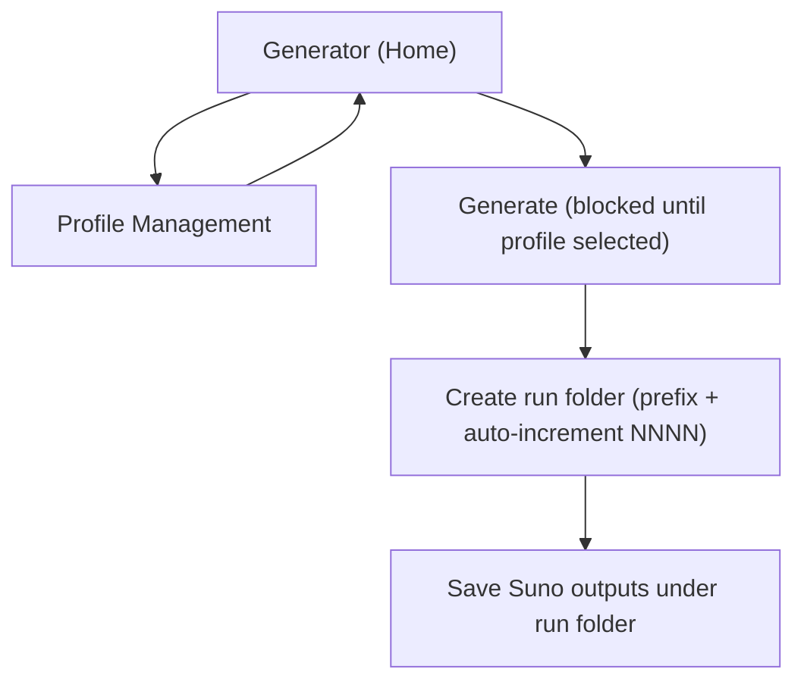

## 1. Product Overview
Add local profile management so you must select a profile before generating.
All Suno outputs are stored under the selected profile folder using auto-incremented numbered subfolders with an optional prefix.

## 2. Core Features

### 2.1 Feature Module
Our requirements consist of the following main pages:
1. **Generator (Home)**: active profile selector, generate controls, blocking validation, output location preview.
2. **Profile Management**: create/rename/delete profiles, choose profile folder name, set active profile.

### 2.2 Page Details
| Page Name | Module Name | Feature description |
|-----------|-------------|---------------------|
| Generator (Home) | Active profile selector | Select an existing profile; show current selection prominently; provide one-click access to profile management. |
| Generator (Home) | Generate gating | Disable/guard Generate actions until a profile is selected; show inline message explaining what to do. |
| Generator (Home) | Output prefix (optional) | Enter an optional prefix used when creating the numbered output subfolder for this generation run. |
| Generator (Home) | Output path preview | Display the resolved save folder for the next run: `{sunoOutputDir}/{profileFolder}/{prefix?}/{NNNN}/` (preview string only). |
| Profile Management | Profile list | List profiles with name + folder name; indicate active profile; allow selecting a profile to view/edit. |
| Profile Management | Create profile | Create a profile with required name; generate a safe default folder name; set as active (default behavior). |
| Profile Management | Rename profile | Edit profile display name (must not break existing on-disk folder). |
| Profile Management | Delete profile | Delete profile record; keep on-disk output folder intact (no data loss). |
| Profile Management | Change active profile | Set a profile as active; immediately updates Generate gating on Home. |

## 3. Core Process
### Main user flow
1. You open the app and land on the Generator (Home).
2. If no active profile exists, you open Profile Management and create one (it becomes active).
3. You select (or confirm) the active profile on Home.
4. You optionally type a prefix for the next generation run.
5. You click Generate; the app creates the next numbered run folder under the active profile folder and saves Suno outputs there.

