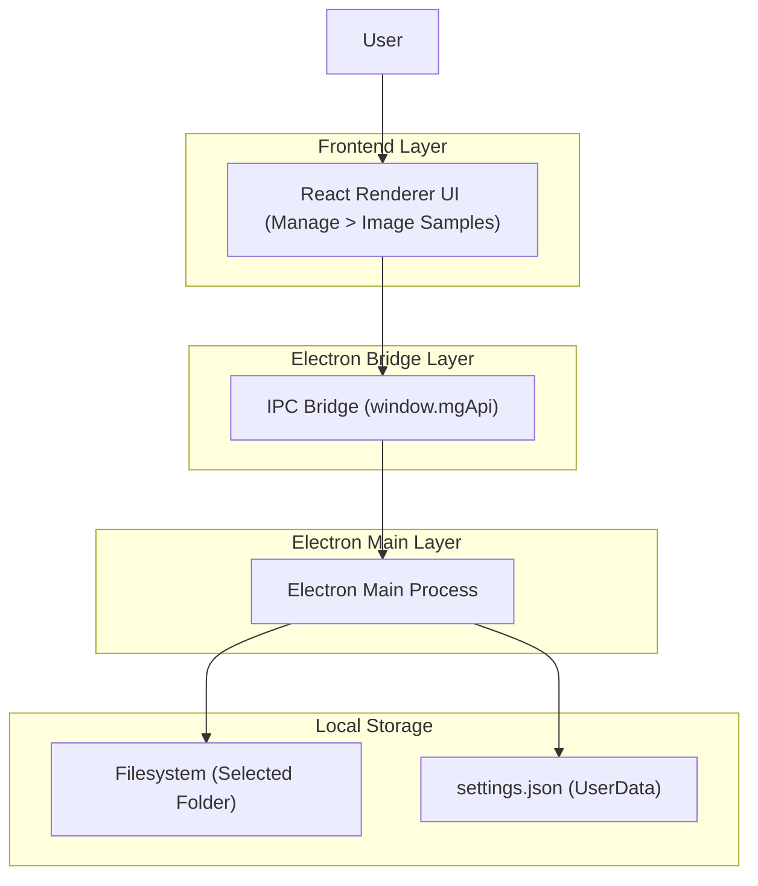

## 1.Architecture design


## 2.Technology Description
- Frontend: React + TypeScript + Zustand (existing store pattern)
- Backend: Electron main process + IPC (existing `mg:*` handlers)
- Storage: JSON settings file under Electron `app.getPath("userData")`

## 3.Route definitions
| Route | Purpose |
|-------|---------|
| / | Main app screen; entry point to Manage dialog |

## 4.API definitions (If it includes backend services)
### 4.1 IPC surface (proposed additions)
1) List images in the selected folder
```
IPC: mg:imageSamples:list
```
Request (renderer -> main):
| Param Name | Param Type | isRequired | Description |
|-----------|------------|-----------:|-------------|
| folderPath | string | true | Absolute directory path to scan |

Response (main -> renderer):
| Param Name | Param Type | Description |
|-----------|------------|-------------|
| ok | boolean | Whether scan succeeded |
| items | Array<{ filePath: string; fileUrl: string; fileName: string; mtimeMs: number }> | Discovered image files (when ok=true) |
| message | string | Error message (when ok=false) |

Notes:
- `fileUrl` should be created in main process (e.g., via `pathToFileURL`) so the renderer can safely set ``.
- Limit scanning to common image extensions (e.g., png/jpg/jpeg/webp) and sort by name or modified time.

2) (Optional) Create small thumbnails in main
```
IPC: mg:imageSamples:thumbnail
```
Request: `{ filePath: string; maxSize: number }`
Response: `{ ok: boolean; dataUrl?: string; message?: string }`

### 4.2 Shared setting shape (required change)
Add a new field in `AppData.settings`:
```ts
type Settings = {
  // ...existing
  imageSamplesDir?: string;
};
```

## 5.Server architecture diagram (If it includes backend services)
N/A (no separate server; Electron main process handles filesystem + persistence).

## 6.Data model(if applicable)
### 6.1 Data model definition
N/A (file-based scan + JSON settings).

### 6.2 Data Definition Language
N/A.

## Implementation notes aligned to the current repo
- The current tab is implemented in `src/components/dashboard/manage/ImageSamplesTab.tsx` and currently edits `data.imageSamples` rows.
- Persistence is handled through `useAppStore.updateSettings(...)` -> `dataClient.setData(...)` -> `electron/storage.ts`, which writes settings to a JSON file under userData.
- Requirement says **settings.json**: the repo currently uses `mg-settings.json` (constant `SETTINGS_FILE_NAME`). To comply, change the filename to `settings.json` and support backward compatibility by reading `mg-settings.json` if `settings.json` doesn’t exist (one-time migration logic in the read path).