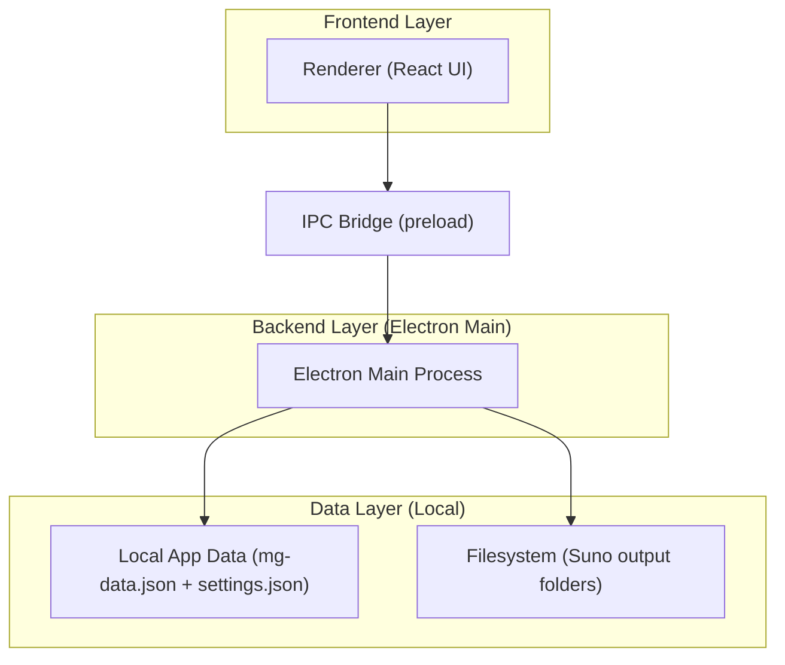
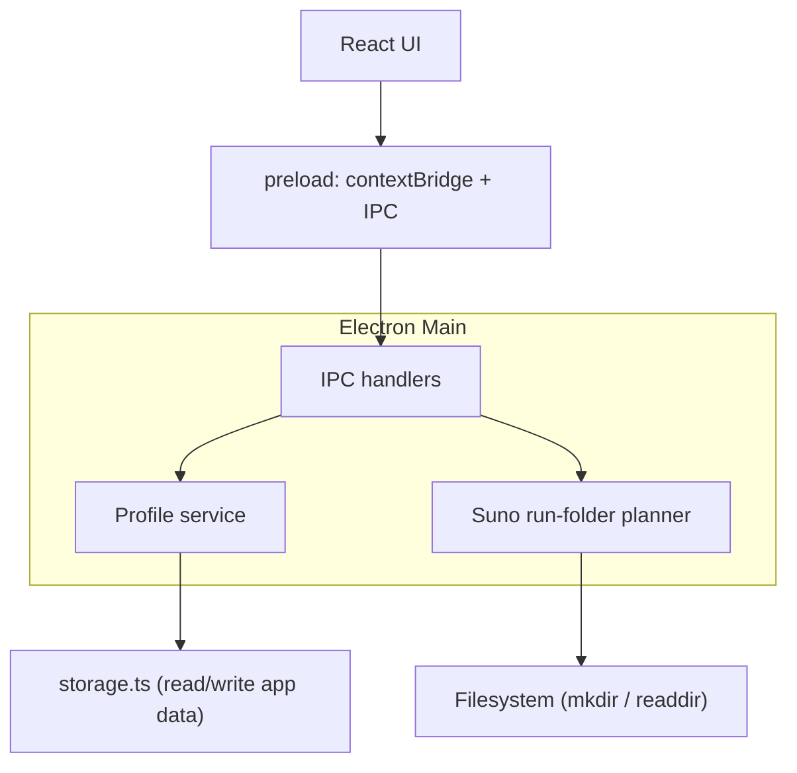

## 1.Architecture design


## 2.Technology Description
- Frontend: React@18 + react-router-dom@7 + tailwindcss@3 + vite
- State: zustand@5
- Backend: Electron main process (Node.js)
- Persistence: JSON files under Electron userData (existing app storage) + filesystem folders for outputs

## 3.Route definitions
| Route | Purpose |
|-------|---------|
| / | Generator home page; includes profile selection and Generate gating |

## 4.API definitions (If it includes backend services)
### 4.1 Shared types (TypeScript)
```ts
export type Profile = {
  id: string;            // uuid
  name: string;          // display name
  folderName: string;    // safe folder segment used on disk
  createdAt: string;     // ISO
  updatedAt: string;     // ISO
};

export type ProfileState = {
  activeProfileId: string | null;
  profiles: Profile[];
};

export type SunoRunFolderPlan = {
  profileId: string;
  profileFolderPath: string; // absolute
  runFolderName: string;     // e.g. "0007" or "intro_0007"
  runFolderPath: string;     // absolute
};
```

### 4.2 IPC channel contracts (recommended)
(Names are illustrative; keep consistent with your existing IPC naming style.)
- `profiles.list` -> returns `Profile[]`
- `profiles.create` (name: string) -> returns `Profile`
- `profiles.rename` (id: string, name: string) -> returns `Profile`
- `profiles.delete` (id: string) -> returns `{ ok: true }`
- `profiles.setActive` (id: string) -> returns `{ ok: true }`
- `suno.planRunFolder` (profileId: string, prefix?: string) -> returns `SunoRunFolderPlan`

## 5.Server architecture diagram (If it includes backend services)


## 6.Data model(if applicable)
### 6.1 Data model definition
Profiles are local-only and should be stored in the existing app data file (same place as other app data) to keep the setup simple.
- Add `profiles: Profile[]` to the stored data.
- Add `settings.activeProfileId: string | null` to settings.

**On-disk output structure (Suno)**
- Base: `settings.sunoOutputDir`
- Profile folder: `{base}/{profile.folderName}/`
- Run folder: `{profileFolder}/{runFolderName}/`
- Run folder name:
  - Without prefix: `NNNN` (zero-padded, e.g. `0001`)
  - With prefix: `{sanitizedPrefix}_NNNN` (e.g. `chorus_0001`)
- Files inside run folder stay consistent with current behavior:
  - `{Title}_OK.mp3`
  - `{Title}_Alt.mp3`

**Auto-increment algorithm (main process, single source of truth)**
1. Compute `profileFolderPath` from `sunoOutputDir + profile.folderName`.
2. List immediate subfolders under `profileFolderPath`.
3. Parse suffix number `NNNN` from folder names matching `^([A-Za-z0-9._-]+_)?(\d{4})$`.
4. Next index = `max(existing) + 1` (start at 1).
5. Create the run folder using `fs.mkdir(runFolderPath, { recursive: false })`.
6. If it already exists (race/collision), increment and retry a few times.

**Generate gating rule**
- UI must not enqueue Suno jobs unless `activeProfileId` is set.
- Main process should also validate the presence of an active profile to prevent bypass via IPC.
